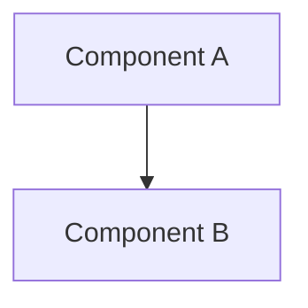

# Documentation ownership

Start at the [documentation index](README.md). Each fact has one maintained
owner; other documents summarize its purpose and link to it.

| Information | Owner |
| --- | --- |
| Installation and first run | [Quickstart](deployment/QUICKSTART.md) |
| Current system boundaries | [Architecture](architecture.md) |
| Decision, alternatives and tradeoffs | Relevant [ARD](architecture/README.md) |
| Capability and acceptance scope | [Functional overview](product/FUNCTIONAL_OVERVIEW.md) |
| User workflow | [Use-case catalogue](use-cases/README.md) or focused ML guide |
| Current gates, issue state and dated evidence | [Current status](roadmap/CURRENT_STATUS.md) |
| Target dates and dependencies | [Main roadmap](roadmap/ROADMAP-MAIN.md) |
| Forward feature requirements | [Phase scope](roadmap/PHASES.md) |
| Exact contract, formula or command | Relevant data, ML, runtime or operations reference |
| Historical attempts and review outcomes | [Archive](archive/README.md), linked receipts |

## Editing rules

1. Update the owning document. Update consumers only when their scope or link
   changes; do not copy status, contracts or procedures into every overview.
2. Preserve unique requirements, formulas, failure semantics and authorization
   boundaries. Keep exact receipts and frozen `evidence/` snapshots unchanged.
3. Distinguish design acceptance, implemented software, synthetic rehearsal and
   production qualification. Baseline dates are not a revised forecast.
4. Keep dated execution history outside current instructions. A historical
   command or approval is not authority to run it again.
5. Retain ARD identifiers. Mark superseded decisions and name their successors;
   keep context, decision, alternatives and consequences. Add diagrams or
   implementation detail only when needed to explain that decision.
6. Use relative local links and HTTPS externally. When moving a page, update
   its relative links and retain navigation for referenced old paths/anchors.
7. Give each diagram one owner. Link to it elsewhere. Prefer diagrams for
   ownership, state, branching, concurrency or trust boundaries; use prose or a
   table for short linear lists. Label proposed/historical views explicitly.
8. Do not require a diagram, status table, documentation map or generic
   "business value" section in every document. Avoid another full-file review
   ledger for routine edits; put validation evidence in the PR.

## Validation

- Run `python3 scripts/check_markdown_links.py` against active Markdown files
  and any changed archives, excluding immutable evidence snapshots.
- Render new/changed Mermaid blocks and visually inspect them. Unchanged
  blocks can be checked by content hash against a previously rendered baseline.
- Check moved-file consumers in scripts and packaging; run affected static
Example (proper formatting):


### 4. Navigability

- **Each document links to related documents** at the end
- **README.md is the master index** — it links to all major sections
- **Breadcrumbs**: Use "Related Documentation" sections to show context
- **Visual hierarchy**: Use headings (H1, H2, H3) consistently

## Updating Documentation

### When to Update

| Change | Documents to Update |
|--------|---------------------|
| Architecture changes | [architecture.md](architecture.md), affected ARDs, [USE_CASES.md](use-cases/README.md) |
| New workflow added | [USE_CASES.md](use-cases/README.md), [architecture.md](architecture.md), [README.md](../README.md) |
| API changes | [backend/README.md](../backend/README.md), [QUICKSTART.md](deployment/QUICKSTART.md), affected ARDs |
| New ARD created | [architecture/README.md](architecture/README.md), [architecture.md](architecture.md), [USE_CASES.md](use-cases/README.md) |
| UI shell or presentation behavior changes | [DESIGN-IDEAS.md](product/DESIGN-IDEAS.md), [architecture.md](architecture.md), [USE_CASES.md](use-cases/README.md), affected ARDs |
| Deployment changes | Relevant deployment guide, [QUICKSTART.md](deployment/QUICKSTART.md), [architecture.md](architecture.md), affected ARD |
| Functional capability/status changes | [FUNCTIONAL_OVERVIEW.md](product/FUNCTIONAL_OVERVIEW.md), [USE_CASES.md](use-cases/README.md), [README.md](../README.md) |
| Safety/legal implications | [safety-and-disclaimers.md](product/safety-and-disclaimers.md) |

### How to Update

1. **Identify the primary document** that owns the change
2. **Update that document first**
3. **Update all dependent documents** (use `rg` to find references)
4. **Test all markdown links** (VS Code should show link validation)
5. **Verify Mermaid diagrams render** (they appear visually in VS Code)

### Creating a New ARD

1. Copy an existing ARD as a template
2. Follow the format in [architecture/README.md](architecture/README.md)
3. Add to [architecture/README.md](architecture/README.md) index
4. Link from [architecture.md](architecture.md)
5. Add "Related Documentation" linking back to main docs

## Validation Checklist

Use this checklist when making documentation changes:

- [ ] Internal links are relative, external links use HTTPS, and no link uses
      `file://`
- [ ] All links use proper markdown syntax: `[text](path#section)`
- [ ] No backticks around file names or links
- [ ] Mermaid diagrams render without errors (check in VS Code preview)
- [ ] Architecture-related changes update [architecture.md](architecture.md)
- [ ] Workflow changes update [USE_CASES.md](use-cases/README.md)
- [ ] New sections added to [README.md](../README.md) index
- [ ] "Related Documentation" sections are current
- [ ] No references to files that don't exist
- [ ] Current version/status claims match evidence; historical values are dated and flagged

## Common Issues & Fixes

### Issue: Broken links in VS Code
**Fix**: Ensure relative paths are correct. Paths should be:
- From current file to target: `../path/file.md`
- Same directory: `file.md`
- Subdirectory: `subdir/file.md`

### Issue: Mermaid diagram not rendering
**Fix**: Check syntax in VS Code markdown preview. Common issues:
- Missing space after `flowchart` keyword
- Unclosed quotes in node labels
- Invalid node references (typos)

### Issue: Documentation doesn't match code
**Fix**: Find the right section using `rg`:
```bash
rg "old_component_name" docs/
```
Then update all occurrences.

### Issue: Stale API endpoints
**Fix**: Compare with `backend/README.md` — if it differs, update both docs.

## Documentation Tools

### View Mermaid Diagrams
- **VS Code**: Built-in markdown preview (Cmd+Shift+V)
- **GitHub**: Automatic rendering in .md files
- **Online**: https://mermaid.live

### Check Links
- **VS Code**: Markdown link validator (built-in)
- **Terminal**: `rg -n '\]\(' docs/` to find inline link destinations
- **Manual**: Click each link in VS Code preview

### Search Across Docs
```bash
# Find all references to a file
rg 'use-cases/README.md' docs/

# Find all links in a file
rg -o "\[.*\](.*)" docs/file.md

# Find stale references
rg "ARD-0010" docs/  # (if ARD-0010 doesn't exist, this is stale)
```

## Responsibilities

- **Maintainers**: Keep docs current with code changes
- **Contributors**: Update docs when submitting PRs that affect architecture/workflows
- **Reviewers**: Check that docs are updated before approving PRs

## Questions?

If documentation is unclear or missing:
1. Check the index in [README.md](../README.md)
2. Follow the breadcrumb links in "Related Documentation"
3. Check [QUICKSTART.md](deployment/QUICKSTART.md) for common tasks
4. Review [USE_CASES.md](use-cases/README.md) for workflows
