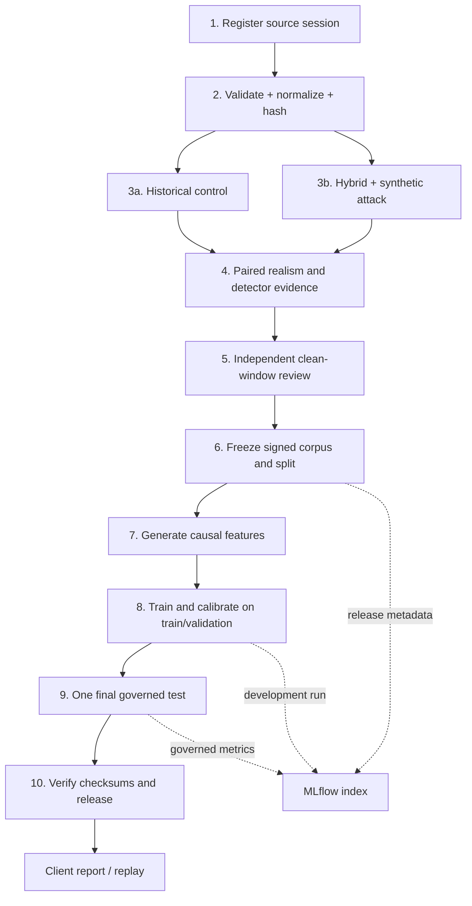

# Functional Overview

This document defines the user-visible capabilities, workflow boundaries, and
acceptance rules for LOB Arena. The authoritative component topology is in the
[High-Level Architecture](architecture.md#system-high-level-design); detailed
decisions are in the [ARD index](architecture/README.md).

## Product Boundary

LOB Arena is a market-surveillance detector validation and model-development
platform. It can replay licensed historical order-book data and add controlled
synthetic scenarios, but it does not label historical activity automatically,
generate trading signals, or make compliance decisions.

## Actors

| Actor | Responsibilities |
| --- | --- |
| Data steward | Registers licensed sessions, verifies provenance, controls retention and freezes permitted corpus inputs. |
| Independent reviewer | Reviews proposed clean windows without seeing another reviewer's decision and records a reasoned verdict. |
| Adjudicator | Resolves reviewer conflicts without rewriting the original decisions. |
| Research operator | Runs historical controls, hybrid attacks, feature generation and detector comparisons. |
| ML engineer | Trains/calibrates challengers on governed folds and logs development records to MLflow. |
| Model validator | Freezes operating modes, opens the final test once, verifies paired results and approves or rejects a release. |
| Client reviewer | Inspects coverage, missed attacks, alert load, latency, replay and signed evidence. |

## Capability Status

| Capability | Status | Functional result |
| --- | --- | --- |
| Paired LOBSTER ingestion | Implemented | Validated immutable Parquet and checksummed source manifest |
| Historical control replay | Implemented | Unlabeled canonical Java stream over a selected source window |
| Hybrid replay | Implemented | The same historical window plus a deterministic namespaced synthetic overlay |
| Hybrid realism/equivalence validation | Implemented | Before/during/after locality evidence and signed validation bundle |
| Governed corpus and split | Implemented as contracts/CLI | Reviewed negatives, family/seed coverage, chronological grouping and signed release |
| Multi-reviewer corpus API/UI | Planned Track B | Blind decisions, conflict resolution, freeze and signed corpus release workflow |
| Causal feature pipeline | Implemented | `lob_features_v1` Parquet, quality metadata and leakage checks |
| LightGBM Phase 0 boundary | Implemented | Hash-bound training, calibration, prediction and model-bundle contracts |
| LightGBM Phase 1 data boundary | Implemented | Externally anchored feature release, reconstructed governed labels, replay-unit binding and isolated test access |
| Shared MLflow | Implemented and deployed | Authenticated tracking/registry with PostgreSQL and S3-compatible artifacts |
| LightGBM v1 trainer and detector | Planned Track A next | Binary training, calibrated operating modes, contributions and paired test |
| GRU/Transformer challenger | Future | Sequence-aware attack state/phase model after LightGBM establishes value |
| RL adaptive red team | Future | Offline bounded search for realistic detector blind spots |

## End-to-End Functional Flow

## Functional Invariants

1. **Java is the only exchange writer.** FastAPI, agents, models, MLflow and
   Nebius cannot mutate the live book directly.
2. **Historical source data is immutable.** Import writes a new normalized
   dataset and manifest; replay verifies them before use.
3. **Historical activity is unlabeled by default.** A negative label requires
   independent review/adjudication. Attack labels come only from controlled
   synthetic scenarios.
4. **No future information reaches a detector.** Historical replay and feature
   generation operate on the visible prefix at the prediction timestamp.
5. **Adjacent observations stay grouped.** Complete sessions/base sessions and
   injection campaigns cannot be randomly split across folds.
6. **Validation selects; test measures.** Early stopping, calibration and
   thresholds use validation only. Test is opened after the three operating
   modes are frozen.
7. **MLflow is an index, not an authority.** Repository contracts, hashes,
   checksums and signatures decide compatibility and release acceptance.
8. **LLM output is explanatory.** Rules or learned detectors produce structured
   evidence before an AI narrative is requested.

## Operating Modes

| Mode | Inputs | Labels | Main output |
| --- | --- | --- | --- |
| Synthetic arena | Generated normal/attack agents | Explicit synthetic ground truth | Live incidents and replayable synthetic artifacts |
| Historical control | Validated LOBSTER or canonical CSV | None unless separately reviewed | Canonical control stream and detector observations |
| Hybrid challenge | Historical source plus selected synthetic scenario | Synthetic overlay only | Paired control/hybrid evidence and attack metrics |
| Governed corpus build | Validated sessions, hybrid campaigns, review decisions | Reviewed negatives plus synthetic positives | Signed corpus and frozen split |
| Model development | Governed training/validation features | Fold-bound binary/multiclass targets | Model, calibration, explanations and MLflow development run |
| Final evaluation | Frozen model and test fold | Test labels used only for measurement | Paired metrics, release manifests and signed evidence |

## Track A: LightGBM v1 Acceptance

The first learned detector is binary `attack_active`. Delivery is accepted only
when it:

- rejects incompatible schema, protocol, corpus and split hashes;
- fits preprocessing and class weights on training only;
- uses validation for early stopping, calibration and threshold selection;
- freezes high-precision, balanced and high-recall modes before test;
- emits feature contributions or SHAP-compatible evidence;
- records model, calibration and prediction manifests with checksums;
- compares rules and LightGBM on identical governed observations; and
- reports liquidity evaporation and subtle layering challenge performance.

## Track B: Corpus Operations Acceptance

The client-facing corpus workflow must:

- register at least 30 complete sessions across three instruments and ten dates;
- cover every required attack family with at least three seeds per family;
- hide reviewer identities/decisions from one another until both submit;
- preserve original decisions while adjudicating conflicts;
- keep unreviewed historical windows unlabeled;
- freeze exact source, review, protocol and split hashes; and
- issue a signed, immutable corpus release before Track A can train.

## Shared MLflow Functional Contract

MLflow provides:

- experiments `lob-arena/corpus-releases`,
  `lob-arena/lightgbm-development`, and
  `lob-arena/governed-evaluation`;
- registered-model namespace `lob-arena-lightgbm-attack-active`;
- authenticated metadata and artifact access;
- PostgreSQL persistence and S3-compatible artifact storage; and
- a smoke test covering registry, metadata, artifact upload and download.

MLflow must not contain raw licensed LOBSTER records unless a client-specific
licence and access policy explicitly allow it.

## Outputs

Client-reviewable outputs include:

- dataset and source manifests;
- historical-control and hybrid replay artifacts;
- signed hybrid validation reports;
- review/adjudication and frozen corpus manifests;
- causal feature schema, configuration and quality reports;
- training, calibration, prediction and model-bundle manifests;
- rules/model paired metrics, uncertainty and regime reports;
- feature or sequence explanations; and
- checksums, signatures, model cards and replay links.

## Related Documentation

- [Use Cases](USE_CASES.md)
- [Runtime Model](runtime-model.md)
- [Governed Corpus Protocol](governed-corpus-benchmark-protocol.md)
- [Feature Engineering](feature-engineering-lightgbm.md)
- [Shared MLflow Tracking](mlflow-tracking-server.md)
- [Hybrid Dataset Validation](hybrid-dataset-validation.md)
