# Use Cases

LOB Arena is a research and validation platform for historical order-book
replay, controlled synthetic attack injection, governed detector evaluation,
shared ML experiments, and AI-assisted investigation.

This document describes business-style use cases. Historical activity is never
automatically classified as benign or abusive, and the platform does not
provide trading signals or compliance decisions.

**For architecture details**, see [High-Level Architecture](architecture.md) and [Architecture Records (ARDs)](architecture/README.md).

## What We Solve

The project solves a detector-validation problem: how to make market
microstructure anomaly detection understandable, inspectable, and measurable
using either synthetic streams or locally licensed historical backgrounds
without inventing labels for real activity.

We provide:

- a live visual arena where synthetic normal and abuse-like agents act in real time
- validated, immutable LOBSTER ingestion and historical control replay
- deterministic hybrid streams containing a separate namespaced attack overlay
- deterministic detectors that convert order-book behavior into confidence scores and evidence
- AI Investigator explanations that make detector evidence understandable to a reviewer
- governed corpora, causal features, chronological splits, and signed benchmark releases
- shared authenticated MLflow tracking for corpus, model-development, and governed-evaluation records
- batch benchmarks that measure detector quality, latency, alert load, regimes, and uncertainty
- local UI shell preferences for day/night/system display and compact navigation
- safety framing that keeps the project educational and non-compliance-oriented

The core business value is detector testing and model-development evidence:
register, validate, replay, inject, label, review, feature, train, compare,
explain, and release.

The commercial north star is BYO data/BYO detector adapter: onboard customer
data, train LOB Arena reference detectors offline, certify the customer detector
on replay, and later shadow-test it in real time. Those adapter products are
parked while the active milestone proves one full Nasdaq + LOBSTER E2E flow for
LightGBM, standalone Transformer and hybrid. Story #91 then delivers a secure
CEO/customer path: Sign in → Data → Replay → Experiments → Management Summary.
Presentation panels wait for verified backend evidence; authentication and
backend authorization must arrive sooner if a shared deployment exposes
sensitive data.

## How We Use Nebius Serverless

Nebius is used for two distinct serverless surfaces:

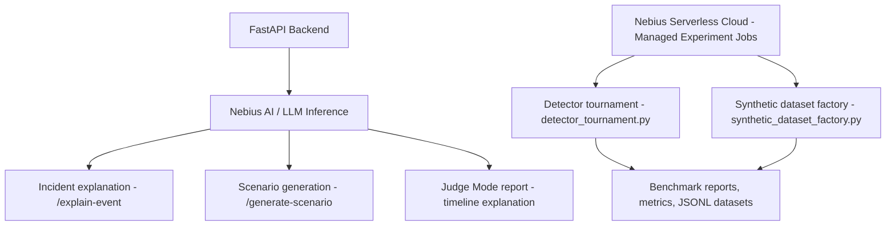

Nebius AI / LLM inference:

- receives compact evidence from the backend
- generates AI Investigator explanations for the Arena UI
- generates bounded red-team scenario drafts for Scenario Generator
- supports Judge Mode timeline explanations
- runs in deterministic mock mode for first wiring and AI mode after deployment

Nebius Serverless Cloud - Managed Experiment jobs:

- run detector tournament benchmarks outside the interactive UI
- generate labeled synthetic datasets
- produce benchmark reports and metrics artifacts
- keep long-running experiment work separate from live demo latency

## Full Functional Lifecycle

```mermaid
flowchart LR
    Register["Register and validate<br/>historical session"]
    Replay["Historical control replay"]
    Inject["Hybrid replay +<br/>synthetic attack"]
    Evidence["Signed comparison<br/>and locality evidence"]
    Review["Blind clean-window<br/>review / adjudication"]
    Freeze["Frozen corpus +<br/>chronological split"]
    Features["Causal features"]
    LightGBM["LightGBM<br/>reference baseline"]
    Transformer["Standalone<br/>Transformer"]
    Hybrid["Transformer → LightGBM<br/>hybrid"]
    Compare["Identical-row comparison<br/>+ LOBSTER robustness"]
    Track["MLflow experiments<br/>and approved artifacts"]
    Package["Verified E2E<br/>evidence package"]
    Client["Simple CEO demo<br/>then commercial BYO step"]

    Register --> Replay
    Register --> Inject
    Replay --> Evidence
    Inject --> Evidence
    Evidence --> Review
    Review --> Freeze
    Freeze --> Features
    Features --> LightGBM
    Features --> Transformer
    Transformer --> Hybrid
    Features --> Hybrid
    LightGBM --> Compare
    Transformer --> Compare
    Hybrid --> Compare
    Compare --> Package
    Package --> Client
    Freeze -. "release hash" .-> Track
    LightGBM -. "development run" .-> Track
    Transformer -. "development run" .-> Track
    Hybrid -. "development run" .-> Track
    Compare -. "metrics + manifest" .-> Track
```

## Use Case Summary

| Use case | Primary actor | Business outcome |
| --- | --- | --- |
| Command Center Demo | Demo Operator | Run the Serverless E2E demo, inspect endpoint/job status, and show AI investigation plus detector tournament evidence. |
| Live Arena Mode | Demo Operator | Show a changing synthetic order book with normal and red-team activity. |
| Manual Scenario Launch | Demo Operator | Inject a bounded abuse-like pattern and observe visible market effects. |
| Historical Session Registration | Data Steward / Research User | Validate a licensed LOBSTER pair and freeze immutable normalized provenance. |
| Hybrid Historical Replay | Demo Operator / Research User | Replay a LOBSTER window as an unlabeled control, then inject the same predefined synthetic attack over that window for reproducible comparison. |
| Governed Corpus Release | Data Steward / Independent Reviewers | Admit sessions and clean windows only after coverage, provenance, blind review, conflict resolution, and signed release gates pass. |
| Shared MLflow Tracking | ML Engineer / Reviewer | Keep corpus, LightGBM-development, governed-evaluation, and approved model metadata in one authenticated tracking plane. |
| Governed LightGBM v1 | ML Engineer / Model Validator | Train deterministic binary `attack_active` candidates now; next freeze validation-selected operating modes and compare against rules without test leakage. |
| Incident Investigation | Demo Operator / Reviewer | Use AI Investigator to turn detector evidence into a clear explanation. |
| Red-Team Scenario Generation | Demo Operator | Use Scenario Generator to create a launchable synthetic scenario configuration. |
| Detector Tournament Benchmark | Research / Benchmark User | Use Managed Experiment jobs to compare detector precision, recall, F1, and latency. |
| Secure CEO/Customer Demo UI | CEO / Product Sponsor / Technical Reviewer | Sign in, inspect governed Nasdaq/LOBSTER ingestion, replay a frozen campaign, compare rules/LightGBM/Transformer/hybrid, inspect MLflow-linked results and read/export a one-page management summary. |
| BYO Data + BYO Detector Adapter | Future Client / Data Steward / Detector Team | Commercial north star, parked until the E2E demo exits: onboard client data and validate the client detector offline, then in real-time shadow mode. |
| Synthetic Dataset Generation | Research / Benchmark User | Use Managed Experiment jobs to produce labeled synthetic event/snapshot/incident artifacts. |
| Challenge Submission Evidence | Technical Reviewer | Review architecture, metrics, screenshots, and safety framing. |
| UI Shell Personalization | Demo Operator / Reviewer | Use compact navigation and switch day/night/system display without changing backend state. |

## Live Arena Mode

Purpose: demonstrate a live synthetic market with changing order-book state.

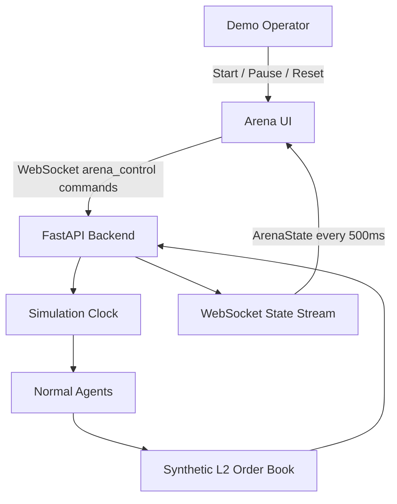

Business value:

- Gives reviewers an immediate visual understanding of the system.
- Shows that detector and AI features are grounded in live synthetic state.
- Provides a demo cockpit before any batch or Nebius workflow is introduced.

Nebius role:

- No direct Nebius call is needed for the baseline live loop.
- The live arena creates the state and incidents later sent to Nebius AI / LLM inference.

## UI Shell Personalization

Purpose: make the arena usable in repeated demos, recordings, and reviews without changing simulation state.

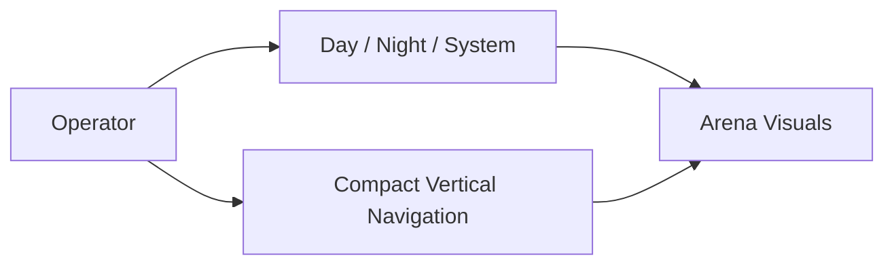

Business value:

- Makes the UI cleaner for screenshots and demos.
- Supports dark rooms, light rooms, and system-following display behavior.
- Keeps visual preferences local to the browser, separate from backend runtime and detector behavior.

Nebius role:

- No Nebius call is required.
- Cleaner UI state improves review of Nebius-generated reports and benchmark artifacts.

## Manual Scenario Launch

Purpose: let an operator inject bounded synthetic abuse-like patterns.

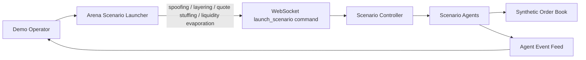

Business value:

- Creates a controlled, repeatable demo moment.
- Separates synthetic red-team behavior from normal market agents.
- Makes scenario labels available for detector and benchmark evaluation.

Nebius role:

- Manually launched scenarios can be generated or narrated by Nebius AI.
- Scenario labels become inputs for Managed Experiment benchmark runs.

## Historical Session Registration

Status: implemented for local/UI ingestion and manifest validation.

Purpose: convert one licensed LOBSTER message/book pair into an immutable,
locally governed replay dataset without uploading the raw source to MLflow.

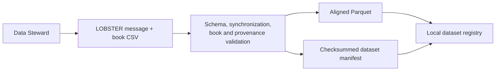

Main flow:

1. Select a complete session or bounded time window in Data Ingestion.
2. Validate message/book alignment, price units, timestamps, lifecycle,
   crossed-book state, visible volume, and source provenance.
3. Write events, snapshots, and the manifest atomically.
4. Register the dataset only after all hashes and row counts agree.
5. Record only permitted manifest/release metadata in downstream tracking.

Business value:

- Creates a reproducible client-data onboarding boundary.
- Prevents malformed or modified source material from entering Java replay.
- Keeps licensed raw records local and out of experiment metadata by default.

## Hybrid Historical Replay

Purpose: compare detector behavior on an immutable LOBSTER window with and
without an existing synthetic attack overlay.

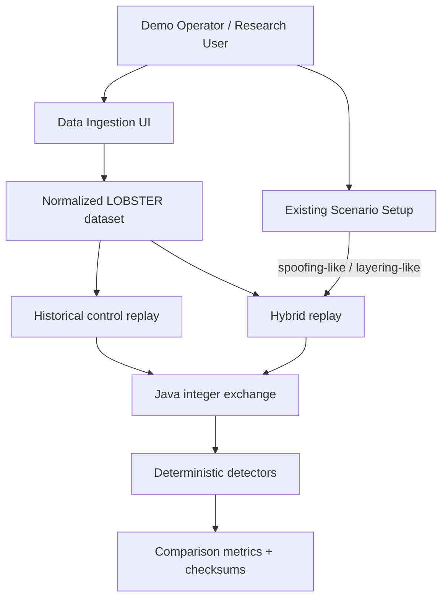

Main flow:

1. Import a paired LOBSTER message/order-book dataset.
2. Select **Historical control**, load the dataset, and replay the window
   without assigning benign or attack ground truth.
3. Select **Hybrid + attacks** and load the same dataset.
4. Launch a predefined scenario from the existing Scenario Setup UI.
5. Compare source/event counts, detector alerts, TP/FN/FP/TN, precision,
   recall, F1, and final-book realism deltas.

Business value:

- Tests existing detectors against genuine visible-depth market conditions.
- Preserves reproducibility without creating another simulator.
- Separates synthetic ground truth from potentially suspicious historical
  activity.
- Demonstrates that attack behavior responds only to the reconstructed current
  book, never future data.

Nebius role:

- No Nebius call is required for deterministic replay or detector scoring.
- Persisted comparison evidence may later be summarized by AI Investigator,
  without moving labels or AI output into the detector decision path.

## Governed Corpus Release

Status: implemented as typed manifests, CLIs, validation gates, chronological
splits, and signed releases. The multi-reviewer API/UI workflow remains the next
Track B product delivery.

Purpose: freeze a scientifically defensible corpus instead of treating all
historical windows as clean negatives.

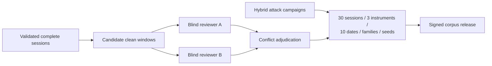

Acceptance boundary:

- at least 30 complete sessions, three instruments, and ten dates;
- every protocol-required attack family and at least three seeds per family;
- two independent blinded decisions or explicit adjudication for every clean
  window;
- frozen session-grouped chronological assignments, boundary embargo, and
  duplicate-source rejection; and
- exact protocol, corpus, split, feature, signature, and checksum bindings.

MLflow may index the frozen release hash and permitted reports only after these
repository gates pass.

## Shared MLflow Tracking

Status: implemented and deployed through the opt-in `mlflow` Compose profile.

Purpose: give Track A and Track B one authenticated experiment, artifact, and
model-registry index without making MLflow the approval authority.

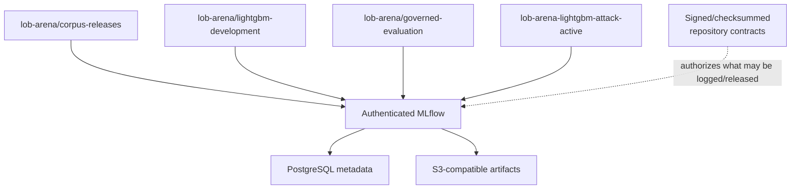

Main flow:

1. A governed pipeline verifies compatible protocol, corpus, split, feature,
   and release hashes locally.
2. It logs parameters, metrics, manifests, and permitted artifacts to the
   appropriate experiment.
3. Development models remain in the development experiment.
4. Final test results enter governed evaluation only after thresholds are
   frozen.
5. A registered model version or alias is created only after release
   verification passes.

## Governed LightGBM v1

Status: implemented and verified locally through the complete governed v1
software boundary. Nebius Wave 1 cloud qualification is in progress at G4;
G5-G9 performance, reproducibility and release gates remain pending. The
market-sequence Transformer and Transformer-to-LightGBM cascade are separate
Todo waves after the LightGBM go/no-go decision.

Purpose: deliver an interpretable binary `attack_active` challenger and compare
it with deterministic rules on identical governed observations.

Main flow:

1. Load only schema/protocol/corpus/split-compatible feature artifacts.
2. Fit preprocessing and class weights on the training fold only.
3. Use validation for early stopping, probability calibration, and threshold
   selection.
4. Freeze high-precision, balanced, and high-recall operating modes.
5. Run one final paired test evaluation against rules.
6. Persist feature contributions or SHAP evidence, manifests, checksums, and
   MLflow run/model references.

Primary challenge cases are liquidity evaporation and subtle layering, rather
than only reproducing already-easy spoofing or quote-stuffing results.

## Incident Investigation

Purpose: explain a detected synthetic incident using compact replay evidence.

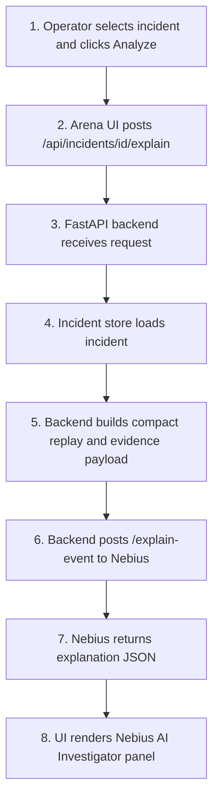

Business value:

- Converts detector evidence into a readable investigation narrative.
- Keeps Nebius credentials and endpoint details out of the browser.
- Preserves safety framing with synthetic-only disclaimers.

Nebius role:

- Backend calls `NEBIUS_INCIDENT_EXPLAINER_URL`, deployed as `/explain-event`.
- Request contains compact replay context, detector evidence, and incident metadata.
- Response is typed explanation JSON for the UI's Nebius AI Investigator panel.

## Red-Team Scenario Generation

Purpose: generate a launchable synthetic scenario configuration from business
constraints.

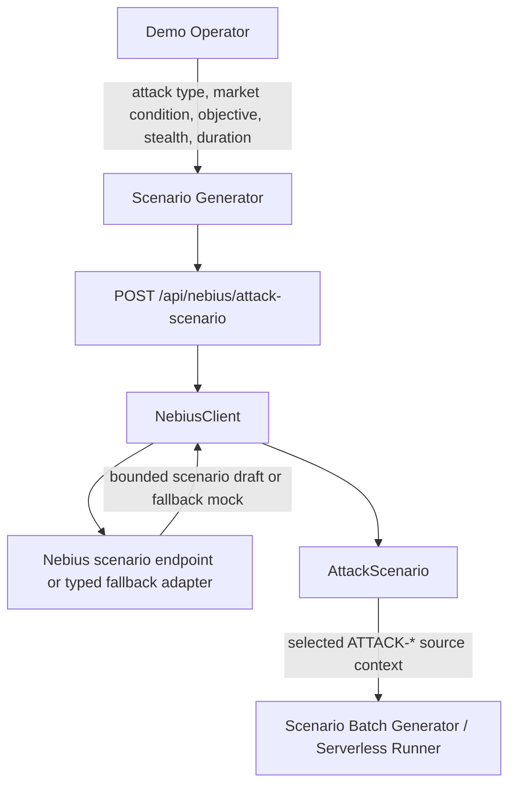

Business value:

- Lets the demo create scenario variants without hardcoding every variant.
- Keeps generated scenarios bounded, persisted, selectable, and usable as source context for scenario grids or Nebius Serverless batches.
- Supports both Nebius endpoint mode and local mock fallback mode.

Nebius role:

- Backend calls the configured Nebius scenario endpoint when available and falls back to a typed local adapter.
- Input includes attack type, market condition, objective, stealth level, attack duration, red-team agent count, and detector difficulty.
- Output is normalized into `AttackScenario`; persisted scenarios can be selected later in the Control Panel and submitted to the Scenario Batch Generator or Serverless Batch Experiment Runner.

## Detector Tournament Benchmark

Purpose: evaluate deterministic detectors across labeled synthetic scenario
families.

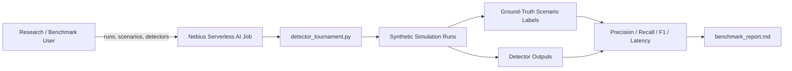

Business value:

- Provides measurable evidence beyond a visual demo.
- Shows detector performance by scenario family.
- Produces artifacts suitable for challenge review and iteration.

Nebius role:

- Runs as a Nebius Serverless AI Job using `serverless/jobs/detector_tournament.py`.
- Accepts `--runs`, `--scenarios`, `--detectors`, and `--output`.
- Writes `benchmark_report.md`, `metrics.csv`, and `results.json`.

## Synthetic Dataset Generation

Purpose: create labeled synthetic artifacts for demos, tests, and analysis.

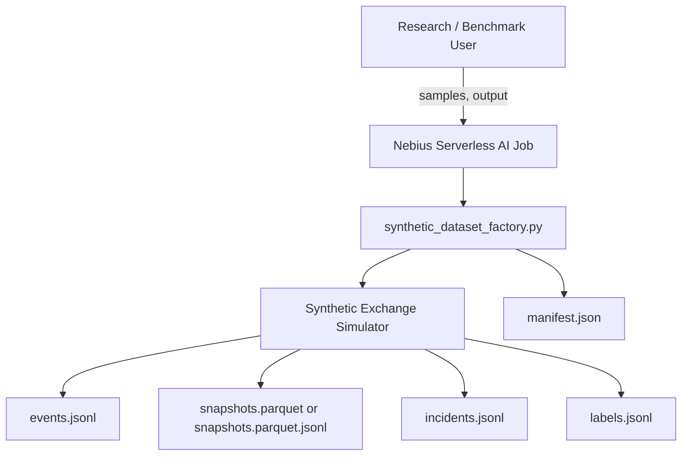

Business value:

- Produces repeatable labeled synthetic data without external market feeds.
- Supports offline analysis and regression tests.
- Falls back to JSONL when Parquet dependencies are unavailable.

Nebius role:

- Runs as a Nebius Serverless AI Job using `serverless/jobs/synthetic_dataset_factory.py`.
- Accepts `--samples` and `--output`.
- Writes JSONL artifacts and Parquet or Parquet-like JSON fallback snapshots.

## Judge Mode Investigation Report

Purpose: explain a selected timeline window, not only a pre-created incident.

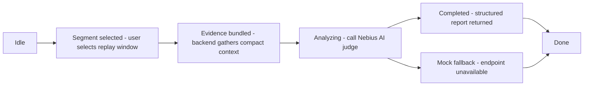

Business value:

- Supports a more exploratory review workflow.
- Connects charts, order-book state, events, and detector signals.
- Produces an investigation-style report while preserving educational framing.

Nebius AI role:

- Uses the same Nebius AI / LLM inference family as AI Investigator.
- Sends bounded timeline context rather than full raw event logs.
- Returns a structured investigation report for reviewer-facing analysis.

## Challenge Submission Evidence

Purpose: package the project story for technical review.

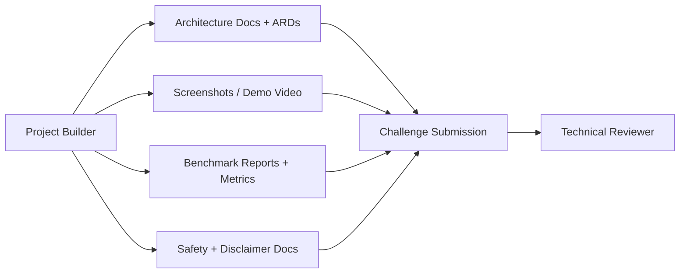

Business value:

- Shows both the visual demo and engineering rigor.
- Makes Nebius usage explicit through endpoint and job workflows.
- Provides a reviewable path from architecture decisions to runnable artifacts.

Nebius role:

- Endpoint evidence: incident explanations, scenario drafts, Judge Mode reports.
- Job evidence: detector tournament metrics and synthetic dataset artifacts.
- Deployment evidence: endpoint/job configs, Dockerfiles, and serverless docs.

## Use Cases → Architecture Mapping

Each use case is supported by specific architecture components:

| Use Case | Primary Path | Key Components | ARDs |
|----------|--------------|-----------------|------|
| Live Arena Mode | Interactive | UI + Java Control Plane + Exchange + Agent Runner | [ARD-0001](architecture/ARD-0001-overall-architecture.md), [ARD-0002](architecture/ARD-0002-websocket-state-schema.md), [ARD-0020](architecture/ARD-0020-java-arena-websocket-agent-orchestration.md) |
| Manual Scenario Launch | Interactive | Scenario Launcher + Backend API | [ARD-0006](architecture/ARD-0006-scenario-labeling-and-reproducibility.md) |
| Historical Session Registration | Data governance | FastAPI Ingestion + Local Registry + Immutable Parquet | [ARD-0018](architecture/ARD-0018-canonical-exchange-event-stream.md), [ARD-0022](architecture/ARD-0022-historical-market-data-ingestion.md) |
| Hybrid Historical Replay | Interactive / Evaluation | Data Ingestion + Java Replay Adapter + Integer Exchange + Scenario Launcher + Comparison Artifacts | [ARD-0018](architecture/ARD-0018-canonical-exchange-event-stream.md), [ARD-0022](architecture/ARD-0022-historical-market-data-ingestion.md), [ARD-0023](architecture/ARD-0023-hybrid-historical-replay.md) |
| Governed Corpus Release | Data governance | Review/Adjudication + Coverage Gates + Frozen Split + Signed Release | [ARD-0025](architecture/ARD-0025-governed-corpus-and-ml-benchmark.md) |
| Shared MLflow Tracking | ML governance | MLflow + PostgreSQL + S3-Compatible Artifacts | [ARD-0027](architecture/ARD-0027-shared-mlflow-tracking.md) |
| Governed LightGBM v1 | ML development / Evaluation | Causal Features + Governed Loader + Deterministic Trainer + MLflow + Paired Benchmark | [ARD-0024](architecture/ARD-0024-versioned-causal-feature-engineering.md), [ARD-0025](architecture/ARD-0025-governed-corpus-and-ml-benchmark.md), [ARD-0026](architecture/ARD-0026-governed-lightgbm-release-boundary.md), [ARD-0027](architecture/ARD-0027-shared-mlflow-tracking.md), [ARD-0028](architecture/ARD-0028-governed-lightgbm-feature-loading.md), [ARD-0029](architecture/ARD-0029-deterministic-lightgbm-binary-training.md) |
| Incident Investigation | Interactive | Incident Store + Nebius Endpoint | [ARD-0005](architecture/ARD-0005-nebius-endpoint-contract.md), [ARD-0008](architecture/ARD-0008-nebius-serverless-ai-endpoints.md), [ARD-0015](architecture/ARD-0015-nebius-ai-investigation-team.md) |
| Red-Team Scenario Generation | Interactive | Nebius Endpoint /generate-scenario | [ARD-0005](architecture/ARD-0005-nebius-endpoint-contract.md), [ARD-0016](architecture/ARD-0016-ai-scenario-generator.md) |
| Detector Tournament Benchmark | Batch | Nebius Jobs + Simulation + Metrics | [ARD-0004](architecture/ARD-0004-benchmark-artifact-format.md), [ARD-0007](architecture/ARD-0007-nebius-serverless-ai-jobs.md), [ARD-0017](architecture/ARD-0017-ai-detector-tournament.md) |
| Synthetic Dataset Generation | Batch | Nebius Jobs + Dataset Factory | [ARD-0004](architecture/ARD-0004-benchmark-artifact-format.md), [ARD-0007](architecture/ARD-0007-nebius-serverless-ai-jobs.md) |
| UI Shell Personalization | Interactive | Themed Shell + Local Preferences + Arena Visual Stability | [ARD-0013](architecture/ARD-0013-ui-shell-preferences.md) |

## Related Documentation

- [Architecture Overview](architecture.md) — System design and data flow
- [Functional Overview](FUNCTIONAL_OVERVIEW.md) — Capability status, actors, lifecycle and acceptance rules
- [Architecture Records (ARDs)](architecture/README.md) — Detailed design decisions
- [Runtime Model](runtime-model.md) — Simulation engine execution
- [Benchmark Methodology](benchmark-methodology.md) — How we measure detector quality
- [Nebius Deployment](nebius-deployment.md) — Setup instructions
- [Shared MLflow Tracking](mlflow-tracking-server.md) — Experiment/model tracking operations and governance boundary
- [Quick Start](QUICKSTART.md) — Get running in 5 minutes
- [Safety & Disclaimers](safety-and-disclaimers.md) — Educational focus and limitations
