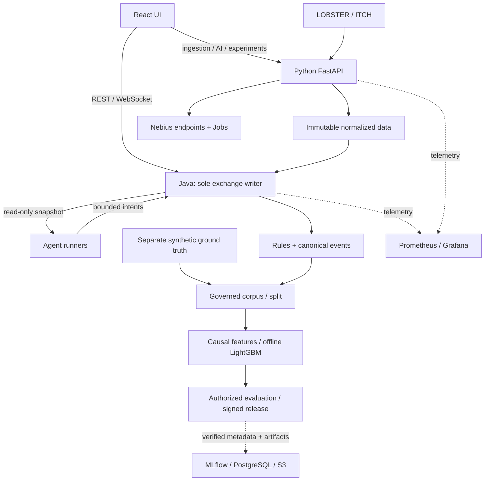
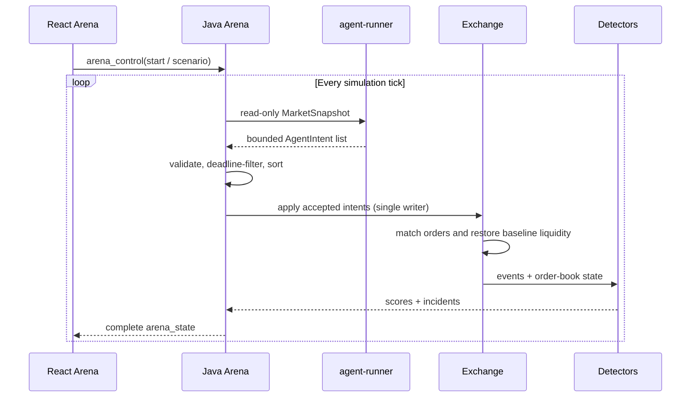

# High-Level Architecture

The [documentation index](README.md) explains the topic layout. For dated gates,
issues, baseline targets and pending readiness evidence, use the
[current roadmap snapshot](roadmap/CURRENT_STATUS.md). This is the canonical
system overview; ARD-0001 retains the original decision history.

LOB Arena separates six concerns:

- **User and integration surfaces**: React/Vite UI, CLIs, batch jobs, and future
  external detector adapters.
- **Data plane**: licensed LOBSTER and Nasdaq ITCH ingestion, immutable normalized Parquet,
  source manifests, synthetic scenarios, and distinct ground truth.
- **Java execution plane**: the only live-book writer for synthetic,
  historical-only, and hybrid streams.
- **Python AI/ML plane**: ingestion, corpus governance, causal features,
  learned-detector contracts and roadmap, Nebius integration, evaluation, and
  evidence tooling.
- **ML governance plane**: authenticated MLflow tracking, PostgreSQL metadata,
  and S3-compatible artifacts.
- **Operations plane**: Prometheus/Grafana telemetry and local or Nebius
  execution infrastructure.

The architecture supports interactive replay/investigation and offline governed
corpus/training/evaluation paths. Both paths reuse the same canonical Java
stream, scenario ground truth, hashes, and release contracts.

## Implementation scope

LightGBM training/calibration and C4 tabular/sequence preparation exist.
Transformer training, cascade, model-version promotion and Java-stream learned
serving remain planned. Use the [ML lifecycle](use-cases/ml-lifecycle.md) for
implementation boundaries and [current status](roadmap/CURRENT_STATUS.md) for
dated qualification, frozen candidate and authorization evidence.

## System High-Level Design

### Component Responsibilities

| Component | Responsibility |
| --- | --- |
| React / Vite UI | Presents the themed product shell with Data Ingestion, Arena, Control Panel, and About navigation, plus 2D order-book views, detector output, Incident Details, and AI Investigator reports. Arena live controls and state use WebSocket; Nebius AI, experiment, artifact, and report actions use backend REST APIs. |
| Java arena/control plane | Owns the live exchange, scenarios, deterministic detectors/incidents, journals, REST controls, WebSocket sessions, and agent fan-out as the sole book writer. |
| FastAPI AI/ML service | Owns LOBSTER discovery/validation/normalization, corpus and feature tooling boundaries, Nebius AI/ML, explanations, experiments, evidence archives, and serverless workflows. Its arena compatibility routes are thin Java clients. |
| Historical replay adapter | Verifies normalized manifests and feeds immutable source records into the Java exchange before the synthetic phase without assigning historical labels. |
| Agent Runners Workspace | Runs out-of-process normal, CPU-heavy, ML, and LangGraph-compatible agents behind the common intent protocol. Runners return intents and never mutate the exchange directly. |
| Corpus and feature pipeline | Accepts independently adjudicated negatives and synthetic attack labels, freezes chronological session groups, and emits causal schema-locked features and signed evaluation inputs. |
| Shared MLflow plane | Indexes corpus releases, LightGBM development, governed evaluations, metrics and permitted artifacts in PostgreSQL/S3-compatible storage. A registered-model namespace exists; automatic version publication/promotion is planned. It cannot approve a release. |
| Experiment manager | Owns local/Nebius Managed Experiment manifests on `/api/experiments`, persists `outputs/experiments/<experiment_id>/experiment.json`, and exposes artifact paths without replacing MLflow or the governed release manifests. |
| Nebius Serverless Cloud | Provides Nebius AI inference for Smart Detection and AI Investigator reports, plus Managed Experiment batch execution, GPU utilization, datasets, and artifacts. |
| Prometheus | Opt-in operational telemetry store that scrapes Java Actuator, FastAPI, agent-runner, and its own health. It is outside the exchange and detector decision path. |
| Grafana | Opt-in visualization layer that queries Prometheus through a provisioned datasource and supplies end-to-end, Java, component, bottleneck, and detector-tournament dashboards. |
| Event / snapshot log | Stores replayable event streams, order book snapshots, detected incidents, and generated reports for inspection and offline analysis. |

The exchange produces a versioned canonical stream of `add`, `modify`,
`cancel`, `execute`, and `snapshot` events. Simulation, strict canonical CSV,
and normalized LOBSTER Parquet now enter the same Java exchange while preserving
upstream sequence/timestamps separately from canonical replay order. Arena
state/WebSocket messages carry a bounded event tail,
`/api/arena/exchange-events` provides cursor replay, and append-only history
stores full events plus snapshot-only checkpoints.

### Historical And Hybrid Replay Path

Historical records enter Java before the synthetic phase. Source snapshots stay
immutable, synthetic identities/labels remain separate, and attacks read only
the current book. See [runtime ordering](runtime/runtime-model.md#historical-and-hybrid-runtime),
[hybrid contract](architecture/ARD-0023-hybrid-historical-replay.md) and
[replay commands](data/replay-quickstart.md).

### Offline Feature Engineering Path

Python consumes the canonical Java stream. Causal numeric features are calculated
before separate labels are joined; historical source-only snapshots do not become
combined-book prediction rows. The [feature reference](ml/feature-engineering-lightgbm.md)
owns the data-flow diagram, formulas, schemas and prefix-invariance guarantee.

### Governed LightGBM Release Boundary

Protocol, corpus, split, feature, model, calibration and prediction identities
must agree before release verification or tracking. The
[release decision](architecture/ARD-0026-governed-lightgbm-release-boundary.md)
owns artifact relationships; the [ML lifecycle](use-cases/ml-lifecycle.md)
owns development, validation reuse and planned promotion workflows.

### Frozen C4 Evaluation and Recovery

[ARD-0038](architecture/ARD-0038-c4-specific-evaluation.md) defines the four-date
C4 contract separately from the seven-date benchmark. Original C3 checkpoints
bind the rules comparison to the same retained observations. Row metrics,
calibration and session-cluster uncertainty retain their explicit coverage limits.
The logger independently recomputes the report before indexing `c4.test.*` metrics.

```mermaid
flowchart LR
    C4["Authorized frozen candidate + C4 projection"] --> Reserve["Reserve one MLflow run; durable ledger"]
    Reserve --> Score["Final scoring"]
    Score --> Eval["C4 report + original C3 evidence"]
    Eval --> Durable["Seal scored checkpoint before logging"]
    Durable --> Log["Verify and log to same MLflow run"]
    Durable -. "after workspace loss; no rescoring" .-> Recovery["Log-only recovery"]
    Recovery --> Log
    Log --> Complete["Completed release"]
    Complete --> Retain["Sealed publication checkpoint"]
    Retain --> Publish["Conditional PUTs; SUCCESS last; readback"]
```

This lifecycle is implemented in the signed replacement path and exercised by
synthetic native Jobs. [ARD-0039](architecture/ARD-0039-same-run-mlflow-recovery.md)
reserves one MLflow identity and recovers verified logging without another run.
[ARD-0040](architecture/ARD-0040-completed-release-publication-recovery.md)
recovers publication of a completed release without scoring or MLflow writes.
Separate pre-logging retention supplies the payload needed for log-only recovery.
The [native receipt](evidence/g8-native-recovery-20260917.json) and later
[independent S3 receipt](evidence/g8-independent-s3-readback-20260917.json)
prove synthetic recovery, not production G8 acceptance. See
[remaining recovery gates](operations/g8/g8-completion-recovery.md) and
[the native storage exception](operations/g8/g8-persistent-storage-exception.md).

### Shared MLflow Tracking Plane

[MLflow operations](ml/mlflow-tracking-server.md) owns topology, version,
namespaces, authentication, PostgreSQL/S3 storage and exporter configuration.
MLflow indexes verified artifacts; repository hashes/signatures remain release
authority. Artifact logging and a model namespace do not imply registered
versions, aliases or serving deployment.

### Detector Tournament Observability

Detector tournaments participate in the observability plane through
FastAPI, which already owns local child-process execution and Nebius Job
submission, status refresh, and artifact collection. Prometheus does not scrape
short-lived tournament processes or Nebius Jobs directly.

The implemented operational contract is deliberately bounded:

| Metric family | Purpose | Bounded labels |
| --- | --- | --- |
| `detector_tournament_runs_total` | Count tournament terminal outcomes | `execution_mode`, `outcome` |
| `detector_tournament_duration_seconds` | Measure end-to-end tournament duration | `execution_mode`, `outcome` |
| `detector_tournament_in_flight` | Show queued or running work | `execution_mode` |
| `detector_tournament_scenarios_total` | Measure completed scenario throughput | `execution_mode`, `outcome` |
| `detector_tournament_artifact_collections_total` | Track successful, failed, and incomplete result collection | `execution_mode`, `outcome` |

Tournament IDs, Job IDs, seeds, scenario IDs, and artifact paths must not become
Prometheus labels. Precision, recall, F1, detector leaderboards, and per-scenario
results remain in the artifact store and product UI. Grafana's tournament view
is for operational questions—whether work is completing, how long it takes, and
where it fails—not for replacing the benchmark report.

Java 25 owns both the versioned deterministic kernel API and the stateful live arena. Spring Boot exposes kernel and arena REST plus `/ws/arena`, while framework objects remain outside the matching hot loop. FastAPI retains only AI/ML, Nebius, experiments, evidence, and serverless capabilities.

### Runtime Flow

The [runtime reference](runtime/runtime-model.md) owns lifecycle and transport.
Java validates runner deadlines/intents, preserves baseline liquidity, persists
events and broadcasts complete state. AI requests go through FastAPI after
evidence collection; browser theme preferences do not affect simulation.

### Live Tick Sequence

## Batch / Benchmark Path

FastAPI's experiment manager persists manifests, submits/polls configured Jobs,
collects artifacts and aggregates reports. Cloud completion requires confirmed
provider state and collected output; missing configuration is explicitly pending.
See [Job integration](architecture/ARD-0007-nebius-serverless-ai-jobs.md),
[tournament contracts](architecture/ARD-0017-ai-detector-tournament.md) and
[benchmark methodology](ml/benchmark-methodology.md). Agent model workloads
follow the [execution policy](ml/model-validation-execution-policy.md).

## Data Artifacts

| Artifact | Purpose |
| --- | --- |
| `events.jsonl` | Append-only stream of simulation events, agent actions, detector signals, and state changes. |
| `history/exchange_events.jsonl` | Canonical add/modify/cancel/execute/snapshot archive, segmented by stream ID for replay. |
| `history/lob_snapshots.jsonl` | Snapshot-only canonical checkpoints for efficient L2 state scans. |
| `data/processed/lobster/<dataset_id>/` | Immutable normalized LOBSTER events, aligned visible-depth snapshots, and registry manifest. |
| `historical-replay/<run>/control.json` / `hybrid.json` | Historical-only and hybrid summaries over the same source window, including source/canonical counts and stream hashes. |
| `historical-replay/<run>/comparison.json` | Detector TP/FN/FP/TN, precision, recall, F1, alert timing, and final-book realism deltas. |
| `historical-replay/<run>/validation-report.json` / `.sig` | Causal-neighbourhood equivalence, lifecycle, provenance, determinism, and detached Ed25519 attestation. |
| `historical-replay/<run>/manifest.json` / `checksums.sha256` | Replay comparison inventory and full-bundle integrity checks. |
| `features/<run>/features.parquet` | Stable typed causal feature rows consumed by the governed LightGBM v1 loader and trainer. |
| `features/<run>/run-metadata.json` / `feature-quality.json` | Feature/config/input hashes, source/session metadata, split policy, missing/distribution/class-balance summaries, and invalid rows. |
| LightGBM Phase 0 manifests | Strict training, calibration, model-bundle, and prediction contracts binding governed inputs, frozen operating points, checksums, and release identity. |
| `experiments/<experiment_id>/experiment.json` | Phase 4.5 experiment manifest with requested scenarios, execution mode, status, artifact paths, optional smart-batch link, and metrics. |
| `experiments/<experiment_id>/attacks.jsonl` | Deterministic attack plan rows with expected labels, detector family, timing, agent profile, and parameters for each planned run. |
| `experiments/<experiment_id>/jobs.jsonl` | Experiment-scoped local and Nebius Job records, including queued, running, completed, failed, and explicitly unconfigured states. |
| `experiments/<experiment_id>/local-batch/` | Local smart-batch outputs for the experiment, including order-book events, trades, labels, alerts, metrics, report, and batch manifest. |
| `experiments/<experiment_id>/artifact_index.json` | Index mapping original local-batch artifact names to canonical experiment-root artifact names. |
| `experiments/<experiment_id>/investigations/` | Per-alert AI Investigator reports as JSON and Markdown, generated from persisted top-confidence batch alerts. |
| `experiments/<experiment_id>/experiment_summary.json` / `leaderboard.json` | Aggregated experiment totals and scenario leaderboard sourced from detector metrics, labels, alerts, and investigations. |
| `experiments/<experiment_id>/benchmark_report.md` | Human-readable synthetic educational benchmark report shown in Reports after aggregation. |
| `snapshots.parquet` | Structured order book and market snapshots optimized for offline analysis. |
| `incidents.json` | Detected incidents with metadata, timestamps, involved agents, scenario labels, and detector evidence. |
| `reports.md` | Human-readable AI Investigator explanations, incident summaries, and benchmark reports. |

### Artifact Relationships

See the [artifact contract diagram](architecture/ARD-0004-benchmark-artifact-format.md#artifact-relationships)
for the legacy benchmark; governed learned releases have separate versioned
[contracts](architecture/ARD-0026-governed-lightgbm-release-boundary.md).

## Architectural Boundaries

- The UI uses Java REST/WebSocket for live arena controls and FastAPI for AI/ML operations; it never calls agent runners or Nebius endpoints directly.
- UI shell theme preferences are local browser state.
- The simulation engine should emit structured events and detector results without depending on UI concerns.
- Agent runners may decide remotely, but they must return intents only; they must not mutate exchange state directly.
- Java owns live transport, arena persistence and scenario orchestration; FastAPI owns AI calls, experiments and their artifacts.
- `/api/experiments` owns durable experiment manifests and report visibility; `/api/nebius/smart-batches` continues to own Nebius Control smart-batch execution.
- Real Nebius Serverless Job submit, status, log, and artifact collection calls are isolated in `backend/app/experiments/nebius_orchestrator.py`; absent configuration records `real_nebius_pending`, while completion requires confirmed cloud status and collected artifacts.
- Batch benchmark jobs should share simulation and detector code with the live path where practical, but should not depend on the interactive UI.
- Persisted artifacts should be treated as replay and audit inputs, not only as transient logs.
- Historical source records and source snapshots are immutable. Hybrid
  execution may add synthetic orders to the live book but must not rewrite the
  historical snapshot payload or infer benign labels.
- Detector inputs must remain numeric/event-derived projections and must not
  expose scenario labels, attack seeds, or synthetic-only identifiers.
- Prometheus and Grafana are read-only operational diagnostics. Their absence or
  failure must not change deterministic simulation results, and their time
  series must not be confused with detector benchmark artifacts.
- Detector-tournament processes publish operational telemetry through the
  backend orchestration boundary; they are not direct Prometheus scrape targets.
- Detection reports and generated AI Investigator text are synthetic educational evidence for this simulator, not real surveillance, trading, or compliance outputs.

## Related Documentation

Use the [ARD index](architecture/README.md) for decision history and the
[workflow catalogue](use-cases/README.md) for user actions. The
[documentation index](README.md) links deployment, contracts, operations and
historical records without duplicating their contents here.
