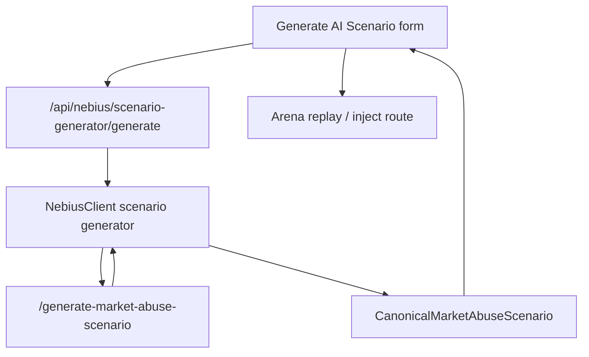

# ARD-0016: AI Scenario Generator

Status: Accepted

Date: 2026-07-06

Implementation Status: `[done: bounded demo integration]`

## Context

The AI Scenario Generator promotes existing red-team templates, variant generation
and Arena injection into a bounded Nebius Endpoint workflow. It generates a
synthetic specification with explicit ground truth; Java remains the live exchange
authority. Python retains generation, normalization, persistence and projection.

## Decision

Use one canonical scenario contract through:

- backend: `POST /api/nebius/scenario-generator/generate`;
- endpoint: `POST /generate-market-abuse-scenario`.

Keep `/api/nebius/attack-scenario*`, `/generate-scenario` and
`/generate-smart-scenario` as compatibility paths. Normalize endpoint output or
replace invalid output with deterministic templates. Persist the canonical
scenario and its `AttackScenario` projection separately.



## Canonical Schema

The maintained models are
[`backend/app/nebius/scenario_generator.py`](../../backend/app/nebius/scenario_generator.py);
the endpoint request model is in
[`serverless/endpoint/app.py`](../../serverless/endpoint/app.py).

| Request field | Accepted values / bounds |
| --- | --- |
| `manipulation_type` | `spoofing_like_wall`, `layering_like`, `quote_stuffing`, `liquidity_evaporation` |
| `difficulty` | `easy`, `medium`, `hard`, `adversarial` |
| `symbol` | 1–16 characters |
| `duration_ticks` | 30–600 |
| `liquidity_regime` | `thin`, `normal`, `deep` |
| `volatility_regime` | `low`, `medium`, `high` |
| `seed` | Optional deterministic fallback seed |

Human-facing “Spoofing” and “Layering” labels are not API enum aliases.

```json
{
  "manipulation_type": "spoofing_like_wall",
  "difficulty": "medium",
  "symbol": "AIMD",
  "duration_ticks": 120,
  "liquidity_regime": "thin",
  "volatility_regime": "high",
  "seed": 42
}
```

A structurally valid illustrative backend response follows. Its values are an
example, not a measured result or an execution receipt.

```json
{
  "mode": "mock",
  "endpoint": "/generate-market-abuse-scenario",
  "scenario_id": "ai-spoofing-example",
  "title": "Synthetic Spoofing Pressure",
  "description": "A bounded visible-wall scenario specification.",
  "manipulation_type": "spoofing_like_wall",
  "difficulty": "medium",
  "symbol": "AIMD",
  "duration_ticks": 120,
  "liquidity_regime": "thin",
  "volatility_regime": "high",
  "ground_truth": {
    "label": "spoofing_like_wall",
    "manipulation_windows": [{"start_tick": 20, "end_tick": 96}],
    "manipulator_agent_ids": ["AI-SPOOF-001"],
    "expected_detector_targets": ["wall_size_ratio", "cancel_to_trade_ratio"],
    "positive_event_ids": ["evt-0020-place"]
  },
  "events": [{
    "event_id": "evt-0020-place",
    "tick": 20,
    "event_type": "place_order",
    "type": "place_order",
    "agent_id": "AI-SPOOF-001",
    "symbol": "AIMD",
    "scenario_id": "ai-spoofing-example",
    "scenario_name": "Synthetic Spoofing Pressure",
    "scenario_family": "spoofing_like_wall",
    "stage": "wall_placed",
    "message": "Place synthetic visible depth.",
    "side": "buy",
    "price": 99.75,
    "quantity": 750,
    "order_id": "ord-0020-a",
    "metadata": {"intent": "visible_depth_pressure"}
  }],
  "expected_detector_behavior": {
    "primary_signals": ["wall_size_ratio", "cancel_to_trade_ratio"],
    "expected_risk_score": 0.76,
    "false_positive_risk": "medium"
  },
  "explanation": "Synthetic visible depth is supplied as scenario context.",
  "replay": {
    "mode": "attack_scenario_projection",
    "route": "spoofing_like_wall",
    "supported": true,
    "scenario_id": "ai-spoofing-example",
    "duration_ticks": 120
  },
  "source": {
    "mode": "mock",
    "provider": "nebius_serverless",
    "endpoint": "/generate-market-abuse-scenario",
    "model": "deterministic-template"
  }
}
```

Event types are `place_order | cancel_order | trade | quote_update`. Every
canonical event also carries `type`, `scenario_id`, `scenario_name`,
`scenario_family`, `stage` and `message`; order fields apply when relevant.
Unknown extra information belongs under `metadata`.

## Replay And Persistence

`generate_with_client()` passes a validated request to `NebiusClient`.
The backend stores `nebius/generated_market_abuse_scenarios.jsonl` and
`nebius/attack_scenarios.jsonl`. `project_attack_scenario()` maps ID/title/type,
regime, duration, expected signals and source into the compatibility projection.

`POST /api/nebius/attack-scenario/{scenario_id}/inject` invokes one of the four
existing Java scenario implementations through `JavaArenaClient`. It does
**not** execute an arbitrary generated event list event for event. Generated
ground truth describes the specification; executed replay labels come from the
scenario that actually runs. Direct canonical-event replay remains future work.

## Fallback / Mock Behavior

- Missing endpoint configuration or failed/invalid endpoint output uses deterministic templates.
- The same request and seed produce stable template content.
- Normalization preserves ground truth, bounded events and expected detector behavior.
- Responses retain mode/source/model and fallback metadata; the UI identifies mock or fallback output.
- Endpoint model JSON is validated before it is adapted to the canonical response.

## Acceptance Criteria

- All four supported scenario families can use the existing Arena injection path.
- Canonical ground truth and the compatibility projection are stored.
- The UI shows the source mode and the Nebius Endpoint integration path.
- Generation works without credentials through deterministic mock mode.
- Existing compatibility routes continue to work.
- Unsupported or invalid endpoint output is normalized or replaced by deterministic fallback.
- Java remains the sole live-book writer; generated content does not create exchange authority.

## Alternatives And Consequences

Reusing named scenario projection avoids a second simulator and preserves the
existing detector/label path. Direct event-list execution was deferred because
its contract is richer than the current injection path. The tradeoff is that
generated event detail and expected risk are specifications, not independently
verified replay outcomes. Ground truth and source metadata must stay separate
from detector input.

## Related Documentation

- [Endpoint contracts and runnable examples](../../serverless/endpoint/README.md)
- [AI/Serverless use cases](../use-cases/nebius-serverless-use-cases.md) — historical July payload/acceptance examples
- [Scenario labeling](ARD-0006-scenario-labeling-and-reproducibility.md)
- [Java live ownership](ARD-0020-java-arena-websocket-agent-orchestration.md)
- [AI Investigation Team](ARD-0015-nebius-ai-investigation-team.md)
- [Original implementation/UI/demo narrative](https://github.com/khab40/lob-arena/blob/d896efe8ca501c1ef8e6c63442f3433948a6405e/docs/architecture/ARD-0016-ai-scenario-generator.md) — historical reference, not current instructions
