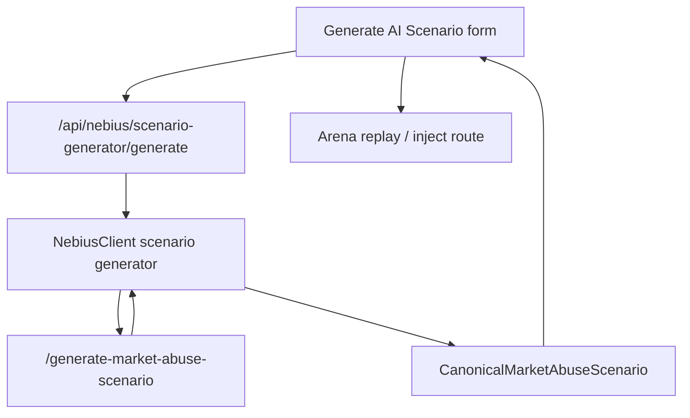

# ARD-0016: AI Scenario Generator

Status: Accepted

Date: 2026-07-06

Implementation Status: `[done: bounded demo integration]`

## Context

The AI Scenario Generator promotes existing red-team templates, variant generation
and Arena injection into a bounded Nebius Endpoint workflow. It generates a
synthetic specification with explicit ground truth; Java remains the live exchange
authority. Python retains generation, normalization, persistence and projection.

## Decision

Use one canonical scenario contract through:

- backend: `POST /api/nebius/scenario-generator/generate`;
- endpoint: `POST /generate-market-abuse-scenario`.

Keep `/api/nebius/attack-scenario*`, `/generate-scenario` and
`/generate-smart-scenario` as compatibility paths. Normalize endpoint output or
replace invalid output with deterministic templates. Persist the canonical
scenario and its `AttackScenario` projection separately.



## Canonical Schema

The maintained models are
[`backend/app/nebius/scenario_generator.py`](../../backend/app/nebius/scenario_generator.py);
the endpoint request model is in
[`serverless/endpoint/app.py`](../../serverless/endpoint/app.py).

| Request field | Accepted values / bounds |
| --- | --- |
| `manipulation_type` | `spoofing_like_wall`, `layering_like`, `quote_stuffing`, `liquidity_evaporation` |
| `difficulty` | `easy`, `medium`, `hard`, `adversarial` |
| `symbol` | 1–16 characters |
| `duration_ticks` | 30–600 |
| `liquidity_regime` | `thin`, `normal`, `deep` |
| `volatility_regime` | `low`, `medium`, `high` |
| `seed` | Optional deterministic fallback seed |

Human-facing “Spoofing” and “Layering” labels are not API enum aliases.

```json
{
  "manipulation_type": "spoofing_like_wall",
  "difficulty": "medium",
  "symbol": "AIMD",
  "duration_ticks": 120,
  "liquidity_regime": "thin",
  "volatility_regime": "high",
  "seed": 42
}
```

A structurally valid illustrative backend response follows. Its values are an
example, not a measured result or an execution receipt.

```json
{
  "mode": "mock",
  "endpoint": "/generate-market-abuse-scenario",
  "scenario_id": "ai-spoofing-example",
  "title": "Synthetic Spoofing Pressure",
  "description": "A bounded visible-wall scenario specification.",
  "manipulation_type": "spoofing_like_wall",
  "difficulty": "medium",
  "symbol": "AIMD",
  "duration_ticks": 120,
  "liquidity_regime": "thin",
  "volatility_regime": "high",
  "ground_truth": {
    "label": "spoofing_like_wall",
    "manipulation_windows": [{"start_tick": 20, "end_tick": 96}],
    "manipulator_agent_ids": ["AI-SPOOF-001"],
    "expected_detector_targets": ["wall_size_ratio", "cancel_to_trade_ratio"],
    "positive_event_ids": ["evt-0020-place"]
  },
  "events": [{
    "event_id": "evt-0020-place",
    "tick": 20,
    "event_type": "place_order",
    "type": "place_order",
    "agent_id": "AI-SPOOF-001",
    "symbol": "AIMD",
    "scenario_id": "ai-spoofing-example",
    "scenario_name": "Synthetic Spoofing Pressure",
    "scenario_family": "spoofing_like_wall",
    "stage": "wall_placed",
    "message": "Place synthetic visible depth.",
    "side": "buy",
    "price": 99.75,
    "quantity": 750,
    "order_id": "ord-0020-a",
    "metadata": {"intent": "visible_depth_pressure"}
  }],
  "expected_detector_behavior": {
    "primary_signals": ["wall_size_ratio", "cancel_to_trade_ratio"],
    "expected_risk_score": 0.76,
    "false_positive_risk": "medium"
  },
  "explanation": "Synthetic visible depth is supplied as scenario context.",
  "replay": {
    "mode": "attack_scenario_projection",
    "route": "spoofing_like_wall",
    "supported": true,
    "scenario_id": "ai-spoofing-example",
    "duration_ticks": 120
  },
  "source": {
    "mode": "mock",
    "provider": "nebius_serverless",
    "endpoint": "/generate-market-abuse-scenario",
    "model": "deterministic-template"
  }
}
```

Event types are `place_order | cancel_order | trade | quote_update`. Every
canonical event also carries `type`, `scenario_id`, `scenario_name`,
`scenario_family`, `stage` and `message`; order fields apply when relevant.
Unknown extra information belongs under `metadata`.

## Replay And Persistence

`generate_with_client()` passes a validated request to `NebiusClient`.
The backend stores `nebius/generated_market_abuse_scenarios.jsonl` and
`nebius/attack_scenarios.jsonl`. `project_attack_scenario()` maps ID/title/type,
regime, duration, expected signals and source into the compatibility projection.

`POST /api/nebius/attack-scenario/{scenario_id}/inject` invokes one of the four
existing Java scenario implementations through `JavaArenaClient`. It does
**not** execute an arbitrary generated event list event for event. Generated
ground truth describes the specification; executed replay labels come from the
scenario that actually runs. Direct canonical-event replay remains future work.

## Fallback / Mock Behavior

- Missing endpoint URL, API key, or invalid model JSON returns deterministic templates.
- Templates are stable for the same request and seed.
- Fallback preserves `ground_truth`, `events`, and `expected_detector_behavior`.
- UI must label fallback as local template mode, while still showing the Nebius Serverless integration path.

## Demo Script

1. Open `/nebius`.
2. Click `Generate AI Scenario`.
3. Select `Spoofing`, `Medium`, `AIMD`, `120 ticks`, `Thin`, `High`.
4. Generate scenario.
5. Confirm badge `Powered by Nebius AI Serverless Endpoint` and source mode.
6. Click `Replay in Arena`.
7. Open incident/detector output.
8. Send resulting incident to AI Investigation Team.

## Acceptance Criteria

- Generated scenario can be replayed by the existing Arena injection path.
- Ground truth is preserved in the canonical response and stored artifact.
- UI clearly shows `Powered by Nebius AI Serverless Endpoint`.
- Works with no Nebius credentials through deterministic mock mode.
- Existing `/api/nebius/attack-scenario*` and `/generate-smart-scenario` routes continue to work.
- Unsupported or invalid model output is normalized or replaced with deterministic fallback.

## Risks And Shortcuts

- Risk: canonical event replay is richer than current Arena scenario launch. Shortcut: store canonical events now, project to existing scenario names for replay, then add direct event replay later.
- Requests are limited to the four first-class Arena routes so generated scenarios always replay their named implementation.
- Risk: AI output violates enums. Shortcut: backend schema validation plus deterministic fallback.
- Risk: too many controls in demo. The active page keeps only the core controls; the retired legacy tuning implementation has been removed.
