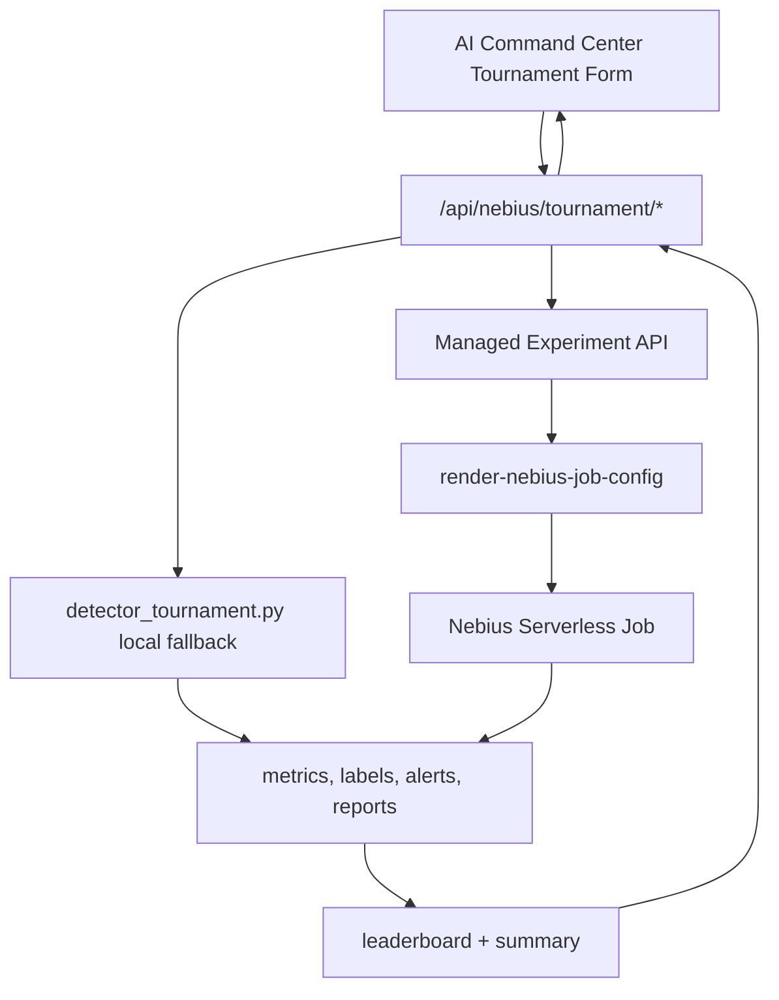

# ARD-0017: AI Detector Tournament

Status: Accepted

Date: 2026-07-06

Implementation Status: `[done]`

Primary implementation:

- Backend API: `POST /api/nebius/tournament/start`, `GET /api/nebius/tournament/{id}`, `GET /api/nebius/tournament/{id}/artifacts`
- E2E demo API: `POST /api/nebius/serverless-smoke/run`
- Backend service: `backend/app/nebius/detector_tournament.py`
- E2E demo service: `backend/app/nebius/serverless_smoke.py`
- Serverless job: `serverless/jobs/detector_tournament.py`
- Frontend surface: AI Command Center detector tournament panel

## Governed ML boundary — 2026-09-21

The tournament and mock leaderboard described here do not train/select the
governed LightGBM, Transformer or cascade. Governed development uses immutable
projections, separate train/validation/test access, hash-bound candidates and
independently verified comparisons. See [ML lifecycle use cases](../use-cases/ml-lifecycle.md).
A demo leaderboard or successful Job is not a model qualification receipt.

## Context

LOB Arena already has detector tournament pieces:

- `serverless/jobs/detector_tournament.py`: runs detector comparison over simulator scenarios and writes `metrics.csv`, `results.json`, chart artifacts, and `benchmark_report.md`.
- `serverless/jobs/run_batch_experiments.py`: runs larger smart batches and writes canonical experiment artifacts such as `order_book_events.jsonl`, `attack_labels.jsonl`, `blue_team_alerts.jsonl`, `detector_metrics.csv`, and `manifest.json`.
- `backend/app/api/routes_experiments.py`: exposes benchmark runs, managed experiments, local batch fallback, Nebius job config rendering, submit, refresh, collect, aggregate, summary, and leaderboard.
- `backend/app/experiments/manager.py`: persists managed experiment state and artifacts.
- `backend/app/experiments/aggregator.py`: builds `experiment_summary.json`, `leaderboard.json`, and benchmark report output.
- `backend/app/experiments/nebius_orchestrator.py`: renders and tracks Nebius job submit/status/collect paths.
- `frontend/src/pages/NebiusControlPanelPage.tsx`: already shows Detector Tournament controls, jobs, leaderboard, and artifact links.

Phase 3 should expose this as “AI Detector Tournament using Nebius Serverless Jobs” without creating a second orchestration system.

## Decision

Use a Nebius product facade for tournament operations:

- `POST /api/nebius/tournament/start`
- `GET /api/nebius/tournament/{id}`
- `GET /api/nebius/tournament/{id}/artifacts`

The facade reuses existing experiment APIs and runners internally:

- `local_mock` fallback returns deterministic leaderboard rows without backend batch execution.
- Explicit `local` execution uses `serverless/jobs/detector_tournament.py` for capped detector-set comparison when the user starts a lightweight tournament.
- Managed Nebius job path uses `ManagedExperiment`, `render-nebius-job-config`, `submit-nebius`, `collect-nebius-artifacts`, and `aggregate`.
- Larger artifact-heavy tournaments continue to use `run_batch_experiments.py` because it already produces canonical JSONL/CSV/MD artifacts for investigations and reports.
- The polished challenge demo uses `serverless-smoke/run` as orchestration glue only. It does not introduce new detector algorithms or duplicate job architecture; it writes a curated artifact bundle under `outputs/serverless-smoke/`.



## Objective

Run scalable detector evaluations over many generated or replayed synthetic scenarios. Each tournament compares detector predictions to synthetic ground truth and returns precision, recall, F1, latency, leaderboard rows, summary text, and downloadable artifacts.

## User Controls

Tournament start form:

- `number_of_scenarios`: integer, default `100`, capped by backend
- `manipulation_types`: list of `spoofing_like_wall`, `layering_like`, `quote_stuffing`, `liquidity_evaporation`
- `difficulty_mix`: object such as `{ "easy": 0.2, "medium": 0.5, "hard": 0.2, "adversarial": 0.1 }`
- `detector_set`: list of `spoofing_like`, `layering_like`, `quote_stuffing`, `liquidity_shock`
- `random_seed`: integer
- `execution_mode`: `local_mock | local | nebius`

The first implementation can map `difficulty_mix` into scenario repetition/manifest metadata until simulator difficulty-specific replay is available.

## Backend API

### Start

```http
POST /api/nebius/tournament/start
Content-Type: application/json
```

Request:

```json
{
  "number_of_scenarios": 100,
  "manipulation_types": ["spoofing", "layering", "quote_stuffing"],
  "difficulty_mix": {
    "easy": 0.2,
    "medium": 0.5,
    "hard": 0.2,
    "adversarial": 0.1
  },
  "detector_set": ["spoofing_like", "layering_like", "quote_stuffing"],
  "random_seed": 42,
  "execution_mode": "local_mock"
}
```

Response:

```json
{
  "tournament_id": "TRN-20260706-0001",
  "status": "completed",
  "execution_mode": "local_mock",
  "started_at": "2026-07-06T10:00:00Z",
  "completed_at": "2026-07-06T10:01:12Z",
  "detectors": ["spoofing_like", "layering_like", "quote_stuffing"],
  "leaderboard": [
    {
      "detector": "spoofing_like",
      "scenario": "spoofing",
      "precision": 1.0,
      "recall": 0.75,
      "f1": 0.8571,
      "false_positives": 0,
      "false_negatives": 1,
      "avg_detection_latency_ms": 1200
    }
  ],
  "metrics": {
    "total_scenarios": 100,
    "total_alerts": 87,
    "macro_f1": 0.81
  },
  "artifacts": {},
  "summary": "Deterministic mock detector tournament completed after local runner fallback.",
  "fallback_reason": "local_mock mode uses deterministic tournament output without backend batch execution."
}
```

### Read Status

```http
GET /api/nebius/tournament/{id}
```

Returns the same envelope with current `status`:

- `queued`
- `running`
- `completed`
- `failed`
- `real_nebius_pending`

### Read Artifacts

```http
GET /api/nebius/tournament/{id}/artifacts
```

Returns artifact metadata and download URLs:

```json
{
  "tournament_id": "TRN-20260706-0001",
  "artifacts": [
    {
      "name": "metrics.csv",
      "path": "outputs/benchmark/TRN-20260706-0001/metrics.csv",
      "download_url": "/api/experiments/artifacts/download?path=..."
    }
  ]
}
```

## Backend Implementation

Implemented in `backend/app/nebius/detector_tournament.py` with schemas:

- `DetectorTournamentStartRequest`
- `DetectorTournamentLeaderboardRow`
- `DetectorTournamentResponse`
- `DetectorTournamentArtifact`
- `DetectorTournamentArtifactsResponse`

Implemented routes in `backend/app/api/routes_nebius.py`:

- `POST /api/nebius/tournament/start`
- `GET /api/nebius/tournament/{id}`
- `GET /api/nebius/tournament/{id}/artifacts`

Route behavior:

1. Normalize request controls into existing scenario names:
   - `spoofing_like_wall` -> `spoofing_like_wall`
   - `layering_like` -> `layering_like`
   - `quote_stuffing` -> `quote_stuffing`
   - `liquidity_evaporation` -> `liquidity_evaporation`
2. If `execution_mode=local_mock`, return deterministic leaderboard rows immediately and do not launch backend batch work.
3. If `execution_mode=local`, queue a capped local run through `serverless/jobs/detector_tournament.py`; only one local tournament can run at a time.
4. If `execution_mode=nebius` and job submit config is present, submit a Nebius Serverless Job command, persist request/stdout artifacts, and return `queued`.
5. If `execution_mode=nebius` and job submit config is missing, return deterministic mock output with a fallback reason.
6. Persist tournament state under `nebius/tournaments/{tournament_id}/`.
7. Append summary rows to `nebius/tournaments.jsonl`.
8. Store history artifact with `kind="run"` and `source="ai_detector_tournament"`.

## E2E Smoke Demo Contract

`POST /api/nebius/serverless-smoke/run` runs one curated story:

1. Generate spoofing scenario through the existing Nebius scenario generator client.
2. Replay `spoofing-like` through the existing Arena simulation.
3. Capture deterministic detector alerts and incident.
4. Explain the incident through the existing incident explainer.
5. Run the AI Investigation Team through the existing endpoint client.
6. Run a local detector tournament for immediate leaderboard evidence.
7. Write `serverless_job.json` with `real_nebius_pending` if `NEBIUS_JOB_*_COMMAND_TEMPLATE` values are absent.

Artifacts:

- `outputs/serverless-smoke/summary.json`
- `outputs/serverless-smoke/scenario.json`
- `outputs/serverless-smoke/simulation_events.json`
- `outputs/serverless-smoke/detector_alerts.json`
- `outputs/serverless-smoke/investigation_report.md`
- `outputs/serverless-smoke/tournament_result.json`
- `outputs/serverless-smoke/serverless_job.json`
- `outputs/serverless-smoke/manifest.json`

## Serverless Job Design

Primary lightweight tournament runner:

```bash
python serverless/jobs/detector_tournament.py \
  --runs 100 \
  --scenarios spoofing,layering,quote_stuffing \
  --detectors spoofing_like,layering_like,quote_stuffing \
  --output outputs/benchmark/TRN-20260706-0001
```

Current outputs:

- `metrics.csv`
- `results.json`
- `benchmark_report.md`
- `charts/f1_by_scenario.png`
- `charts/confidence_distribution.png`
- `charts/detection_latency.png`

Artifact-heavy managed path:

```bash
python serverless/jobs/run_batch_experiments.py \
  --runs 100 \
  --batch-size 20 \
  --scenarios normal_market,spoofing,layering,quote_stuffing \
  --output outputs/serverless-batch/TRN-20260706-0001
```

Current outputs:

- `order_book_events.jsonl`
- `trades.jsonl`
- `attack_labels.jsonl`
- `blue_team_alerts.jsonl`
- `detector_metrics.csv`
- `generated_report.md`
- `manifest.json`

Design rule: do not create a third runner. If Phase 3 needs additional fields, extend `detector_tournament.py` or aggregate existing `run_batch_experiments.py` artifacts.

## Data Mapping

| Requested field | Existing source |
| --- | --- |
| `tournament_id` | New facade id or `BenchmarkRunResponse.id` |
| `status` | local process result, `ExperimentJobRecord.status`, or managed experiment status |
| `started_at` | route start time or experiment `created_at` |
| `completed_at` | route completion time or aggregate timestamp |
| `detectors` | request `detector_set` |
| `leaderboard` | `metrics.csv`, `results.json`, or `leaderboard.json` |
| `metrics` | `metrics.csv`, `detector_metrics.csv`, `experiment_summary.json` |
| `artifacts` | artifact paths from benchmark run or managed experiment |
| `summary` | `benchmark_report.md` or generated summary string |

## Frontend Changes

Reuse `NebiusControlPanelPage.tsx` Detector Tournament section.

The page exposes one judge-facing tournament panel backed by the managed experiment workflow. The `/api/nebius/tournament/*` facade remains available for automation and the polished serverless-smoke workflow; it is not rendered as a second tournament form.

Implemented controls:

- workload count and batch size
- scenario multi-select
- random seed
- Local Demo and Nebius Serverless Job execution

Actions:

- `Create benchmark`
- `Generate manifest`
- `Run Local Demo tournament`
- `Run serverless job`
- `Aggregate`
- `Run AI Investigation`
- `Refresh`

Display:

- benchmark and latest Job status
- detector/model comparison counts
- detector/model leaderboard with precision, recall, F1, alert count, and latency
- downloadable local and synchronized cloud artifacts

## Fallback / Mock Behavior

- `local_mock`: return deterministic leaderboard rows immediately, with no subprocess and no artifacts.
- Explicit `local`: execute capped `detector_tournament.py` and return `status="completed"` with local artifacts.
- `execution_mode=nebius` without config: queue deterministic local fallback, set `execution_mode="local_mock"`, and include a fallback reason.
- Local failures or timeout return deterministic mock output with a fallback reason and keep previous tournament state readable.
- UI must label local fallback clearly and still show leaderboard/artifacts.

## Demo Script

1. Open `/nebius`.
2. Select Detector Tournament.
3. Set `number_of_scenarios=100`.
4. Select `spoofing`, `layering`, `quote_stuffing`.
5. Choose balanced difficulty mix.
6. Select detector set.
7. Start tournament in Local Demo.
8. Show leaderboard, macro F1, latency, and artifacts.
9. Switch to Cloud.
10. Render or submit Nebius Serverless Job.
11. Show `real_nebius_pending` if job submit config is missing, or collect artifacts if remote output exists.

## Acceptance Criteria

- UI can start a tournament from the command center.
- UI can show leaderboard and metric summary.
- Mock/local mode works with no Nebius credentials.
- Real Nebius job path is isolated behind job config and submit commands.
- Artifacts are visible or downloadable.
- Existing experiment APIs and job runners continue to work.
- No duplicate tournament runner is introduced.

## Risks And Shortcuts

- Scenario inputs are restricted to the four native Arena implementations; unsupported projections are rejected.
- Risk: `difficulty_mix` is not yet supported by simulator physics. Shortcut: store it in manifest and use it to weight scenario selection first.
- Risk: cloud artifacts are not mounted automatically. Shortcut: keep `collect-nebius-artifacts` as explicit step.
- Risk: two existing runners have different artifact names. Shortcut: facade normalizes both into the same response envelope.
