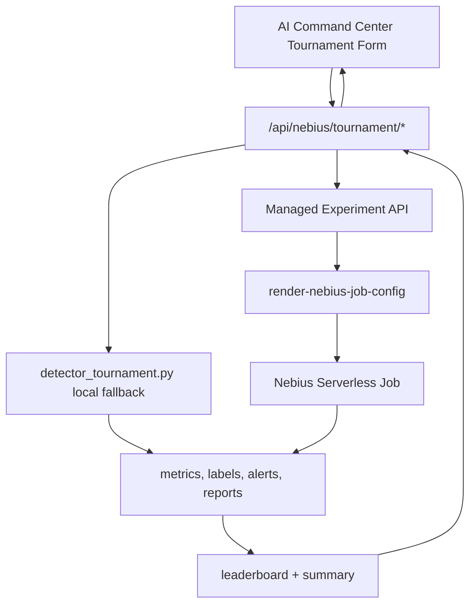

# ARD-0017: AI Detector Tournament

Status: Accepted

Date: 2026-07-06

Implementation Status: `[done: bounded demo tournament]`

## Governed ML boundary

This tournament and its mock leaderboard do not train or select governed
LightGBM, Transformer or cascade candidates. A demo leaderboard or successful
Job is not a model qualification receipt. Governed development uses immutable
projections, separate fold access, hash-bound candidates and independently
verified comparisons; see [ML lifecycle](../use-cases/ml-lifecycle.md).
Agent-initiated model training/scoring/evaluation workloads, including synthetic
rehearsals, follow the [Nebius execution policy](../ml/model-validation-execution-policy.md).

## Context

Existing detector and managed-experiment runners already provide synthetic
scenarios, labels, alerts, metrics, reports and Nebius submit/collect paths.
The command center needs one facade rather than a third runner or a second
orchestration system.

## Decision

Expose `POST /api/nebius/tournament/start`,
`GET /api/nebius/tournament/{id}` and
`GET /api/nebius/tournament/{id}/artifacts` over existing runners:

| Requested mode | Behavior | Response mode |
| --- | --- | --- |
| `local_mock` | Return deterministic mock rows without batch execution or runner artifacts | `local_mock` |
| `local` | Queue a capped rule-detector tournament; one local tournament at a time | `local` |
| `nebius`, configured | Submit a Job through the configured command template; collect artifacts explicitly | `nebius_serverless_job` |
| `nebius`, unconfigured | Return deterministic mock rows with a fallback reason | `local_mock` |

Local rule-detector capability is not permission to execute an agent model
workload locally. New Jobs require their own reviewed bounds, immutable image,
exact dry run and applicable authorization.


```mermaid
graph TD
    UI["AI Command Center Tournament Form"]
    Facade["/api/nebius/tournament/*"]
    Exp["Managed Experiment API"]
    Local["detector_tournament.py local fallback"]
    JobConfig["render-nebius-job-config"]
    NebiusJob["Nebius Serverless Job"]
    Artifacts["metrics, labels, alerts, reports"]
    Aggregate["leaderboard + summary"]

    UI --> Facade
    Facade --> Exp
    Facade --> Local
    Exp --> JobConfig
    JobConfig --> NebiusJob
    Local --> Artifacts
    NebiusJob --> Artifacts
    Artifacts --> Aggregate
    Aggregate --> Facade
    Facade --> UI
```

The diagram's generic config-rendering path is the retained demo integration.
Its old tag-based examples do not meet current Job submission policy; see
[Job image preflight](../operations/digest-pinned-jobs.md).

## Backend API

The maintained schemas and lifecycle are in
[`backend/app/nebius/detector_tournament.py`](../../backend/app/nebius/detector_tournament.py).

```json
{
  "number_of_scenarios": 100,
  "manipulation_types": [
    "spoofing_like_wall",
    "layering_like",
    "quote_stuffing",
    "liquidity_evaporation"
  ],
  "difficulty_mix": {
    "easy": 0.2,
    "medium": 0.5,
    "hard": 0.2,
    "adversarial": 0.1
  },
  "detector_set": ["spoofing_like", "layering_like", "quote_stuffing", "liquidity_shock"],
  "random_seed": 42,
  "execution_mode": "local_mock"
}
```

`number_of_scenarios` is 1–1000. Scenario enums are exactly the four listed
above; friendly `spoofing`/`layering` labels are not accepted aliases.
Detector names are independent of scenario names. The local runner may cap the
requested count and reports that effective count plus a fallback/cap reason.

The response contains `tournament_id`, `status`, `execution_mode`,
`started_at`, nullable `completed_at`, `detectors`, `leaderboard`,
`metrics`, `artifacts`, `summary` and optional `fallback_reason`.
Status is `queued | running | completed | failed | real_nebius_pending`.
Artifact responses contain `tournament_id` and a list of
`{name, path, download_url}`.

For example, this is a structurally valid mock envelope, not execution evidence:

```json
{
  "tournament_id": "TRN-EXAMPLE",
  "status": "completed",
  "execution_mode": "local_mock",
  "started_at": "2026-07-06T10:00:00Z",
  "completed_at": "2026-07-06T10:00:00Z",
  "detectors": ["spoofing_like"],
  "leaderboard": [{
    "detector": "spoofing_like",
    "scenario": "spoofing_like_wall",
    "precision": 0.82,
    "recall": 0.82,
    "f1": 0.82,
    "false_positives": 0,
    "false_negatives": 1,
    "avg_detection_latency_ms": 1200.0
  }],
  "metrics": {"total_scenarios": 100, "macro_f1": 0.82},
  "artifacts": {},
  "summary": "Illustrative deterministic mock tournament envelope.",
  "fallback_reason": "local_mock mode does not execute a simulation batch."
}
```

## Workload And Metrics

`detector_tournament.py` runs exactly the effective total, distributing it
with seeded balanced scenario and weighted difficulty plans. Each run derives
its seed from the supplied master seed and run index; difficulty changes the
simulation profile. Both controls affect the executed workload.

Each selected detector uses binary attack-active truth: every injected attack
is positive; `normal_market` is negative. Scenario family groups reports but
does not make other detectors negative during an attack. Undefined metric
denominators remain null. Reports include specificity/false-positive rate,
temporal overlap, early/on-time/late detection, event/participant/order
attribution and phase detection where label/evidence linkage is available.
Missing attribution truth is not fabricated.

Detection latency is simulated market time from the first alert tick, not
wall-clock model-inference latency. See the exact
[calculation reference](../runtime/calculations-explanations.md#step-4--detector-tournament).

## Artifacts And E2E Smoke

The lightweight runner writes `metrics.csv`, `results.json`,
`benchmark_report.md` and three chart files. Local facade artifacts live under
`outputs/nebius/tournaments/<id>/artifacts/`; state and request evidence are
under `outputs/nebius/tournaments/<id>/`.

The artifact-heavy managed path reuses `run_batch_experiments.py`:
events, trades, attack labels, blue-team alerts, metrics, report and manifest.
The facade normalizes both inventories rather than adding another runner.
See [Jobs reference](../../serverless/jobs/README.md) for filenames and runner arguments.

`POST /api/nebius/serverless-smoke/run` reuses generation, Arena replay,
detector/incident capture, explanation, investigation and tournament services.
It writes curated evidence under `outputs/serverless-smoke/<experiment_id>/`
and records pending cloud execution when no Job submission is configured.
The command center renders one managed-experiment tournament panel; the
`/api/nebius/tournament/*` facade also supports automation and smoke orchestration.

## Acceptance Criteria

- The command center starts a tournament and displays its status, leaderboard and artifacts.
- Mock mode works without credentials and is clearly labelled.
- Explicit local rule runs are capped and serialized; failed/timeout runs retain readable state and a fallback reason.
- Configured Nebius execution is isolated behind Job configuration and submit/collect commands.
- Requested counts, seed and difficulty affect the runner as documented.
- Existing experiment APIs and both runners remain usable; no third runner is introduced.
- Detailed detector quality remains artifact evidence, not Prometheus labels or model qualification.

## Alternatives And Consequences

A new orchestration system was rejected because the managed-experiment API
already owns configuration, state, collection and aggregation. Different runner
filenames remain a compatibility cost handled by the facade. Mock results make
the demo usable without cloud configuration, but must never be presented as
measured detector performance. Cloud output collection remains explicit.

## Related Documentation

- [Current source and schemas](../../backend/app/nebius/detector_tournament.py)
- [Synthetic rule calculations and limitations](../runtime/calculations-explanations.md)
- [Operational tournament telemetry](ARD-0021-local-observability-grafana.md)
- [Job image preflight and authorization](../operations/digest-pinned-jobs.md)
- [Original implementation/UI/demo narrative](https://github.com/khab40/lob-arena/blob/d896efe8ca501c1ef8e6c63442f3433948a6405e/docs/architecture/ARD-0017-ai-detector-tournament.md) — historical reference, not current commands
