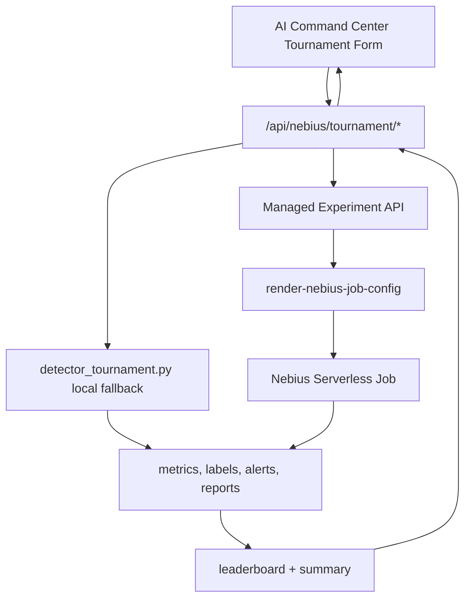

# ARD-0017: AI Detector Tournament

Status: Accepted

Date: 2026-07-06

Implementation Status: `[done: bounded demo tournament]`

## Governed ML boundary

This tournament and its mock leaderboard do not train or select governed
LightGBM, Transformer or cascade candidates. A demo leaderboard or successful
Job is not a model qualification receipt. Governed development uses immutable
projections, separate fold access, hash-bound candidates and independently
verified comparisons; see [ML lifecycle](../use-cases/ml-lifecycle.md).
Agent-initiated model training/scoring/evaluation workloads, including synthetic
rehearsals, follow the [Nebius execution policy](../ml/model-validation-execution-policy.md).

## Context

Existing detector and managed-experiment runners already provide synthetic
scenarios, labels, alerts, metrics, reports and Nebius submit/collect paths.
The command center needs one facade rather than a third runner or a second
orchestration system.

## Decision

Expose `POST /api/nebius/tournament/start`,
`GET /api/nebius/tournament/{id}` and
`GET /api/nebius/tournament/{id}/artifacts` over existing runners:

| Requested mode | Behavior | Response mode |
| --- | --- | --- |
| `local_mock` | Return deterministic mock rows without batch execution or runner artifacts | `local_mock` |
| `local` | Queue a capped rule-detector tournament; one local tournament at a time | `local` |
| `nebius`, configured | Submit a Job through the configured command template; collect artifacts explicitly | `nebius_serverless_job` |
| `nebius`, unconfigured | Return deterministic mock rows with a fallback reason | `local_mock` |

Local rule-detector capability is not permission to execute an agent model
workload locally. New Jobs require their own reviewed bounds, immutable image,
exact dry run and applicable authorization.


```mermaid
graph TD
    UI["AI Command Center Tournament Form"]
    Facade["/api/nebius/tournament/*"]
    Exp["Managed Experiment API"]
    Local["detector_tournament.py local fallback"]
    JobConfig["render-nebius-job-config"]
    NebiusJob["Nebius Serverless Job"]
    Artifacts["metrics, labels, alerts, reports"]
    Aggregate["leaderboard + summary"]

    UI --> Facade
    Facade --> Exp
    Facade --> Local
    Exp --> JobConfig
    JobConfig --> NebiusJob
    Local --> Artifacts
    NebiusJob --> Artifacts
    Artifacts --> Aggregate
    Aggregate --> Facade
    Facade --> UI
```

The diagram's generic config-rendering path is the retained demo integration.
Its old tag-based examples do not meet current Job submission policy; see
[Job image preflight](../operations/digest-pinned-jobs.md).

## Backend API

The maintained schemas and lifecycle are in
[`backend/app/nebius/detector_tournament.py`](../../backend/app/nebius/detector_tournament.py).

```json
{
  "number_of_scenarios": 100,
  "manipulation_types": [
    "spoofing_like_wall",
    "layering_like",
    "quote_stuffing",
    "liquidity_evaporation"
  ],
  "difficulty_mix": {
    "easy": 0.2,
    "medium": 0.5,
    "hard": 0.2,
    "adversarial": 0.1
  },
  "detector_set": ["spoofing_like", "layering_like", "quote_stuffing", "liquidity_shock"],
  "random_seed": 42,
  "execution_mode": "local_mock"
}
```

`number_of_scenarios` is 1–1000. Scenario enums are exactly the four listed
above; friendly `spoofing`/`layering` labels are not accepted aliases.
Detector names are independent of scenario names. The local runner may cap the
requested count and reports that effective count plus a fallback/cap reason.

The response contains `tournament_id`, `status`, `execution_mode`,
`started_at`, nullable `completed_at`, `detectors`, `leaderboard`,
`metrics`, `artifacts`, `summary` and optional `fallback_reason`.
Status is `queued | running | completed | failed | real_nebius_pending`.
Artifact responses contain `tournament_id` and a list of
`{name, path, download_url}`.

For example, this is a structurally valid mock envelope, not execution evidence:

```json
{
  "tournament_id": "TRN-EXAMPLE",
  "status": "completed",
  "execution_mode": "local_mock",
  "started_at": "2026-07-06T10:00:00Z",
  "completed_at": "2026-07-06T10:00:00Z",
  "detectors": ["spoofing_like"],
  "leaderboard": [{
    "detector": "spoofing_like",
    "scenario": "spoofing_like_wall",
    "precision": 0.82,
    "recall": 0.82,
    "f1": 0.82,
    "false_positives": 0,
    "false_negatives": 1,
    "avg_detection_latency_ms": 1200.0
  }],
  "metrics": {"total_scenarios": 100, "macro_f1": 0.82},
  "artifacts": {},
  "summary": "Illustrative deterministic mock tournament envelope.",
  "fallback_reason": "local_mock mode does not execute a simulation batch."
}
```

## Workload And Metrics

```http
GET /api/nebius/tournament/{id}
```

Returns the same envelope with current `status`:

- `queued`
- `running`
- `completed`
- `failed`
- `real_nebius_pending`

### Read Artifacts

```http
GET /api/nebius/tournament/{id}/artifacts
```

Returns artifact metadata and download URLs:

```json
{
  "tournament_id": "TRN-20260706-0001",
  "artifacts": [
    {
      "name": "metrics.csv",
      "path": "outputs/benchmark/TRN-20260706-0001/metrics.csv",
      "download_url": "/api/experiments/artifacts/download?path=..."
    }
  ]
}
```

## Backend Implementation

Implemented in `backend/app/nebius/detector_tournament.py` with schemas:

- `DetectorTournamentStartRequest`
- `DetectorTournamentLeaderboardRow`
- `DetectorTournamentResponse`
- `DetectorTournamentArtifact`
- `DetectorTournamentArtifactsResponse`

Implemented routes in `backend/app/api/routes_nebius.py`:

- `POST /api/nebius/tournament/start`
- `GET /api/nebius/tournament/{id}`
- `GET /api/nebius/tournament/{id}/artifacts`

Route behavior:

1. Normalize request controls into existing scenario names:
   - `spoofing_like_wall` -> `spoofing_like_wall`
   - `layering_like` -> `layering_like`
   - `quote_stuffing` -> `quote_stuffing`
   - `liquidity_evaporation` -> `liquidity_evaporation`
2. If `execution_mode=local_mock`, return deterministic leaderboard rows immediately and do not launch backend batch work.
3. If `execution_mode=local`, queue a capped local run through `serverless/jobs/detector_tournament.py`; only one local tournament can run at a time.
4. If `execution_mode=nebius` and job submit config is present, submit a Nebius Serverless Job command, persist request/stdout artifacts, and return `queued`.
5. If `execution_mode=nebius` and job submit config is missing, return deterministic mock output with a fallback reason.
6. Persist tournament state under `nebius/tournaments/{tournament_id}/`.
7. Append summary rows to `nebius/tournaments.jsonl`.
8. Store history artifact with `kind="run"` and `source="ai_detector_tournament"`.

## E2E Smoke Demo Contract

`POST /api/nebius/serverless-smoke/run` runs one curated story:

1. Generate spoofing scenario through the existing Nebius scenario generator client.
2. Replay `spoofing-like` through the existing Arena simulation.
3. Capture deterministic detector alerts and incident.
4. Explain the incident through the existing incident explainer.
5. Run the AI Investigation Team through the existing endpoint client.
6. Run a local detector tournament for immediate leaderboard evidence.
7. Write `serverless_job.json` with `real_nebius_pending` if `NEBIUS_JOB_*_COMMAND_TEMPLATE` values are absent.

Artifacts:

- `outputs/serverless-smoke/summary.json`
- `outputs/serverless-smoke/scenario.json`
- `outputs/serverless-smoke/simulation_events.json`
- `outputs/serverless-smoke/detector_alerts.json`
- `outputs/serverless-smoke/investigation_report.md`
- `outputs/serverless-smoke/tournament_result.json`
- `outputs/serverless-smoke/serverless_job.json`
- `outputs/serverless-smoke/manifest.json`

## Serverless Job Design

Primary lightweight tournament runner:

```bash
python serverless/jobs/detector_tournament.py \
  --runs 100 \
  --scenarios spoofing,layering,quote_stuffing \
  --detectors spoofing_like,layering_like,quote_stuffing \
  --output outputs/benchmark/TRN-20260706-0001
```

Current outputs:

- `metrics.csv`
- `results.json`
- `benchmark_report.md`
- `charts/f1_by_scenario.png`
- `charts/confidence_distribution.png`
- `charts/detection_latency.png`

Artifact-heavy managed path:

```bash
python serverless/jobs/run_batch_experiments.py \
  --runs 100 \
  --batch-size 20 \
  --scenarios normal_market,spoofing,layering,quote_stuffing \
  --output outputs/serverless-batch/TRN-20260706-0001
```

Current outputs:

- `order_book_events.jsonl`
- `trades.jsonl`
- `attack_labels.jsonl`
- `blue_team_alerts.jsonl`
- `detector_metrics.csv`
- `generated_report.md`
- `manifest.json`

Design rule: do not create a third runner. If Phase 3 needs additional fields, extend `detector_tournament.py` or aggregate existing `run_batch_experiments.py` artifacts.

## Data Mapping

| Requested field | Existing source |
| --- | --- |
| `tournament_id` | New facade id or `BenchmarkRunResponse.id` |
| `status` | local process result, `ExperimentJobRecord.status`, or managed experiment status |
| `started_at` | route start time or experiment `created_at` |
| `completed_at` | route completion time or aggregate timestamp |
| `detectors` | request `detector_set` |
| `leaderboard` | `metrics.csv`, `results.json`, or `leaderboard.json` |
| `metrics` | `metrics.csv`, `detector_metrics.csv`, `experiment_summary.json` |
| `artifacts` | artifact paths from benchmark run or managed experiment |
| `summary` | `benchmark_report.md` or generated summary string |

## Frontend Changes

Reuse `NebiusControlPanelPage.tsx` Detector Tournament section.

The page exposes one judge-facing tournament panel backed by the managed experiment workflow. The `/api/nebius/tournament/*` facade remains available for automation and the polished serverless-smoke workflow; it is not rendered as a second tournament form.

Implemented controls:

- workload count and batch size
- scenario multi-select
- random seed
- Local Demo and Nebius Serverless Job execution

Actions:

- `Create benchmark`
- `Generate manifest`
- `Run Local Demo tournament`
- `Run serverless job`
- `Aggregate`
- `Run AI Investigation`
- `Refresh`

Display:

- benchmark and latest Job status
- detector/model comparison counts
- detector/model leaderboard with precision, recall, F1, alert count, and latency
- downloadable local and synchronized cloud artifacts

## Fallback / Mock Behavior

- `local_mock`: return deterministic leaderboard rows immediately, with no subprocess and no artifacts.
- Explicit `local`: execute capped `detector_tournament.py` and return `status="completed"` with local artifacts.
- `execution_mode=nebius` without config: queue deterministic local fallback, set `execution_mode="local_mock"`, and include a fallback reason.
- Local failures or timeout return deterministic mock output with a fallback reason and keep previous tournament state readable.
- UI must label local fallback clearly and still show leaderboard/artifacts.

## Demo Script

1. Open `/nebius`.
2. Select Detector Tournament.
3. Set `number_of_scenarios=100`.
4. Select `spoofing`, `layering`, `quote_stuffing`.
5. Choose balanced difficulty mix.
6. Select detector set.
7. Start tournament in Local Demo.
8. Show leaderboard, macro F1, latency, and artifacts.
9. Switch to Cloud.
10. Render or submit Nebius Serverless Job.
11. Show `real_nebius_pending` if job submit config is missing, or collect artifacts if remote output exists.

## Acceptance Criteria

- UI can start a tournament from the command center.
- UI can show leaderboard and metric summary.
- Mock/local mode works with no Nebius credentials.
- Real Nebius job path is isolated behind job config and submit commands.
- Artifacts are visible or downloadable.
- Existing experiment APIs and job runners continue to work.
- No duplicate tournament runner is introduced.

## Risks And Shortcuts

- Scenario inputs are restricted to the four native Arena implementations; unsupported projections are rejected.
- Risk: `difficulty_mix` is not yet supported by simulator physics. Shortcut: store it in manifest and use it to weight scenario selection first.
- Risk: cloud artifacts are not mounted automatically. Shortcut: keep `collect-nebius-artifacts` as explicit step.
- Risk: two existing runners have different artifact names. Shortcut: facade normalizes both into the same response envelope.
