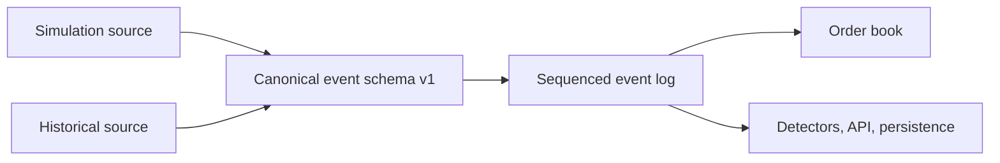

# ARD-0018: Canonical Exchange Event Stream

Status: Accepted and Implemented

Date: 2026-07-18

Implementation Status: `[done]`

Completion: The original ten implementation steps completed in commit `32dc799`.

## Ownership update

[ARD-0020](ARD-0020-java-arena-websocket-agent-orchestration.md) made Java the sole
live exchange and REST/WebSocket owner. Retained Python schemas/readers consume
artifacts for offline simulation, causal features and ML; they do not establish
a second live exchange. The
[original Python implementation record](https://github.com/khab40/lob-arena/blob/d896efe8ca501c1ef8e6c63442f3433948a6405e/docs/architecture/ARD-0018-canonical-exchange-event-stream.md#step-1-implementation-record)
retains the ten-step migration history and former persistence paths.

## Context

Loose order-book dictionaries did not provide a stable source contract for
replay or historical adapters. Simulation and historical data need one ordered
vocabulary for adds, modifications, cancellations, executions and L2 snapshots.
Venue timestamps and upstream sequences must survive without forcing logical
simulator ticks to imitate exchange wall-clock time.

## Decision

Publish version 1 canonical events with `add | modify | cancel | execute | snapshot`
discriminators, identity, normalized source, venue, symbol, canonical/source
sequences, optional tick/timestamps and optional scenario lineage.

- Canonical sequence is contiguous within a stream and distinct from upstream `source_sequence`.
- Validate required identifiers, positive price/quantity state, non-negative remainders, snapshot depth and modification-priority claims.
- Same-price quantity changes retain FIFO position/timestamp; price changes cancel/reinsert at the new price. Side and agent ownership cannot change.
- A crossing order emits one execution per resting fill and then any resting limit remainder; non-mutating commands emit no canonical state event.
- One combined-book checkpoint follows all mutations in each completed simulation tick.
- Preserve the derived UI event projection while delivering typed canonical events to consumers.

The Java integer/Protobuf boundary and outward JSON records represent the same
canonical lifecycle. Raw JSON/Protobuf wire bytes are not the canonical hash
encoding; [hashing v1](../runtime/canonical-hashing-v1.md) owns that specification.

## Architecture

This is the source/consumer relationship, not permission for a consumer to
mutate the authoritative Java exchange.

## Durable Replay Boundary

The current Java archive extends the original append-only design:

- A completed tick's canonical rows are flushed before completed state is published.
- `history/exchange-events/<stream_id>/segment-*.jsonl` and segment manifests retain sequence ranges and byte counts.
- The bounded JVM window is not the replay boundary: older cursor pages come from the archive.
- Reset starts a new stream at sequence 1 and preserves completed streams.
- `GET /api/arena/exchange-events` returns the exclusive next cursor, latest sequence, `has_more`, `stream_id`, `first_available_sequence` and `retained_from_sequence`; `streamId` selects a completed stream.
- Replay estimates above the configured archive quota are rejected before starting; a persistence failure must not be reported as a completed canonical tick.

This reconciles implemented behavior, not a new storage or deletion policy.
[Exchange Event Stream](../runtime/exchange-event-stream.md#delivery-contract)
owns the exact cursor/retention controls, and
[Java memory/archive limits](../runtime/java-kernel-performance.md#long-running-control-plane-memory-budget)
owns resource defaults and capacity responses. Implementation lives in
`CanonicalEventArchive` and `LiveArenaService`; archive and replay tests cover
rotation, stream reset and publication boundaries.

## Historical Replay Evolution

[ARD-0023](ARD-0023-hybrid-historical-replay.md) uses the same versioned vocabulary:

- strict canonical CSV maps source lifecycle events into add/modify/cancel/
  execute-compatible kernel mutations;
- normalized LOBSTER replay reconstructs deterministic visible aggregate
  levels and records the immutable source L2 snapshot;
- historical source sequence remains distinct from total canonical sequence;
  and
- synthetic overlays share the live kernel but retain separate source,
  identity, seed, and ground-truth provenance.

## Related Documentation

- [Exchange Event Stream](../runtime/exchange-event-stream.md)
- [ARD-0002: WebSocket State Schema](ARD-0002-websocket-state-schema.md)
- [ARD-0004: Benchmark Artifact Format](ARD-0004-benchmark-artifact-format.md)
- [ARD-0011: Exchange Liquidity Invariant](ARD-0011-exchange-liquidity-invariant.md)
- [ARD-0022: Historical Market Data Ingestion](ARD-0022-historical-market-data-ingestion.md)
- [ARD-0023: Deterministic Hybrid Historical Replay](ARD-0023-hybrid-historical-replay.md)
