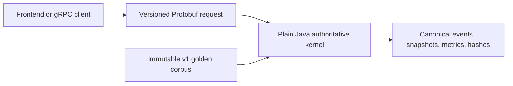

# ARD-0019: Python Reference And Java Kernel Migration

Status: Accepted and Implemented

Date: 2026-07-18

Implementation Status: `[done: step 18 of 18]`

## Context

Moving the Python exchange, simulation, scenarios, detectors and orchestration
at once would have removed the working correctness reference while combining
delivery, performance and deployment risks. The deterministic kernel could move
independently behind one language-neutral contract.

The migration sequence is historical. Java now owns both the versioned kernel
and live arena; Python shadow/authority/fallback controls are retired.
[ARD-0020](ARD-0020-java-arena-websocket-agent-orchestration.md) records the
subsequent complete live cutover.

## Decision

Migrate through a reference-and-candidate architecture, prove parity, then retire
the duplicate kernel:

1. Protobuf defines requests, integer-unit canonical events, trades, snapshots, quantized metrics and result hashes.
2. Freeze numeric conversion, logical time, total ordering, named SplitMix64 streams, identifiers, FIFO/modify semantics and canonical encoding.
3. Implement Java 25 as framework-free modules; Spring, transport, telemetry and persistence stay outside the hot loop.
4. Compare identical serialized requests across the Python reference and Java candidate, retaining full results and the first divergence.
5. Move authority only after correctness, performance, observability, stability and rollback gates pass.
6. Retire executable Python-kernel replay after cutover. An immutable versioned golden corpus becomes the compatibility oracle.

## Final Component Boundary

Java owns the versioned kernel and, after ARD-0020, the interactive clock,
scenarios, deterministic detectors/incidents, journals, REST/WebSocket and agent
orchestration. Python retains AI/ML, LangGraph-capable agent execution, Nebius
integration, experiments, offline/serverless simulation and a thin Java client.

## Completed Implementation Sequence

| Stage | Completed boundary |
| --- | --- |
| 1–4 | Ownership gates; versioned Protobuf; integer units/ordering/PRNG; explicit canonical SHA-256 encoding |
| 5–6 | Python reference adapter and immutable requests/results covering all five event types and six scenarios |
| 7–10 | Repository-owned Java toolchain/build, determinism/hashing, integer matching engine and complete Java tick runner |
| 11–13 | Shared unary gRPC, structured differential reports and bounded shadow verification |
| 14–15 | Separate JMH diagnostics, portable allocation/latency gates and failure-isolated boundary telemetry |
| 16–17 | Staged authority rollout, Java-default image and permanent real-service corpus replay |
| 18 | Java-only HTTP/gRPC kernel; removed Python reference, routing, replay/shadow/fallback and duplicate tests |

The [historical migration guide](../runtime/history/java-kernel-migration.md)
retains the step table, initial component boundaries and former authority modes.
The [original detailed implementation record](https://github.com/khab40/lob-arena/blob/d896efe8ca501c1ef8e6c63442f3433948a6405e/docs/architecture/ARD-0019-python-reference-java-kernel-migration.md#step-1-implementation-record)
preserves all 18 step narratives, historical tooling observations, Linux parity
correction and dated image measurements. Those commands/measurements are not
current runtime instructions or capacity guarantees.

## Compatibility And Rollback

- Java is the sole production implementation of the versioned deterministic kernel.
- Permanent CI starts the production Java service and compares complete results with immutable `contracts/golden/parity-v1` bytes.
- Intentional deterministic behavior or fixture changes require the [corpus versioning/ARD policy](../runtime/golden-parity-corpus-v1.md#maintenance-policy).
- Operational rollback deploys a previously verified Java image/release; no Python kernel fallback remains.
- Retained offline Python simulation is not live authority or the versioned-kernel compatibility oracle.

## Toolchain And Performance Boundary

The repository owns a checksum-pinned Gradle 9.6.1 wrapper, Java 25 toolchain
declaration and build-time Java Protobuf/gRPC generation. Checked-in Python
bindings are contract/client tooling. A Java 21 launcher can use the wrapper's
toolchain provisioning; no global Gradle or `protoc` is required.

[JMH diagnostics and portable gates](../runtime/java-kernel-performance.md) are
separate from correctness parity. Agrona, alternative queues or data structures
require profiling evidence; brokers and analytics storage were not prerequisites
for moving the deterministic hot loop.

## Alternatives And Consequences

A complete backend rewrite before parity was rejected because it would remove
the independent reference and entangle unrelated components. Permanent duplicate
runtime kernels were also rejected after the stability gates: the golden corpus
detects behavior drift without sampled production replay.

The resulting boundary isolates Java performance work and preserves exact
compatibility evidence. Its cost is constrained numeric representation, PRNG,
ordering and hashing, plus rollback through verified releases rather than a
second implementation.

## Related Documentation

- [Java live cutover](ARD-0020-java-arena-websocket-agent-orchestration.md)
- [Canonical events](ARD-0018-canonical-exchange-event-stream.md)
- [Runtime ownership](../runtime/runtime-model.md)
- [Determinism](../runtime/determinism-contract-v1.md)
- [Canonical hashing](../runtime/canonical-hashing-v1.md)
- [Golden corpus](../runtime/golden-parity-corpus-v1.md)
- [Integer book](../runtime/java-order-book.md)
- [Java simulation kernel](../runtime/java-simulation-kernel.md)
- [gRPC boundary](../runtime/grpc-kernel-boundary.md)
- [Observability](../runtime/kernel-observability.md)
- [Historical differential harness](../runtime/history/differential-parity-harness.md)
- [Historical shadow stage](../runtime/history/kernel-shadow-mode.md)
- [Historical rollout](../runtime/history/kernel-authority-rollout.md)
- [Completed cutover](../runtime/history/java-kernel-cutover.md)
