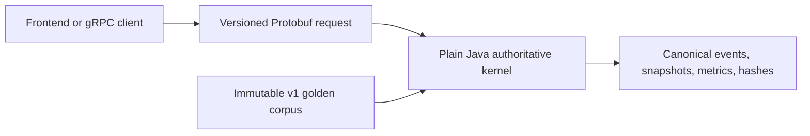

# ARD-0019: Python Reference And Java Kernel Migration

Status: Accepted and Implemented

Date: 2026-07-18

Implementation Status: `[done: step 18 of 18]`

## Context

Moving the Python exchange, simulation, scenarios, detectors and orchestration
at once would have removed the working correctness reference while combining
delivery, performance and deployment risks. The deterministic kernel could move
independently behind one language-neutral contract.

The migration sequence is historical. Java now owns both the versioned kernel
and live arena; Python shadow/authority/fallback controls are retired.
[ARD-0020](ARD-0020-java-arena-websocket-agent-orchestration.md) records the
subsequent complete live cutover.

## Decision

Migrate through a reference-and-candidate architecture, prove parity, then retire
the duplicate kernel:

1. Protobuf defines requests, integer-unit canonical events, trades, snapshots, quantized metrics and result hashes.
2. Freeze numeric conversion, logical time, total ordering, named SplitMix64 streams, identifiers, FIFO/modify semantics and canonical encoding.
3. Implement Java 25 as framework-free modules; Spring, transport, telemetry and persistence stay outside the hot loop.
4. Compare identical serialized requests across the Python reference and Java candidate, retaining full results and the first divergence.
5. Move authority only after correctness, performance, observability, stability and rollback gates pass.
6. Retire executable Python-kernel replay after cutover. An immutable versioned golden corpus becomes the compatibility oracle.

## Final Component Boundary

Java owns the versioned kernel and, after ARD-0020, the interactive clock,
scenarios, deterministic detectors/incidents, journals, REST/WebSocket and agent
orchestration. Python retains AI/ML, LangGraph-capable agent execution, Nebius
integration, experiments, offline/serverless simulation and a thin Java client.

## Completed Implementation Sequence

| Stage | Completed boundary |
| --- | --- |
| 1–4 | Ownership gates; versioned Protobuf; integer units/ordering/PRNG; explicit canonical SHA-256 encoding |
| 5–6 | Python reference adapter and immutable requests/results covering all five event types and six scenarios |
| 7–10 | Repository-owned Java toolchain/build, determinism/hashing, integer matching engine and complete Java tick runner |
| 11–13 | Shared unary gRPC, structured differential reports and bounded shadow verification |
| 14–15 | Separate JMH diagnostics, portable allocation/latency gates and failure-isolated boundary telemetry |
| 16–17 | Staged authority rollout, Java-default image and permanent real-service corpus replay |
| 18 | Java-only HTTP/gRPC kernel; removed Python reference, routing, replay/shadow/fallback and duplicate tests |

The [historical migration guide](../runtime/history/java-kernel-migration.md)
retains the step table, initial component boundaries and former authority modes.
The [original detailed implementation record](https://github.com/khab40/lob-arena/blob/d896efe8ca501c1ef8e6c63442f3433948a6405e/docs/architecture/ARD-0019-python-reference-java-kernel-migration.md#step-1-implementation-record)
preserves all 18 step narratives, historical tooling observations, Linux parity
correction and dated image measurements. Those commands/measurements are not
current runtime instructions or capacity guarantees.

## Compatibility And Rollback

- Java is the sole production implementation of the versioned deterministic kernel.
- Permanent CI starts the production Java service and compares complete results with immutable `contracts/golden/parity-v1` bytes.
- Intentional deterministic behavior or fixture changes require the [corpus versioning/ARD policy](../runtime/golden-parity-corpus-v1.md#maintenance-policy).
- Operational rollback deploys a previously verified Java image/release; no Python kernel fallback remains.
- Retained offline Python simulation is not live authority or the versioned-kernel compatibility oracle.

## Toolchain And Performance Boundary

The repository owns a checksum-pinned Gradle 9.6.1 wrapper, Java 25 toolchain
declaration and build-time Java Protobuf/gRPC generation. Checked-in Python
bindings are contract/client tooling. A Java 21 launcher can use the wrapper's
toolchain provisioning; no global Gradle or `protoc` is required.

[JMH diagnostics and portable gates](../runtime/java-kernel-performance.md) are
separate from correctness parity. Agrona, alternative queues or data structures
require profiling evidence; brokers and analytics storage were not prerequisites
for moving the deterministic hot loop.

## Alternatives And Consequences

A complete backend rewrite before parity was rejected because it would remove
the independent reference and entangle unrelated components. Permanent duplicate
runtime kernels were also rejected after the stability gates: the golden corpus
detects behavior drift without sampled production replay.

## Step 6 Implementation Record

- Checked in immutable deterministic Protobuf request/result pairs for normal market, empty book, and every active abuse scenario.
- Covered add, modify, cancel, execute, and L2 snapshot events across multiple seeds, including absent optional best-price fields.
- Added a language-neutral manifest with raw-file SHA-256 checksums, canonical stream/book hashes, event-type counts, and metric counts.
- Added authoritative regeneration and freshness validation plus semantic self-consistency and Python replay tests.
- Required a new versioned corpus directory and ARD decision for intentional behavioral changes instead of mutating version 1 evidence.

## Step 7 Implementation Record

- Added a repository-owned Gradle 9.6.1 wrapper and Java 25 toolchain auto-provisioning; no developer-global Gradle or JDK 25 install is required.
- Added `exchange-proto`, `simulation-kernel`, and `control-plane` modules with shared dependency and test conventions.
- Generated Java Protobuf types directly from the root language-neutral schema and parsed a checked-in golden request in Java tests.
- Kept Spring Boot dependencies outside the framework-free simulation kernel and added a control-plane context smoke test.
- Added a dedicated Java 25 GitHub Actions job that runs the full Gradle `clean check` lifecycle.

## Step 8 Implementation Record

- Implemented Java total event ordering and the frozen phase codes with non-negative and ASCII boundary validation.
- Implemented bit-exact SplitMix64, full-range rejection-sampled bounded integers, and SHA-256-derived named PRNG streams.
- Implemented exact base-10 tick/lot conversion, round-half-even metric quantization, midpoint overflow checks, and simulation event identifiers.
- Implemented all five canonical event payload encodings, book encoding, per-object SHA-256 digests, and the rolling stream hash chain.
- Matched Java outputs to every frozen PRNG, seed, ordering, numeric, identifier, canonical-byte, event-hash, book-hash, and rolling-hash vector.

## Step 9 Implementation Record

- Added a signed-int64 tick/lot order model and deterministic bid/ask price maps with FIFO queues at each level.
- Implemented best-price matching for both aggressor sides, crossing limits, partial fills, one execution per resting fill, and residual limit-order resting.
- Implemented actual-state cancel, same-price priority preservation, price-change priority loss, ownership validation, baseline/agent level maintenance, and deterministic synthetic IDs.
- Emitted contiguous version 1 Protobuf add, modify, cancel, execute, and depth-limited snapshot events directly from the Java matching boundary.
- Added tests for ordering, both sides, limits, remainders, modification queues/timestamps, cancel state, owners, baseline construction, empty optionals, all payloads, sequences, and canonical hashability.

## Step 10 Implementation Record

- Added a framework-free `JavaSimulationKernel` that validates and executes the shared Protobuf request and returns the shared result.
- Implemented the logical clock and frozen per-tick phases for ordered normal-agent intents, scenarios, baseline repair, snapshots, and metrics.
- Implemented reference market-maker, noise-trader, and liquidity-taker behavior plus all four active scenario state machines.
- Implemented deterministic market features and detector confidences with sorted scale-six metric output and event-limit enforcement.
- Matched all six checked-in golden cases exactly for every ordered event, event-stream hash, final book/hash, and quantized metric while retaining Python authority.

## Step 11 Implementation Record

- Added the unary `lob.exchange.v1.SimulationKernel.RunSimulation` operation directly to the shared Protobuf contract.
- Generated checked-in Python gRPC bindings and build-owned Java message/service stubs from the same schema.
- Added a Python service adapter that delegates to the authoritative reference kernel and maps deterministic contract failures to `INVALID_ARGUMENT`.
- Added a separate Java `kernel-grpc` module that delegates to the framework-free candidate kernel and keeps transport code outside the hot loop.
- Verified the Java endpoint through an in-process generated client against the complete exact golden Protobuf result; no runtime authority changed.

## Step 12 Implementation Record

- Added a reusable differential runner that serializes each request once and gives Python and Java independent copies of identical deterministic bytes.
- Added structured parity reports for contract identity, ordered events, event hashes, executions, LOB snapshots, final book/hash, quantized metrics, and termination.
- Localized the first ordered event divergence by canonical sequence and retained both complete Protobuf results for deeper investigation.
- Added a JSON-compatible summary for later persistence and observability without copying full event payloads into routine reports.
- Verified all six golden cases plus targeted mismatch injection for trades, books, metrics, hashes, termination, identity, and missing events; authority remains Python.

## Step 13 Implementation Record

- Added a runnable plain-Java gRPC server and a deadline-bound Python candidate client with explicit channel lifecycle.
- Added synchronous offline shadow replay that retains both results and returns Python as the authoritative result on match, mismatch, or Java failure.
- Added live shadow mirroring that returns Python before bounded background Java comparison completes.
- Added `match`, `mismatch`, `error`, and capacity-pressure `skipped` outcomes plus drain/close lifecycle controls; candidate transport failures cannot replace the Python result.
- Added a corpus replay command and verified all six golden scenarios over a real local gRPC socket: 320 events, 10 executions, and 51 snapshots with no divergence.

## Step 14 Implementation Record

- Added a separate Java benchmark module using OpenJDK JMH 1.37 without introducing benchmark dependencies into the hot-loop module.
- Added forked simulation benchmarks for normal, quote-stuffing, and liquidity-evaporation requests plus a crossing integer-order-book match benchmark.
- Added GC allocation profiling commands and verified forked Java 25 profiling on the current macOS/aarch64 environment.
- Added portable CI smoke ceilings for p99 latency, throughput, and thread allocation on the largest golden kernel run and crossing-match path.
- Kept event-count and canonical-hash assertions inside measured kernel runs, and deferred Agrona or data-structure changes until repeated profiles justify them.

## Step 15 Implementation Record

- Added failure-isolated gRPC boundary telemetry without adding metrics or tracing objects to the deterministic simulation kernel.
- Added bounded request outcomes, latency histograms, and event-count summaries plus Micrometer observations bridged to OpenTelemetry.
- Added Spring Boot Actuator health/metrics/Prometheus exposure with OTLP traces and metrics explicitly opt-in, so local tests require no collector.
- Added thread-safe Python shadow pending gauges, bounded outcome counters, candidate durations, snapshots, and Prometheus rendering without high-cardinality run labels.
- Added Prometheus scrape and Grafana dashboard templates without expanding the optimized Docker Compose service set.

## Step 16 Implementation Record

- Added an explicit Python control-plane authority router with `python`, `shadow`, and `java` modes; the default remains Python.
- Added deterministic run-id percentage cohorts for Java rollout and independently sampled Python parity replay.
- Added automatic Python fallback on Java transport error or known parity mismatch plus a fail-closed option that returns an error instead of publishing divergence.
- Added a bounded Protobuf HTTP kernel endpoint, status endpoint, persisted authority decisions, result authority headers, and FastAPI shadow metric attachment.
- Added environment/Compose controls and a staged 1/5/25/50/100 percent rollout and one-setting rollback runbook without adding a container.

## Step 17 Implementation Record

- Changed the versioned Protobuf kernel API default to 100% Java authority with 10% synchronous Python replay and Python fallback retained.
- Added a fourth purposeful Compose service for the Java kernel and made the Python backend wait for its health before connecting over gRPC.
- Added a multi-stage, non-root Java 25 runtime image with an allow-listed 476 KB source context and no Gradle/JDK/tests/docs/outputs/Windows launchers in the runtime image.
- Added the Java image to CI and a permanent real-service cross-language job that replays 100% of the Python golden corpus through Java gRPC.
- Hardened the permanent parity job to run the production Spring Boot JAR with an explicit lifecycle, bounded timeout, failure-log retention, and isolated per-image Docker build caches.
- Replaced architecture-dependent native float summation with Java-equivalent exact binary-value summation and an explicit scale-three half-even conversion after Linux CI exposed a one-lot liquidity-thinning divergence.
- Added the Protobuf/gRPC runtime dependencies omitted from the minimized Python image and CI smoke checks for backend imports plus the non-root Java runtime JAR layout.
- Verified the built 149.6 MB image locally and confirmed a default-authority golden request selected Java with complete parity and no fallback.

## Step 18 Implementation Record

- Made Spring Boot the sole owner of `POST /api/kernel/run` and `GET /api/kernel/status`, backed by one shared framework-free `JavaSimulationKernel` instance.
- Removed the FastAPI kernel endpoint, Python reference kernel, authority router, differential/shadow runners, runtime replay/fallback settings, and their duplicate tests.
- Kept Python runtime ownership only for ML/AI and application capabilities without a Java replacement: the interactive arena, scenarios, detectors, persistence, experiments, WebSocket delivery, agent orchestration, and Nebius integration.
- Replaced executable Python-kernel parity with exact Java replay of the immutable versioned golden corpus in CI.
- Routed same-origin frontend `/api/kernel/` traffic directly to the Java control plane while preserving `/dist` static delivery and the existing Python API/WebSocket configuration.

## Consequences

Positive:

- Java has one production implementation for the versioned deterministic kernel.
- Immutable corpus evidence continues to detect deterministic behavior drift without a duplicate runtime kernel.
- CI detects any byte-level deterministic output drift against the versioned corpus.
- Java performance work is isolated from HTTP and framework concerns.
- Python and Java ownership boundaries are explicit, so later components can move independently.

Tradeoffs:

- Rollback now means deploying a previously verified Java release; there is no Python runtime fallback for the versioned kernel.
- The legacy Python simulation remains only in offline/serverless jobs; it is not a live backend authority.
- Exact cross-language determinism constrains numeric representation, PRNG choice, ordering, and hashing.
- Java authority arrives later than a superficial rewrite but with measurable correctness.

## Related Documentation

- [Java Kernel Migration](../runtime/history/java-kernel-migration.md)
- [ARD-0020: Java Arena WebSocket And Agent Orchestration](ARD-0020-java-arena-websocket-agent-orchestration.md)
- [ARD-0018: Canonical Exchange Event Stream](ARD-0018-canonical-exchange-event-stream.md)
- [ARD-0010: Agent Runner Execution](ARD-0010-agent-runner-execution.md)
- [High-Level Architecture](../architecture.md)
- [Runtime Model](../runtime/runtime-model.md)
- [Golden Parity Corpus V1](../runtime/golden-parity-corpus-v1.md)
- [gRPC Kernel Boundary](../runtime/grpc-kernel-boundary.md)
- [Differential Parity Harness](../runtime/history/differential-parity-harness.md)
- [Kernel Shadow Mode](../runtime/history/kernel-shadow-mode.md)
- [Java Kernel Performance](../runtime/java-kernel-performance.md)
- [Kernel Observability](../runtime/kernel-observability.md)
- [Kernel Authority Rollout](../runtime/history/kernel-authority-rollout.md)
- [Java Kernel Default Cutover](../runtime/history/java-kernel-cutover.md)
