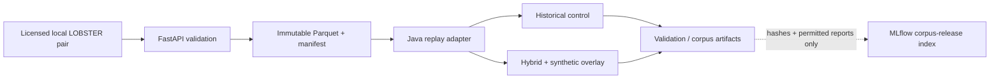

# ARD-0022: Historical Market Data Ingestion And Replay

Status: Accepted and Implemented; original source-exclusivity constraint
superseded by [ARD-0023](ARD-0023-hybrid-historical-replay.md)

Date: 2026-07-23

## Context

LOB Arena needs a one-time administrative path for importing licensed local
LOBSTER files without turning the synthetic Arena into a vendor-specific data
pipeline. Historical replay must retain the Java control plane as the browser
WebSocket authority.

## Decision

- FastAPI owns file discovery, validation, Parquet conversion, manifests, and
  the dataset registry.
- Each batch import may cover the complete source pair or a bounded time
  window. The Data Ingestion UI exposes one-minute and five-minute presets;
  the selected start is inclusive and the computed end is exclusive.
- LOBSTER `price_x10000` remains an integer in the persisted contract.
- The Java control plane reads only normalized Parquet and manifest fields
  through `HistoricalMarketDataSource`.
- The initial increment allowed either synthetic or historical execution. That
  temporary exclusivity constraint is superseded by ARD-0023, which reuses the
  same normalized datasets for deterministic hybrid execution.
- Streaming ingestion, distributed import jobs, and timestamp-paced replay are
  outside this increment.

## Current Data Flow



Raw licensed records remain local by default. MLflow may receive source/release
hashes and permitted derived reports after governance checks; it is not the
historical dataset registry and does not replace the immutable local manifest.

## Storage Contract

Each ready dataset contains:

```text
data/processed/lobster/<dataset_id>/
├── events.parquet
├── book_snapshots.parquet
└── manifest.json
```

The manifest is written last and is the registry source of truth. Import occurs
in a temporary sibling directory followed by an atomic rename. A bounded
import records its effective start and end in the manifest and produces a
distinct dataset identifier, so multiple test slices may coexist.

## Consequences

LOBSTER parsing cannot leak into the simulator. Historical snapshots remain
immutable source evidence. In hybrid mode, the Java kernel reconstructs
historical aggregate level orders and adds namespaced synthetic orders to the
live book; the canonical historical snapshot payload is still recorded from
the source snapshot rather than from the combined book.

## Implementation Evolution

The implemented hybrid path preserves this ARD's ingestion and storage
contract:

- FastAPI still discovers, validates, and converts paired LOBSTER CSV files.
- Imported Parquet files and their manifest remain immutable.
- Java reads only normalized Parquet and uses the integer matching engine as
  the sole live-book writer.
- ARD-0023 defines merge ordering, ID separation, seed derivation, label
  isolation, detector input, and comparison artifacts.
- ARD-0025 governs which validated sessions and independently reviewed windows
  may enter a frozen corpus.
- ARD-0027 indexes approved corpus-release metadata without accepting raw
  LOBSTER records by default.

## Related Documentation

- [ARD-0018: Canonical Exchange Event Stream](ARD-0018-canonical-exchange-event-stream.md)
- [ARD-0023: Hybrid Historical Replay](ARD-0023-hybrid-historical-replay.md)
- [ARD-0025: Governed Corpus and Benchmark](ARD-0025-governed-corpus-and-ml-benchmark.md)
- [ARD-0027: Shared MLflow Tracking](ARD-0027-shared-mlflow-tracking.md)
- [Public LOBSTER-compatible fixture](../../data/lobster/README.md)
- [Historical and hybrid replay instructions](../../README.md#historical-and-hybrid-replay)
