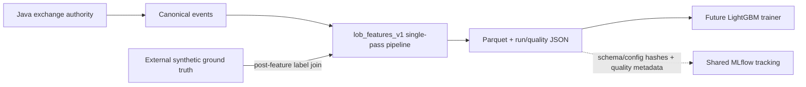

# ARD-0024: Versioned Causal Market-Abuse Feature Engineering

Status: Accepted and Implemented

Date: 2026-07-25

Implementation Status: `[done]`

## Context

A future LightGBM detector needs one stable numeric input contract across real
LOBSTER, synthetic, and hybrid streams. Computing different feature sets for
each origin would introduce model skew. Computing features inside a new market
simulator would duplicate the authoritative Java book. Mixing scenario
provenance into numeric inputs would leak labels, while randomly splitting
adjacent rolling windows would overstate generalization.

## Decision

Keep Java authoritative for ordering, matching, and canonical exchange events.
Add a Python, offline, single-pass `lob_features_v1` pipeline that consumes
those events and emits one typed row for each simulation-source combined-book
checkpoint. Immutable historical-source snapshots remain validation/provenance
inputs and never become prediction rows because they omit the synthetic
overlay by design.

The pipeline:

- uses only events already ordered before the prediction snapshot;
- calculates source-agnostic numeric features before joining external labels;
- hashes the complete versioned configuration;
- has an immutable ordered list of float64 feature names;
- validates sequence, timestamp, book, tick, and lot semantics;
- writes Parquet plus checksummed run and feature-quality metadata; and
- assigns a stable session-level split group.

The current task establishes the feature contract only. It does not add a
LightGBM dependency, trainer, model registry, inference endpoint, threshold, or
surveillance claim.

## Architecture

## Causality and leakage boundary

Input sequence is the total order. Equal exchange timestamps retain that
sequence. At snapshot `S`, only earlier events and `S` itself are available.
Rolling windows are trailing and right-inclusive. The pipeline does not inspect
the input suffix before emitting the current row.

`split_group` binds instrument, venue, session, and date while deliberately
excluding dataset/run IDs. Duplicate imports of one market session therefore
remain in the same fold. Future trainers must group by it, split
chronologically, and purge at least the longest rolling horizon around
boundaries. The feature contract intentionally does not expose a random
row-splitting helper.

Scenario ID/name/family, owner, participant/order namespace, and event source
are ignored by formulas. Nullable attack family/phase/label/source columns come
from a separate label document after numeric feature calculation. Missing
ground truth remains null rather than being interpreted as benign.

## Schema and artifacts

The feature schema and configuration hash appear in every row and in Arrow
schema metadata. Metadata/label fields use explicit Arrow string, date32,
int64, int8, and boolean types; numeric features use float64 in a fixed order.

Each run writes:

- `features.parquet`;
- `feature-quality.json`; and
- `run-metadata.json`.

The metadata records the canonical input digest, Parquet/quality hashes, row
counts, complete column inventory, source/session identity, and split policy.
The quality report records missing values, distributions, class balance, and
invalid rows.

## Tracking boundary

Feature files remain governed local artifacts referenced by checksum. The
shared MLflow plane may index the feature schema/configuration hashes, row
counts, quality metrics, and approved reports in the
`lob-arena/lightgbm-development` experiment. It must not receive raw licensed
LOBSTER records, infer labels, choose a fold, or make an incompatible dataset
acceptable. A future trainer must first pass the ARD-0025 and ARD-0026
compatibility checks.

## Alternatives considered

### Compute features separately in each adapter

Rejected because source-specific implementations would drift and undermine
hybrid/control comparisons.

### Compute features in Java

Deferred. Java owns the live exchange path, while Python is already the retained
AI/ML boundary and PyArrow is an existing dependency. The canonical event
contract keeps a later online Java implementation possible, but parity would be
required before using it.

### Include scenario metadata as model features

Rejected as direct target leakage that would not exist for genuine history.

### Shuffle snapshot rows for cross-validation

Rejected because adjacent rolling windows share both market state and events.
Session-grouped chronological splits are required.

## Consequences

Positive:

- All replay modes produce the same numeric contract.
- Feature datasets are deterministic, typed, inspectable, and provenance-bound.
- Ground truth and model input remain structurally separate.
- Prefix invariance and hybrid causal convergence are executable tests.

Tradeoffs:

- The initial pipeline is offline and combined-checkpoint-sampled.
- Warm-up and denominator-zero features are nullable.
- Exact order age is unavailable when an imported window starts after entry.
- A future online implementation must prove parity with `lob_features_v1`.

## Related documentation

- [Feature engineering for LightGBM](../feature-engineering-lightgbm.md)
- [ARD-0018: Canonical Exchange Event Stream](ARD-0018-canonical-exchange-event-stream.md)
- [ARD-0023: Deterministic Hybrid Historical Replay](ARD-0023-hybrid-historical-replay.md)
- [ARD-0025: Governed Corpus and ML Benchmark Protocol](ARD-0025-governed-corpus-and-ml-benchmark.md)
- [ARD-0027: Shared MLflow Tracking Plane](ARD-0027-shared-mlflow-tracking.md)
- [Hybrid Dataset Validation](../hybrid-dataset-validation.md)
- [Architecture Overview](../architecture.md)
