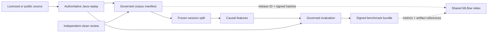

# ARD-0025: Governed Corpus and ML Benchmark Protocol

Status: Accepted

Date: 2026-07-26

Implementation Status: `[done]`

## Context

A sophisticated detector can appear accurate when adjacent rolling windows,
duplicate imports, or seed variants of the same historical session cross
training and test folds. Historical control data is not automatically benign,
so treating every non-synthetic interval as label zero would create
questionable negatives. Row-level confidence intervals would also overstate
precision because neighbouring features are strongly dependent.

The authoritative Java exchange, canonical event hashes, hybrid validation,
scenario ground truth, feature contract, and signed evidence bundles already
provide the required execution and provenance boundaries. The missing layer is
a governed corpus and a frozen, session-level scientific evaluation protocol.

## Decision

Adopt `governed_benchmark_protocol_v1` as a training prerequisite.

- A complete venue/instrument/date/session is the split and bootstrap cluster.
- A base session, its control replay, and every campaign/seed variant remain in
  one fold.
- Splits are chronological, purged, embargoed, and frozen before training.
- Historical windows remain unlabeled unless independently verified clean.
- Synthetic attack labels remain separate ground truth.
- ML evaluation consumes only provenance-bound canonical Java replay artifacts.
- Operational metrics, session-cluster bootstrap intervals, paired
  comparisons, regime matrices, and worst-decile results are mandatory.
- Full-session feature generation must be bounded-memory and chunk invariant.
- Release corpus and benchmark manifests are checksummed and signed.

The checked-in policy is
[`configs/benchmark/governed-benchmark-v1.json`](../../configs/benchmark/governed-benchmark-v1.json);
its contract is
[`contracts/governed-benchmark-protocol-v1.schema.json`](../../contracts/governed-benchmark-protocol-v1.schema.json).

## Governance boundary

Model outputs never feed the clean-window review. Unreviewed or ambiguous
history is excluded from supervised negative-label metrics. Regime thresholds
are fitted on training controls or pre-attack history and frozen before
validation and test evaluation.

## Implementation phases

1. Freeze protocol, schema, configuration, ARD, and contract tests.
2. Add corpus registry and independent clean-label adjudication.
3. Generate chronological, grouped, purged split manifests.
4. Bind ML evaluation inputs to canonical Java replay artifacts.
5. Add chunked, bounded-memory feature output and performance measurement.
6. Add operational metrics, clustered confidence intervals, and paired tests.
7. Add regime matrices and worst-decile reporting.
8. Produce signed release validation and CI/reproduction workflows.

No model trainer may be promoted before every phase gate passes. All eight
phases now have executable contracts, CLI entry points, focused tests, and an
end-to-end signed-release test. Production training remains blocked until a
real client corpus meets the configured coverage and independent-review gates.

MLflow is an operational index over this process, not the corpus authority.
Only immutable release identities, hashes, review aggregates, permitted
reports, and later evaluation results may be logged. Raw licensed sessions and
individual blind-review decisions remain in governed corpus storage. A
different MLflow run, tag, or registered-model version cannot override a
frozen split or signed corpus release.

## Consequences

Positive:

- Evaluation reflects generalisation to unseen sessions rather than adjacent
  rows or replay variants.
- Negative labels have explicit independent provenance.
- Statistical uncertainty is reported at the correct dependence level.
- Every score can be traced to immutable Java events, labels, and alerts.

Tradeoffs:

- Clean-window review becomes a manual critical path.
- Session grouping reduces the apparent sample count.
- Test-set changes require a new benchmark version.
- Licensed corpora remain external and must be resolved by digest.

## Related documentation

- [Governed Corpus and Benchmark Protocol](../governed-corpus-benchmark-protocol.md)
- [ARD-0018: Canonical Exchange Event Stream](ARD-0018-canonical-exchange-event-stream.md)
- [ARD-0023: Deterministic Hybrid Historical Replay](ARD-0023-hybrid-historical-replay.md)
- [ARD-0024: Versioned Causal Feature Engineering](ARD-0024-versioned-causal-feature-engineering.md)
- [ARD-0026: Governed LightGBM Release Boundary](ARD-0026-governed-lightgbm-release-boundary.md)
- [ARD-0027: Shared MLflow Tracking Plane](ARD-0027-shared-mlflow-tracking.md)
- [Hybrid Dataset Validation](../hybrid-dataset-validation.md)
