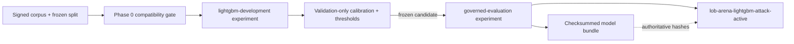

# ARD-0026: Governed LightGBM Release Boundary

Status: Accepted and Implemented

Date: 2026-07-28

Implementation Status: `[phase-0 done]`

## Context

The governed corpus, chronological split, and causal feature pipeline already
define which observations may reach a learned detector. A LightGBM trainer
could still weaken those controls if it silently accepts incompatible inputs,
fits preprocessing on validation or test data, changes thresholds after seeing
test results, or releases artifacts without exact provenance.

## Decision

Define four strict, versioned contracts before implementing the trainer:

- `lightgbm_training_run_v1`;
- `model_calibration_v1`;
- `lightgbm_model_bundle_v1`; and
- `detector_predictions_v1`.

All four bind a stable model and training-run identity to the exact benchmark
protocol, corpus release, frozen chronological assignment, feature schema, and
feature configuration hashes. The training manifest additionally records the
Git commit, training seed, ordered columns, input artifact digests,
hyperparameters, and immutable leakage-prevention policy.

Calibration may use only the validation fold. It must freeze one threshold for
each supported operating mode: high precision, balanced, and high recall.
Prediction manifests must use the frozen threshold for their declared mode.
The model bundle must inventory the model, training, calibration, and
prediction manifests, prediction rows, feature schema, validation metrics,
feature-importance output, and checksum file.

The production governed protocol derives its required attack families from the
implemented scenario catalog, preventing a newly implemented scenario from
silently escaping corpus coverage. Liquidity evaporation is therefore required
alongside spoofing-like walls, layering-like behavior, and quote stuffing.

## Validation boundary

Runtime Pydantic models reject unknown fields, malformed hashes, duplicate
features/artifacts, unsafe paths, invalid calibration parameters, non-finite or
non-binary training parameters, test-fold access during fitting, incorrect
class weights, incomplete operating modes, impossible prediction counts, and
incomplete bundles. The models and all nested structures are immutable. A
compatibility check rejects identity, schema, calibration, manifest-digest, or
threshold drift. The release verifier checks actual bytes, sizes, hashes,
canonical manifest content, and the complete checksum inventory. Generated JSON
Schemas are checked into the repository and tested for exact synchronization
with the runtime models.

Phase 0 intentionally does not add LightGBM, train a model, score the test
fold, or make a detector-performance claim.

## MLflow mapping

MLflow mirrors—but never relaxes—the release state machine:

Training and validation runs belong in
`lob-arena/lightgbm-development`. The final untouched-test run belongs in
`lob-arena/governed-evaluation` only after thresholds and calibration are
frozen. A registered model version is eligible for release only after the
local model-bundle verifier succeeds. MLflow run IDs may be recorded as
traceability references, but repository manifests and checksums remain the
compatibility and release authority.

## Consequences

Positive:

- Later training and release commands have one fail-closed provenance boundary.
- Validation-selected thresholds cannot be silently changed during test
  evaluation.
- Model artifacts are reproducible and attributable to exact governed inputs.
- Scenario coverage follows the authoritative implemented catalog.

Tradeoffs:

- Each later pipeline stage must produce and verify more metadata.
- Any protocol, corpus, split, or feature change deliberately requires a new
  training run and model bundle.
- Cryptographic signing of the model bundle remains a later release step; Phase
  0 provides checksummed artifact inventory and stable manifest hashing.

## Related documentation

- [ARD-0024: Versioned Causal Feature Engineering](ARD-0024-versioned-causal-feature-engineering.md)
- [ARD-0025: Governed Corpus and ML Benchmark Protocol](ARD-0025-governed-corpus-and-ml-benchmark.md)
- [ARD-0027: Shared MLflow Tracking Plane](ARD-0027-shared-mlflow-tracking.md)
- [Generated Contract Catalog](../../contracts/README.md)
- [Architecture Overview](../architecture.md)
