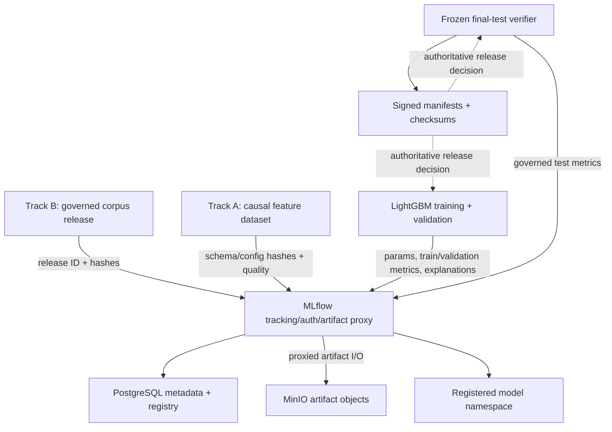

# ARD-0027: Shared MLflow Tracking Plane

Status: Accepted and Implemented

Date: 2026-07-28

## Evaluation and Recovery Update — 2026-09-21

C4 reports now require independent recomputation from original evidence before
MLflow indexing, as specified in [ARD-0038](ARD-0038-c4-specific-evaluation.md).
[ARD-0039](ARD-0039-same-run-mlflow-recovery.md) adds pre-scoring reservation and
same-run, readback-verified log-only recovery through the shared logger API.
The signed replacement runner integrates scored retention and same-run recovery.
The [native synthetic rehearsal](../evidence/g8-native-recovery-20260917.json)
verified authenticated remote logging and recovery after Job workspace loss;
production qualification remains pending. A reserved run is not a completed
evaluation receipt.

## Context

The governed LightGBM and real-corpus tracks need one shared experiment,
artifact, and registry index. Local file stores cannot provide durable
multi-client metadata, common experiment names, or a controlled model registry.
MLflow must not become a path around Phase 0 hash compatibility, frozen splits,
validation-only selection, release checksums, corpus review, or signatures.

## Decision

Deploy pinned MLflow (currently 3.16.0 in the checked-in Dockerfile) in an opt-in Docker Compose profile with:

- PostgreSQL as the metadata and registry backend;
- private MinIO as the default local S3-compatible artifact store, with Nebius
  Object Storage replacing MinIO in the Wave 1 cloud deployment;
- proxied artifacts so clients need access only to MLflow;
- a dedicated non-root MinIO service identity for MLflow artifact access;
- basic authentication, fail-closed default permissions, generated secrets,
  host/CORS restrictions, and local-only default port bindings;
- health-gated startup, automatic forward database migration, persistent
  volumes, and container hardening; and
- an idempotent verifier that creates the roadmap experiment/model namespaces
  and validates metadata plus artifact round trips.

The Wave 1 Nebius deployment uses the same application image and verifier via
`docker-compose.nebius.yml`. It keeps PostgreSQL on the CPU VM, points the
artifact proxy at the region-local Nebius S3 endpoint, and pulls the MLflow
image from Nebius Container Registry by immutable digest. The cloud profile
does not start MinIO. Object access is supplied by the dedicated MLflow
identity and remains scoped to the MLflow bucket/prefix.

The canonical release authority remains the repository's checksummed and signed
manifests. MLflow stores their hashes, artifacts, and lifecycle metadata but
does not replace them.

## High-level design

The three stable experiment namespaces are:

- `lob-arena/corpus-releases`;
- `lob-arena/lightgbm-development`; and
- `lob-arena/governed-evaluation`.

The initial registered-model namespace is
`lob-arena-lightgbm-attack-active`. Bootstrap creates this namespace only.
Current training/evaluation loggers upload explicit artifacts and metadata;
they do not create model versions, log a deployable MLflow Model flavor, assign
aliases or serve models. Those integration steps remain planned in the
[model-retention use case](../use-cases/ml-model-serving.md).

## Security and data boundary

- PostgreSQL and local MinIO are private Compose services; only the MLflow
  UI/API is host-bound, on loopback by default. On Nebius, the API is admitted
  only from the selected private subnet by a dedicated security group.
- MLflow authenticates to MinIO with the dedicated `mlflow-artifacts` service
  identity. MinIO root credentials are reserved for bootstrap administration.
- Runtime secrets live in ignored `deployments/mlflow/.env`; the checked-in
  example contains placeholders only.
- Raw licensed LOBSTER files, blind-review records, and mutable working
  datasets are not uploaded to MLflow by default.
- The self-contained profile is for trusted development and private pilots.
  Enterprise deployment requires external identity, TLS ingress, backups,
  scoped object-store policy, and managed secret rotation.

## Consequences

Positive:

- Track A and Track B share persistent experiment history and an artifact
  index.
- The deployment can later point at managed PostgreSQL and S3-compatible
  storage without changing experiment semantics.
- Normal Compose startup and existing CI remain unchanged because the profile
  is opt-in.
- A real smoke test covers authentication, registry, database writes, artifact
  upload, and artifact download.
- The Nebius deployment removes a duplicate object-store service and verifies
  the real Object Storage boundary used by Wave 1 Jobs.

Tradeoffs:

- The current self-contained stack is not highly available.
- Operators must back up two stateful stores and manage named user permissions.
- Basic authentication and local `.env` secrets are transitional controls for
  private development, not the final enterprise identity architecture.
- Database downgrades and uncoordinated credential regeneration are unsafe.

## Related documentation

- [Shared MLflow Tracking Server](../mlflow-tracking-server.md)
- [ARD-0026: Governed LightGBM Release Boundary](ARD-0026-governed-lightgbm-release-boundary.md)
- [ARD-0022: Historical Market Data Ingestion](ARD-0022-historical-market-data-ingestion.md)
- [ARD-0023: Deterministic Hybrid Historical Replay](ARD-0023-hybrid-historical-replay.md)
- [ARD-0025: Governed Corpus and ML Benchmark Protocol](ARD-0025-governed-corpus-and-ml-benchmark.md)
- [Governed Corpus and ML Benchmark Protocol](../governed-corpus-benchmark-protocol.md)
- [Functional Overview](../FUNCTIONAL_OVERVIEW.md)
- [Use Cases](../USE_CASES.md)
