# ARD-0036: Governed Market-Sequence Transformer Challenger

Status: Accepted research design; development and authorized holdout independently verified; live integration pending.

Date: 2026-08-16; updated 2026-10-08.

Tracking: [Story #24](https://github.com/khab40/lob-arena/issues/24),
[Bug #357](https://github.com/khab40/lob-arena/issues/357),
[Project #3](https://github.com/users/khab40/projects/3).
[ARD-0042](ARD-0042-transformer-lightgbm-research-sequence.md) owns comparison,
experiment ordering and research disposition; this record owns model design.

## Signed LightGBM exit — 2026-09-27

G9 is complete as `research_baseline_qualified`: the operator accepted the
verified package and unknown-cost disposition and delegated signing.
See [G9 closure](../operations/g8/g9-closure-20260927.md).
Production/client qualification is not established.

## Validation execution policy — 2026-09-16

Apply the [validation execution policy](../ml/model-validation-execution-policy.md)
in preference to historical billing, retention-window and fixed spend/VM limits.
Finite resource/Job/time bounds, execution identities, integrity and separate
final-access/replacement approvals remain. No billing or balance queries.

## Implementation Status

The causal classifier, GPU trainer, checkpoint/resume, versioned publisher,
calibration and independent reader are implemented. Replacement smoke, all four
trials, three-seed stability, C/O comparison and the authorized December holdout
are independently verified. The operator chose `continue_research`.
[Current status](../roadmap/CURRENT_STATUS.md) owns remaining story acceptance;
[the disposition](../ml/transformer-research-disposition-20261008.md) records scope.

The [settings release](../ml/transformer-settings-release.md) retains the original
seed-42/epoch-4 candidate and complete preprocessing/calibration configuration.
#314's scoped persistence/reference acceptance is met. It includes CUDA logit
parity on 64 saved development windows and separately derived probability/decision
arithmetic; it is not a new capture of original-Job reference probabilities.
[ARD-0042](ARD-0042-transformer-lightgbm-research-sequence.md#verified-continuation--8-october-2026)
keeps reference parity, held-out probability portability and reduction tolerances distinct.

The [input consumer](../ml/transformer-input-contract.md) verifies windows,
masks, target alignment and train-only normalization. The first mock replays
verified saved scores; dedicated inference, causal event integration, online
MLflow, cost reconciliation, production serving and a cascade remain pending.
Development consumers still reject final data. Consumed holdout approval grants
no new access, training, calibration, threshold search or replacement execution.

## Implemented research architecture

As a detector developer,
I want a causal sequence classifier over the governed feature release,
So that I can test temporal information without changing labels or target rows.

Actor: detector developer. Goal: standalone research challenger.
Value: measure temporal modeling beyond tabular features.
Out of scope: raw-event tokenization, live serving and cascade.
Verification: inert local contract checks; numerical behavior in authorized
Nebius Jobs; independent artifact and metric readback before accepting results.

```mermaid
flowchart LR
    C4["Frozen C4 feature release"] --> Seq["64 retained rows x 60 features"]
    Seq --> Prep["Train-only normalization + missingness + padding masks"]
    Prep --> Model["Projection + positions + 2 causal attention blocks"]
    Model --> Head["Last valid token: attack_active logit"]
    Head --> Cal["Frozen C-role temperature"]
    Cal --> Score["Probability + O-role operating points"]
    Model --> Artifacts["Versioned checkpoints and event journal"]
    Score --> Artifacts
    Artifacts --> Verify["Independent readback"]
    Verify -. "later reconciliation" .-> MLflow["MLflow research lineage"]
```



Each window has up to 64 retained supervised feature rows, not raw ITCH events
or a fixed duration. Left padding and no cross-shard history preserve the
projection. Sixty train-normalized values plus 60 missingness indicators form a
120-channel token; padding is distinct from missing features. Targets bind exact
row identities. The existing materializer expands a complete shard in memory.

The [classifier](../../backend/app/ml/transformer/research_model.py) projects to
width 64/128, adds fixed sinusoidal positions, then uses two pre-normalized blocks:
four heads, 4x-width GELU feed-forward layer, dropout 0.1. Valid queries cannot
attend to future/padded keys; padded outputs are zeroed. Final layer normalization
and the last valid token produce one `attack_active` logit. The generative AI
Investigator is a separate model.

The [trainer](../../backend/app/ml/transformer/research_training.py) uses float32
AdamW, weighted BCE, batch 64, gradient clipping 1.0, 5% warmup and cosine decay.
Weights balance classes and base sessions within class; seeded shuffling does
not sample by label. CUDA deterministic algorithms and disabled TF32 do not
promise reproducibility across arbitrary hardware or dependency versions.

Epoch checkpoints bind model, optimizer, RNG/progress, configuration, numerical
source, execution image, input/normalizer and ordered-target hashes. Publication
must verify object version/checksum before acknowledging an epoch. Resume never
authorizes automatic replacement. CUDA smoke evidence covers causality, padding,
missingness, gradients, batch behavior and resume parity; source inspection alone
cannot satisfy those behavior gates.

```gherkin
Feature: Governed causal Transformer inputs
  Scenario: Reject a changed development input
    Given a frozen sequence contract and ordered target ledger
    When an input hash or target identity differs
    Then the research Job rejects the input before fitting

  Scenario: Preserve causal predictions
    Given a valid governed sequence window in evaluation mode
    When only positions after an observed token are changed
    Then that token's encoded representation is unchanged

  Scenario: Reject a checkpoint from another experiment
    Given a checkpoint bound to a source, input and trial configuration
    When resume is requested with different bindings
    Then the checkpoint is rejected before optimizer steps
```

## Context

A sequence challenger may learn temporal structure beyond LightGBM's rolling
features, but adds leakage risk, GPU cost and a serving surface. Measure its
value after freezing the cheaper baseline on identical governed targets.

## Decision

Bind corpus/split/source-feature hashes, event-time cutoff, ordered inputs,
length/stride/padding/masks, replay/session groups, label horizon, train-only
normalization and deterministic row-to-sequence identity. Consume
`sequence_projection_v1` from the same corpus, chronological split and target
ledger as `tabular_projection_v1`; never reacquire, resplit or relabel independently.
A representation/length change needs a new projection version. See
[data preparation](../use-cases/ml-data-preparation.md).

Authenticate inputs and audit roles before fitting inside the first GPU Job.
Training/batch inference use bounded Serverless Jobs; calibration occupies the
final inference slot. The Mac orchestrates and inspects artifacts. Do not use
vLLM for this classifier. The fixed research matrix varies width/rate and confirms
seeds; broader search and any new final evaluation require separate approval.

A later registered candidate must bind preprocessing, weights, calibration,
thresholds, sequence schema, checkpoint checksum and model card. Retain curves,
parameter count, runtime/memory/resources, metrics and explicit unknown costs.
MLflow reconciliation does not imply registration or promotion.

### Pending live integration decisions

Before approving event inference, specify how live causal feature rows reproduce
the trained retained-row sampling contract, equal-timestamp cutoff/order, gap and
session resets, warm-up/padding and unavailable-state behavior. Define bounded
queue/backpressure and stale-result handling outside Java book mutation, plus
row-alert consolidation/deduplication into incidents. The nine Arena display
features are insufficient for the trained 60-feature contract. These are unresolved
design/acceptance choices, not approved architecture or authorization for a run.

## Exit Gates

A Transformer feature producer needs immutable bundle verification, causal/split
checks, identical comparison rows, incremental quality with delay/throughput/
failure/GPU-cost evidence, and an explicit go/no-go decision. Even a standalone
champion does not automatically approve the [cascade](ARD-0037-transformer-to-lightgbm-cascade.md).

## Cost And Operations

Bound the matrix, start small, early-stop and checkpoint. Use ephemeral Jobs,
record active GPU time/resources, and retain verified evidence in durable storage.
No interactive GPU endpoint is required. Resource deletion needs applicable
operator approval. [Retaining readback](../ml/transformer-holdout-execution-package.md#future-readback-packages--8-october-2026)
is required for future holdout packages; preserve frozen collectors/identities.

## Alternatives Considered

Transformer-first research was rejected until LightGBM froze. vLLM was rejected
for the classifier's different contract. Quality-only promotion was rejected:
clean-window, calibration, latency, throughput, reproducibility and cost gates remain.

## Consequences

Richer temporal context can be studied without weakening governance; serving and
optional combination add separately assessed artifacts, cost and acceptance work.
[Historical implementation narrative](https://github.com/khab40/lob-arena/blob/d896efe8ca501c1ef8e6c63442f3433948a6405e/docs/architecture/ARD-0036-market-sequence-transformer.md#implementation-status)
retains dated development milestones and superseded pending-holdout statements.

## Related Records

[ARD-0024](ARD-0024-versioned-causal-feature-engineering.md),
[ARD-0025](ARD-0025-governed-corpus-and-ml-benchmark.md),
[ARD-0035](ARD-0035-nebius-lightgbm-first.md),
[ARD-0037](ARD-0037-transformer-to-lightgbm-cascade.md),
[ARD-0042](ARD-0042-transformer-lightgbm-research-sequence.md),
[project phases](../roadmap/PHASES.md).
