```mermaid
flowchart LR
    C4["Frozen C4 feature release"] --> Seq["64 retained rows x 60 features"]
    Seq --> Prep["Train-only normalization + missingness + padding masks"]
    Prep --> Model["Projection + positions + 2 causal attention blocks"]
    Model --> Head["Last valid token: attack_active logit"]
    Head --> Cal["Frozen C-role temperature"]
    Cal --> Score["Probability + O-role operating points"]
    Model --> Artifacts["Versioned checkpoints and event journal"]
    Score --> Artifacts
    Artifacts --> Verify["Independent readback"]
    Verify -. "later reconciliation" .-> MLflow["MLflow research lineage"]
```

# ARD-0036: Governed Market-Sequence Transformer Challenger

Status: Accepted for bounded development research; GPU verification pending.

Date: 2026-08-16; updated 2026-10-03.

Ticket: [Story #24](https://github.com/khab40/lob-arena/issues/24),
[Project #3](https://github.com/users/khab40/projects/3).
The approved research fork changes execution ordering, not the frozen data or
final-test boundary. [ARD-0042](ARD-0042-transformer-lightgbm-research-sequence.md)
owns comparison, experiment sequencing and the subsequent research decision.

## Signed LightGBM exit — 2026-09-27

G9 is complete as `research_baseline_qualified`; the operator accepted the
verified governed package and unknown-cost disposition and delegated signing.
See the [signed decision and verification](../operations/g8/g9-closure-20260927.md).
Wave 2 engineering is eligible; the first #24 input-contract chunk and governed
input verification are complete. Production/client qualification is not
established. Older pending-G9 statements below are historical.

## Validation execution policy — 2026-09-16

The operator removed administrative submission/retention windows, billing checks
and fixed validation spend/VM limits until LightGBM and Transformers validation
have recorded outcomes. Apply the [validation execution policy](../ml/model-validation-execution-policy.md)
in preference to older operational bounds in this record. No billing queries or
balance-refresh requests. Finite Job timeouts, execution identities, evidence
integrity and separate final-test authorization remain. This is an execution-policy
change, not model-quality acceptance or a completed G8/G9 milestone.

## Implementation Status

Status: `[in progress; GitHub Story #24; research-baseline G9 exit accepted]`

The causal classifier, GPU trainer, checkpoint/resume support, calibration,
versioned publisher and independent result reader are implemented in
[PR #284](https://github.com/khab40/lob-arena/pull/284). This is implementation
progress, not a verified trained detector. The first GPU smoke Job failed at
startup before model execution; no Transformer quality result exists. See the
[dated status](../roadmap/CURRENT_STATUS.md) for execution evidence.

The [input consumer contract](../ml/transformer-input-contract.md) now verifies
the complete causal source window, masks, exact target alignment and train-only
normalization. [Merged #239's r2 evidence](../ml/transformer-development-results-r2.md)
verifies all 42,660 development targets on Nebius with independent artifact readback.
The [research fork](../ml/transformer-research-fork.md) amends the earlier
[GPU campaign plan](../ml/transformer-gpu-campaign-plan.md): role checks run inside
the GPU Job before fitting, and online MLflow readiness is deferred. Serving,
registry promotion and a Transformer-to-LightGBM cascade remain unimplemented.

## Implemented research architecture

As a detector developer,
I want a causal sequence classifier over the governed feature release,
So that I can test temporal information without changing labels or target rows.

Actor: detector developer. Goal: standalone development challenger.
Value: measure temporal modeling beyond tabular features.
Out of scope: raw-event tokenization, live serving, cascade and final evaluation.
Verification: inert contract checks locally; model behavior in Nebius GPU Jobs;
independent artifact and metric readback before accepting a result.



Each window contains up to 64 retained supervised feature rows, not 64 raw ITCH
events or a fixed duration. Left padding and no cross-shard history preserve the
existing projection. The normalizer is fitted on training only. Sixty normalized
values plus 60 missingness indicators form a 120-channel token; padding remains
distinct from a missing feature. Targets bind exact governed row identities.

The [classifier](../../backend/app/ml/transformer/research_model.py) projects to
width 64 or 128, adds fixed sinusoidal positions, then uses two pre-normalized
blocks with four attention heads, a 4x-width GELU feed-forward layer and 0.1
dropout. Valid queries cannot attend to future or padded keys. Padded outputs
are zeroed. Final layer normalization and the last valid token feed one binary
logit for `attack_active`. This is separate from the generative AI Investigator.

The [trainer](../../backend/app/ml/transformer/research_training.py) uses float32
AdamW, weighted binary cross entropy, batch size 64, gradient clipping at 1.0,
5% warmup and cosine decay. Weights balance classes and base sessions within
each class; seeded epoch shuffling does not sample by label. CUDA deterministic
algorithms are required and TF32 is disabled. This is a reproducibility setting,
not a claim of verified reproducibility across arbitrary hardware or versions.

Epoch checkpoints bind model, optimizer, RNG/progress, configuration, source,
image, input/normalizer hashes and ordered target hashes. Publication must return
a verified object version and checksum before acknowledging an epoch. Resume
support does not authorize an automatic replacement Job. GPU smoke checks cover
causality, padding, missingness, gradients, batch behavior and resume parity;
they remain required execution evidence, not satisfied by source inspection.

```gherkin
Feature: Governed causal Transformer inputs
  Scenario: Reject a changed development input
    Given a frozen sequence contract and ordered target ledger
    When an input hash or target identity differs
    Then the research Job rejects the input before fitting

  Scenario: Preserve causal predictions
    Given a valid governed sequence window
    And the classifier is in evaluation mode
    When only positions after an observed token are changed
    Then that token's encoded representation is unchanged

  Scenario: Reject a checkpoint from another experiment
    Given a checkpoint bound to a source, input and trial configuration
    When resume is requested with different bindings
    Then the checkpoint is rejected before optimizer steps
```

## Context

The tabular LightGBM detector observes causal rolling features but cannot learn
arbitrary temporal structure across an ordered event window. A market-sequence
Transformer may capture attack phase, cancellation choreography, refill and
liquidity response patterns that are difficult to express as fixed aggregates.

Sequence training adds material GPU cost, more leakage risk and a distinct
serving surface. Its value must therefore be measured after the cheaper
LightGBM baseline is frozen, on the same governed data and operational metrics.
This classifier is separate from the generative vLLM AI Investigator.

## Decision

After ARD-0035 exits, develop one bounded causal Transformer challenger with a
versioned sequence contract containing:

- corpus, split and source-feature hashes;
- event-time cutoff and proof that no later event is visible;
- ordered inputs, sequence length, stride, padding and attention masks;
- replay/session grouping and label horizon;
- normalization or tokenization fitted on training only; and
- deterministic row-to-sequence identity.

The sequence contract consumes `sequence_projection_v1` from the selective
Nasdaq-to-Nebius shared data foundation. It must bind the same root corpus,
chronological split, replay domains and evaluation-row identities used by the
Wave 1 `tabular_projection_v1`; the Transformer may not reacquire, resplit or
relabel Nasdaq data independently. Existing sequences use left zero padding,
attention masks and NaN feature missingness, with one target per retained row
and no cross-shard history. The current materializer expands a complete shard
in memory. The trainer must define train-only normalization, missingness,
temporal encoding and label-independent sampling parity with serving. A changed
representation/length requires a new versioned projection. See
[data preparation](../use-cases/ml-data-preparation.md).

For the current research fork, authenticate inputs and audit roles inside the
first GPU Job before any optimizer step. Use time-boxed GPU Serverless AI Jobs
for training and batch inference; calibration is in the final inference slot.
The Mac performs orchestration, static checks and artifact inspection. Do not
serve or train this classifier through vLLM unless a later ARD intentionally
changes it into a compatible generative architecture.

The current matrix varies only width and learning rate, followed by fixed seed
confirmation. Sequence length, encoding, schedule and loss are fixed. Broader
search is deferred. Final test is outside this research fork and requires a
separately frozen candidate and explicit authorization.

Any later registered candidate must contain preprocessing, model weights,
calibration, thresholds, sequence schema, checkpoint checksum and a model card.
The durable research package retains curves, parameter count, runtime, memory,
resource identities and detector metrics; unknown costs are identified. MLflow
reconciliation is required later and does not imply registration or promotion.

## Exit Gates

Transformer-derived features may be consumed by LightGBM only after:

1. the standalone Transformer bundle verifies from immutable inputs;
2. causal-cutoff and split-leakage tests pass;
3. standalone LightGBM and Transformer are evaluated on identical rows;
4. incremental quality is reported alongside detection delay, throughput,
   failure behavior and GPU cost; and
5. a go/no-go record approves the model as a feature producer even if it is not
   selected as a standalone champion.

## Cost And Operations

- Cap the experiment matrix before starting the GPU campaign.
- Start with the smallest architecture and shortest useful sequence.
- Use early stopping, resumable checkpoints and small smoke datasets before
  full runs.
- Prefer ephemeral Job execution; no interactive GPU endpoint is required for
  training.
- Record actual active GPU time and resource evidence. Follow the validation
  policy above for cost reporting; do not query billing or remaining credit.
- Stop unused GPU endpoints immediately and delete them when fast restart is
  unnecessary because retained disks may still incur storage cost. Completed
  Jobs remove their associated VM and disk; retain governed checkpoints and
  evidence in Object Storage.

## Alternatives Considered

### Start with the Transformer before LightGBM

Rejected because the project already has a complete CPU-friendly LightGBM
boundary and needs its measured baseline to justify GPU spend.

### Use vLLM for the detector

Rejected because vLLM serves autoregressive language models, while this design
is a causal market-sequence classifier with different input, output and latency
contracts.

### Promote the Transformer on quality alone

Rejected. A surveillance candidate must also satisfy clean-window, calibration,
latency, throughput, reproducibility and cost gates.

## Consequences

The project can test richer temporal context without weakening the existing
governance boundary. Training and optional inference introduce GPU cost and
additional artifacts, but the staged gate makes that spend explicit and
reversible.

## Related Records

- [ARD-0024: Versioned Causal Feature Engineering](ARD-0024-versioned-causal-feature-engineering.md)
- [ARD-0025: Governed Corpus And ML Benchmark](ARD-0025-governed-corpus-and-ml-benchmark.md)
- [ARD-0035: Nebius-First LightGBM](ARD-0035-nebius-lightgbm-first.md)
- [ARD-0037: Transformer-To-LightGBM Cascade](ARD-0037-transformer-to-lightgbm-cascade.md)
- [ARD-0042: Transformer and LightGBM Research Sequence](ARD-0042-transformer-lightgbm-research-sequence.md)
- [Project phases](../roadmap/PHASES.md)
