# ARD-0036: Governed Market-Sequence Transformer Challenger

Status: Accepted research design; development and authorized holdout independently verified; live integration pending.

Date: 2026-08-16; updated 2026-10-08.

Tracking: [Story #24](https://github.com/khab40/lob-arena/issues/24),
[Bug #357](https://github.com/khab40/lob-arena/issues/357),
[Project #3](https://github.com/users/khab40/projects/3).
[ARD-0042](ARD-0042-transformer-lightgbm-research-sequence.md) owns comparison,
experiment ordering and research disposition; this record owns model design.

## Signed LightGBM exit — 2026-09-27

G9 is complete as `research_baseline_qualified`: the operator accepted the
verified package and unknown-cost disposition and delegated signing.
See [G9 closure](../operations/g8/g9-closure-20260927.md).
Production/client qualification is not established.

## Validation execution policy — 2026-09-16

Apply the [validation execution policy](../ml/model-validation-execution-policy.md)
in preference to historical billing, retention-window and fixed spend/VM limits.
Finite resource/Job/time bounds, execution identities, integrity and separate
final-access/replacement approvals remain. No billing or balance queries.

## Implementation Status

The causal classifier, GPU trainer, checkpoint/resume, versioned publisher,
calibration and independent reader are implemented. Replacement smoke, all four
trials, three-seed stability, C/O comparison and the authorized December holdout
are independently verified. The operator chose `continue_research`.
[Current status](../roadmap/CURRENT_STATUS.md) owns remaining story acceptance;
[the disposition](../ml/transformer-research-disposition-20261008.md) records scope.

The [settings release](../ml/transformer-settings-release.md) retains the original
seed-42/epoch-4 candidate and complete preprocessing/calibration configuration.
#314's scoped persistence/reference acceptance is met. It includes CUDA logit
parity on 64 saved development windows and separately derived probability/decision
arithmetic; it is not a new capture of original-Job reference probabilities.
[ARD-0042](ARD-0042-transformer-lightgbm-research-sequence.md#verified-continuation--8-october-2026)
keeps reference parity, held-out probability portability and reduction tolerances distinct.

The [input consumer](../ml/transformer-input-contract.md) verifies windows,
masks, target alignment and train-only normalization. The first mock replays
verified saved scores; dedicated inference, causal event integration, online
MLflow, cost reconciliation, production serving and a cascade remain pending.
Development consumers still reject final data. Consumed holdout approval grants
no new access, training, calibration, threshold search or replacement execution.

## Implemented research architecture

As a detector developer,
I want a causal sequence classifier over the governed feature release,
So that I can test temporal information without changing labels or target rows.

Actor: detector developer. Goal: standalone research challenger.
Value: measure temporal modeling beyond tabular features.
Out of scope: raw-event tokenization, live serving and cascade.
Verification: inert local contract checks; numerical behavior in authorized
Nebius Jobs; independent artifact and metric readback before accepting results.

```mermaid
flowchart LR
    C4["Frozen C4 feature release"] --> Seq["64 retained rows x 60 features"]
    Seq --> Prep["Train-only normalization + missingness + padding masks"]
    Prep --> Model["Projection + positions + 2 causal attention blocks"]
    Model --> Head["Last valid token: attack_active logit"]
    Head --> Cal["Frozen C-role temperature"]
    Cal --> Score["Probability + O-role operating points"]
    Model --> Artifacts["Versioned checkpoints and event journal"]
    Score --> Artifacts
    Artifacts --> Verify["Independent readback"]
    Verify -. "later reconciliation" .-> MLflow["MLflow research lineage"]
```



Each window has up to 64 retained supervised feature rows, not raw ITCH events
or a fixed duration. Left padding and no cross-shard history preserve the
projection. Sixty train-normalized values plus 60 missingness indicators form a
120-channel token; padding is distinct from missing features. Targets bind exact
row identities. The existing materializer expands a complete shard in memory.

The [classifier](../../backend/app/ml/transformer/research_model.py) projects to
width 64/128, adds fixed sinusoidal positions, then uses two pre-normalized blocks:
four heads, 4x-width GELU feed-forward layer, dropout 0.1. Valid queries cannot
attend to future/padded keys; padded outputs are zeroed. Final layer normalization
and the last valid token produce one `attack_active` logit. The generative AI
Investigator is a separate model.

The [trainer](../../backend/app/ml/transformer/research_training.py) uses float32
AdamW, weighted BCE, batch 64, gradient clipping 1.0, 5% warmup and cosine decay.
Weights balance classes and base sessions within class; seeded shuffling does
not sample by label. CUDA deterministic algorithms and disabled TF32 do not
promise reproducibility across arbitrary hardware or dependency versions.

Epoch checkpoints bind model, optimizer, RNG/progress, configuration, numerical
source, execution image, input/normalizer and ordered-target hashes. Publication
must verify object version/checksum before acknowledging an epoch. Resume never
authorizes automatic replacement. CUDA smoke evidence covers causality, padding,
missingness, gradients, batch behavior and resume parity; source inspection alone
cannot satisfy those behavior gates.

```gherkin
Feature: Governed causal Transformer inputs
  Scenario: Reject a changed development input
    Given a frozen sequence contract and ordered target ledger
    When an input hash or target identity differs
    Then the research Job rejects the input before fitting

  Scenario: Preserve causal predictions
    Given a valid governed sequence window in evaluation mode
    When only positions after an observed token are changed
    Then that token's encoded representation is unchanged

  Scenario: Reject a checkpoint from another experiment
    Given a checkpoint bound to a source, input and trial configuration
    When resume is requested with different bindings
    Then the checkpoint is rejected before optimizer steps
```

## Context

A sequence challenger may learn temporal structure beyond LightGBM's rolling
features, but adds leakage risk, GPU cost and a serving surface. Measure its
value after freezing the cheaper baseline on identical governed targets.

## Decision

Bind corpus/split/source-feature hashes, event-time cutoff, ordered inputs,
length/stride/padding/masks, replay/session groups, label horizon, train-only
normalization and deterministic row-to-sequence identity. Consume
`sequence_projection_v1` from the same corpus, chronological split and target
ledger as `tabular_projection_v1`; never reacquire, resplit or relabel independently.
A representation/length change needs a new projection version. See
[data preparation](../use-cases/ml-data-preparation.md).

For the current research fork, authenticate inputs and audit roles inside the
first GPU Job before any optimizer step. Use time-boxed GPU Serverless AI Jobs
for training and batch inference; calibration is in the final inference slot.
The Mac performs orchestration, static checks and artifact inspection. Do not
serve or train this classifier through vLLM unless a later ARD intentionally
changes it into a compatible generative architecture.

The current matrix varies only width and learning rate, followed by fixed seed
confirmation. Sequence length, encoding, schedule and loss are fixed. Broader
search is deferred. Final test is outside this research fork and requires a
separately frozen candidate and explicit authorization.

Any later registered candidate must contain preprocessing, model weights,
calibration, thresholds, sequence schema, checkpoint checksum and a model card.
The durable research package retains curves, parameter count, runtime, memory,
resource identities and detector metrics; unknown costs are identified. MLflow
reconciliation is required later and does not imply registration or promotion.

## Exit Gates

Transformer-derived features may be consumed by LightGBM only after:

1. the standalone Transformer bundle verifies from immutable inputs;
2. causal-cutoff and split-leakage tests pass;
3. standalone LightGBM and Transformer are evaluated on identical rows;
4. incremental quality is reported alongside detection delay, throughput,
   failure behavior and GPU cost; and
5. a go/no-go record approves the model as a feature producer even if it is not
   selected as a standalone champion.

## Cost And Operations

- Cap the experiment matrix before starting the GPU campaign.
- Start with the smallest architecture and shortest useful sequence.
- Use early stopping, resumable checkpoints and small smoke datasets before
  full runs.
- Prefer ephemeral Job execution; no interactive GPU endpoint is required for
  training.
- Record actual active GPU time and resource evidence. Follow the validation
  policy above for cost reporting; do not query billing or remaining credit.
- Stop unused GPU endpoints immediately and delete them when fast restart is
  unnecessary because retained disks may still incur storage cost. Completed
  Jobs remove their associated VM and disk; retain governed checkpoints and
  evidence in Object Storage.

## Alternatives Considered

### Start with the Transformer before LightGBM

Rejected because the project already has a complete CPU-friendly LightGBM
boundary and needs its measured baseline to justify GPU spend.

### Use vLLM for the detector

Rejected because vLLM serves autoregressive language models, while this design
is a causal market-sequence classifier with different input, output and latency
contracts.

### Promote the Transformer on quality alone

Rejected. A surveillance candidate must also satisfy clean-window, calibration,
latency, throughput, reproducibility and cost gates.

## Consequences

The project can test richer temporal context without weakening the existing
governance boundary. Training and optional inference introduce GPU cost and
additional artifacts, but the staged gate makes that spend explicit and
reversible.

## Related Records

- [ARD-0024: Versioned Causal Feature Engineering](ARD-0024-versioned-causal-feature-engineering.md)
- [ARD-0025: Governed Corpus And ML Benchmark](ARD-0025-governed-corpus-and-ml-benchmark.md)
- [ARD-0035: Nebius-First LightGBM](ARD-0035-nebius-lightgbm-first.md)
- [ARD-0037: Transformer-To-LightGBM Cascade](ARD-0037-transformer-to-lightgbm-cascade.md)
- [ARD-0042: Transformer and LightGBM Research Sequence](ARD-0042-transformer-lightgbm-research-sequence.md)
- [Project phases](../roadmap/PHASES.md)
