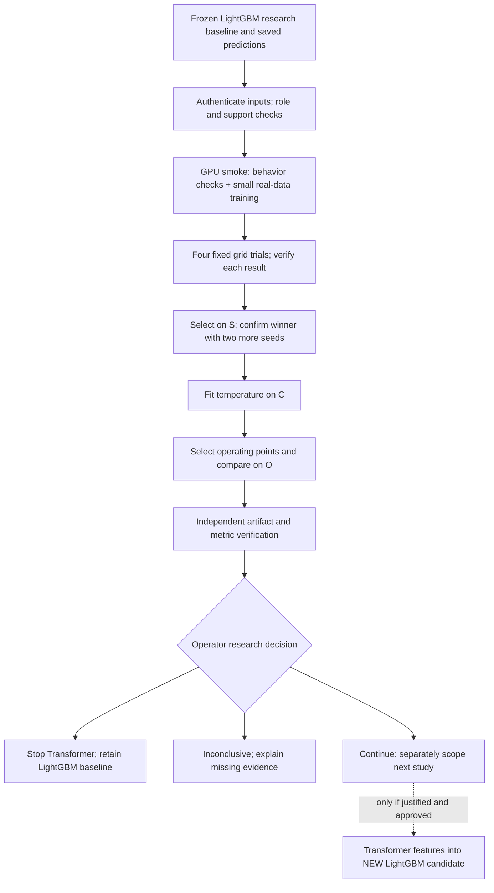

# ARD-0042: Transformer and LightGBM Research Sequence

Status: Accepted research ordering; holdout verified, bounded continuation and first mock next.

Date: 2026-10-03; updated 2026-10-08. Records the operator-approved research forks.

Tickets: [Story #24](https://github.com/khab40/lob-arena/issues/24),
[Feature #16](https://github.com/khab40/lob-arena/issues/16),
[Epic #15](https://github.com/khab40/lob-arena/issues/15),
[Project #3](https://github.com/users/khab40/projects/3).
Later cascade scope belongs to [Story #25](https://github.com/khab40/lob-arena/issues/25).

## Context and decision

LightGBM's signed G9 outcome is `research_baseline_qualified`, not production
qualification. The immediate question is whether a standalone Transformer adds
enough value to justify more research. Platform maintenance and live MLflow
acceptance must not prevent that experiment when complete results can be retained
durably. A negative or inconclusive answer is a valid outcome.

Keep [ARD-0036](ARD-0036-market-sequence-transformer.md) as the Transformer design.
This record owns comparison and ordering. It supersedes the MLflow-first and
separate-CPU-first research prerequisites in
[ARD-0041](ARD-0041-mlflow-readiness-before-transformer-execution.md), while leaving
its maintenance acceptance work open. It does not change final-test authorization,
approve new permissions or promote either model. G8/G9 remain closed.

As a researcher,
I want a bounded comparison against frozen LightGBM on identical development targets,
So that I can continue or stop Transformer work using measured quality and cost.

Actor: researcher. Goal: a reproducible continue/stop/inconclusive decision.
Value: test the hypothesis before investing in serving or a cascade.
Out of scope: new corpus, final fold, LightGBM refit, deployment and promotion.
Verification: exact ordered identities and labels, complete trial receipts,
independent recomputation from saved predictions and explicit limitations.

## Holdout extension — 5 October 2026

PR #318 merged with verified C/O results; the operator chose **continue_research**
and approved the later-date implementation plan. [Settings #314](../ml/transformer-settings-release.md)
retain the original seed-42/epoch-4 candidate as research-only metadata. The
[locked protocol](../ml/transformer-holdout-protocol-20261005.md) extends the original
development-only fork with separately authorized December inference. It does not
change the original experiment's exclusion of final data or reopen LightGBM G8/G9.

Order: settings/protocol → separate holdout adapter/package → exact dry-run and
final-access/run/spend approval → one GPU reference-parity/holdout Job → independent
paired report → operator decision → later MLflow reconciliation. Preserve all
weights, feature order, normalizer, temperature and operating points. Read saved
G8 baseline predictions; never rescore LightGBM. Historical December exposure is
disclosed, so this cannot be called a globally blind benchmark. No training,
calibration fitting, threshold search or automatic replacement follows the holdout.
The remaining text describes the original development study; its final-fold
exclusion remains enforced by all existing development consumers.

## Verified continuation — 8 October 2026

The [December report](../ml/transformer-holdout-report-20261007.md) is independently
verified. Frozen balanced F1 is 95.35% for Transformer and 74.48% for LightGBM,
on 15,160 rows / 135 positives. Historical LightGBM exposure, one date/three base
sessions and synthetic attack labels constrain the conclusion.
The [operator disposition](../ml/transformer-research-disposition-20261008.md)
records continue_research and the previously scoped first mock.
#314's scoped persistence/reference acceptance is complete; full #24 remains open.

Current order: verified saved-score playback under #90/#91 → dedicated research
inference adapter → governed causal event features/sequences → separately approved
bounded Nebius rehearsal → MLflow/cost/full-story reconciliation. No new training,
final access or cascade follows automatically. Production serving remains denied.
This update supersedes the historical pending execution/calibration status below.

## Experiment sequence



1. **Preserve the baseline.** Authenticate saved predictions and the frozen
   isotonic calibration manifest. Reapply that mapping; do not refit or rescore
   LightGBM. Map original prediction IDs through frozen run lineage and verify
   exact ordered target IDs and labels against the Transformer inputs.
2. **Check inputs and smoke behavior.** Run source/role/class-support checks
   before fitting inside the first GPU Job. Run CUDA behavior tests, then a
   1,024-row, two-epoch smoke. A failed prerequisite blocks dependent trials.
3. **Train the fixed grid.** Width 64/128 crossed with learning rate
   0.0003/0.001, seed 42; at most 30 epochs and patience 5. Select epochs using
   unweighted S log loss with minimum improvement 1e-6, retaining the earliest
   tied epoch. Require all four verified trials before choosing a winner;
   trial ties use parameter count, then canonical configuration hash.
4. **Check seed stability.** Repeat only the winning configuration with seeds
   7 and 2027. Seed 42 remains the candidate; do not select the luckiest seed.
   S log-loss range and F1-at-0.5 range must each be at most 0.05 for freeze.
5. **Calibrate and compare.** Fit one temperature on C only, bounded to
   [0.05, 20], with at most 200 objective evaluations. Use O for Transformer
   operating-point selection and reported comparison. Keep LightGBM's original
   frozen high-precision, balanced and high-recall thresholds.
6. **Verify and decide.** Independently check versioned artifacts, selected
   checkpoints, saved-logit metrics, seed spread, calibration and family results.
   Report `continue_research`, `stop_transformer` or `inconclusive`; never expand
   search or access the final fold automatically.

### Fixed data roles

| Role | Targets | Source | Permitted use |
| --- | ---: | --- | --- |
| Train | 33,450 | 2019-01-30 and 2019-03-27; three instruments | Normalization and model fitting |
| S: selection | 1,250 | 2019-10-30, NVDA | Early stopping, grid selection and seed diagnostics |
| C: calibration | 5,490 | 2019-10-30, MSFT | Temperature fitting |
| O: operating point | 2,470 | 2019-10-30, AAPL | Threshold selection and development comparison |

Source grouping keeps shared source observations together, including controls
and seed variants. Each validation role requires at least 20 positives and 20
negatives. Insufficient support blocks fitting without reassignment. The frozen
2019-12-30 final fold is excluded from this experiment.

### Interpretation and decision limits

Report log loss, average precision (the implementation's PR-AUC convention),
precision/recall/F1, false positives, Brier score, ECE and per-family support.
Default 0.5 metrics and the selected/frozen operating points are distinct views.
Per-family metrics at 0.5 compare each family's positives with all shared negative
controls, excluding other families' positives. Support counts identify the
population; controls recur across families, so these reports cannot be summed.
The inference worker also records Transformer batch timing including host-to-device
transfer; trial receipts record runtime and peak GPU memory. Saved LightGBM
predictions provide no fresh latency measurement, so no speedup claim is allowed.

This is not an untouched holdout comparison: O selects the Transformer thresholds
being reported, and LightGBM's frozen calibrator previously used the entire
validation fold. One date and one instrument per validation role confound temporal
and instrument generalization. Synthetic positives and research-control negatives
do not establish real-world abuse detection performance. Do not compare these
development deltas with LightGBM's December final metrics as if the rows matched.

Unattainable 0.90 operating-point floors, both Brier and ECE worsening by more
than 1e-6, or failed seed stability block candidate freeze. Clearing these checks
does not itself approve continuation or promotion. There is no predeclared
numerical superiority margin for this fork: report actual deltas and trade-offs
without inventing one after seeing results. Missing/failed trials are inconclusive,
not evidence that the Transformer architecture is worse.

## Durable execution and MLflow

The [protocol amendment](../../configs/experiments/transformer/research-fork-20261002.json)
preserves the hash of the [base configuration](../../configs/experiments/transformer/c4-campaign-20260928.json).
It defines eight GPU slots: smoke, four grid trials, two seed confirmations and
inference/calibration. One L40S, 8 vCPU, 32 GiB RAM, 100 GiB disk and 1 GiB shared
memory per Job; concurrency one, restart never. Smoke/inference have one-hour
timeouts and training slots two hours: at most 14 planned GPU-hours. These are
resource bounds, not measured cost. No automatic replacement is included.

Exact requests bind source commit, immutable image digest, inputs, output prefix
and dependency receipts. The worker requires a signed context bound to the
observed provider Job. The publisher is designed to conditionally create objects,
verify their versions and bytes, journal events and publish SUCCESS last.
Ambiguous publication stops; a completed container alone is insufficient evidence.

Retain configuration, preprocessing/lineage, checkpoints and RNG state, curves,
logits with target IDs, baseline/calibration hashes, comparison metrics, runtime
identities, measurements and verification receipts in versioned storage. The
implemented worker records MLflow reconciliation as pending. Later reconciliation
must index these same artifacts and identities without retraining. Online MLflow,
registry aliases and platform #19–#21 acceptance are separate completion states.

Historical status reconciliation, 2026-10-04: the October 3 failed first smoke remains retained and consumed;
the separately authorized replacement and [four grid trials](../ml/transformer-training-grid-results.md)
are independently verified. The selection winner is width 128 / rate 0.0003 /
seed 42 / epoch 4. Both [replacement confirmations](../ml/transformer-confirmation-results-20261004.md)
are independently verified and three-seed stability passed: selection-loss range
0.002395075568322679 and F1 range 0.0. Seed 42 remains the candidate; this does not
establish an advantage over LightGBM. The [current week plan](../ml/transformer-week-plan-20261004.md)
next requires checkpoint-origin compatibility and separate exact run/spend approval
for one inference/calibration Job, at most one hour. Calibration/comparison has not run.
Research decision precedes MLflow/platform maintenance and any conditional cascade.

## Replacement lineage decision — 4 October 2026

After seed 7 failed before training, its prefix remains consumed. The original
v1 schema fixes campaign/name/prefix, so a new name alone cannot safely replace
that attempt. The [confirmation-only v2 package](../ml/transformer-confirmation-r2-20261004.md)
uses a fresh fixed namespace and exactly five pinned legacy publications.
Cross-image compatibility applies only to those smoke/grid references, requiring
their original source, image, signing key and request/SUCCESS hashes. Own-result
verification still requires the new exact assembly identity and trial.

The new image retains the original sealed image layers; only four execution
modules and the source marker change. Numerical source and assembly source are
separate provenance fields. Model, training, selection, inputs, dependencies and
baseline bytes stay unchanged. Supervised attester readiness precedes async
submission, retaining failure diagnostics without automatically retrying a write.

This compatibility does not authorize inference or silently migrate checkpoints.
The later inference package must recognize the selected seed-42 checkpoint's
original bindings and record its own execution identity separately. Never rewrite
checkpoint bindings to satisfy a newer runtime. This keeps the comparison design
unchanged while making replacement provenance explicit and testable.

## Comparison versus combination

Today both standalone models consume aligned projections of the same governed
release and their predictions are compared side by side. Neither model's output
feeds the other during this experiment, and there is no live cascade.

Only after a research decision justifies further work may
[ARD-0037](ARD-0037-transformer-to-lightgbm-cascade.md) be implemented: a frozen
Transformer produces causal scores/embeddings, joined by exact row identity to
tabular features, then a **new** LightGBM candidate learns from the combined
features. Cross-fitting or disjoint producer/downstream training groups is
required to prevent stacking leakage. This does not modify frozen LightGBM v1.
Separate ablations and serving/fallback acceptance must justify that added cost.

## Acceptance scenarios and consequences

```gherkin
Feature: Transformer research decision
  Scenario: Reject a mismatched baseline
    Given frozen LightGBM predictions and governed Transformer targets
    When their ordered identities or labels differ
    Then no comparison result is accepted

  Scenario: Do not choose a winner from an incomplete grid
    Given one fixed-grid trial lacks independently verified results
    When candidate selection is requested
    Then selection is rejected and the campaign remains inconclusive

  Scenario: Keep a negative result without expanding the search
    Given a complete verified comparison does not justify more Transformer work
    When the operator chooses to stop
    Then LightGBM remains the research baseline
    And no cascade, extra trial or final evaluation starts automatically
```

The fork brings the research question forward while retaining governance checks.
It defers platform acceptance and accepts explicitly limited development evidence.
It avoids committing to an expensive cascade before demonstrating standalone value.
