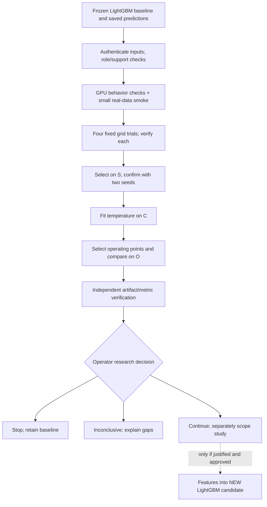

# ARD-0042: Transformer and LightGBM Research Sequence

Status: Accepted research ordering; holdout verified; bounded continuation and first saved-score mock next.

Date: 2026-10-03; updated 2026-10-08.

Tracking: [Story #24](https://github.com/khab40/lob-arena/issues/24),
[Feature #16](https://github.com/khab40/lob-arena/issues/16),
[Epic #15](https://github.com/khab40/lob-arena/issues/15),
[Bug #357](https://github.com/khab40/lob-arena/issues/357),
[Project #3](https://github.com/users/khab40/projects/3).
Later cascade scope belongs to [Story #25](https://github.com/khab40/lob-arena/issues/25).

## Context and decision

LightGBM G9 is `research_baseline_qualified`, not production qualification.
Test whether a standalone Transformer justifies more research; negative and
inconclusive outcomes are valid. [ARD-0036](ARD-0036-market-sequence-transformer.md)
owns model design; this record owns comparison and ordering. It supersedes
[ARD-0041](ARD-0041-mlflow-readiness-before-transformer-execution.md)'s MLflow-first
and separate-CPU-first research prerequisites, leaving maintenance acceptance
open. Durable complete results may precede online MLflow. G8/G9 stay closed.

As a researcher,
I want a bounded comparison against frozen LightGBM on identical development targets,
So that I can continue or stop Transformer work using measured quality and cost.

Actor: researcher. Goal: reproducible continue/stop/inconclusive decision.
Value: test standalone value before serving/cascade investment.
Original-study exclusions: new corpus, final fold, LightGBM refit, deployment,
promotion. Verification: ordered identities/labels, complete trial receipts,
independent saved-prediction recomputation and explicit limitations.

## Holdout extension — 5 October 2026

After verified C/O results the operator chose `continue_research`. The
[settings release](../ml/transformer-settings-release.md) freezes seed 42/epoch 4;
the [locked protocol](../ml/transformer-holdout-protocol-20261005.md) separately
extends research to December inference. Existing development consumers still
reject final data. This extension never reopens LightGBM G8/G9.

Order: frozen settings/protocol → separate consumer/package → exact dry-run and
access/run/spend approval → GPU reference parity before holdout reads → paired
independent report → operator decision → later MLflow reconciliation. Preserve
weights, feature order, normalizer, temperature and thresholds. Read saved G8
LightGBM predictions; never rescore/refit the baseline. Historical December
exposure precludes a globally blind benchmark. No training, calibration fitting,
threshold search or automatic replacement follows the evaluation.

## Verified continuation — 8 October 2026

The [December report](../ml/transformer-holdout-report-20261007.md) is independently
verified: balanced F1 95.35% Transformer versus 74.48% LightGBM on 15,160 rows /
135 positives. One date/three base sessions, synthetic labels, repeated variants
and earlier LightGBM exposure limit generalization. The
[disposition](../ml/transformer-research-disposition-20261008.md) records continuation
and #314's scoped persistence/reference acceptance; full #24 remains open.
[Current status](../roadmap/CURRENT_STATUS.md) owns remaining acceptance.

Current order: #90/#91 saved-score playback → dedicated research inference adapter
→ governed causal event features/sequences → separately approved bounded Nebius
rehearsal → MLflow/cost/full-story reconciliation. Playback is not fresh event
inference. New training, final access, cascade and production serving are not
approved by this sequence. Live contract choices remain
[unresolved in ARD-0036](ARD-0036-market-sequence-transformer.md#pending-live-integration-decisions).

Keep three numerical contracts distinct:

| Check | Allowed difference | Exact invariants |
| --- | --- | --- |
| Saved development CUDA reference logits | `atol=1e-5`, `rtol=1e-6`; derived calibrated probability bound `(atol + rtol * abs(reference_logit))/(4*T)` plus two scalar rounding ULPs | 64 ordered reference windows; all three mode decisions |
| Published holdout calibrated probabilities | At most one adjacent float64 ULP | Threshold decisions (three modes and 0.5), ranking, ties, ten-bin reliability membership |
| Named float64 aggregate reductions | At most eight ULPs, using verified published probabilities | Artifact hashes, rows, counts, thresholds, structure and decisions |

The reference probability check is derived arithmetic on authenticated logits,
not direct capture of original-Job reference probabilities or fresh inference.
The [post-hoc portability repair](../ml/transformer-holdout-verification-repair-20261007.md)
changes no frozen output, probability decisions or eight-ULP reduction bound.

## Experiment sequence



1. Authenticate saved baseline predictions and frozen isotonic mapping. Reapply
   it without refit/rescoring; map prediction IDs through frozen lineage and
   verify ordered target IDs/labels against Transformer inputs.
2. Audit source/roles/class support before fitting in the first GPU Job; run CUDA
   behavior checks, then a 1,024-row/two-epoch smoke. Failure blocks dependent trials.
3. Train width 64/128 × rate 0.0003/0.001, seed 42, at most 30 epochs, patience 5.
   Select by unweighted S log loss, improvement 1e-6, earliest tied epoch. All four
   verified trials are required; trial ties use parameter count then config hash.
4. Confirm only the winner with seeds 7/2027. Retain seed 42, never the luckiest
   seed. S log-loss and F1-at-0.5 ranges must each be ≤0.05 to freeze.
5. Fit temperature only on C, bounded [0.05,20], at most 200 objective evaluations.
   Select Transformer operating points on O; preserve LightGBM's original three
   high-precision/balanced/high-recall thresholds.
6. Independently verify artifacts, metrics and selection before operator disposition.

## Fixed data roles

| Role | Rows | Source | Permitted use |
| --- | ---: | --- | --- |
| Train | 33,450 | 2019-01-30 and 2019-03-27; three instruments | Normalization/model fitting |
| S | 1,250 | 2019-10-30 NVDA | Early stopping, selection, seed diagnostics |
| C | 5,490 | 2019-10-30 MSFT | Temperature fitting |
| O | 2,470 | 2019-10-30 AAPL | Operating points/development comparison |

Keep shared source observations, controls and seed variants together. Each
validation role needs ≥20 positives and ≥20 negatives; insufficient support blocks
fitting without reassignment. December final is excluded from this original study.

### Interpretation and decision limits

Report log loss, average precision (implemented PR-AUC convention), precision/
recall/F1, false positives, Brier, ECE and family support. Distinguish 0.5 metrics
from selected operating points. At 0.5 each family uses its positives and all
shared negative controls, excluding other-family positives. Controls recur;
family reports cannot be summed. Record inference host-to-device batch timing,
trial runtime and peak GPU memory. Saved baseline predictions yield no fresh
LightGBM latency or speedup evidence.

O also selects thresholds; LightGBM calibration previously saw full validation.
One date/instrument per role confounds temporal/instrument generalization.
Synthetic attacks and assumed research controls do not establish real abuse
performance. Never compare development deltas with unmatched December rows.

Unattainable 0.90 operating floors, both Brier and ECE worsening >1e-6, or failed
seed stability block freeze. Passing does not approve continuation/promotion.
No superiority margin was predeclared: report actual trade-offs without inventing
one afterward. Missing/failed trials are inconclusive, not architectural inferiority.

## Durable execution and MLflow

The [original amendment](../../configs/experiments/transformer/research-fork-20261002.json)
binds the [base config](../../configs/experiments/transformer/c4-campaign-20260928.json):
eight slots (smoke, four trials, two confirmations, inference), one L40S, 8 vCPU,
32 GiB RAM, 100 GiB disk, 1 GiB shared memory, concurrency one, restart never.
Smoke/inference timeouts are one hour, training two: 14 planned GPU-hours, not
measured cost or cumulative replacement allowance. Consumed approvals are not reusable.

Exact requests bind execution source, immutable image, inputs, output prefix and
dependencies; signed context binds observed provider Job. Conditional publication
verifies versions/bytes, journals events and writes SUCCESS last. Ambiguity stops;
container completion alone is insufficient. Numerical source/checkpoint origins
remain separate from execution assembly source; never relabel older bindings.

Retain config, preprocessing/lineage, weights/RNG, curves, ordered logits, baseline/
calibration hashes, metrics, resources and verification receipts. Future holdout
packages use [RetainingReadbackStore](../ml/transformer-holdout-execution-package.md#future-readback-packages--8-october-2026):
a fresh private root `outputs/` or approved external directory, outside disposable
worktrees. Before returning results, retain verified publication bytes with original
version/size/SHA-256 and exact request verifier-input responses. Offline recovery
also needs separately retained pinned settings. Keep payloads private and original
collectors/packages unchanged; retention adds no access/run/spend authority.
MLflow later indexes these same artifacts without retraining; online tracking,
registry aliases and platform #19–#21 acceptance remain separate.

## Replacement lineage decision — 4 October 2026

The failed seed-7 prefix is consumed. The [confirmation v2 package](../ml/transformer-confirmation-r2-20261004.md)
uses a fresh namespace and exactly five pinned legacy publications. Cross-image
compatibility admits only those references with original source/image/key and
request/SUCCESS hashes; own results require exact new assembly/trial identity.
The sealed base layers/numerical source stay fixed; four execution modules and
source marker change. Attester readiness precedes submission; failures retain
origin diagnostics without automatic write retry. Later inference explicitly
admits original checkpoint bindings and records its own identity separately.

## Comparison versus combination

Aligned standalone predictions are compared side by side; there is no live
cascade. [ARD-0037](ARD-0037-transformer-to-lightgbm-cascade.md) needs a separate
justified decision: causal producer scores/embeddings join exact rows into a
**new** LightGBM candidate, using cross-fitting or disjoint producer/downstream
training groups. Frozen v1 stays unchanged; ablations/fallback/serving costs must pass.

## Acceptance scenarios and consequences

```gherkin
Feature: Transformer research decision
  Scenario: Reject a mismatched baseline
    Given frozen LightGBM predictions and governed Transformer targets
    When their ordered identities or labels differ
    Then no comparison result is accepted

  Scenario: Do not choose a winner from an incomplete grid
    Given one fixed-grid trial lacks independently verified results
    When candidate selection is requested
    Then selection is rejected and the campaign remains inconclusive

  Scenario: Keep a negative result without expanding the search
    Given a complete comparison does not justify further Transformer work
    When the operator chooses to stop
    Then LightGBM remains the research baseline
    And no cascade, extra trial or final evaluation starts automatically
```

Research proceeds before platform maintenance without weakening governance.
[Immutable historical narrative](https://github.com/khab40/lob-arena/blob/d896efe8ca501c1ef8e6c63442f3433948a6405e/docs/architecture/ARD-0042-transformer-lightgbm-research-sequence.md#durable-execution-and-mlflow)
retains dated trial/replacement milestones; linked receipts remain authoritative.
