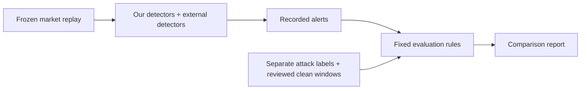

# Design idea: fair comparison of our own and external detectors

Date: 2026-10-07. Status: proposed design idea; documentation only.

Roadmap: [Epic #93](https://github.com/khab40/lob-arena/issues/93) →
[Feature #88: Pluggable detector adapter and test harness](https://github.com/khab40/lob-arena/issues/88),
in [GitHub Project #3](https://github.com/users/khab40/projects/3).
Related research: [Transformer Story #24](https://github.com/khab40/lob-arena/issues/24)
and [Transformer → LightGBM Story #25](https://github.com/khab40/lob-arena/issues/25).

We do not yet know that our detector is better than third-party detectors.
Our models must earn that result through the same test as everyone else.
LOB Arena can still provide valuable testing when a customer's detector beats ours.

The reference is independent ground truth: what attack was injected, when it
happened, and which market windows were independently reviewed as clean.
Agreement with LightGBM or Transformer does not determine whether another
detector is correct.

## Planned comparison

1. **Prepare a credible test set.** Replay market data with controlled attacks,
   including difficult variations and legitimate behaviour that resembles abuse.
   Historical data without reviewed labels stays unknown; we cannot automatically
   count every alert there as a false positive. This distinction is already
   specified in the [governed benchmark protocol](data/governed-corpus-benchmark-protocol.md).

2. **Connect each detector through an adapter.** An external detector could run
   through an API, container or batch scorer. Each receives the same permitted
   market information, with labels and future events withheld. Normalize its
   alerts, timestamps, evidence and failures. The generic adapter and conformance
   harness are planned under [Feature #88](https://github.com/khab40/lob-arena/issues/88);
   they are not yet a complete customer integration capability. That commercial
   feature is parked until [Story #91](https://github.com/khab40/lob-arena/issues/91) exits.

3. **Freeze the comparison before testing.** Configure models and thresholds
   using development data, then lock them before opening the test set. Keep all
   variants of the same underlying market session together. Declare the detector's
   intended scope: a spoofing detector should be evaluated against spoofing
   requirements.

4. **Measure useful outcomes.** Compare attack recall at the same false-alert
   budget, detection delay, duplicate alerts, performance by attack family,
   reliability and operating cost. Report uncertainty across independent market
   sessions. F1 alone cannot answer whether a detector is better for an analyst's
   workload. Use the same frozen evaluation population and alert-matching policy;
   missing or invalid detector outputs must be reported explicitly.

## What would justify calling a detector better

For example, illustratively, detecting 90 of 100 attacks versus 70 of 100, while
both meet the same false-alert and latency limits, would support a superiority
claim for that tested scope. These numbers are an example, not measured results.
A small difference with wide uncertainty should remain inconclusive.

The claim needs a predeclared use case, operating constraints and a practically
meaningful improvement supported by paired evaluation across independent source
sessions. There is no automatic winner based on architecture: test LightGBM,
Transformer and their combination separately. A combination must demonstrate
added value beyond both standalone models, including its additional cost and
latency.

Because we develop both the scenarios and our models, we also need independent
scenario review and a hidden test set to reduce bias toward patterns our models
learned. Independent assessment is recommended by
[NIST's AI Risk Management Framework](https://airc.nist.gov/airmf-resources/airmf/5-sec-core/).
Keep benchmark labels separate from detector outputs and retain disappointing
results, including cases where the external detector wins.

## Current evidence and limits

Status snapshot: 7 October 2026. These are research findings and pending work,
not customer-grade superiority claims.

- **LightGBM:** a qualified research baseline; no demonstrated superiority over
  commercial detectors. See the [signed G9 research exit](operations/g8/g9-closure-20260927.md).
- **Transformer:** a strong development comparison against LightGBM, but those
  comparison rows also helped select thresholds. See the
  [development comparison and limitations](ml/transformer-week-plan-20261004.md).
  As of 7 October, the later-date holdout result is still pending under
  [Story #24](https://github.com/khab40/lob-arena/issues/24).
- **Combination:** proposed under [Story #25](https://github.com/khab40/lob-arena/issues/25).
  It must demonstrate added value beyond both standalone models. See the
  [proposed cascade design](architecture/ARD-0037-transformer-to-lightgbm-cascade.md).

The [December holdout protocol](ml/transformer-holdout-protocol-20261005.md)
uses data excluded from Transformer development, but already evaluated by
LightGBM. It is a holdout for the fixed Transformer, not a globally blind
benchmark. Its labels remain synthetic attacks and unadjudicated research
controls; one date cannot establish market-wide generalization.

For a customer-grade superiority claim, we still need broader unseen sessions
and independently reviewed labels. Existing synthetic research results cannot
establish that claim. The value of LOB Arena is reproducible evidence about
detector strengths, weaknesses and release changes, regardless of which detector
wins the comparison.

Saving this design idea does not authorize implementation, model workloads,
final-test access or promotion. Later implementation and execution retain the
existing roadmap, independent-review and operator approval gates.
