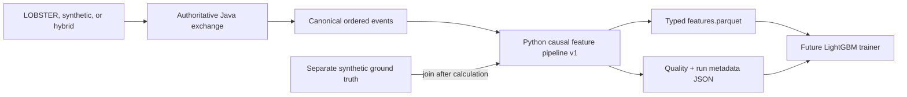

# Causal Feature Engineering for a Future LightGBM Detector

## Scope

LOB Arena produces a versioned, model-ready feature table from the canonical
exchange events emitted by the authoritative Java runtime. The pipeline supports
the same contract for:

- a normalized LOBSTER historical replay;
- a fully synthetic run; and
- a LOBSTER replay with a synthetic scenario injected through the existing
  Arena workflow.

This layer does **not** train or serve LightGBM. It establishes the deterministic
data contract and the fail-closed governed loader a future trainer must consume.

## Architecture



Java remains the source of exchange truth. The Python layer consumes its
canonical `add`, `modify`, `cancel`, `execute`, and L2 `snapshot` records and
emits one feature row at each simulation-source combined-book checkpoint. It
validates immutable historical-source snapshots but does not use their
source-only books as prediction rows or reconstruct another matching engine.

Historical and synthetic records are normalized by their canonical event
meaning, not their origin. Source, scenario, owner, participant, and synthetic
order-ID fields are unavailable to feature formulas. External scenario labels
are joined only after all numeric features for a row have been calculated.

## Causal clock and ordering

The prediction timestamp is the snapshot's `exchange_timestamp_ns`. A
synthetic-only event without that field uses:

```text
effective_timestamp_ns = tick * run_metadata.tick_interval_ns
```

Input must be the complete canonical stream starting at sequence 1. Sequences
must remain contiguous, event IDs must be unique, and effective timestamps and
ticks may not regress. Equal timestamps retain canonical Java sequence order. A
combined checkpoint row therefore sees only earlier canonical records and the
current checkpoint; later records with the same timestamp are not visible.
Window membership is:

```text
prediction_timestamp - window_ns < event_timestamp <= prediction_timestamp
```

The implementation is single-pass and never buffers a future event. Tests
generate a prefix alone and as part of a longer stream and require every prefix
row to be byte-for-value identical.

## Configuration

The checked-in configuration is
[`configs/features/lightgbm-v1.json`](../configs/features/lightgbm-v1.json).
Its canonical sorted JSON SHA-256 is stored as `feature_config_hash` in every
row and in the Parquet schema metadata.

| Setting | Meaning |
| --- | --- |
| `schema_version` | Feature contract; currently `lob_features_v1` |
| `short_window_ns` | Near-horizon event and snapshot window |
| `long_window_ns` | Context, comparison, and z-score window |
| `depth_levels` | Maximum levels per side used for depth features |
| `zscore_min_periods` | Minimum observations before a rolling z-score |
| `rapid_cancel_ns` | Maximum add-to-cancel time for a rapid cancel |
| `replenishment_ns` | Cancel-to-same-price-add replenishment horizon |
| `burst_gap_ns` | Maximum gap between messages counted as a burst |
| `large_order_quantity` | Source-normalized quantity threshold |
| `wall_size_multiple` | Level-size multiple of the visible-depth median |
| `layering_min_levels` | Same-side wall count that saturates layering score |
| `fail_on_invalid_rows` | Make the CLI return status 2 after writing diagnostics |

The rapid-cancel, replenishment, and burst horizons cannot exceed the long
window. Price and quantity units come from run metadata; they must match the
normalization used by Java.

## Feature formulas

Let `B1`, `A1` be the best bid/ask, `QB1`, `QA1` their quantities, `Dbid` and
`Dask` the top-N depth, and `m` the mid-price.

| Group | Features and definitions |
| --- | --- |
| Price | `spread = A1-B1`; `spread_bps = spread/m*10000`; `mid_price = (A1+B1)/2`; `microprice = (A1*QB1+B1*QA1)/(QB1+QA1)`; microprice deviation in basis points; one-step log return; summed short/long log returns |
| Depth | Top-N bid, ask and total depth; L1 depth; visible level count; `depth_imbalance=(Dbid-Dask)/(Dbid+Dask)`; L1 queue imbalance |
| Flow | Message/add/cancel/trade counts divided by window seconds; cancel/add, cancel/trade and trade/add ratios; signed quantity flow and cancel/add quantity ratio; add/cancel/trade volumes |
| Lifecycle | Mean observed terminal order lifetime; mean cancel lifetime; rapid-cancel share |
| Large orders | Rate and add-volume share above `large_order_quantity` |
| Walls/layering | Levels at least `wall_size_multiple` times median visible level size; largest-level share; bid/ask wall imbalance; bounded same-side layering score |
| Replenishment | Share of adds/modification increases following a same-side, same-price cancel within `replenishment_ns` |
| Bursts/stuffing | Consecutive-message burst share; short/long message-rate ratio; bounded composite of cancel/add ratio, rapid cancels, rate acceleration, and bursts |
| Regime | Short/long realized volatility from causal log returns; volatility ratio; visible depth/spread liquidity; Amihud-style absolute return per traded volume; liquidity z-score |
| Horizon change | Short-minus-long spread/imbalance means; relative short-versus-long depth; signed flow-rate change |
| Rolling z-scores | Current spread, depth, imbalance, short message rate, return, and liquidity against the causal long window |

Division by zero yields null, not infinity. Warm-up rows can have legitimate
null values. Non-finite values, invalid/crossed books, out-of-order sides, and
tick/lot misalignment are reported through `row_valid` and `invalid_reason`.

The authoritative ordered feature list is `FEATURE_COLUMNS` in
[`backend/app/features/pipeline.py`](../backend/app/features/pipeline.py).
Changing a name, order, type, or formula requires a new schema version.

## Output contract

Each run directory contains:

| File | Contract |
| --- | --- |
| `features.parquet` | Zstandard-compressed Arrow table with stable metadata, label, and float64 feature columns |
| `run-metadata.json` | Version/config/input hashes, run identity, schema/column inventory, output hashes, row counts, and split policy |
| `feature-quality.json` | Missing counts, min/max/mean/stddev/p01/p50/p99 distributions, class balance, attack-family counts, and up to 100 invalid-row diagnostics |

The writer uses a per-output-directory lock and unique staging files so two
processes cannot interleave one artifact bundle. A lock left by an interrupted
process must be investigated and removed before retrying that exact directory.

Typed row metadata includes feature schema/config versions, run and dataset
identities, source type, instrument, venue, session/date, nullable seed,
prediction timestamp, tick, canonical sequence, and `split_group`. Ground truth
fields are nullable `attack_family`, `attack_phase`, `label`, and
`label_source`.

No labels file means labels remain null. In particular, historical records are
never automatically assigned label 0. Governed negative labels use explicit,
half-open `feature_labels_v2` windows with
`label_source=independently_verified_clean`; session-wide default negatives are
rejected by the governed adapter. Version 1 positive-label inputs remain
readable for compatibility. The adapter accepts `feature_labels_v1` or
`feature_labels_v2`, a replay summary containing
`ground_truth`, or the native multi-line
`outputs/labels/scenario_labels.jsonl` contract.

Every run records the label-schema version, canonical label-specification hash,
and window count independently of the canonical event hash. Label assignment
is performed only after causal features are calculated, so labels and review
metadata cannot enter feature formulas.

## Running

Generate the checked-in fixture:

```bash
make generate-features FEATURE_OVERWRITE=1
```

Generate with bounded-memory event iteration and Parquet row groups:

```bash
make generate-features-streaming FEATURE_OVERWRITE=1
```

Benchmark event throughput, feature-row throughput, peak Python allocation,
process RSS, output size, and logical row determinism:

```bash
make benchmark-feature-streaming FEATURE_OVERWRITE=1
```

The streaming writer retains active-order/rolling-window state, one configured
Parquet row group, exact online counts and moments, and a bounded deterministic
priority sample for quality-report quantiles. `logical_feature_rows_sha256`
must remain identical across row-group sizes even when physical Parquet bytes
differ.

Equivalent direct command:

```bash
backend/.venv/bin/python scripts/generate_features.py \
  --events data/features/fixture/events.jsonl \
  --metadata data/features/fixture/run-metadata.json \
  --labels data/features/fixture/labels.json \
  --config configs/features/lightgbm-v1.json \
  --output outputs/features/sample \
  --overwrite
```

Generate governed features whose reviewed clean windows become explicit
negative rows:

```bash
backend/.venv/bin/python scripts/generate_features.py \
  --replay-manifest /secure/corpus/session/replay-manifest.json \
  --clean-adjudications /secure/corpus/adjudications.jsonl \
  --corpus-manifest outputs/governed/client-corpus-v1/corpus-manifest.json \
  --benchmark-protocol configs/benchmark/governed-benchmark-v1.json \
  --artifact-root /secure/corpus/artifacts \
  --output outputs/features/client-session
```

This path performs local SHA-256 verification of corpus artifacts and review
evidence, binds the replay to its registered base session/campaign, and then
exports only replay-appropriate negatives. Historical controls receive
original verified-clean windows. Hybrid runs receive only windows explicitly
transferred after exact-equivalence validation. Synthetic runs receive no
historical negatives. All unreviewed, candidate, ambiguous, excluded, and
out-of-window rows remain null.

To consume the current Java replay directly:

```bash
backend/.venv/bin/python scripts/generate_features.py \
  --events-url http://localhost:8081/api/arena/exchange-events \
  --metadata path/to/run-metadata.json \
  --labels path/to/separate-ground-truth.json \
  --output outputs/features/client-run
```

The endpoint reader follows the bounded cursor until `has_more` is false.
For durable production runs, archive the canonical JSONL beside the generated
artifacts so the recorded input digest can be reproduced independently.

## Governed Phase 1 loader

Install the isolated ML dependency set for training jobs:

```bash
uv sync --project backend --dev --extra ml --frozen
```

On macOS, install the OpenMP runtime required by the native LightGBM wheel
before importing it:

```bash
brew install libomp
```

`load_governed_feature_dataset` accepts a protocol, locally validated corpus,
frozen split, feature configuration, artifact root, and the complete feature
run inventory for the selected access mode. It recomputes bindings and hashes,
verifies every Parquet identity and label source, rejects incomplete
session/campaign coverage, and yields only supervised rows.

`development` access returns train and validation. `final_test` returns only
test. No API mode loads all folds together. Null historical labels remain in
the immutable Parquet source and are never converted into negatives.

Run the Phase 0 and Phase 1 contract suite with:

```bash
make lightgbm-phase1-test
```

See [ARD-0028](architecture/ARD-0028-governed-lightgbm-feature-loading.md).

## Leakage-safe training rules

A future trainer must:

1. Require one supported `feature_schema_version` and
   `feature_config_hash` per training job.
2. Use exactly the ordered feature columns recorded in run metadata.
3. Exclude all metadata and label columns from the LightGBM feature matrix.
4. Split by `split_group`, which binds instrument, venue, session, and session
   date. It deliberately excludes run/dataset IDs so duplicate imports of one
   market session cannot leak across folds. Never randomly split adjacent rows.
5. Use chronological, session-grouped train/validation/test folds and purge at
   least `long_window_ns` around fold boundaries.
6. Fit imputers, clipping limits, categorical encoders, and class weights on
   the training fold only.
7. Reject invalid rows deliberately and record the rejection policy; do not
   silently turn null labels into negatives.
8. Report metrics by complete held-out sessions and attack family, not shuffled
   windows.

The future trainer should fail closed when schema/config hashes differ unless an
explicit migration has converted every input to one contract.

## Hybrid consistency

Automated tests compare a historical control and a hybrid stream at each tick:

- features are identical before injection;
- flow, lifecycle, wall, layering, and burst features may differ only after a
  synthetic event becomes causally visible;
- all historical event IDs remain present;
- after the attack and the full long window have expired, every feature is
  exactly equal to control again;
- changing source metadata alone does not change feature values; and
- misaligned price/quantity units fail row validation.

These feature-level checks complement, rather than replace, the signed
[hybrid dataset validation](hybrid-dataset-validation.md) for event/book
integrity and statistical equivalence.

## Limitations and next steps

- Rows are emitted at combined L2 checkpoints, not at every mutation or
  immutable historical-source snapshot. A later schema could add
  decision-event sampling without changing Java authority.
- LOBSTER visible depth cannot recover undisclosed participant identity or
  queue priority.
- Thresholds are configuration values, not calibrated production surveillance
  policies.
- Lifetime features include only orders whose observed lifecycle begins in the
  selected window; pre-window order ages are unknown.
- The current artifact writer is local-filesystem based. Remote object-store
  publication should reuse the existing evidence-bundle transport.
- The next LightGBM phase should add binary training, training-only class
  weighting/preprocessing, validation early stopping, probability calibration,
  frozen operating points, explanations, and model-card/evidence artifacts on
  top of the governed Phase 1 loader.

## Related documentation

- [ARD-0024: Versioned causal market-abuse features](architecture/ARD-0024-versioned-causal-feature-engineering.md)
- [Canonical exchange event stream](exchange-event-stream.md)
- [Determinism contract](determinism-contract-v1.md)
- [Historical and hybrid replay](architecture/ARD-0023-hybrid-historical-replay.md)
- [Client historical-data validation runbook](client-historical-dataset-validation-runbook.md)
