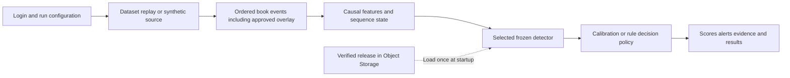

# Frozen detector release and CEO demo flow

Design recorded 4 October; scope reconciled 8 October 2026.
[Current status](roadmap/CURRENT_STATUS.md) owns remaining acceptance;
[research disposition](ml/transformer-research-disposition-20261008.md) owns the
approved continuation. This is design, not serving completion or run/access approval.

Tracking: [backend #90](https://github.com/khab40/lob-arena/issues/90),
[demo #91](https://github.com/khab40/lob-arena/issues/91),
[LightGBM #23](https://github.com/khab40/lob-arena/issues/23),
[Transformer #24](https://github.com/khab40/lob-arena/issues/24),
[conditional cascade #25](https://github.com/khab40/lob-arena/issues/25),
[Bug #357](https://github.com/khab40/lob-arena/issues/357),
[Project #3](https://github.com/users/khab40/projects/3).

## 1. The first working demo

As an authorized reviewer,
I want to play back verified saved detector scores with clear source and threshold identity,
So that I can inspect the research evidence before funding event-inference integration.

The immediate #90/#91 mock authenticates version/size/hash receipts from an
explicitly configured, allowlisted private campaign. It offers Transformer/
LightGBM selection, source identity, ordered score/alert playback, pause/resume/
speed and frozen threshold provenance. Label it **saved research predictions**:
it replays scores, not an order book or newly inferred market events. Public
aggregate reports cannot substitute for private rows. Use opaque IDs and local-only
access, separate from generic artifact serving; exclude row payloads from Git,
frontend fixtures and website assets. Reject corrupt evidence/unavailable detectors.
This needs no model execution and does not complete full #90/#91 acceptance.

### Guided user journey

The later event-to-alert journey below is proposed integration. It requires a
verified runnable release, causal feature parity, bounded rehearsal and separately
assessed authentication. It is not the first saved-score mock's acceptance scope.

1. Authenticate an authorized workspace; backend APIs enforce dataset/run/result
   access. Explicit local identity cannot provide shared sensitive-data fallback.
2. Select an approved Nasdaq/LOBSTER source, instrument and time window, or a
   versioned synthetic profile/seed; display provenance, validation and restrictions.
3. Select supported wall/layering/stuffing parameters or no added attacks. Apply
   identified synthetic overlay before features; freeze source/scenario/seed.
4. Select a verified detector/operating mode; unavailable choices show readiness.
   Pin weights/calibration/thresholds per run. Start shows warm-up, lag and failures.
5. Present event-cutoff scores, alerts, evidence and runtime measures. Report
   quality/delay only with supported labels; unchanged new history is unlabeled.

C4 controls are assumed research negatives; synthetic labels stay outside inputs.
Historical participants do not react to overlays; equal-time historical events
precede overlays. Wall quantity/duration/distance, layering levels/increments and
stuffing burst/distance parameters follow the versioned schema. Liquidity
evaporation is outside the learned models' three-family calibrated coverage.
See [replay behavior](data/replay-quickstart.md).

## 2. What the frozen release contains

The release binds the entire inference dependency set. Its expected manifest hash
comes from the approved deployment configuration; artifact checks use that identity.
Store exact files and object versions durably in governed Object Storage. Download
and verify them at startup, cache them read-only and load the active scorer into
memory. MLflow indexes the same release later and is outside per-event scoring.
Changing weights, calibration, thresholds or runtime policy creates a new release
identity; it does not modify an existing frozen release.

| Part | Saved content | Purpose |
| --- | --- | --- |
| Release manifest | Schema/release identity, component hashes and object versions, source runs, code commit, runtime image digest and evidence references | Bind one reproducible detector configuration |
| Feature contract | Ordered columns, units/dtypes, missing-value rules, rolling windows, checkpoint cadence and causal event cutoff | Reproduce training-time inputs |
| Runtime policy | Selected backend/mode, batching and queue bounds, warm-up/gap/reset policy, maximum feature age and alert consolidation rules | Define operational behavior |
| LightGBM artifacts | `model.txt`, training manifest, ordered feature schema, calibration manifest, optional fitted preprocessing and complete existing release evidence | Recover the trained trees and calibrated decision |
| Transformer weights | Selected checkpoint's `model.state_dict()`, including learned parameters and registered buffers | Recover the exact selected NN |
| Transformer architecture | Model-definition version, selected width, dimensions, sequence length and compatible runtime | Reconstruct the matching NN before loading weights |
| Transformer normalization | Frozen training means, scales, observed counts and fitting lineage | Reproduce numerical preprocessing |
| Transformer calibration | Fitted temperature, calibration lineage and selected operating thresholds | Convert logits into calibrated scores and decisions |
| Deterministic configuration | Rule implementation version, parameters and decision/aggregation policy | Reproduce rule decisions; heuristic scores retain their own semantics |
| Combined configuration | Exact producer and downstream-model identities, temporal-feature/join contract, development-fitted calibration, frozen thresholds and fallback release | Define a separately verified combined family |
| Verification evidence | Selection/freeze receipts, artifact inventory, parity results, measured resources and intended-use limitations | Explain why the release is eligible for its declared use |

Only selected components and any declared fallback are required by a deployment.
The proposed logical layout is:

```text
detector-release.json
feature-contract.json
runtime-policy.json
lightgbm/       # complete existing governed release with its root-relative paths
transformer/   # weights.pt, architecture.json, normalization.json,
               # calibration.json, operating-points.json
deterministic/ # versioned rule configuration when selected
combined/      # separate downstream model and producer/join policy when verified
evidence/      # inventories, receipts and verification references
```

These serving filenames are a proposed layout. The current LightGBM loader verifies
the complete governed release, including prediction/evidence dependencies. Preserve
that structure for the first demo. A smaller serving export needs a new verified
contract. Transformer serving export/loading and the common stream wrapper remain
integration work. See [existing serving boundary](use-cases/ml-model-serving.md).

## 3. How training, calibration and selection produce the release

The shared corpus binds source/replay/split/feature/row identities. Public ITCH
AAPL/MSFT/NVDA 10:00–10:30 Eastern sessions use January/March training, October
development and December evaluation. Variants stay with base sessions; causal
60-feature inputs include 2/10-second history and labels attach afterward.
Limited dates/synthetic labels constrain claims; LOBSTER robustness is separate,
without retuning. See [data preparation](use-cases/ml-data-preparation.md).

| Detector | Verified research state | Required integration binding |
| --- | --- | --- |
| LightGBM | Frozen 31-feature CPU booster, isotonic calibration, three thresholds; signed research baseline | Preserve complete governed loader/release dependencies and root-relative paths. [Training](use-cases/ml-training-selection.md), [G9](operations/g8/g9-closure-20260927.md). |
| Transformer | Width 128 / rate 0.0003 / seed 42 / epoch 4; train-only normalization, causal 64 retained rows ×60 features, 120 channels with missingness, frozen C temperature/O thresholds; holdout verified | Dedicated export/loader binds exact selected state, architecture, normalization/calibration/thresholds. Strict loading, `eval()` and `torch.inference_mode()`; optimizer/RNG remain training evidence. [ARD-0036](architecture/ARD-0036-market-sequence-transformer.md), [settings](ml/transformer-settings-release.md). |
| Combined | Conditional #25, no verified combined runtime | NEW LightGBM with exact producer joins, leakage-safe downstream training, own calibration/thresholds and verified fallback; never append columns to frozen v1. [ARD-0037](architecture/ARD-0037-transformer-to-lightgbm-cascade.md). |
| Deterministic | Versioned rules and decision policy | Present rule scores with their existing semantics, not calibrated probabilities without separate verification. |

Research settings/reference acceptance does not complete a serving release.
Live retained-row sampling, ties, warm-up/gap/reset, bounded queues and incident
consolidation remain [pending design decisions](architecture/ARD-0036-market-sequence-transformer.md#pending-live-integration-decisions).
[Immutable training narrative](https://github.com/khab40/lob-arena/blob/d896efe8ca501c1ef8e6c63442f3433948a6405e/docs/frozen-detector-release-and-demo-flow.md#3-how-training-calibration-and-selection-produce-the-release)
retains algorithm walkthroughs; the linked owning contracts avoid duplicate detail.

## 4. Frozen artifacts versus changing feature state

The following event-inference state and checkpoints are proposed later scope.

Model artifacts and fitting statistics are immutable. Runtime market state changes
as events arrive. Start each independent run with new state; share loaded read-only
models while isolating state by stream, session, instrument and replay scenario.

| Frozen in the release | Changes during a run |
| --- | --- |
| Trees or NN weights, feature order and normalizer | Current order book and rolling feature accumulators |
| Calibration parameters and operating thresholds | Recent retained feature rows, validity and missingness masks |
| Feature/scoring cadence and reset policy | Last processed sequence/event cutoff and source offset |
| Rule/alert-consolidation policy | Alert-consolidation state and emitted result identities |

Use source event time for feature windows; replay speed changes delivery pacing.
Match the training checkpoint cadence and cutoff semantics. Declare warm-up and
gap handling. Invalid/stale input produces an unavailable state instead of a clean
negative decision. Combined fallback records which release actually scored the row.

For resumable replay, a separate run checkpoint records source manifest/offset,
last event cutoff, detector-release hash, compatible book/feature history or the
rebuild position, sequence buffer, attack-generator state and emitted-result cursor.
Resume only after identity checks and replay-state reconstruction; deduplicate by
run, target row and release identity. Runtime checkpoints are proposed integration,
not learned weights or normalization fitting. Preserve exact overlay state/seed so
resume cannot generate a different attack scenario.

## 5. Startup, detection and results



Keep book mutation in the existing Java boundary. Feed a bounded asynchronous
consumer that computes derived state and invokes the Python learned scorer. It
must not block the market loop. Verify the release before readiness and check
known input/output examples. Pin one release per run; a later release applies to
a new run or an explicitly audited transition. Online and replay paths reuse the
same feature/scoring core. Live-feed adapters and their measured serving budgets
remain later integration scope.

Each result retains run/source/overlay identity, symbol/session, target row and
event cutoff, release/model/calibration identities, raw/calibrated score where
applicable, threshold, decision, timing and fallback/unavailable reason. Results
also retain the alert-consolidation policy because row alerts and incidents have
different counts. Measure throughput, queue lag and event-to-alert latency with
the replay speed and execution conditions attached.

A later model-scoring rehearsal uses a bounded Nebius Serverless Job under the
repository execution policy, with explicit resources, timeout, Job count and spend
disposition. Durable artifacts survive tracking outages; reconcile MLflow without
retraining. Shared sensitive-data deployment retains authentication/authorization.

## 6. Observable acceptance for implementation

```gherkin
Feature: Frozen detector demo
  Scenario: Play back verified saved scores
    Given an allowlisted private campaign with verified version, size and hash receipts
    When a local reviewer selects a detector and changes playback pacing
    Then ordered saved scores and frozen threshold decisions remain unchanged
    And the display identifies saved research predictions and their source

  Scenario: Deny unauthorized data access
    Given a reviewer has no authorized workspace session
    When the reviewer requests a dataset or detection run
    Then the backend denies access before exposing data or starting model work

  Scenario: Run an authorized scenario
    Given an authorized dataset or synthetic profile and bounded attack configuration
    And a verified runnable detector release
    When the reviewer starts detection
    Then results identify the source configuration and exact detector release
    And scores and alerts trace to their event cutoffs

  Scenario: Preserve the release on different replay speeds
    Given identical ordered events and a frozen detector release
    When replay pacing changes within supported processing bounds
    Then feature checkpoints and decisions match within declared numerical tolerances

  Scenario: Resume a saved replay
    Given a compatible run checkpoint and unchanged source and release identities
    When the replay resumes
    Then feature and attack state are restored or reconstructed
    And previously emitted results are not duplicated

  Scenario: Reject an invalid release or input
    Given a changed artifact hash or incompatible feature contract
    When the detector prepares to score
    Then scoring is unavailable and the reason is visible

  Scenario: Select an unfinished detector
    Given a detector option lacks verified runtime or calibration evidence
    When the reviewer opens detector selection
    Then that option shows its readiness reason and cannot start a run

  Scenario: Present results without ground truth
    Given a historical replay without independently supported attack labels
    When results are presented
    Then alerts and runtime evidence are visible
    And precision and recall are marked unavailable for that replay
```

Verification requires export/load score parity, offline/stream feature parity at
identical cutoffs, warm-up/session-reset/gap handling, bounded performance evidence
and result readback. These are implementation acceptance requirements; this saved
design document does not claim those scenarios have passed.
