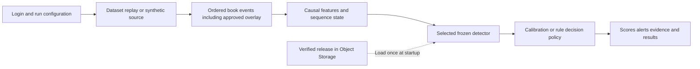

# Frozen detector release and CEO demo flow

Design recorded 4 October; scope reconciled 8 October 2026.
[Current status](roadmap/CURRENT_STATUS.md) owns remaining acceptance;
[research disposition](ml/transformer-research-disposition-20261008.md) owns the
approved continuation. This is design, not serving completion or run/access approval.

Tracking: [Project #3](https://github.com/users/khab40/projects/3),
[backend and evidence #90](https://github.com/khab40/lob-arena/issues/90),
[secure CEO demo #91](https://github.com/khab40/lob-arena/issues/91).
Model evidence belongs to [LightGBM #23](https://github.com/khab40/lob-arena/issues/23),
[Transformer #24](https://github.com/khab40/lob-arena/issues/24) and the conditional
[combined detector #25](https://github.com/khab40/lob-arena/issues/25).

## 1. The first working demo

As a CEO or customer reviewer,
I want to run a selected detector against a reproducible market scenario,
So that I can see arriving events become alerts and decide which pilot to fund.

Actor: authorized reviewer, with an operator preparing the release and run bounds.
Goal: one understandable event-to-alert demonstration.
Value: product feedback before broader platform work or further model research.
Verification: a bounded rehearsal, verified release loading, feature/score parity
and result readback. Out of scope: live-feed acquisition, production qualification,
online training and automatic promotion.

The first delivery uses one supported, calibrated learned detector. The design
allows deterministic, LightGBM, Transformer and combined choices as their runtime
and evidence become available. An unavailable option shows its readiness reason.
The first demo does not depend on completing all four options. Full #90/#91
acceptance remains separately tracked; this smaller delivery does not close them.

### Guided user journey

1. **Log in.** Authenticate and enter an authorized workspace. Backend APIs enforce
   access to datasets, runs and results. A local demo mode has an explicit identity;
   it cannot provide fallback access to a shared sensitive-data deployment.
2. **Ingest a dataset or select Synthetic.** For Nasdaq ITCH or LOBSTER, choose an
   approved source/session, instrument and bounded event-time window. Show source
   provenance, validation status and use restrictions. For Synthetic, choose a
   versioned scenario profile and seed. Start becomes available after preparation.
3. **Configure attacks or choose Without attacks.** Select supported spoofing-like
   walls, layering or quote stuffing through the scenario's versioned schema.
   Parameters include applicable side, size, level distance, start time, duration,
   activity/cancellation rate and seed. The UI exposes only parameters supported
   by that attack implementation. Ingested data can run unchanged or with a clearly
   identified synthetic overlay. Apply overlay events before feature calculation.
4. **Select the detector.** Choose a runnable deterministic, LightGBM, Transformer
   or combined release and its verified operating mode. Show the release identity
   and readiness. Weights, calibration and thresholds are fixed for the run.
5. **Start detection.** Freeze the run configuration and source/release identities.
   Show progress, warm-up, scores, alerts, processing lag and actionable failures.
   Replay supports pacing, pause and resume within the declared run bounds.
6. **Present results.** Show the event timeline, alerts and supporting evidence,
   selected detector, source/attack configuration, thresholds and runtime measures.
   Where supported ground truth exists, show precision, recall, F1 and the confusion
   matrix. Include per-family results and delay only when the labels and event
   evidence support those measures. Provide a compact management summary/export.

In the frozen C4 research corpus, historical controls are assumed research negatives;
newly ingested history remains unlabeled unless independently adjudicated.
Without attacks means no added synthetic attacks. Synthetic labels remain
outside detector inputs. Historical participants do not react to a synthetic overlay.
Equal-timestamp historical events precede the overlay under the existing replay
ordering rule. The current wall schema includes `quantity_lots`, `duration_ticks`
and `distance_levels`; layering includes level range and quantity increments;
quote stuffing includes burst rate and start distance. Liquidity evaporation exists
in the simulator but is outside these models' three-family calibrated research
coverage. See [replay behavior](data/replay-quickstart.md).

## 2. What the frozen release contains

The release binds the entire inference dependency set. Its expected manifest hash
comes from the approved deployment configuration; artifact checks use that identity.
Store exact files and object versions durably in governed Object Storage. Download
and verify them at startup, cache them read-only and load the active scorer into
memory. MLflow indexes the same release later and is outside per-event scoring.
Changing weights, calibration, thresholds or runtime policy creates a new release
identity; it does not modify an existing frozen release.

| Part | Saved content | Purpose |
| --- | --- | --- |
| Release manifest | Schema/release identity, component hashes and object versions, source runs, code commit, runtime image digest and evidence references | Bind one reproducible detector configuration |
| Feature contract | Ordered columns, units/dtypes, missing-value rules, rolling windows, checkpoint cadence and causal event cutoff | Reproduce training-time inputs |
| Runtime policy | Selected backend/mode, batching and queue bounds, warm-up/gap/reset policy, maximum feature age and alert consolidation rules | Define operational behavior |
| LightGBM artifacts | `model.txt`, training manifest, ordered feature schema, calibration manifest, optional fitted preprocessing and complete existing release evidence | Recover the trained trees and calibrated decision |
| Transformer weights | Selected checkpoint's `model.state_dict()`, including learned parameters and registered buffers | Recover the exact selected NN |
| Transformer architecture | Model-definition version, selected width, dimensions, sequence length and compatible runtime | Reconstruct the matching NN before loading weights |
| Transformer normalization | Frozen training means, scales, observed counts and fitting lineage | Reproduce numerical preprocessing |
| Transformer calibration | Fitted temperature, calibration lineage and selected operating thresholds | Convert logits into calibrated scores and decisions |
| Deterministic configuration | Rule implementation version, parameters and decision/aggregation policy | Reproduce rule decisions; heuristic scores retain their own semantics |
| Combined configuration | Exact producer and downstream-model identities, temporal-feature/join contract, development-fitted calibration, frozen thresholds and fallback release | Define a separately verified combined family |
| Verification evidence | Selection/freeze receipts, artifact inventory, parity results, measured resources and intended-use limitations | Explain why the release is eligible for its declared use |

Only selected components and any declared fallback are required by a deployment.
The proposed logical layout is:

```text
detector-release.json
feature-contract.json
runtime-policy.json
lightgbm/       # complete existing governed release with its root-relative paths
transformer/   # weights.pt, architecture.json, normalization.json,
               # calibration.json, operating-points.json
deterministic/ # versioned rule configuration when selected
combined/      # separate downstream model and producer/join policy when verified
evidence/      # inventories, receipts and verification references
```

These serving filenames are a proposed layout. The current LightGBM loader verifies
the complete governed release, including prediction/evidence dependencies. Preserve
that structure for the first demo. A smaller serving export needs a new verified
contract. Transformer serving export/loading and the common stream wrapper remain
integration work. See [existing serving boundary](use-cases/ml-model-serving.md).

## 3. How training, calibration and selection produce the release

### Shared market data and causal features

The frozen research corpus uses public Nasdaq ITCH for AAPL, MSFT and NVDA in
10:00–10:30 Eastern windows. Train dates are 30 January and 27 March 2019;
30 October 2019 supplies development validation; 30 December 2019 supplied the
completed LightGBM final evaluation. Source sessions and their synthetic variants
stay in the same partition. Any LOBSTER robustness evaluation must be reported
separately without retuning.

Reconstruct the order book, replay ordered events and compute the 60-feature
contract from information available at each cutoff. It includes trailing 2-second
and 10-second windows. Attach labels afterwards. Retain source, replay, split,
feature and row identities. These limited dates and synthetic labels support
research claims; future independent qualification needs an appropriate untouched
evaluation protocol. See [data preparation](use-cases/ml-data-preparation.md).

### LightGBM

1. Train a binary `attack_active` model on CPU using deterministic configuration,
   training-derived class balance and base-session weighting. Select the boosting
   iteration through validation binary log loss and early stopping.
2. The bounded G6 campaign compared four configuration/feature searches, confirmed
   the selected configuration at seeds 7 and 2027 alongside seed 42, and compared
   raw, Platt and isotonic calibration. Retain all nine trial receipts.
3. Configuration ranking used balanced F1, minimum family recall, Brier score, ECE,
   log loss and deterministic tie-breaking. Calibration ranking used Brier, ECE,
   balanced F1 and method-name tie-breaking. The selected `ablate-state` experiment
   excluded 29 state columns, leaving 31 ordered model features from the shared 60.
4. Save the selected booster as `model.txt` with `training-run.json`, best iteration,
   feature order, preprocessing and hashes. LightGBM has no periodic boosting-resume
   checkpoint loop in this implementation; the saved model is the selected booster.
5. Fit the selected isotonic mapping on validation predictions. Save its `x/y`
   knots in `calibration-manifest.json`, together with the operating points. The
   balanced threshold is `0.5769230769230769`, selected by maximum validation F1.
6. Freeze the exact candidate, calibrator and thresholds before the separately
   authorized final evaluation. Signed G9 accepted it as `research_baseline_qualified`.

The runtime calculation is `p = isotonic(raw_probability)` followed by
`alert = p >= frozen_threshold`. The adapter accepts the operating mode evaluated
by the verified release. A different mode requires its corresponding verified evidence.
Wave 1 reused validation for early stopping, selection, calibration and thresholds;
its fitting-row calibration metrics do not prove independent calibration quality.
See [selection procedure](use-cases/ml-training-selection.md) and
[final results](operations/g8/g8-final-results-20260923.md). The signed disposition
is retained in [G9 closure](operations/g8/g9-closure-20260927.md); older Transformer
planning sections in the selection guide are superseded by the current source below.

### Transformer

1. Use causal sequences of up to 64 retained feature rows, each with 60 ordered
   numeric features. These are feature rows, not 64 raw messages or 64 seconds.
   Left padding has a validity mask; observed missing features have a separate mask.
2. Fit normalization only on unique training rows, saving 60 means/scales and
   observed counts with training lineage. Missing normalized values zero-fill;
   the model also receives 60 missingness indicators, producing 120 input values
   per observed step. Padding is excluded by the attention mask.
3. Train the custom causal `SequenceClassifier` with weighted binary-logit loss,
   AdamW, batch 64, up to 30 epochs, patience 5, warm-up/cosine learning-rate policy
   and gradient clipping. Selection, calibration and operating-point roles are
   authenticated separately; no final-test rows enter this development experiment.
4. The four GPU trials compared widths 64/128 and learning rates 0.0003/0.001.
   Checkpoint/configuration selection used raw selection log loss. The selected
   candidate is width 128, learning rate 0.0003, seed 42, epoch 4. Selection-fold
   F1 was descriptive, not the ranking criterion or proof of generalization.
5. Save every completed epoch as immutable `epoch-NN.pt`, containing model state,
   optimizer/RNG, trial/bindings and progress. A versioned publication receipt must
   acknowledge the checksum. Retain the selected epoch's exact reference rather
   than loading the last epoch. Confirmations at seeds 7/2027 verified stability;
   seed 42 remains the candidate, rather than choosing the luckiest seed.
6. The declared calibration stage fits temperature `T` only on calibration role C;
   operating thresholds and frozen-LightGBM comparison use role O. The serving
   formula is `p = sigmoid(logit / T)`, then `alert = p >= selected_threshold`.
   Publish and independently verify those outputs before calling this a calibrated
   runnable release. O also selects thresholds, so its results are development evidence.
7. Export the selected model state, matching architecture, normalization, fitted
   temperature and operating points into one serving release. Optimizer/RNG state
   stays in the training archive. At inference use strict state loading, `eval()`
   and `torch.inference_mode()`.

The grid and seed confirmations are verified. A complete calibrated serving release
must bind the independently verified calibration/comparison receipt; this document
does not establish completion of the concurrent comparison work. Sources:
[grid results](ml/transformer-training-grid-results.md),
[checkpoint code](../backend/app/ml/transformer/research_checkpoint.py),
[normalization](../backend/app/ml/transformer/normalization.py),
[calibration](../backend/app/ml/transformer/research_evaluation.py) and [Story #24](https://github.com/khab40/lob-arena/issues/24).

### Combined and deterministic choices

The planned combination uses Transformer-derived temporal features plus base
features in a newly trained LightGBM model. It requires producer-to-row lineage,
leakage-safe downstream training, its own development-fitted calibration and frozen
thresholds, and a verified
standalone fallback. It cannot add columns to the existing frozen LightGBM booster.
It remains conditional [#25](https://github.com/khab40/lob-arena/issues/25) scope;
see [combined design](architecture/ARD-0037-transformer-to-lightgbm-cascade.md).

Deterministic rules retain versioned parameters and decision policy. Their scores
are presented as rule scores unless a separate probability-calibration procedure
has been implemented and verified.

## 4. Frozen artifacts versus changing feature state

Model artifacts and fitting statistics are immutable. Runtime market state changes
as events arrive. Start each independent run with new state; share loaded read-only
models while isolating state by stream, session, instrument and replay scenario.

| Frozen in the release | Changes during a run |
| --- | --- |
| Trees or NN weights, feature order and normalizer | Current order book and rolling feature accumulators |
| Calibration parameters and operating thresholds | Recent retained feature rows, validity and missingness masks |
| Feature/scoring cadence and reset policy | Last processed sequence/event cutoff and source offset |
| Rule/alert-consolidation policy | Alert-consolidation state and emitted result identities |

Use source event time for feature windows; replay speed changes delivery pacing.
Match the training checkpoint cadence and cutoff semantics. Declare warm-up and
gap handling. Invalid/stale input produces an unavailable state instead of a clean
negative decision. Combined fallback records which release actually scored the row.

For resumable replay, a separate run checkpoint records source manifest/offset,
last event cutoff, detector-release hash, compatible book/feature history or the
rebuild position, sequence buffer, attack-generator state and emitted-result cursor.
Resume only after identity checks and replay-state reconstruction; deduplicate by
run, target row and release identity. Runtime checkpoints are proposed integration,
not learned weights or normalization fitting. Preserve exact overlay state/seed so
resume cannot generate a different attack scenario.

## 5. Startup, detection and results



Keep book mutation in the existing Java boundary. Feed a bounded asynchronous
consumer that computes derived state and invokes the Python learned scorer. It
must not block the market loop. Verify the release before readiness and check
known input/output examples. Pin one release per run; a later release applies to
a new run or an explicitly audited transition. Online and replay paths reuse the
same feature/scoring core. Live-feed adapters and their measured serving budgets
remain later integration scope.

Each result retains run/source/overlay identity, symbol/session, target row and
event cutoff, release/model/calibration identities, raw/calibrated score where
applicable, threshold, decision, timing and fallback/unavailable reason. Results
also retain the alert-consolidation policy because row alerts and incidents have
different counts. Measure throughput, queue lag and event-to-alert latency with
the replay speed and execution conditions attached.

The first model-scoring rehearsal uses a bounded Nebius Serverless Job under the
repository execution policy, with explicit resources, timeout, Job count and spend
disposition. Durable artifacts survive tracking outages; reconcile MLflow without
retraining. Shared sensitive-data deployment retains authentication/authorization.

## 6. Observable acceptance for implementation

```gherkin
Feature: Frozen detector demo
  Scenario: Deny unauthorized data access
    Given a reviewer has no authorized workspace session
    When the reviewer requests a dataset or detection run
    Then the backend denies access before exposing data or starting model work

  Scenario: Run an authorized scenario
    Given an authorized dataset or synthetic profile and bounded attack configuration
    And a verified runnable detector release
    When the reviewer starts detection
    Then results identify the source configuration and exact detector release
    And scores and alerts trace to their event cutoffs

  Scenario: Preserve the release on different replay speeds
    Given identical ordered events and a frozen detector release
    When replay pacing changes within supported processing bounds
    Then feature checkpoints and decisions match within declared numerical tolerances

  Scenario: Resume a saved replay
    Given a compatible run checkpoint and unchanged source and release identities
    When the replay resumes
    Then feature and attack state are restored or reconstructed
    And previously emitted results are not duplicated

  Scenario: Reject an invalid release or input
    Given a changed artifact hash or incompatible feature contract
    When the detector prepares to score
    Then scoring is unavailable and the reason is visible

  Scenario: Select an unfinished detector
    Given a detector option lacks verified runtime or calibration evidence
    When the reviewer opens detector selection
    Then that option shows its readiness reason and cannot start a run

  Scenario: Present results without ground truth
    Given a historical replay without independently supported attack labels
    When results are presented
    Then alerts and runtime evidence are visible
    And precision and recall are marked unavailable for that replay
```

Verification requires export/load score parity, offline/stream feature parity at
identical cutoffs, warm-up/session-reset/gap handling, bounded performance evidence
and result readback. These are implementation acceptance requirements; this saved
design document does not claim those scenarios have passed.
