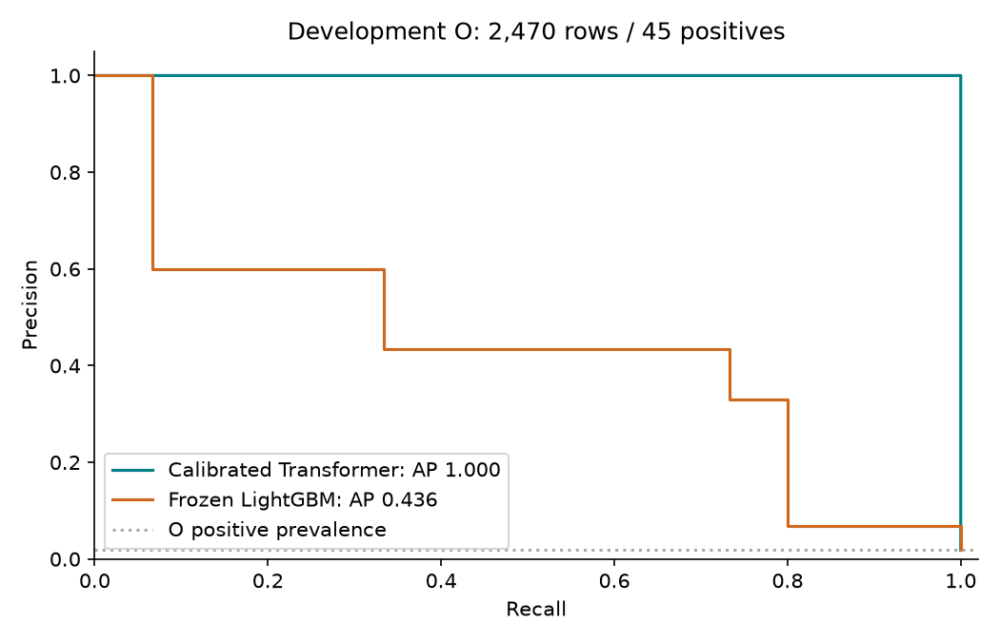
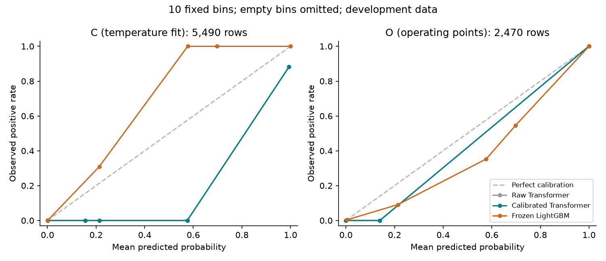
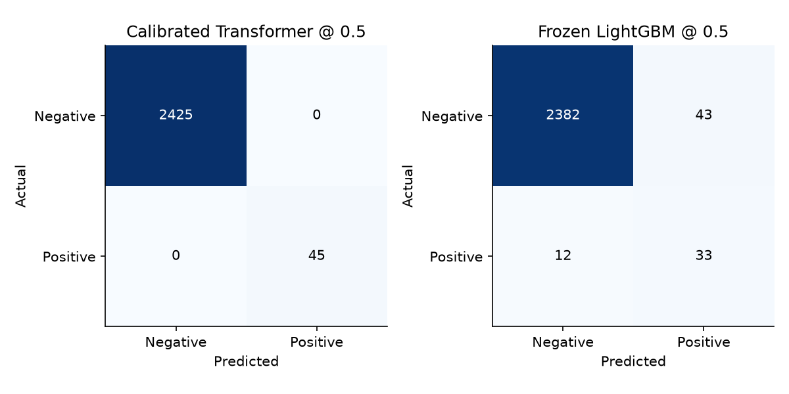
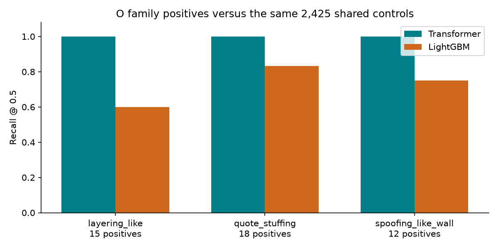

# Transformer versus frozen LightGBM — r2 comparison

Run: 4 October 2026 UTC; reconciled/report generated: 5 October 2026.

[Story #24](https://github.com/khab40/lob-arena/issues/24) · [Project #3](https://github.com/users/khab40/projects/3).

**Recommendation: continue_research. Operator decision remains pending.**
The selected Transformer improves the saved development comparison. This
supports further research; it does not establish generalization, real-world
market-abuse detection quality or production qualification. No candidate was
promoted/frozen, no final data accessed, and no further Job is authorized.

## Candidate and support

- Width 128; learning rate 0.0003; seed 42; epoch 4. No retraining/reselection.
- C: 5,490 rows / 45 positives / 5,445 controls; temperature fitted only on C.
- O: 2,470 rows / 45 positives / 2,425 controls; exact baseline target/label alignment.
- Temperature: 0.998497116725; C objective loss 0.0102560930.
- Three-seed stability passed; calibration/operating-point freeze blockers are false.
- Research labels describe governed scenarios; controls are not independently adjudicated abuse truth.

## Operating-point results

| O measure | Raw Transformer | Calibrated Transformer | Frozen LightGBM |
|---|---:|---:|---:|
| Log loss | 0.0005067767 | 0.0005018954 | 0.0468799751 |
| Average precision (PR area) | 1.0000000000 | 1.0000000000 | 0.4361517679 |
| Precision @ 0.5 | 1.0000000000 | 1.0000000000 | 0.4342105263 |
| Recall @ 0.5 | 1.0000000000 | 1.0000000000 | 0.7333333333 |
| F1 @ 0.5 | 1.0000000000 | 1.0000000000 | 0.5454545455 |
| Brier score | 0.0000100109 | 0.0000099513 | 0.0130624870 |
| ECE (10 bins) | 0.0005013308 | 0.0004964827 | 0.0081605109 |

Delta log loss: **-0.0463780797**; delta average precision: **+0.5638482321**.
Transformer: TP 45 / FP 0 / FN 0 / TN 2,425. LightGBM @ 0.5: TP 33 / FP 43 / FN 12 / TN 2,382.
These are O development results, separate from the frozen LightGBM G8 final result.

## Declared operating points

| Model / mode | Threshold | Precision | Recall | F1 |
|---|---:|---:|---:|---:|
| Transformer / high_precision | 0.996423148188 | 1.000000 | 1.000000 | 1.000000 |
| Transformer / balanced | 0.996423148188 | 1.000000 | 1.000000 | 1.000000 |
| Transformer / high_recall | 0.996423148188 | 1.000000 | 1.000000 | 1.000000 |
| LightGBM / balanced | 0.576923076923 | 0.434211 | 0.733333 | 0.545455 |
| LightGBM / high_precision | 1.000000000000 | 1.000000 | 0.066667 | 0.125000 |
| LightGBM / high_recall | 0.012964563526 | 0.068913 | 1.000000 | 0.128940 |

Transformer modes all select the same threshold on reported O labels.
LightGBM thresholds/calibration are reused unchanged; they were fitted on the whole validation fold.

## Family support

| Family | Positives | Transformer recall @ 0.5 | LightGBM recall @ 0.5 |
|---|---:|---:|---:|
| layering_like | 15 | 1.000000 | 0.600000 |
| quote_stuffing | 18 | 1.000000 | 0.833333 |
| spoofing_like_wall | 12 | 1.000000 | 0.750000 |

Family populations reuse all 2,425 controls; do not sum their confusion totals.

## Runtime, publication and cost

- Provider runtime: **324.59 s**; create-to-terminal: **558.22 s**.
- Worker elapsed/CPU: 322.56 / 324.06 s; peak RSS 2.551 GiB.
- Timed O inference: 2,470 rows in 0.094366 s at batch 64, including host-to-device transfer.
  This is batch throughput, not end-to-end real-time latency. LightGBM latency was not measured.
- 56 observer records; maximum saved gap 10.86 s; signed context delivered. Fresh provider readback is terminal COMPLETED.
- 15 new immutable artifacts; 244 artifacts including all seven prerequisites reverified (285,567,717 bytes).
- $6.25 reservation remains held; prior cancelled comparison $6.25, confirmation $25 and grid $50 remain held.
  Compute/disk time estimate ~$0.24; excludes storage, requests, egress and VAT. Actual billing is unreconciled.
- Configuration, normalization, selected checkpoint origin, predictions, calibration, thresholds and replayable events retained. Online MLflow reconciliation remains pending.

## Independent verification and limitations

Signatures, version-pinned hashes, original checkpoint/feature/normalization
lineage, causal roles, exact row alignment, C bounded optimum without refitting,
O/family arithmetic and all prerequisites passed offline reconciliation.
Original strict readback failed only on a one-ULP raw log-loss reduction.
[Bug #317 repair](../../transformer-comparison-arithmetic-reconciliation.md)
allows at most eight ULPs for named aggregates; counts, thresholds and hashes
remain exact. The original failure is preserved and the corrected verifier bound.
No weights were executed locally; two version-pinned publication metadata reads
recovered the manifest before local reconciliation. No model/calibration rerun.

Limitations: prior development exposure; one date/instrument per role;
operating points selected on the reported O role; scenario/control labels;
metadata-based separation does not establish statistical independence.
Perfect O scores with only 45 positives require a fresh unseen evaluation
protocol and a leakage/robustness review before broader quality claims.

## Lineage and next decision

- Job: `aijob-e00acpmmjmp4rfnrf3`; request SHA-256: `e8f049ee86b32cfb1991b48e94508719e2b11e8b2a61e8d7763fbf69bedad68d`.
- Checkpoint SHA-256: `e2cc94d8e11ad3ad644e52d5283fd958c5458717efd7cfe02ccc30f8f82e6b2b`.
- Reconciliation verification SHA-256: `22f65037c0533cf10d8b4693033b3b80e388bf1e6743692d16140e863e14de98`.
- Original numerical source `87ce8a9`; approved assembly `73984fc`.
- Feature release: `nasdaq-public-sample-v1-c4-5c85182-20260905-features`.
- Evidence: `outputs/transformer-comparison-replacement-r2-20261004/`.
Next: review this report and record continue_research / stop_transformer /
inconclusive. Then retain the selected settings package under Story #314 and
reconcile MLflow; qualification and platform acceptance remain separate.
