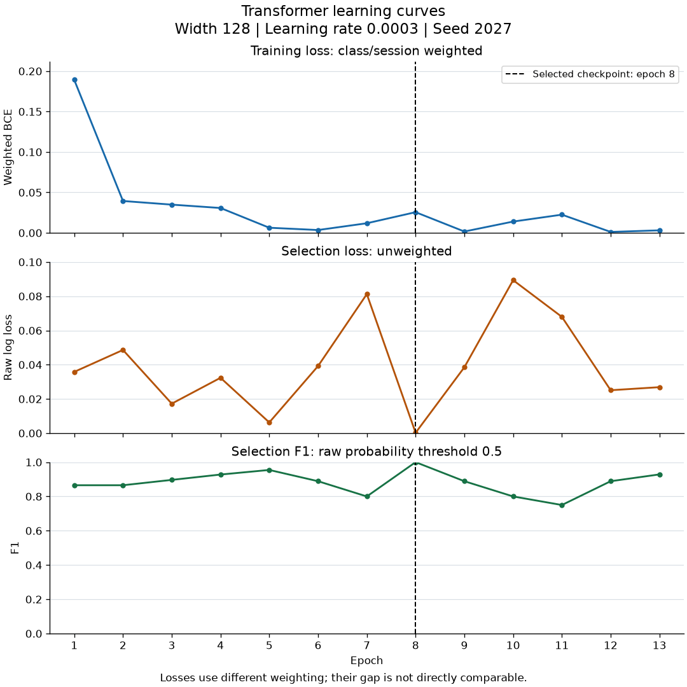
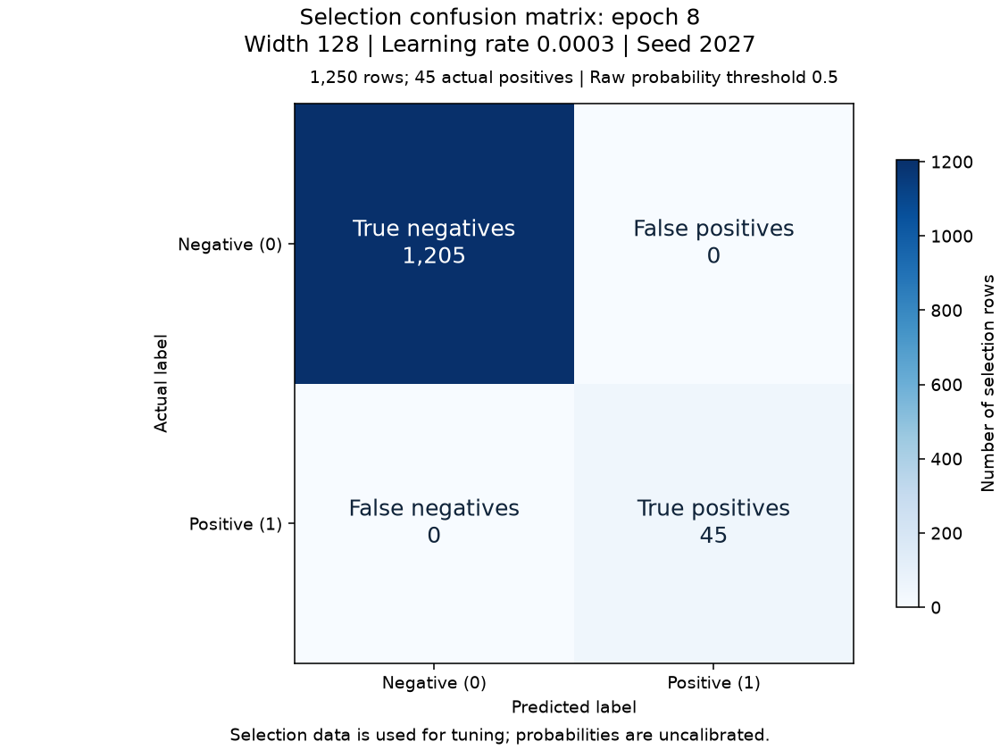

# Experiment: seed-2027

Status: independently verified training result.

[Story #24](https://github.com/khab40/lob-arena/issues/24) · [Project #3](https://github.com/users/khab40/projects/3)

## Basic results

| Measure | Value |
|---|---:|
| Width / learning rate / seed | 128 / 0.0003 / 2027 |
| Batch / max epochs / patience | 64 / 30 / 5 |
| Selected / stopped epoch | 8 / 13 |
| Training rows (normalizer fit) | 33450 |
| Selection rows / positives / negatives | 1250 / 45 / 1205 |
| Raw selection log loss | 0.0002310892 |
| Precision / recall / F1 at 0.5 | 1.000000 / 1.000000 / 1.000000 |
| Parameters | 412,417 |

Selection data was used for tuning. Probabilities are uncalibrated; these
metrics do not establish generalization or superiority to LightGBM.

## Learning curves

The dashed line marks the selected epoch. Training loss is class/session
weighted; selection log loss is unweighted. Their magnitudes are not directly comparable.

| Epoch | Weighted training loss | Selection log loss | Selection F1 at 0.5 |
|---:|---:|---:|---:|
| 1 | 0.18929809 | 0.03581737 | 0.865385 |
| 2 | 0.03938869 | 0.04862531 | 0.865385 |
| 3 | 0.03490198 | 0.01726019 | 0.896552 |
| 4 | 0.03074315 | 0.03236679 | 0.927835 |
| 5 | 0.00632427 | 0.00629329 | 0.954545 |
| 6 | 0.00347764 | 0.03922670 | 0.888889 |
| 7 | 0.01185905 | 0.08125409 | 0.800000 |
| 8 | 0.02556449 | 0.00023109 | 1.000000 |
| 9 | 0.00164237 | 0.03852343 | 0.888889 |
| 10 | 0.01395094 | 0.08939685 | 0.800000 |
| 11 | 0.02248710 | 0.06794386 | 0.750000 |
| 12 | 0.00112532 | 0.02510705 | 0.888889 |
| 13 | 0.00310127 | 0.02689199 | 0.928571 |

## Selected-checkpoint errors

| Actual / predicted | Negative | Positive |
|---|---:|---:|
| Negative | 1205 | 0 |
| Positive | 0 | 45 |

## Runtime and preservation

| Measure | Value |
|---|---:|
| Provider runtime / training loop (s) | 343.96 / 57.60 |
| Worker elapsed / CPU time (s) | 341.98 / 343.43 |
| Peak host RSS (GiB) | 2.693 |
| GPU allocated / reserved (MiB) | 182.65 / 196.00 |
| Verified artifacts | 38 |

Training-loop time includes selection evaluation and checkpoint publication.
Actual cost, GPU utilization and inference latency remain unmeasured/unreconciled.
Online MLflow status: `pending_retained_artifacts`. Configuration, metrics and replayable events are retained.

## Lineage

- Run: `transformer-confirm-c4-20261004-r1-seed-2027`
- Job: `aijob-e00kq6q1fnv1kkn40p`
- Assembly source: `7b88ea213b0e38b8e453e40943dd8403ded79fb4`
- Executed image: `sha256:436def17c45688e764d1cf1b84100ef66f40acfe37bb42cd12ec5c63154c0952`
- Numerical source: `87ce8a933c40fe825569e3de6a8699b519808c34`
- Base image: `sha256:b713f1ffeb3c2ba5e4ab09dd2cdb829c6d659a915dd140a113bcabdf6c1909d9`
- Compatibility manifest SHA-256: `c6c2e66b4968468fca5ab92aeb39ed0b50f7bf47e719ef05464b542896d5a0f7`
- Request SHA-256: `21891f90c63922a2f5fe36c2330e571b429b5f3c967a53772738dbb58da5a6fa`
- Verification SHA-256: `3301c1e05dcda8515793576fdfb63ce21f3eee039c442c5d29d65e1ec5a18ee1`
- S3 prefix: `s3://aimada-wave1-results-e00g6zvxpr00/campaigns/wave1-research-20260816/development/transformer-confirm-c4-20261004-r1/seed-2027/`
- Checkpoint: `seed-2027-epoch-08.pt` (version `1`)
- Checkpoint SHA-256: `e17159eddd29d226b330f0a94ab385b827c572e301a1f75e47c1a7340eea5c1b`

Calibration, precision-recall comparison and latency plots await those later measurements.
