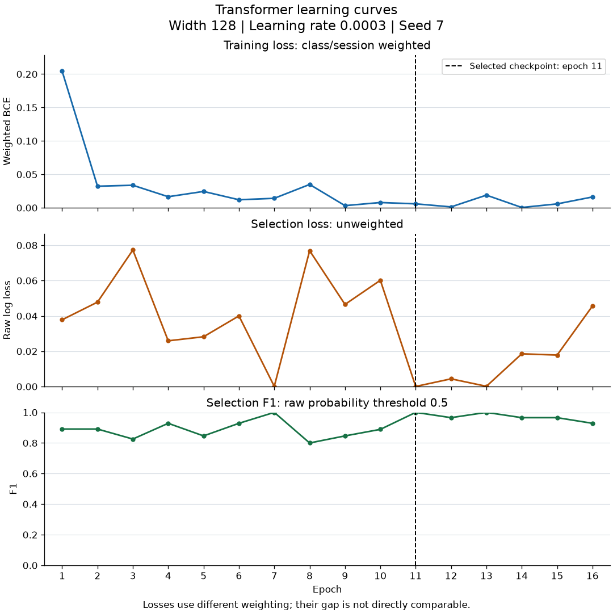
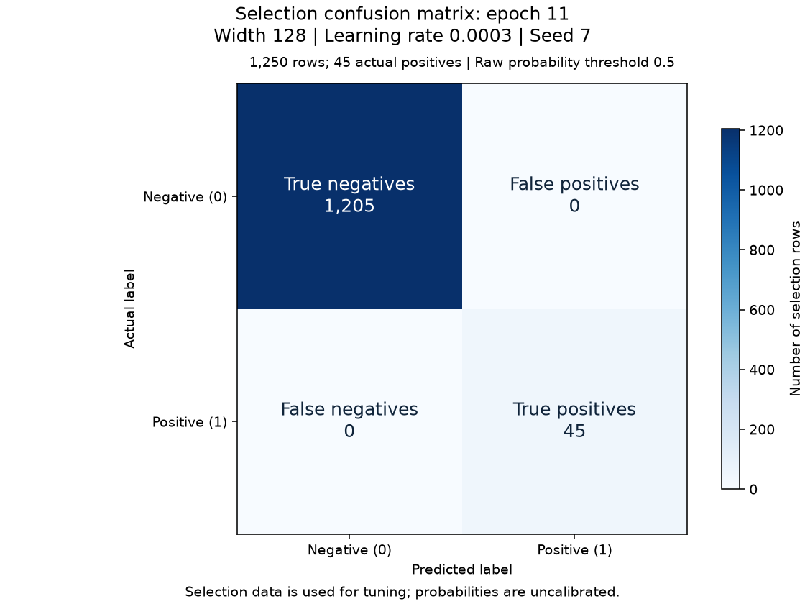

# Experiment: seed-7

Status: independently verified training result.

[Story #24](https://github.com/khab40/lob-arena/issues/24) · [Project #3](https://github.com/users/khab40/projects/3)

## Basic results

| Measure | Value |
|---|---:|
| Width / learning rate / seed | 128 / 0.0003 / 7 |
| Batch / max epochs / patience | 64 / 30 / 5 |
| Selected / stopped epoch | 11 / 16 |
| Training rows (normalizer fit) | 33450 |
| Selection rows / positives / negatives | 1250 / 45 / 1205 |
| Raw selection log loss | 0.0000427579 |
| Precision / recall / F1 at 0.5 | 1.000000 / 1.000000 / 1.000000 |
| Parameters | 412,417 |

Selection data was used for tuning. Probabilities are uncalibrated; these
metrics do not establish generalization or superiority to LightGBM.

## Learning curves

The dashed line marks the selected epoch. Training loss is class/session
weighted; selection log loss is unweighted. Their magnitudes are not directly comparable.

| Epoch | Weighted training loss | Selection log loss | Selection F1 at 0.5 |
|---:|---:|---:|---:|
| 1 | 0.20425919 | 0.03782538 | 0.891089 |
| 2 | 0.03222733 | 0.04781903 | 0.891089 |
| 3 | 0.03366246 | 0.07734131 | 0.825688 |
| 4 | 0.01651614 | 0.02590067 | 0.928571 |
| 5 | 0.02442306 | 0.02819932 | 0.846154 |
| 6 | 0.01197805 | 0.04001255 | 0.928571 |
| 7 | 0.01412692 | 0.00011748 | 1.000000 |
| 8 | 0.03487721 | 0.07693993 | 0.800000 |
| 9 | 0.00318638 | 0.04651134 | 0.846154 |
| 10 | 0.00783975 | 0.06017863 | 0.888889 |
| 11 | 0.00587899 | 0.00004276 | 1.000000 |
| 12 | 0.00127656 | 0.00436274 | 0.965517 |
| 13 | 0.01889746 | 0.00012941 | 1.000000 |
| 14 | 0.00039926 | 0.01853939 | 0.965517 |
| 15 | 0.00577282 | 0.01782342 | 0.965517 |
| 16 | 0.01616589 | 0.04563407 | 0.928571 |

## Selected-checkpoint errors

| Actual / predicted | Negative | Positive |
|---|---:|---:|
| Negative | 1205 | 0 |
| Positive | 0 | 45 |

## Runtime and preservation

| Measure | Value |
|---|---:|
| Provider runtime / training loop (s) | 358.79 / 71.82 |
| Worker elapsed / CPU time (s) | 356.77 / 353.50 |
| Peak host RSS (GiB) | 2.672 |
| GPU allocated / reserved (MiB) | 182.65 / 196.00 |
| Verified artifacts | 44 |

Training-loop time includes selection evaluation and checkpoint publication.
Actual cost, GPU utilization and inference latency remain unmeasured/unreconciled.
Online MLflow status: `pending_retained_artifacts`. Configuration, metrics and replayable events are retained.

## Lineage

- Run: `transformer-confirm-c4-20261004-r1-seed-7`
- Job: `aijob-e00vjqjfhgp7s79mj4`
- Assembly source: `7b88ea213b0e38b8e453e40943dd8403ded79fb4`
- Executed image: `sha256:436def17c45688e764d1cf1b84100ef66f40acfe37bb42cd12ec5c63154c0952`
- Numerical source: `87ce8a933c40fe825569e3de6a8699b519808c34`
- Base image: `sha256:b713f1ffeb3c2ba5e4ab09dd2cdb829c6d659a915dd140a113bcabdf6c1909d9`
- Compatibility manifest SHA-256: `c6c2e66b4968468fca5ab92aeb39ed0b50f7bf47e719ef05464b542896d5a0f7`
- Request SHA-256: `98375419ad9697f2278af7a71adb42a2dd33db130e5814aa80c2dded083c90e1`
- Verification SHA-256: `5b1703e2a5689f284d0c67cb059c42014689438b78da4a2a2f003a8fd43e2737`
- S3 prefix: `s3://aimada-wave1-results-e00g6zvxpr00/campaigns/wave1-research-20260816/development/transformer-confirm-c4-20261004-r1/seed-7/`
- Checkpoint: `seed-7-epoch-11.pt` (version `1`)
- Checkpoint SHA-256: `b151df40a5eb7e6014b4a59ec9a6a10dedc904704a7ca9063cd68e36b18e965e`

Calibration, precision-recall comparison and latency plots await those later measurements.
