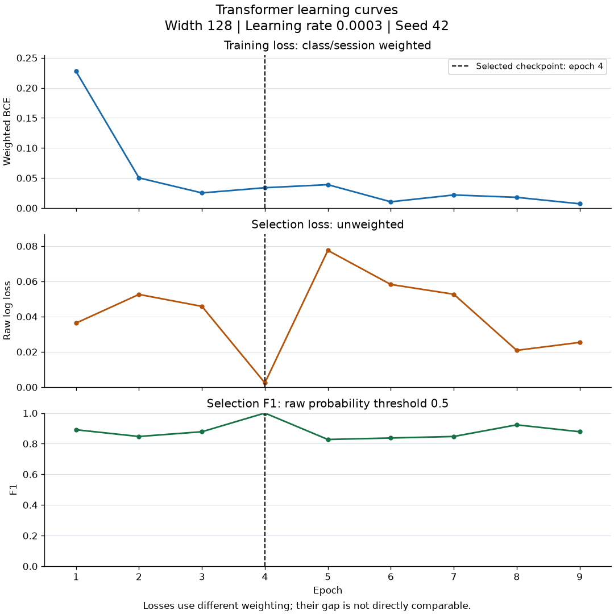
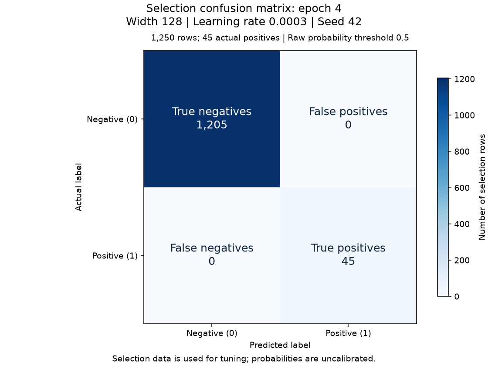

# Experiment: search-128-0003

Status: independently verified training result.

[Story #24](https://github.com/khab40/lob-arena/issues/24) · [Project #3](https://github.com/users/khab40/projects/3)

## Basic results

| Measure | Value |
|---|---:|
| Width / learning rate / seed | 128 / 0.0003 / 42 |
| Batch / max epochs / patience | 64 / 30 / 5 |
| Selected / stopped epoch | 4 / 9 |
| Training rows (normalizer fit) | 33450 |
| Selection rows / positives / negatives | 1250 / 45 / 1205 |
| Raw selection log loss | 0.0024378335 |
| Precision / recall / F1 at 0.5 | 1.000000 / 1.000000 / 1.000000 |
| Parameters | 412,417 |

Selection data was used for tuning. Probabilities are uncalibrated; these
metrics do not establish generalization or superiority to LightGBM.

## Learning curves

The dashed line marks the selected epoch. Training loss is class/session
weighted; selection log loss is unweighted. Their magnitudes are not directly comparable.

| Epoch | Weighted training loss | Selection log loss | Selection F1 at 0.5 |
|---:|---:|---:|---:|
| 1 | 0.22756976 | 0.03631587 | 0.891089 |
| 2 | 0.05028519 | 0.05256574 | 0.847059 |
| 3 | 0.02527488 | 0.04579720 | 0.878049 |
| 4 | 0.03389920 | 0.00243783 | 1.000000 |
| 5 | 0.03899630 | 0.07751129 | 0.827586 |
| 6 | 0.01049618 | 0.05819878 | 0.837209 |
| 7 | 0.02185433 | 0.05267804 | 0.847059 |
| 8 | 0.01792094 | 0.02086195 | 0.923077 |
| 9 | 0.00716002 | 0.02537171 | 0.878049 |

## Selected-checkpoint errors

| Actual / predicted | Negative | Positive |
|---|---:|---:|
| Negative | 1205 | 0 |
| Positive | 0 | 45 |

## Runtime and preservation

| Measure | Value |
|---|---:|
| Provider runtime / training loop (s) | 328.31 / 40.73 |
| Worker elapsed / CPU time (s) | 326.30 / 326.29 |
| Peak host RSS (GiB) | 2.674 |
| GPU allocated / reserved (MiB) | 182.65 / 196.00 |
| Verified artifacts | 30 |

Training-loop time includes selection evaluation and checkpoint publication.
Actual cost, GPU utilization and inference latency remain unmeasured/unreconciled.
Online MLflow status: `pending_retained_artifacts`. Configuration, metrics and replayable events are retained.

## Lineage

- Run: `transformer-research-c4-20261003-r2-search-128-0003`
- Job: `aijob-e00s0s76j0pgrq9bjp`
- Source: `87ce8a933c40fe825569e3de6a8699b519808c34`
- Image: `sha256:b713f1ffeb3c2ba5e4ab09dd2cdb829c6d659a915dd140a113bcabdf6c1909d9`
- Request SHA-256: `cea6563f836b2fa44ee70d3af7659613e95c31f81ca952033c22f52d9ae4ea99`
- Verification SHA-256: `e26e8212dd147f5feb28bf1093aa5e3bbbea530327f67a992e32626cba7ace33`
- S3 prefix: `s3://aimada-wave1-results-e00g6zvxpr00/campaigns/wave1-research-20260816/development/transformer-research-c4-20261003-r2/search-128-0003/`
- Checkpoint: `search-128-0003-epoch-04.pt` (version `1`)
- Checkpoint SHA-256: `e2cc94d8e11ad3ad644e52d5283fd958c5458717efd7cfe02ccc30f8f82e6b2b`

Calibration, precision-recall comparison and latency plots await those later measurements.
