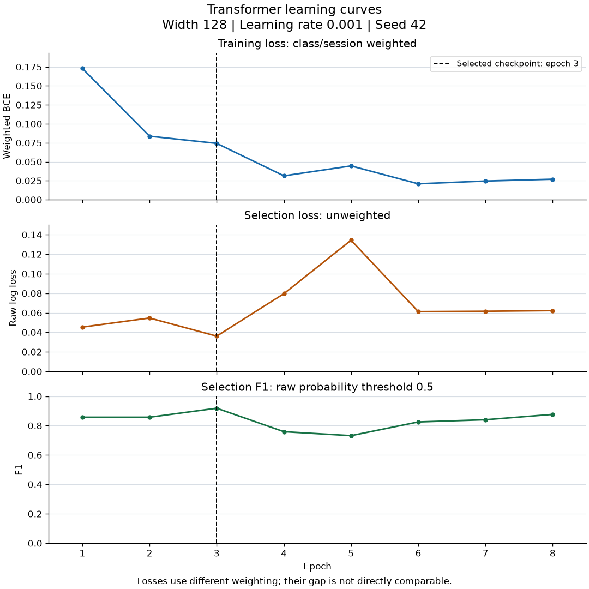
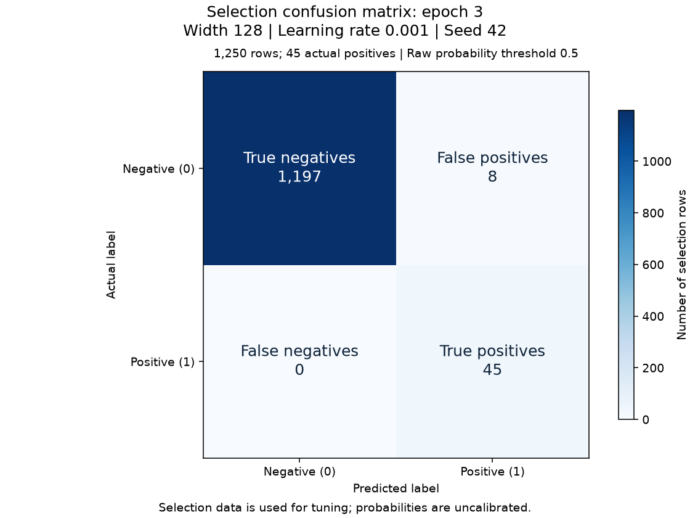

# Experiment: search-128-001

Status: independently verified training result.

[Story #24](https://github.com/khab40/lob-arena/issues/24) · [Project #3](https://github.com/users/khab40/projects/3)

## Basic results

| Measure | Value |
|---|---:|
| Width / learning rate / seed | 128 / 0.001 / 42 |
| Batch / max epochs / patience | 64 / 30 / 5 |
| Selected / stopped epoch | 3 / 8 |
| Training rows (normalizer fit) | 33450 |
| Selection rows / positives / negatives | 1250 / 45 / 1205 |
| Raw selection log loss | 0.0361010956 |
| Precision / recall / F1 at 0.5 | 0.849057 / 1.000000 / 0.918367 |
| Parameters | 412,417 |

Selection data was used for tuning. Probabilities are uncalibrated; these
metrics do not establish generalization or superiority to LightGBM.

## Learning curves

The dashed line marks the selected epoch. Training loss is class/session
weighted; selection log loss is unweighted. Their magnitudes are not directly comparable.

| Epoch | Weighted training loss | Selection log loss | Selection F1 at 0.5 |
|---:|---:|---:|---:|
| 1 | 0.17300939 | 0.04534893 | 0.857143 |
| 2 | 0.08370784 | 0.05466399 | 0.857143 |
| 3 | 0.07420391 | 0.03610110 | 0.918367 |
| 4 | 0.03139265 | 0.07962593 | 0.758621 |
| 5 | 0.04451404 | 0.13434648 | 0.731707 |
| 6 | 0.02089506 | 0.06122967 | 0.825000 |
| 7 | 0.02456018 | 0.06158778 | 0.840000 |
| 8 | 0.02694930 | 0.06224578 | 0.876404 |

## Selected-checkpoint errors

| Actual / predicted | Negative | Positive |
|---|---:|---:|
| Negative | 1197 | 8 |
| Positive | 0 | 45 |

## Runtime and preservation

| Measure | Value |
|---|---:|
| Provider runtime / training loop (s) | 355.75 / 35.82 |
| Worker elapsed / CPU time (s) | 353.69 / 357.95 |
| Peak host RSS (GiB) | 2.688 |
| GPU allocated / reserved (MiB) | 182.65 / 196.00 |
| Verified artifacts | 28 |

Training-loop time includes selection evaluation and checkpoint publication.
Actual cost, GPU utilization and inference latency remain unmeasured/unreconciled.
Online MLflow status: `pending_retained_artifacts`. Configuration, metrics and replayable events are retained.

## Lineage

- Run: `transformer-research-c4-20261003-r2-search-128-001`
- Job: `aijob-e00cnkgb7d85yhj8ks`
- Source: `87ce8a933c40fe825569e3de6a8699b519808c34`
- Image: `sha256:b713f1ffeb3c2ba5e4ab09dd2cdb829c6d659a915dd140a113bcabdf6c1909d9`
- Request SHA-256: `57a387ce865c1f57a60129bfefa1447372293a294a2f92cb3b70a967c0f9e197`
- Verification SHA-256: `7b421725b91881aa7d45f4e55e17c3701b35fd73a8e1be522c6bf42901c147e8`
- S3 prefix: `s3://aimada-wave1-results-e00g6zvxpr00/campaigns/wave1-research-20260816/development/transformer-research-c4-20261003-r2/search-128-001/`
- Checkpoint: `search-128-001-epoch-03.pt` (version `1`)
- Checkpoint SHA-256: `3f3ff305600298cb172f8133b5b9e4a2ed63c5e08db9c2bdf059fc772283e291`

Calibration, precision-recall comparison and latency plots await those later measurements.
