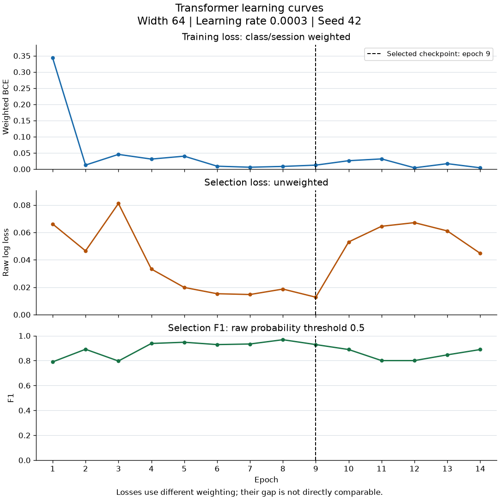
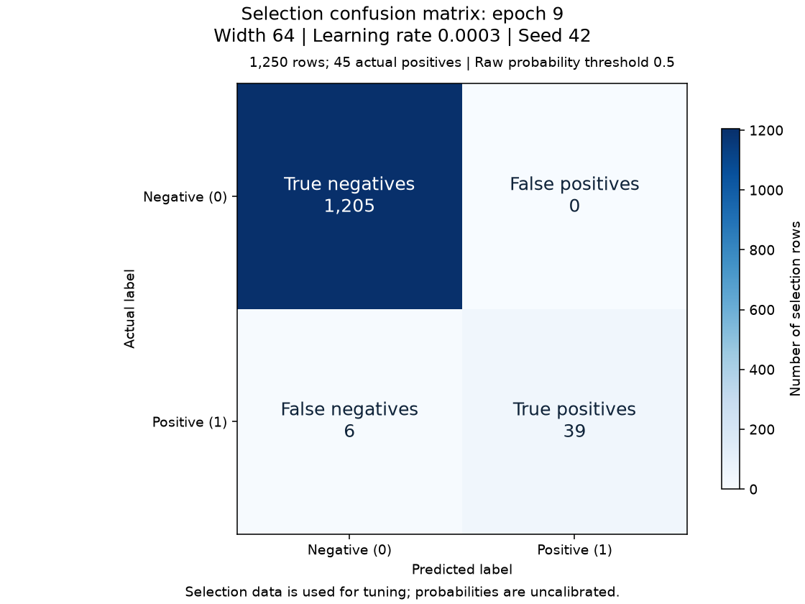

# Experiment: search-64-0003

Status: independently verified training result.

[Story #24](https://github.com/khab40/lob-arena/issues/24) · [Project #3](https://github.com/users/khab40/projects/3)

## Basic results

| Measure | Value |
|---|---:|
| Width / learning rate / seed | 64 / 0.0003 / 42 |
| Batch / max epochs / patience | 64 / 30 / 5 |
| Selected / stopped epoch | 9 / 14 |
| Training rows (normalizer fit) | 33450 |
| Selection rows / positives / negatives | 1250 / 45 / 1205 |
| Raw selection log loss | 0.0127381180 |
| Precision / recall / F1 at 0.5 | 1.000000 / 0.866667 / 0.928571 |
| Parameters | 107,905 |

Selection data was used for tuning. Probabilities are uncalibrated; these
metrics do not establish generalization or superiority to LightGBM.

## Learning curves

The dashed line marks the selected epoch. Training loss is class/session
weighted; selection log loss is unweighted. Their magnitudes are not directly comparable.

| Epoch | Weighted training loss | Selection log loss | Selection F1 at 0.5 |
|---:|---:|---:|---:|
| 1 | 0.34316770 | 0.06614276 | 0.789474 |
| 2 | 0.01250317 | 0.04654715 | 0.891089 |
| 3 | 0.04551229 | 0.08109867 | 0.796460 |
| 4 | 0.03101212 | 0.03329515 | 0.937500 |
| 5 | 0.04002698 | 0.01986816 | 0.947368 |
| 6 | 0.00908293 | 0.01527191 | 0.928571 |
| 7 | 0.00587794 | 0.01469621 | 0.933333 |
| 8 | 0.00836694 | 0.01867304 | 0.967742 |
| 9 | 0.01232641 | 0.01273812 | 0.928571 |
| 10 | 0.02602956 | 0.05307892 | 0.888889 |
| 11 | 0.03155446 | 0.06447892 | 0.800000 |
| 12 | 0.00408805 | 0.06713818 | 0.800000 |
| 13 | 0.01688065 | 0.06108341 | 0.846154 |
| 14 | 0.00410326 | 0.04473162 | 0.888889 |

## Selected-checkpoint errors

| Actual / predicted | Negative | Positive |
|---|---:|---:|
| Negative | 1205 | 0 |
| Positive | 6 | 39 |

## Runtime and preservation

| Measure | Value |
|---|---:|
| Provider runtime / training loop (s) | 382.36 / 62.74 |
| Worker elapsed / CPU time (s) | 380.35 / 383.75 |
| Peak host RSS (GiB) | 2.678 |
| GPU allocated / reserved (MiB) | 133.59 / 152.00 |
| Verified artifacts | 40 |

Training-loop time includes selection evaluation and checkpoint publication.
Actual cost, GPU utilization and inference latency remain unmeasured/unreconciled.
Online MLflow status: `pending_retained_artifacts`. Configuration, metrics and replayable events are retained.

## Lineage

- Run: `transformer-research-c4-20261003-r2-search-64-0003`
- Job: `aijob-e00yqhrjgp4236zy3m`
- Source: `87ce8a933c40fe825569e3de6a8699b519808c34`
- Image: `sha256:b713f1ffeb3c2ba5e4ab09dd2cdb829c6d659a915dd140a113bcabdf6c1909d9`
- Request SHA-256: `cfd8097ab824f9abddfef7fff957773ff78a6b44780f7d8cc3e4c8be44de3788`
- Verification SHA-256: `2a6c76f716c31ba096e9d573c60b338dc1f2927511cf4588fa918bd84214b00b`
- S3 prefix: `s3://aimada-wave1-results-e00g6zvxpr00/campaigns/wave1-research-20260816/development/transformer-research-c4-20261003-r2/search-64-0003/`
- Checkpoint: `search-64-0003-epoch-09.pt` (version `1`)
- Checkpoint SHA-256: `186f95e9d7c866b9f989eb64a42b01a074e4c5e9b6a61eb07c4f4b79323b3b11`

Calibration, precision-recall comparison and latency plots await those later measurements.
