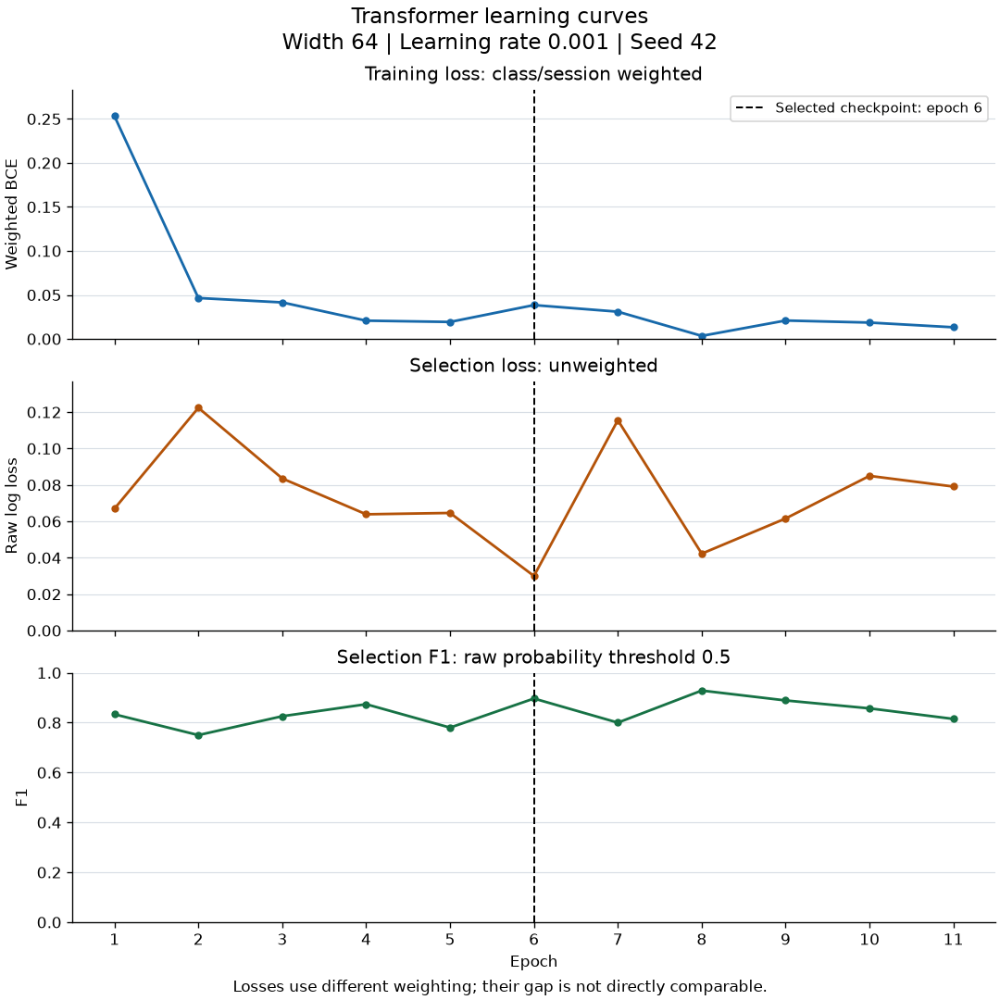
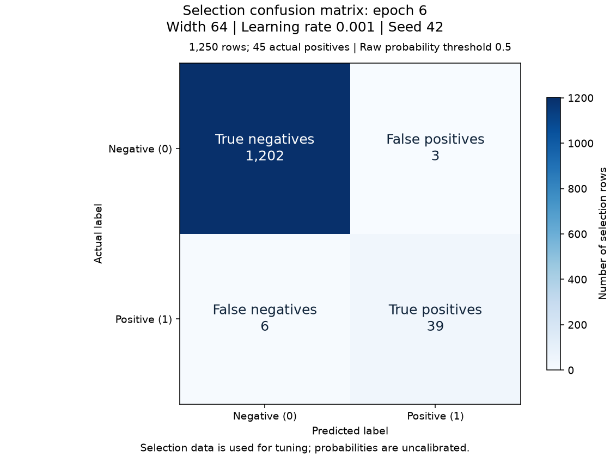

# Experiment: search-64-001

Status: independently verified training result.

[Story #24](https://github.com/khab40/lob-arena/issues/24) · [Project #3](https://github.com/users/khab40/projects/3)

## Basic results

| Measure | Value |
|---|---:|
| Width / learning rate / seed | 64 / 0.001 / 42 |
| Batch / max epochs / patience | 64 / 30 / 5 |
| Selected / stopped epoch | 6 / 11 |
| Training rows (normalizer fit) | 33450 |
| Selection rows / positives / negatives | 1250 / 45 / 1205 |
| Raw selection log loss | 0.0299968305 |
| Precision / recall / F1 at 0.5 | 0.928571 / 0.866667 / 0.896552 |
| Parameters | 107,905 |

Selection data was used for tuning. Probabilities are uncalibrated; these
metrics do not establish generalization or superiority to LightGBM.

## Learning curves

The dashed line marks the selected epoch. Training loss is class/session
weighted; selection log loss is unweighted. Their magnitudes are not directly comparable.

| Epoch | Weighted training loss | Selection log loss | Selection F1 at 0.5 |
|---:|---:|---:|---:|
| 1 | 0.25307618 | 0.06697388 | 0.833333 |
| 2 | 0.04647844 | 0.12235773 | 0.750000 |
| 3 | 0.04149618 | 0.08355055 | 0.825688 |
| 4 | 0.02076058 | 0.06387057 | 0.873786 |
| 5 | 0.01929691 | 0.06460348 | 0.780000 |
| 6 | 0.03844851 | 0.02999683 | 0.896552 |
| 7 | 0.03094750 | 0.11556178 | 0.800000 |
| 8 | 0.00343801 | 0.04224922 | 0.928571 |
| 9 | 0.02091729 | 0.06157514 | 0.888889 |
| 10 | 0.01858150 | 0.08497244 | 0.857143 |
| 11 | 0.01323954 | 0.07910670 | 0.814815 |

## Selected-checkpoint errors

| Actual / predicted | Negative | Positive |
|---|---:|---:|
| Negative | 1202 | 3 |
| Positive | 6 | 39 |

## Runtime and preservation

| Measure | Value |
|---|---:|
| Provider runtime / training loop (s) | 354.67 / 48.96 |
| Worker elapsed / CPU time (s) | 352.66 / 355.50 |
| Peak host RSS (GiB) | 2.689 |
| GPU allocated / reserved (MiB) | 133.59 / 152.00 |
| Verified artifacts | 34 |

Training-loop time includes selection evaluation and checkpoint publication.
Actual cost, GPU utilization and inference latency remain unmeasured/unreconciled.
Online MLflow status: `pending_retained_artifacts`. Configuration, metrics and replayable events are retained.

## Lineage

- Run: `transformer-research-c4-20261003-r2-search-64-001`
- Job: `aijob-e00dj72sk0ks6fc3h9`
- Source: `87ce8a933c40fe825569e3de6a8699b519808c34`
- Image: `sha256:b713f1ffeb3c2ba5e4ab09dd2cdb829c6d659a915dd140a113bcabdf6c1909d9`
- Request SHA-256: `b8697fa036da1d1bb0e145939979882e3853d3f5321f5840b6364580f713b870`
- Verification SHA-256: `e451e7e8e7f09bebeeabcabae04ba2834668f6251b5560840358745113df481a`
- S3 prefix: `s3://aimada-wave1-results-e00g6zvxpr00/campaigns/wave1-research-20260816/development/transformer-research-c4-20261003-r2/search-64-001/`
- Checkpoint: `search-64-001-epoch-06.pt` (version `1`)
- Checkpoint SHA-256: `468ec05a2ea22370f55e20eb42fa5cd18dbbe6a99402c7ce60d2b594e5faf893`

Calibration, precision-recall comparison and latency plots await those later measurements.
