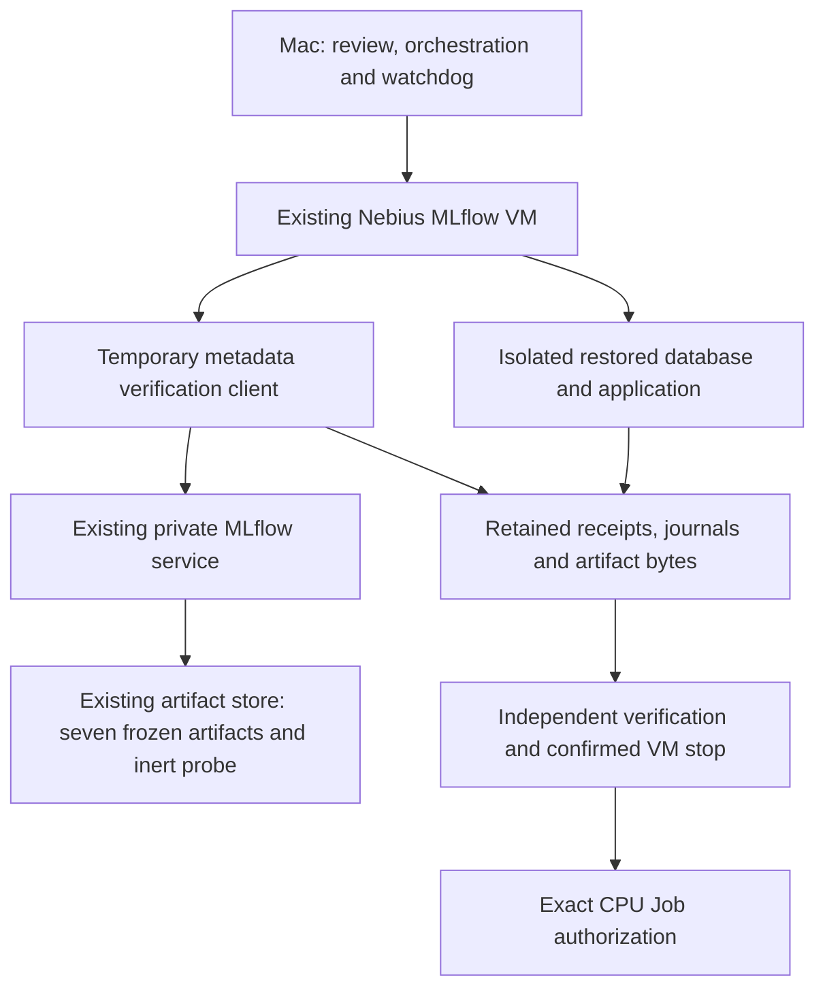

# MLflow readiness design — 2026-10-02

As a validation engineer,
I want restored tracking, frozen registry lineage and restricted Transformer logging verified,
So that subsequent experiment records have trustworthy identities and retained evidence.

Actor: validation engineer. Goal: establish the MLflow prerequisites for the CPU
role audit. Value: reproducible experiment records without reopening G8/G9.
Ticket: [#19](https://github.com/khab40/lob-arena/issues/19); consumer
[#24](https://github.com/khab40/lob-arena/issues/24); [Project #3](https://github.com/users/khab40/projects/3).

## Acceptance scenarios

```gherkin
Feature: MLflow readiness for governed development

  Scenario: Use the retained metadata through the restored application
    Given the retained backup matches its approved hash and original table fingerprints
    When the same deployed MLflow image starts against the isolated restored database
    Then its initial table fingerprints remain unchanged
    And authenticated metadata writes can be read back
    And new experiment and user IDs exceed the restored maxima
    And the retained frozen-run metadata remains unchanged

  Scenario: Add only the required Transformer permissions
    Given existing non-admin writer and exporter accounts with no conflicting access
    When the approved Transformer namespaces and four grants are applied
    Then the writer has EDIT and the exporter has READ on both exact resources
    And prior identities, permissions, credentials and defaults remain unchanged

  Scenario: Refuse broader inherited permissions
    Given either account has conflicting effective or inherited access
    When readiness preflight inspects both accounts
    Then no permission mutation is attempted
    And readiness remains unverified

  Scenario: Verify restricted parent and child tracking
    Given a durable journal bound to the approved maintenance proposal
    When the writer records one metadata-only parent and child
    Then the inert child artifact is read back byte for byte
    And the exporter can read both completed runs
    And its attempted child tag write is denied with HTTP 403
    And that tag is absent on writer readback

  Scenario: Retain an ambiguous mutation without another attempt
    Given a creation or probe intent was persisted before a lost response
    When the same journal is inspected again
    Then matching existing run identities may be reconciled by readback
    And an unresolved mutation is not automatically repeated

  Scenario: Register only the verified frozen research lineage
    Given the frozen run and its exact feature release and dataset lineage match
    And all seven artifact sizes and hashes match the retained manifest
    When research registration is explicitly authorized
    Then one matching version has the research-baseline alias
    And its tags bind the candidate, freeze, inventory and feature release
    And no production alias or deployable-flavor claim is created

  Scenario: Stop on a changed artifact or registry conflict
    Given an artifact, lineage field, existing version or alias conflicts
    When the registration helper verifies the frozen package
    Then registration does not establish readiness
    And no conflicting record is overwritten
```

## Components and evidence



| Component | Responsibility | Required evidence |
| --- | --- | --- |
| Runtime preflight | Actual image imports, supported APIs, finite synchronous transport | Python/MLflow versions and signature checks |
| Isolated restore | Same image, private socket, original table equality, application writes | Image IDs, backup hash, table equality, allocated IDs |
| Permission helper | Inspect both users before adding exact missing grants | Exact resource IDs, additive readback; private SQL preservation boolean |
| Registry helper | Verify seven artifacts and all frozen input lineage before writes | Manifest/candidate/freeze/feature hashes, version, alias, durable intents |
| Tracking helper | Reserve parent/child, write/read inert artifact, verify exporter denial | Run IDs, journal bindings, artifact hash and denial result |
| Allowlist helper | Append only two namespace values | Preserved unrelated bytes and persisted additions |

The recovery probe's model versions reference an inert local path. Its 1→2
counter check applies to the new probe namespace, not a historical registered
model counter. Frozen-run snapshot checks cover the explicitly recorded fields;
broader initial preservation comes from database fingerprint comparison.

The live registry binds the seven artifacts through the immutable manifest hash.
Its version source remains the existing frozen `governed/model.txt`. It does not
load, score, retrain, calibrate or package that model.

## Verification and limits

Inert tests cover permission conflicts, state drift, partial failures, lost
responses, corrupt artifacts, lineage mismatch, stale sequences, configuration
preservation and strict denial classification. These tests execute no models.
Live readiness must be independently read back after the separately approved
[operation](../operations/mlflow-readiness.md); it is currently pending.

Out of scope: final-test access, G8 evaluation, GPU/CPU Job execution, changing
thresholds or candidates, production promotion, live restore, deployment upgrade,
new cloud IAM/network permissions and full closure of platform stories.

See [ARD-0041](../architecture/ARD-0041-mlflow-readiness-before-transformer-execution.md)
for the decision and alternatives.

Compatibility references: [MLflow 3.13 client](https://github.com/mlflow/mlflow/blob/v3.13.0/mlflow/tracking/client.py),
[3.13 authentication](https://github.com/mlflow/mlflow/blob/v3.13.0/mlflow/server/auth/client.py),
and [artifact REST API](https://mlflow.org/docs/latest/api_reference/rest-api.html).
Current documentation does not replace the pinned deployed-image preflight.
