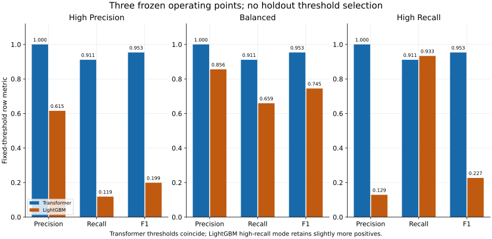
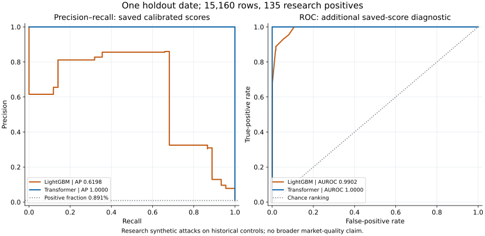
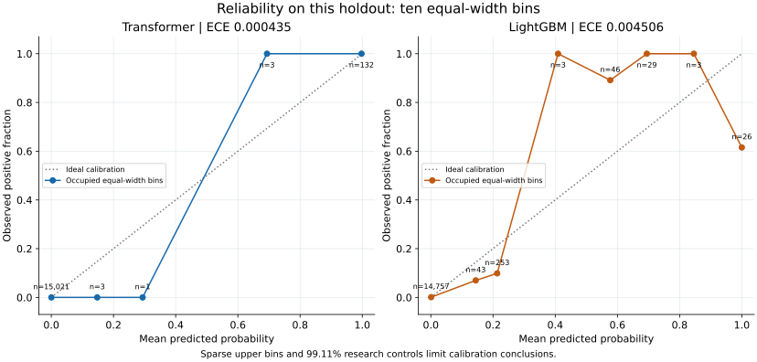

# Transformer versus LightGBM: frozen holdout — 7 October 2026

Linked work: [Transformer Story #24](https://github.com/khab40/lob-arena/issues/24), [Bug #345](https://github.com/khab40/lob-arena/issues/345), [PR #346](https://github.com/khab40/lob-arena/pull/346), [Project #3](https://github.com/users/khab40/projects/3).

**Recommendation: continue bounded Transformer research.** The completed frozen holdout supports the research hypothesis on this dataset: at the balanced point, Transformer detected 123 of 135 positive rows with no false alerts; frozen LightGBM detected 89 with 15 false alerts. Broader quality, real abuse detection and production readiness remain inconclusive. This report does not authorize another workload, change thresholds, select a new model or promote a detector. A first demo remains an operator decision with its research limitations visible.

## Population and frozen candidate

The evaluation uses one Nasdaq TotalView-ITCH day, **30 December 2019**, with AAPL, MSFT and NVDA: three base sessions, 30 replay shards and 27 research synthetic attack campaigns. There are 15,160 aligned target rows: 135 positive and 15,025 control-labelled negative rows (positive fraction 0.8905%). Negative labels are a research control assumption; synthetic labels identify prescribed attack windows, not independently adjudicated market abuse. Variants share their underlying sessions; 30 shards and 27 campaigns are not 30 or 27 independent market samples. December had already been exposed through historical LightGBM G8 evaluation; it is not a never-seen project-wide final set. The Transformer was frozen before this evaluation and no fitting occurred during the holdout.

The selected Transformer remains width **128**, learning rate **0.0003**, seed **42**, checkpoint **epoch 4**, temperature **0.9984971167248549**. Its contract contains 60 ordered LOB features and their missingness indicators (120 input dimensions), 64-step causal sequences, train-only normalization and per-shard history reset. Selected-settings and contract metadata hashes match the frozen request. Feature release: `nasdaq-public-sample-v1-c4-5c85182-20260905-features`, SHA-256 `956e5d0e600e831d662733b773f77790a649e7da6709ab88ed2294f4112a2198`. All three previously selected Transformer operating points have the same threshold; their identical counts are not three independent successful experiments.

## Frozen operating points

Metrics below are row-based. Displayed floating values are rounded; the retained aggregate `plot-data.json` holds the original numeric results and full reliability bins. Decisions use probability **greater than or equal to** the frozen threshold.

| Frozen point | Model | Threshold ≥ | Precision | Recall | F1 | TP | FP | FN | TN |
| --- | --- | --- | --- | --- | --- | --- | --- | --- | --- |
| high precision | transformer | 0.99642314818786404 | 1 | 0.911111111 | 0.953488372 | 123 | 0 | 12 | 15025 |
| high precision | lightgbm | 1 | 0.615384615 | 0.118518519 | 0.198757764 | 16 | 10 | 119 | 15015 |
| balanced | transformer | 0.99642314818786404 | 1 | 0.911111111 | 0.953488372 | 123 | 0 | 12 | 15025 |
| balanced | lightgbm | 0.57692307692307687 | 0.855769231 | 0.659259259 | 0.744769874 | 89 | 15 | 46 | 15010 |
| high recall | transformer | 0.99642314818786404 | 1 | 0.911111111 | 0.953488372 | 123 | 0 | 12 | 15025 |
| high recall | lightgbm | 0.012964563526361279 | 0.128966223 | 0.933333333 | 0.226618705 | 126 | 851 | 9 | 14174 |

Transformer improves precision and F1 at each named setting here, but it does **not** dominate every metric: LightGBM high-recall catches 126 positives versus 123, at a cost of 851 false positives versus zero. At the balanced point, both detectors cover **27/27 campaigns**: campaign detection means at least one positive row alerted, not all attack rows found.

## Ranking and probability quality

| Model | Average precision | Log loss | Brier score | ECE (10 bins) | AUROC* |
| --- | --- | --- | --- | --- | --- |
| transformer | 1 | 0.000454249513 | 3.06463885e-05 | 0.000435444354 | 1 |
| lightgbm | 0.619771846 | 0.0383435951 | 0.00440138909 | 0.00450599014 | 0.990169471 |

Average precision and log loss are the frozen primary comparison metrics. *AUROC is an additional report diagnostic computed from the saved, exactly aligned probabilities using descending distinct-score groups and trapezoidal ROC integration; it was not a frozen primary metric in the Job result. No model was run to compute these curves. AP uses the step integral of precision over recall increments, preserving tied-score groups.

The diagnostic threshold 0.5 gives Transformer TP=135, FP=0, FN=0, TN=15,025 (precision/recall/F1=1), and LightGBM TP=89, FP=15, FN=46, TN=15,010. **Do not select 0.5 from this holdout.** Its perfect diagnostic counts do not replace the three frozen operating points or establish broader quality.

Calibration uses ten equal-width probability bins. Transformer Brier and ECE are lower in this population, but the negative class dominates and several upper bins contain only one or three rows. Empty bins have no estimated reliability. These scores do not establish robust calibration across dates or real abuse prevalence.

## Family results at the balanced point

| Family | Model | Rows | Positive | Precision | Recall | F1 | TP | FP | FN | TN |
| --- | --- | --- | --- | --- | --- | --- | --- | --- | --- | --- |
| control | transformer | 15025 | 0 | undefined | undefined | undefined | 0 | 0 | 0 | 15025 |
| control | lightgbm | 15025 | 0 | 0 | undefined | 0 | 0 | 15 | 0 | 15010 |
| layering_like | transformer | 45 | 45 | 1 | 0.8 | 0.888888889 | 36 | 0 | 9 | 0 |
| layering_like | lightgbm | 45 | 45 | 1 | 0.622222222 | 0.767123288 | 28 | 0 | 17 | 0 |
| quote_stuffing | transformer | 54 | 54 | 1 | 1 | 1 | 54 | 0 | 0 | 0 |
| quote_stuffing | lightgbm | 54 | 54 | 1 | 0.611111111 | 0.75862069 | 33 | 0 | 21 | 0 |
| spoofing_like_wall | transformer | 36 | 36 | 1 | 0.916666667 | 0.956521739 | 33 | 0 | 3 | 0 |
| spoofing_like_wall | lightgbm | 36 | 36 | 1 | 0.777777778 | 0.875 | 28 | 0 | 8 | 0 |

| Family | Model | AP | Log loss | Brier | ECE |
| --- | --- | --- | --- | --- | --- |
| control | transformer | undefined | 0.000363044993 | 1.09953183e-05 | 0.000356567926 |
| control | lightgbm | undefined | 0.0282922971 | 0.00153361949 | 0.00543479253 |
| layering_like | transformer | 1 | 0.0305831188 | 0.00665134374 | 0.0264114273 |
| layering_like | lightgbm | 1 | 1.37842991 | 0.370078719 | 0.554523001 |
| quote_stuffing | transformer | 1 | 0.000424508142 | 2.08625001e-07 | 0.000424403789 |
| quote_stuffing | lightgbm | 1 | 1.0452946 | 0.31437053 | 0.434743992 |
| spoofing_like_wall | transformer | 1 | 0.000902994911 | 2.02383627e-06 | 0.00090198041 |
| spoofing_like_wall | lightgbm | 1 | 1.04783012 | 0.279246523 | 0.477073356 |

The three attack-family groups contain only positives; their AP=1 cannot measure separation from negatives. Their recall and false negatives show the remaining failures: nine layering-like rows and three spoofing-like-wall rows are missed. Control recall/AP are undefined because there are no positive control labels; Transformer control precision/F1 are also undefined because it emits no control alerts. Undefined values remain undefined.

## Uncertainty and scope

The frozen paired bootstrap resamples whole base sessions, keeping each session's variants together: 2,000 draws, seed 20260828, three clusters from one date. Transformer-minus-LightGBM AP is **0.38022815406612975**, with percentile interval **[0.24221439749608764, 0.4656746291880979]**; log-loss difference is **−0.03788934561953553**, interval **[−0.2567387352891326, −0.010842873521839413]**. These are weak conditional summaries, not reliable multi-day confidence bounds or significance claims. A common source, synthetic generators, control-label assumptions, prior development exposure and historical LightGBM final exposure constrain the interpretation. Both recorded research gates pass; `production_qualified` remains false.

## Runtime, costs and verification

Measured Transformer scoring took **32.76583747799998 seconds** for 15,160 rows, batch size 64, on L40S, including host-to-device transfer. Peak GPU allocation was **67,014,144 bytes** and reservation **85,983,232 bytes**. This measurement covers the recorded scoring segment; it is not end-to-end event-to-alert latency or a real-time capacity guarantee. LightGBM latency was not measured because its saved predictions were reused. The **$6.25 excluding-VAT reservation remains held**; actual billing is unreconciled. MLflow reconciliation remains pending; durable artifacts are retained.

Independent offline verification passed for the unchanged frozen outputs. Verification SHA-256: `329158009e8de6b73ff7571acd414cab5cbcfcc760edd8963d61884349a81869`. Execution source commit: `fe5eaaa931791d3c3e809a1d0c2ff8a6811dc508`; original numerical/training source: `87ce8a933c40fe825569e3de6a8699b519808c34`; verifier commit: `da50440846d3afd05d94b93fad0a8606720d4ca9`. Execution image: `sha256:f381263db4095fdb1fec24da505339195033f66e9c26cb98c3d13584a6ae402e`. Selected-settings SHA-256: `2efbed46a82470d86107886041c5eab05265aa89c390f10bce557a9c838b05ab`; checkpoint: `e2cc94d8e11ad3ad644e52d5283fd958c5458717efd7cfe02ccc30f8f82e6b2b`; contract: `c28cacdf981c6c4ec7fb32f93a6349aec386ca883f9282cda6bbc588e1ae1c73`; normalization: `339e4a2b5738d4219a0fe64768e7d5babb86934cd61f2224c76c6a1b295433bc`.

The original independent collector aborted on Linux/macOS float64 probability differences. The **post-hoc verifier repair** accepts at most one float64 ULP per calibrated probability while requiring exact decisions, ranking, ties and reliability-bin assignments. Named metric reductions retain the unchanged eight-ULP bound. The original failure receipt is preserved (`078f5762b51ad8387f1aeacbb52add1be7be537deff98796181c585678833901`); the frozen model, scores, thresholds and published result bytes were not changed or rerun. Offline replay uses validated published probabilities and reconstructed version-bound input receipts; original input sidecars were absent. This arithmetic repair is disclosed, not treated as a new blinded evaluation.

The original saved LightGBM baseline was recovered in **one GET**, object version **1**, **931,523 bytes**, SHA-256 `05298a29c1875a26b638bda26be43d6e79e0c978818779502ee964db1f5ead9f`. No baseline model was rescored. The first recovery admission failed before credentials or a GET, and its receipt remains retained. The corrected recovery removed temporary access after **139.547514 seconds**; independent readback confirms results version **19**, all original nine rules restored. Recovery's separate **$0.01 excluding-VAT cap** does not change the held GPU reservation.

The seven original publication objects remain version 1:

| Original published object (version 1) | Bytes | SHA-256 |
| --- | --- | --- |
| SUCCESS | 219 | 3cb046d544d630d5169fb8cdf4607d2de308d7a6984ef9e3f3e7249c207cd188 |
| checksums.json | 675 | 8883aa6e2f7a9c4afc48eea8520dfb3e671b739e2fd9dc92f7a477f9e329272b |
| execution-context.json | 638 | 232f6944cd93cb150ec7dd14b01c8648feb20ca5e670f156bbbf910d58013528 |
| reference-parity.json | 6023 | 11af7a320b7aa87a74241c5ed6ae3ec6893079318afae8b1264a3b58a0f07d55 |
| predictions.json | 6153742 | afd49175a30a3befe93416398886ccf5b7cfc6072b9294f417e613356b56e32c |
| target-ledger.json | 4199321 | c83f3dc2f696366bc38d03b2fd4b6a5984a372aee801fed82b1eaf066b04e264 |
| result.json | 35543 | 54ae02058e0e3e75bd193b80399a9c010e2cb973a30c4aba7c690d53a7c9bd94 |

Reproduction package: ROOT `outputs/transformer-holdout-verifier-repair-20261007/holdout-report/` contains this draft, aggregate plot data, source hashes, `prepare_data.py`, `render_plots.py`, nine inert diagnostic tests, SVG figures and PNG previews. It inspects saved artifacts only; no model, cloud call, credential or raw payload selector is needed in the report. Regenerate aggregates with `python prepare_data.py` (NumPy 2.4.6), then figures with `python render_plots.py` (Matplotlib 3.11.2/Agg); input hashes and the runtime versions are retained. Nine inert tests compare tie-aware diagnostics with independent scikit-learn metrics; full-population AP/AUROC also agree. SVG XML is compacted without changing drawing elements/attributes or nonwhitespace text. Separate-agent review is required before copying the draft and figures into public documentation.
