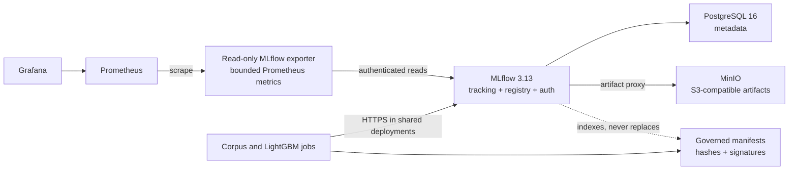

# Shared MLflow Tracking Server

The `mlflow` Docker Compose profile provides a persistent shared tracking plane
for the real-corpus and LightGBM roadmap tracks. It does not weaken the
governed dataset, split, evaluation, or release contracts: MLflow records
experiments and indexes artifacts, while the checked and signed repository
manifests remain the release authority.

## Architecture



The Compose deployment uses pinned images, basic authentication, fail-closed
default permissions, an internal-only container network, health checks,
persistent volumes, a read-only MLflow filesystem, dropped Linux capabilities,
generated local secrets, a dedicated non-root MinIO service identity for
artifact access, and a non-admin telemetry identity with read-only access to
the allow-listed experiments and model. PostgreSQL, MinIO, and the exporter
have no host port. Only the MLflow UI/API joins the edge network and binds to
`127.0.0.1` by default.

## Start and verify

Generate a private environment once:

```bash
make mlflow-bootstrap
```

The generated `deployments/mlflow/.env` has mode `0600`, is Git-ignored, and is
not overwritten automatically. Start and verify the deployment:

```bash
make mlflow-up
make mlflow-verify
make mlflow-status
```

Deployments created before the dedicated MinIO or exporter service identities
were added can be upgraded without rotating initialized PostgreSQL, MinIO root,
or MLflow administrator credentials:

```bash
./scripts/bootstrap-mlflow-env.sh --upgrade-service-credentials
make mlflow-up
make mlflow-verify
```

The upgrade appends only missing service identities and secrets. It fails
closed on a partial credential pair and does not print existing secrets.

The verification creates or confirms these roadmap resources:

- `lob-arena/corpus-releases`;
- `lob-arena/lightgbm-development`;
- `lob-arena/governed-evaluation`; and
- registered model `lob-arena-lightgbm-attack-active`.

It then creates a finished smoke run, writes metadata to PostgreSQL, uploads a
probe artifact through MLflow to MinIO, downloads it, and verifies its bytes.

Open <http://127.0.0.1:5500> and sign in with
`MLFLOW_ADMIN_USERNAME`/`MLFLOW_ADMIN_PASSWORD` from the private environment.
MinIO administration remains container-network-only. Do not paste passwords
into logs, issues, evidence bundles, or shell history.

Operational commands:

```bash
make mlflow-logs
make mlflow-verify
make mlflow-down
```

`mlflow-down` removes the MLflow profile containers but preserves both named
volumes. It does not stop the core arena services and does not delete tracking
data.

## Nebius Wave 1 deployment

The cloud deployment reuses the same pinned MLflow application, PostgreSQL
metadata store, authentication bootstrap, exporter and smoke test. Its
`deployments/mlflow/docker-compose.nebius.yml` profile replaces MinIO with
Nebius Object Storage at `https://storage.eu-north1.nebius.cloud` and requires
all credentials explicitly; it has no local placeholder defaults for secrets.

The deployed endpoint is private: `http://10.4.0.54:5500`. From the operator
workstation, use an SSH tunnel rather than opening port 5500 publicly:

```bash
ssh -L 5500:10.4.0.54:5500 aimada@89.169.102.236
```

Then open <http://127.0.0.1:5500>. The VM security group permits MLflow only
from `10.0.0.0/13` and SSH only from the recorded operator `/32`. The running
application image is pinned to its Nebius Container Registry digest. A
short-lived operator Registry token is used for an explicit pull and removed
immediately afterward; restart uses the locally cached digest and does not
retain Registry credentials.

Generate a protected Nebius environment by passing the S3 secret on standard
input; do not place the secret in a command argument or repository file:

```bash
printf '%s\n' "$AWS_SECRET_ACCESS_KEY" | \
  ./scripts/bootstrap-nebius-mlflow-env.sh \
    --output /tmp/aimada-nebius-mlflow.env \
    --access-key-id "$AWS_ACCESS_KEY_ID" \
    --bucket aimada-mlflow-e00g6zvxpr00 \
    --private-host 10.4.0.54 \
    --image 'cr.eu-north1.nebius.cloud/e00jaawvmwdhya5z2w/lob-arena-mlflow@sha256:2845ef39ff83f79748cda1aa507b2dcc0de6d379b7683e75d27d01ca9a020076'
```

The 2026-08-16 registry-backed verification run was
`aa91baa2acba40dbbd005a197fa7ffa6`; its artifact round trip completed against
`s3://aimada-mlflow-e00g6zvxpr00/artifacts`.

## Prometheus and Grafana telemetry

The `mlflow-exporter` service authenticates with a generated, non-admin MLflow
account. A one-shot initializer grants that account `READ` permission only for
the experiments and registered models in these allow lists:

- `MLFLOW_EXPORTER_EXPERIMENTS`;
- `MLFLOW_EXPORTER_MODEL_NAMES`; and
- `MLFLOW_EXPORTER_METRIC_KEYS`.

The exporter caches MLflow queries and exposes aggregate snapshots at
`mlflow-exporter:9464/metrics` on the Compose network. It exports run counts by
status, latest allow-listed finished-run metrics, bounded duration statistics,
registered-model version counts, collection health, and explicit truncation
signals when an observation limit is reached. Run IDs, hashes, parameters,
tags, and other unbounded values are never Prometheus labels. Collection uses
short, configurable MLflow HTTP timeouts and retries so an unavailable tracking
server cannot hold the Prometheus scrape or readiness endpoint indefinitely.

Start the `mlflow` and `monitoring` profiles, then open the provisioned
**LOB Arena MLflow** dashboard at <http://127.0.0.1:3000>. MLflow remains the
source of truth for individual runs; Prometheus stores only operational
aggregates and current metric snapshots.

## Track A: LightGBM

Each governed training run should log the immutable identifiers already
required by Phase 0:

- protocol, corpus, split, feature-schema, and feature-configuration hashes;
- Git commit, training seed, ordered feature columns, and input digests;
- training-only preprocessing and class-weight configuration;
- validation early-stopping result, calibration artifact, and frozen
  high-precision, balanced, and high-recall thresholds;
- paired rules-versus-LightGBM metrics, emphasizing liquidity evaporation and
  subtle layering challenge cases; and
- the checksum inventory and signed release-manifest references.

Development runs belong in `lob-arena/lightgbm-development`; immutable final
test results belong in `lob-arena/governed-evaluation`. Register a model version
only after repository release verification succeeds. A registry alias is a
deployment pointer, not proof that a model passed governance.

## Track B: real-corpus operations

Corpus construction and reviewer workflow runs belong in
`lob-arena/corpus-releases`. Log only derived governance facts and permitted
artifacts:

- session registration and provenance-manifest hashes;
- blind review/adjudication workflow version and aggregate counts;
- frozen corpus release ID, exact corpus hash, signature, and reviewer-policy
  result; and
- coverage gates for complete sessions, instruments, dates, attack families,
  seeds, and clean-window review.

Do not upload raw LOBSTER records unless the deployment, data licence, access
controls, and client agreement explicitly permit it. Prefer hashes and
encrypted, access-controlled object references.

## Sharing beyond one workstation

The checked-in defaults are deliberately local. For a private-network or client
deployment:

1. terminate TLS at a managed reverse proxy or ingress;
2. keep PostgreSQL and object storage on private networks;
3. set `MLFLOW_BIND_ADDRESS=0.0.0.0` only behind that boundary;
4. set exact `MLFLOW_ALLOWED_HOSTS` and `MLFLOW_CORS_ALLOWED_ORIGINS` values;
5. create named users and grant least-privilege experiment/model permissions
   instead of sharing the bootstrap administrator;
6. put secrets in the deployment secret manager instead of a copied `.env`;
7. back up PostgreSQL and versioned object storage; and
8. restrict raw-data and evidence retention by tenant and licence.

MinIO is the self-contained Docker default. A client or Nebius deployment can
replace it with approved S3-compatible object storage by changing the endpoint,
credentials, and artifact destination while retaining PostgreSQL and MLflow.

## Upgrade and recovery

Before changing any image pin:

1. stop new writers;
2. back up the `mlflow-postgres-data` and `mlflow-minio-data` volumes;
3. test the new pins against restored copies;
4. review upstream database migration notes; and
5. run `make mlflow-up` followed by `make mlflow-verify`.

The entrypoint lets MLflow initialize a fresh database and applies MLflow's
forward migrations when an existing schema is detected. Never downgrade an
existing metadata database in place. Rotating database or object-store
credentials for existing volumes requires coordinating the backing service;
blindly regenerating `.env` will not change credentials stored in an initialized
PostgreSQL or MinIO volume.

## Boundaries

- This deployment is not highly available; one MLflow container is sufficient
  for the current shared-development milestone.
- Basic authentication is appropriate for a controlled private deployment but
  should be integrated with the client identity boundary before enterprise use.
- The self-contained MinIO service identity has the built-in `readwrite`
  policy. Replace that with a bucket-scoped policy in a multi-bucket or
  multi-tenant deployment.
- Model and corpus approval remain external governed workflows. MLflow does not
  sign releases, adjudicate clean windows, or authorize test-fold access.
