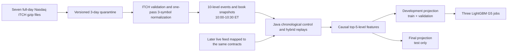

# Nasdaq Public Sample v1: Dataset and Processing Flow

Status: C0 connectivity/storage preflight passed on 2026-08-29. C1 acquired
and verified the first Nasdaq ITCH source on 2026-08-30. The first C2 attempt
verified the second source but failed before quarantine publication because the
source exceeds the S3 single-`PutObject` limit. A multipart fix is locally
reviewed; a fresh image and any retry remain separately approval-gated.

## Purpose

`nasdaq-public-sample-v1` is the frozen historical foundation for offline
LightGBM training and calibration, chronological real-time-mode detector
replays, the later Transformer benchmark, and exact-row comparison between
detectors. It is a research corpus, not a live production feed.

The source contract is
[`configs/data/nasdaq-public-sample-v1.json`](../configs/data/nasdaq-public-sample-v1.json).
The benchmark contract is
[`configs/benchmark/nasdaq-public-sample-v1.json`](../configs/benchmark/nasdaq-public-sample-v1.json).

## Exact Source Dataset

The source is seven public Nasdaq TotalView-ITCH 5.0 gzip files served over
HTTPS from `https://emi.nasdaq.com/ITCH/Nasdaq%20ITCH/`. Each file contains a
complete Nasdaq trading day across many instruments. The complete files must be
downloaded because the ITCH stream multiplexes instruments; symbol and time
filtering happens during governed parsing.

| Fold | Session date | File | Compressed bytes | Decimal GB |
| --- | --- | --- | ---: | ---: |
| Train | 2019-01-30 | `01302019.NASDAQ_ITCH50.gz` | 4,764,426,091 | 4.764 |
| Train | 2019-03-27 | `03272019.NASDAQ_ITCH50.gz` | 5,510,131,732 | 5.510 |
| Train | 2019-07-30 | `07302019.NASDAQ_ITCH50.gz` | 3,662,140,094 | 3.662 |
| Train | 2019-08-30 | `08302019.NASDAQ_ITCH50.gz` | 4,075,649,457 | 4.076 |
| Validation | 2019-10-30 | `10302019.NASDAQ_ITCH50.gz` | 3,872,931,242 | 3.873 |
| Test | 2019-12-30 | `12302019.NASDAQ_ITCH50.gz` | 3,524,013,057 | 3.524 |
| Test | 2020-01-30 | `01302020.NASDAQ_ITCH50.gz` | 5,597,158,940 | 5.597 |

The complete compressed transfer is 31,006,450,613 bytes: 31.006 decimal GB or
28.877 GiB. The four training files contribute 18,012,347,374 bytes, validation
contributes 3,872,931,242 bytes, and final test contributes 9,121,171,997 bytes.

## Governed Historical Selection

Each parsed day retains only:

- instruments `AAPL`, `MSFT`, and `NVDA`;
- the half-hour interval from 10:00:00 through 10:30:00 Eastern Time;
- normalized order events and reconstructed visible book snapshots to 10
  levels; and
- stable source, session, sequence, timestamp, replay, campaign, and row
  identities.

LightGBM v2 features use the top five reconstructed levels with causal 2-second
and 10-second windows. The 10-level normalized book remains available for
replay and later consumers; the five-level setting is a feature choice, not a
loss of source provenance.

The seven dates and three symbols form 21 base symbol-date sessions and 10.5
symbol-hours of historical coverage:

| Fold | Dates | Base sessions | Historical symbol-hours |
| --- | ---: | ---: | ---: |
| Train | 4 | 12 | 6.0 |
| Validation | 1 | 3 | 1.5 |
| Test | 2 | 6 | 3.0 |

Exact ITCH message counts, accepted order events, executions, traded-share
volume, per-symbol book updates, Parquet bytes, and supervised feature-row
counts are intentionally not estimated. C1-C3 must measure and bind them after
the real bodies are downloaded and parsed.

## Replay Corpus

For each base symbol-date session, preparation produces one unchanged control
stream and nine deterministic hybrid streams:

- `spoofing_like_wall`, seeds 41, 42, and 43;
- `layering_like`, seeds 41, 42, and 43; and
- `quote_stuffing`, seeds 41, 42, and 43.

This yields three controls plus 27 hybrid streams per date, or 21 controls plus
189 hybrids across all dates. The complete benchmark therefore contains 210
replay streams, representing approximately 105 logical replay-hours. A base
session and all of its scenario variants remain in the same fold.

Historical control rows use the explicit research label source
`research_control_assumption`. Synthetic scenarios use `synthetic_scenario`.
The controls must not be described as independently verified clean production
data.

## End-to-End Data Flow

The model never trains directly from a gzip file. It trains from an immutable
tabular projection whose inventory binds the source, normalized corpus, replay,
feature, split, and label-provenance hashes. Transformer sequence projections
are derived from the same frozen rows and split identities. The final-test
projection is stored separately and cannot be opened by a development Job.

Offline real-time-mode evaluation delivers historical canonical events in
chronological order through the Java control plane. A future production
detector will consume a new live feed mapped to the same canonical contracts;
it will not treat the 2019-2020 files as live input.

## Bounded Cloud Stages

1. **C0 — complete.** Read a tiny governed request, issue exactly seven HTTPS
   `HEAD` requests, download zero Nasdaq body bytes, and verify a disposable S3
   probe. Job `aijob-e00q7wmjsr9d8hmgqk` passed.
2. **C1 — complete.** Job `aijob-e00f2zk6kmsxtphrmm` downloaded only
   `01302019.NASDAQ_ITCH50.gz` (4,764,426,091 bytes), verified HTTP metadata,
   gzip integrity and full SHA-256, then published six versioned quarantine
   objects with `SUCCESS` last.
3. **C2 — separately gated.** Acquire the other six allowlisted files strictly
   in sequence, stopping on the first failure. The sequence-2 attempt stopped
   after successful source verification when single-request S3 publication
   rejected the 5,510,131,732-byte object.
4. **C3 — separately gated.** Normalize, reconstruct books, run deterministic
   replays, generate features, and record actual event/row/byte volumes.
5. **C4 — separately gated.** Freeze development and final projections, prove
   development-to-final access denial, publish both folds through the operator
   boundary, and deactivate the temporary preparation key.
6. **G5.** Submit three reproducibility jobs only from the verified development
   tabular projection.

The preparation identity can access only
`dev/data/public-sample-v1/*`. Current and noncurrent objects under the raw
quarantine prefix expire after three days. The identity cannot access model
releases, the final bucket, results, or MLflow and expires on 2026-09-30 unless
deactivated earlier after C4.

## Current Evidence

- C0 disposition: `c0_preflight_passed`.
- Seven source responses: HTTP 200, no redirect, exact declared lengths.
- Nasdaq response-body bytes through C0: zero.
- S3 probe: 40 bytes, read-back and checksum verified, deleted and confirmed
  absent.
- C1 disposition: `c1_acquisition_passed`.
- C1 source: `01302019.NASDAQ_ITCH50.gz`, 4,764,426,091 bytes, one HTTP request,
  no resume, gzip verified, SHA-256
  `8c97b5b13bc451c012c2466fb7e258da134dab29aa47b67fe7b0088c78e870be`.
- C1 runtime: 969.304 seconds at 4,915,303.869 bytes/second; peak RSS
  110,940,160 bytes.
- C1 quarantine: six versioned objects, source version `1`, `SUCCESS` last,
  lifecycle response expiry 2026-09-03.
- C2 sequence-2 attempt: source length, gzip and SHA-256 passed; source SHA-256
  `7997025b9e09dd6c2ecb0bfa48a856197e6e800711ab67367ee0f2ab724b9ba8`.
- C2 publication failed before `SUCCESS`: there are no current objects under
  the failed quarantine prefix and one cleanup delete marker remains.
- Root cause: `PutObject` was used for a 5,510,131,732-byte source, which is
  141,422,612 bytes above the 5 GiB single-upload limit. The reviewed local fix
  selects the AWS CLI managed multipart path above that boundary.
- Public-data Jobs consumed: 3 of 15.
- Project spend before C0: USD 11.62 including VAT.
- Project spend after C0: USD 12.22 including VAT; measured public-data
  campaign increment: USD 0.60.
- Spend reporting is informational and is not a C2 preparation or submission
  gate; the fixed resource, byte, sequential, Job-count and approval gates
  remain mandatory.

Local C0 evidence is under `outputs/market-data/nasdaq-c0-6b00d8c-20260829/`.
Local C1 evidence is under
`outputs/market-data/nasdaq-c1-01302019-c4d6bb9-20260829/`. These evidence
files are local operational artifacts and are not model inputs.
