# Nebius Public Market Data Plan for LightGBM Wave 1

Status: Approved research-plan amendment; D0-D2 implementation not started;
no market-data transfer authorized or started

Date: 2026-08-16

## Decision

Continue the existing G4 fixture smoke unchanged. For G5 onward, replace the
fixture-only performance track with a research benchmark built from official
public Nasdaq TotalView-ITCH samples and the repository's LOBSTER SPY sample.

The raw and derived data will be prepared in Nebius, not on the workstation.
The workstation has about 46 GiB free and the importer intentionally reserves
20 GiB, while the selected Nasdaq sources total about 28.9 GiB compressed.

This track is an **official-public-sample research benchmark**. It does not
claim unrestricted redistribution rights, a licensed production corpus, or
verified absence of abuse in historical control windows. Raw source objects
remain private and are never included in the repository, MLflow, result
bundles, or model releases.

## Selected Inputs

Nasdaq identifies the public directory as sample TotalView-ITCH raw data in its
[ITCH FAQ](https://classic.nasdaqtrader.com/Content/TechnicalSupport/FAQs/ITCH_FAQ.pdf).
The selected files are listed in the
[official Nasdaq directory](https://emi.nasdaq.com/ITCH/Nasdaq%20ITCH/) and
use the documented ITCH 5.0 BinaryFILE framing.

| Fold | Source files | Instruments | Window |
| --- | --- | --- | --- |
| Train | `01302019`, `03272019`, `07302019`, `08302019` | AAPL, MSFT, NVDA | 10:00-10:30 ET, depth 10 |
| Validation | `10302019` | AAPL, MSFT, NVDA | 10:00-10:30 ET, depth 10 |
| Test | `12302019`, `01302020` | AAPL, MSFT, NVDA | 10:00-10:30 ET, depth 10 |

The exact filenames are `<date>.NASDAQ_ITCH50.gz`. Their verified HTTP content
lengths total 31,006,450,613 bytes (about 28.9 GiB). Every date is assigned to
one fold before replay generation. All instruments, controls, attack families,
seeds and injection times derived from one date stay in that fold.

The LOBSTER challenge uses the existing SPY 2012-06-21 sample, restricted to
10:00-10:30 and the same causal feature configuration. It is not pooled into
Nasdaq training or candidate selection. It is a frozen cross-source robustness
evaluation performed after the Nasdaq candidate is selected.

Excluded from this release:

- the generated 8-row local ITCH fixture, except for parser and cloud smoke;
- checksum-only 2018 directory entries;
- ITCH v2, NOII-only and aggregated TotalView files;
- newer `S*.txt.gz` sources until the importer supports `MMDDYY` names; and
- any source that fails gzip, BinaryFILE, system-event, order-lifecycle or
  source-hash validation.

## Cloud Flow

```mermaid
flowchart LR
    Nasdaq["Nasdaq public HTTPS samples"] --> Acquire["Nebius acquisition Job"]
    Lobster["Repository LOBSTER sample"] --> Acquire
    Acquire --> Raw["Development bucket<br/>data/public-sample-v1/sources"]
    Raw --> Prepare["Nebius preparation Job<br/>normalize + Java control/hybrid replay"]
    Prepare --> Features["Causal v2 features<br/>controls + injected attacks"]
    Features --> Freeze["Hash and freeze one corpus/split/release"]
    Freeze --> Dev["Development bucket<br/>train + validation projection"]
    Freeze --> Final["Final bucket<br/>test projection"]
    Dev --> Train["G5/G6 LightGBM Jobs"]
    Train --> Candidate["Frozen candidate in results bucket"]
    Candidate --> FinalRun["One authorized G8 Job"]
    Final --> FinalRun
    FinalRun --> Results["Verified release + MLflow pointer"]
```



Nebius Serverless AI Jobs support Object Storage mounts and timeouts up to 168
hours. Resources in the selected subnet use the default egress gateway for
public HTTPS access. Standard Object Storage is retained because same-region
traffic is not charged as egress and the workload does not need Enhanced
Throughput storage.

## Storage Layout

Reuse the four existing Wave 1 buckets. Do not create a fifth bucket.

```text
s3://aimada-wave1-dev-e00g6zvxpr00/
  data/public-sample-v1/
    sources/nasdaq/<date>/staging/{source.gz,source.json,input-inventory.json,SUCCESS}
    sources/lobster/spy-2012-06-21/staging/{source files,source.json,input-inventory.json,SUCCESS}
    normalized/<venue>/<date>/<instrument>/{events.parquet,book_snapshots.parquet,manifest.json}
    replays/<base_session>/<control-or-campaign>/...
    features/<base_session>/<control-or-campaign>/...
    release-staging/{development,final}/...
  releases/public-sample-v1-<release-hash>/...

s3://aimada-wave1-final-e00g6zvxpr00/
  releases/public-sample-v1-<release-hash>/...

s3://aimada-wave1-results-e00g6zvxpr00/
  campaigns/wave1-research-20260816/{development,final}/...
```

Every source and release uses a unique immutable prefix. Objects are uploaded
under `staging/`; a canonical inventory and checksums are verified by read-back;
`SUCCESS` is written last. Partial prefixes are ignored and the existing
one-day incomplete-multipart cleanup remains enabled. No object is overwritten.

At current published pricing, 28.9 GiB of Nasdaq raw data plus roughly 0.9 GiB
of LOBSTER raw data costs about USD 0.44 per month in Standard storage before
derived artifacts and versions. Cap the complete data prefix at 120 GiB
(about USD 1.76 per month) and stop before exceeding it.

## IAM Amendment

Add one temporary least-privilege identity; do not broaden the development
model identity.

| Identity | Allowed | Forbidden |
| --- | --- | --- |
| Data-preparation Job | Read/write `dev/data/public-sample-v1/*` | `dev/releases/*`, final bucket, results, MLflow |
| Operator publisher | Read frozen release staging; publish exact verified projections | Model tuning or changing frozen manifests |
| Development model Job | Read `dev/releases/*`; write campaign development results | `dev/data/*`, final bucket |
| Final model Job | Read `final/releases/*` and frozen development candidate; write final results | Development data-prep prefixes and other campaigns |
| MLflow VM | Existing MLflow artifact prefix only | Every market-data and release prefix |

The preparation access key is MysteryBox-backed, inactive outside preparation,
and deactivated after the two fold projections are published. Its bucket rule
is restricted to `data/public-sample-v1/*`. Mutating-object audit logs remain
enabled. The final key remains inactive until signed candidate authorization.

## Required Repository Work Before Transfer

### D0 - Source and provenance contracts

1. Add `configs/data/nasdaq-public-sample-v1.json` with exact URLs, content
   lengths, dates, symbols, windows, folds and expected file count.
2. Add a strict source-release manifest recording URL, HTTP ETag and
   Last-Modified, byte length, SHA-256, gzip result, ITCH parser/config hash,
   system-event coverage and Object Storage version ID.
3. Preserve `nasdaq_itch` in feature provenance. Historical ITCH controls must
   not be serialized as `source_type=lobster`; hybrid rows must also record the
   base historical source.
4. Add a research benchmark protocol whose negative label source is explicitly
   `research_control_assumption`. It must not reuse the production phrase
   `independently_verified_clean`.

### D1 - Cloud preparation workload

1. Add a bounded downloader with HTTP resume, declared length checking,
   SHA-256, `gzip -t`, maximum-byte limits and no redirect to an unapproved
   host.
2. Extend ITCH normalization to extract AAPL, MSFT and NVDA in one pass per
   source. The current one-symbol implementation would decompress every daily
   file three times.
3. Add the Java control plane to a digest-pinned preparation image and run it
   on localhost inside the Job. The existing LightGBM image contains Python ML
   dependencies but not the Java historical/hybrid replay runtime.
4. Add `run_market_data_wave1.py` modes for `preflight`, `acquire`, `prepare`
   and `verify`. Acquisition and preparation are separate so a replay failure
   never invalidates a verified raw source object.
5. Add a governed-public-sample staging command. The existing CLI only stages
   `approved-research-fixture` requests even though the cloud runner already
   accepts `governed-feature-release` inputs.

### D2 - Fold-isolated release loading

Implement signed/hash-bound fold projections before publishing data:

- the root corpus, split and feature-release identities inventory all folds;
- the development projection contains train and validation artifacts only;
- the final projection contains test artifacts only; and
- each loader invocation verifies its projection against the same frozen root
  identities without opening unavailable folds.

This is required because the current governed loader revalidates the complete
corpus artifact tree even in development mode. Merely omitting test Parquet
files from the development bucket would currently make the load fail; copying
them there would violate the test isolation control.

## Label and Replay Policy

For each of the 21 Nasdaq base sessions, create one historical control and nine
hybrid campaigns: three seeds for each of `spoofing_like_wall`,
`layering_like`, and `quote_stuffing`. This yields 210 replay domains:

| Fold | Base sessions | Replay domains |
| --- | ---: | ---: |
| Train | 12 | 120 |
| Validation | 3 | 30 |
| Test | 6 | 60 |

Positive rows come only from separate synthetic scenario ground truth.
Negative rows come only from predeclared matched control windows that pass data
integrity checks and remain outside every injection causal neighborhood. They
are research assumptions, not assertions that Nasdaq certified the market as
abuse-free. Ambiguous and unlabeled rows remain excluded from supervised
training and denominators.

Feature generation uses `configs/features/lightgbm-v2.json`. Features are
calculated before labels are joined. Source name, participant attribution,
campaign identity and labels are unavailable to feature formulas.

## Execution Gates

### C0 - Recover the existing cloud smoke

The first six G4 attempts failed. The first two mount-based Jobs remained
`STARTING` without container logs; two no-volume Jobs used an older image
without the `run-s3` command; the fifth used a reversed entrypoint and Python
tried to open `/job/serverless/jobs/run`; attempt 6 reached the runner but AWS
CLI v1 rejected the v2-only pager option on the first Object Storage list.
Attempt 7 completed the corrected governed workload and published a verified
`SUCCESS` result prefix. G4 collection and exit remain pending fresh post-run
spend. Do not submit a large transfer or preparation Job until the dedicated
public-data preflight also proves:

- default internet egress can reach `emi.nasdaq.com`;
- the prefix-scoped S3 API read/write path works without a filesystem mount;
- the source host returns the declared content length; and
- a small object can be published, read back and removed from a dedicated
  preflight prefix.

The preflight is not authorization to download a multi-gigabyte source.
The current Wave 1 record authorizes no further Job submission, so this
preflight also requires a new explicit Operator authorization.

### C1 - Acquisition pilot

Run exactly one acquisition Job for `01302019.NASDAQ_ITCH50.gz`:

- `cpu-d3`, `4vcpu-16gb`, 100 GiB disk, four-hour timeout;
- no automatic retry and no parallelism;
- download to Job scratch, never directly to a final object key;
- verify size, gzip and SHA-256 before multipart upload;
- attach SHA-256 as object metadata and verify a read-back range/object hash;
- publish its inventory and `SUCCESS` last; and
- record Job ID, image digest, runtime, peak RSS, bytes/second and cost.

If the pilot fails, stop and fix locally. Do not start the other six downloads.

### C2 - Remaining acquisition

Acquire the remaining six files sequentially using the identical request
template. One successful source prefix is never overwritten or retried.
The public-data campaign has a separate cap of 15 Jobs: one preflight, seven
acquisition Jobs, and seven preparation Jobs. Failed attempts consume that cap
and stop the campaign for reconciliation; they do not expand it. The original
model-development ceiling remains 20 Jobs. The six failed attempts plus the
completed attempt 7 have consumed seven slots; 13 model-development slots
remain.

### C3 - Preparation and replay

Process one trading date per Job, initially sequentially. Each Job:

1. downloads and verifies the exact source package through the S3 API;
2. normalizes all three instruments in one source pass;
3. starts the pinned Java control plane locally;
4. runs control and hybrid comparisons twice and rejects nondeterminism;
5. generates causal features and quality reports;
6. writes only bounded non-secret logs; and
7. publishes checksummed outputs with `SUCCESS` last.

After two dates show deterministic output and acceptable memory/runtime,
parallelism may increase to two Jobs. Never process two jobs for the same date.

### C4 - Corpus freeze and projection publication

Build and verify the complete research corpus, chronological split and feature
release under the preparation identity. Freeze the root hashes. Generate the
development and final projections, prove that the development identity cannot
read the final projection, publish each to its existing bucket, then deactivate
the preparation key.

### C5 - LightGBM experiments

- G5: repeat the identical Nasdaq development request three times and require
  matching model, prediction, metric, feature-order and calibration hashes.
- G6: run the predeclared hyperparameter, feature-ablation, seed-stability and
  calibration matrix on the same frozen train/validation projection.
- Freeze the candidate using validation only.
- G8: after signed authorization, evaluate once on the Nasdaq test projection.
- After the Nasdaq result is frozen, score the LOBSTER challenge without
  retuning and report it separately as cross-source robustness.

The final disposition is `research_baseline_qualified`,
`cloud_pipeline_qualified_performance_pending`, or `not_qualified`. A research
qualification may unlock Wave 2 engineering, but never a production or client
surveillance claim.

## Budget and Stop Rules

- Reserve no more than USD 10 of the Wave 1 USD 50 ceiling for acquisition and
  data preparation.
- Report at USD 5 of data-preparation spend; stop new data Jobs at USD 8 and
  reconcile; hard-stop them at USD 10.
- Cap raw plus derived storage at 120 GiB.
- Keep Standard storage. Same-region Object Storage traffic is free of egress
  charges; internet or cross-region egress is currently USD 0.015/GiB.
- Stop the shared MLflow VM whenever tracking is not required.
- A source hash/size mismatch, redirect to an unapproved host, gzip failure,
  parser nondeterminism, replay mismatch, fold leakage or preparation identity
  access to final/results immediately blocks publication.

## Completion Evidence

The plan is complete only when the repository contains:

- a signed source-release inventory for all seven Nasdaq files and LOBSTER;
- Job and resource evidence for acquisition and preparation;
- normalized/replay/feature hashes for every declared domain;
- a frozen root corpus/split/feature-release identity;
- independently verifiable development and final projections;
- development-to-final access-denial evidence;
- exact G5 repeat comparison;
- the complete G6 candidate report;
- one authorized G8 result;
- the separate Nasdaq-to-LOBSTER robustness report; and
- cost reconciliation and the final claim boundary.

## References

- [Nasdaq sample ITCH directory](https://emi.nasdaq.com/ITCH/Nasdaq%20ITCH/)
- [Nasdaq TotalView-ITCH 5.0 specification](https://classic.nasdaqtrader.com/content/technicalsupport/specifications/dataproducts/NQTVITCHSpecification.pdf)
- [Nebius Serverless AI Job management](https://docs.nebius.com/serverless/jobs/manage)
- [Nebius routing and default internet egress](https://docs.nebius.com/vpc/routing/overview)
- [Nebius Object Storage performance guidance](https://docs.nebius.com/object-storage/performance-cost-best-practices)
- [Nebius Object Storage pricing](https://docs.nebius.com/object-storage/resources/pricing)
