# Nebius Public Market Data Plan for the Learned-Detector Roadmap

Status: C0-C4 repository implementation, the dedicated cloud foundation, fresh
`linux/amd64` Registry image and C0 cloud preflight are complete. Every Nasdaq
source transfer/preparation Job, projection publication, access-denial proof and
key deactivation remain separately approval-gated. No Nasdaq response body or
multi-gigabyte source transfer is authorized or started.

Date: 2026-08-29

## Decision

Preserve the completed G4 fixture smoke as cloud-pipeline evidence. For G5
onward, replace the fixture-only performance track with a research benchmark
built from official public Nasdaq TotalView-ITCH samples and the repository's
LOBSTER SPY sample.

The exact Nasdaq source volumes, historical selection, replay expansion,
labeling and stage-by-stage processing flow are summarized in
[Nasdaq Public Sample v1: Dataset and Processing Flow](nasdaq-public-sample-v1-data-flow.md).

Build this once as the shared governed data foundation for all three detector
waves. The same immutable corpus and split identities must produce a tabular
projection for LightGBM, a causal ordered-sequence projection for the
Transformer, and the row identities needed to join later Transformer outputs
into the separate Transformer-to-LightGBM cascade. No model may silently
create its own dates, labels, folds, replay domains or final-test rows.

The active delivery target is GitHub Story #90: one campaign-bound E2E
demonstration covering the Nasdaq benchmark, all three learned-detector paths,
a separate no-retuning LOBSTER robustness challenge and one verified evidence
package. The simple CEO-facing UI is downstream of this technical flow. BYO
data and BYO detector-adapter productization are commercial Tier-1 features but
remain parked until the E2E milestone exits; this plan's Nasdaq/LOBSTER paths
serve as their first-party reference implementations.

The raw and derived data will be prepared in Nebius, not on the workstation.
The workstation has about 46 GiB free and the importer intentionally reserves
20 GiB, while the selected Nasdaq sources total about 28.9 GiB compressed.

This track is an **official-public-sample research benchmark**. It does not
claim unrestricted redistribution rights, a licensed production corpus, or
verified absence of abuse in historical control windows. Raw source objects
remain private and are never included in the repository, MLflow, result
bundles, or model releases.

This plan authorizes neither a Nasdaq website crawl nor a mirror. Acquisition
is allowlist-only: exactly the declared files, dates, symbols, time windows and
depth below. Because each approved ITCH gzip is a sequential full-market
stream, a Job may need to download the complete approved compressed file to
ephemeral scratch before it can select symbols and windows. That technical
requirement does not authorize retention of unrelated records. A private raw
quarantine object may exist only under a declared short lifecycle while its
derived release is verified; persistent S3 releases retain the selected
AAPL/MSFT/NVDA windows, manifests and hashes, not a general Nasdaq archive.

## Selected Inputs

Nasdaq identifies the public directory as sample TotalView-ITCH raw data in its
[ITCH FAQ](https://classic.nasdaqtrader.com/Content/TechnicalSupport/FAQs/ITCH_FAQ.pdf).
The selected files are listed in the
[official Nasdaq directory](https://emi.nasdaq.com/ITCH/Nasdaq%20ITCH/) and
use the documented ITCH 5.0 BinaryFILE framing.

| Fold | Source files | Instruments | Window |
| --- | --- | --- | --- |
| Train | `01302019`, `03272019`, `07302019`, `08302019` | AAPL, MSFT, NVDA | 10:00-10:30 ET, depth 10 |
| Validation | `10302019` | AAPL, MSFT, NVDA | 10:00-10:30 ET, depth 10 |
| Test | `12302019`, `01302020` | AAPL, MSFT, NVDA | 10:00-10:30 ET, depth 10 |

The exact filenames are `<date>.NASDAQ_ITCH50.gz`. Their verified HTTP content
lengths total 31,006,450,613 bytes (about 28.9 GiB). Every date is assigned to
one fold before replay generation. All instruments, controls, attack families,
seeds and injection times derived from one date stay in that fold.

The LOBSTER challenge uses the existing SPY 2012-06-21 sample, restricted to
10:00-10:30 and the same causal feature configuration. It is not pooled into
Nasdaq training or candidate selection. It is a frozen cross-source robustness
evaluation performed after the Nasdaq candidate is selected.

Excluded from this release:

- the generated 8-row local ITCH fixture, except for parser and cloud smoke;
- checksum-only 2018 directory entries;
- ITCH v2, NOII-only and aggregated TotalView files;
- newer `S*.txt.gz` sources until the importer supports `MMDDYY` names; and
- any source that fails gzip, BinaryFILE, system-event, order-lifecycle or
  source-hash validation.

## Cloud Flow

```mermaid
flowchart LR
    Nasdaq["Nasdaq public HTTPS samples"] --> Acquire["Nebius acquisition Job"]
    Lobster["Repository LOBSTER sample"] --> Acquire
    Acquire --> Raw["Private short-lived quarantine<br/>exact allowlisted packages only"]
    Raw --> Prepare["Nebius preparation Job<br/>select + normalize + Java control/hybrid replay"]
    Prepare --> Features["Causal v2 features<br/>controls + injected attacks"]
    Features --> Freeze["Hash and freeze one corpus/split root"]
    Freeze --> Tabular["lob_features_v2<br/>LightGBM projection"]
    Freeze --> Sequence["causal sequence projection<br/>Transformer"]
    Tabular --> Dev["Development bucket<br/>train + validation projections"]
    Sequence --> Dev
    Tabular --> Final["Final bucket<br/>test projections"]
    Sequence --> Final
    Dev --> Train["G5/G6 LightGBM, then Wave 2 Jobs"]
    Train --> Candidate["Frozen candidate in results bucket"]
    Candidate --> FinalRun["One authorized G8 Job"]
    Final --> FinalRun
    FinalRun --> Results["Verified releases + MLflow pointers"]
    Results --> Cascade["Wave 3 Transformer feature release<br/>exact identity join + LightGBM"]
```



Nebius Serverless AI Jobs support Object Storage mounts and timeouts up to 168
hours. Resources in the selected subnet use the default egress gateway for
public HTTPS access. Standard Object Storage is retained because same-region
traffic is not charged as egress and the workload does not need Enhanced
Throughput storage.

## Storage Layout

Reuse the four existing Wave 1 buckets. Do not create a fifth bucket.

```text
s3://aimada-wave1-dev-e00g6zvxpr00/
  data/public-sample-v1/
    quarantine/nasdaq/<date>/{source.gz,source.json,input-inventory.json,SUCCESS}
    sources/lobster/spy-2012-06-21/staging/{source files,source.json,input-inventory.json,SUCCESS}
    normalized/<venue>/<date>/<instrument>/{events.parquet,book_snapshots.parquet,manifest.json}
    replays/<base_session>/<control-or-campaign>/...
    features/<base_session>/<control-or-campaign>/...
    release-staging/{development,final}/{tabular,sequence}/...
  releases/public-sample-v1-<release-hash>/development/{tabular,sequence}/...

s3://aimada-wave1-final-e00g6zvxpr00/
  releases/public-sample-v1-<release-hash>/final/{tabular,sequence}/...

s3://aimada-wave1-results-e00g6zvxpr00/
  campaigns/wave1-research-20260816/{development,final}/...
  transformer-features/<transformer-feature-release-hash>/...
```

Every source and release uses a unique immutable prefix. Objects are uploaded
under `staging/`; a canonical inventory and checksums are verified by read-back;
`SUCCESS` is written last. Partial prefixes are ignored and the existing
one-day incomplete-multipart cleanup remains enabled. No object is overwritten.

The quarantine prefix has an explicit lifecycle measured in days, is private,
and is deleted after normalized output and provenance read-back pass unless a
separate retention decision is recorded. Lifecycle deletion must not remove
the selected normalized corpus, its source manifest, HTTP metadata, complete
source SHA-256 or immutable consumer releases. At current published pricing,
retaining all 28.9 GiB of Nasdaq compressed sources plus roughly 0.9 GiB of
LOBSTER data would cost about USD 0.44 per month before derived artifacts, but
that is a cost bound rather than authorization for permanent raw retention.
Cap quarantine plus derived data at 120 GiB and stop before exceeding it.

## IAM Amendment

Add one temporary least-privilege identity; do not broaden the development
model identity.

| Identity | Allowed | Forbidden |
| --- | --- | --- |
| Data-preparation Job | Read/write `dev/data/public-sample-v1/*` | `dev/releases/*`, final bucket, results, MLflow |
| Operator publisher | Read frozen release staging; publish exact verified projections | Model tuning or changing frozen manifests |
| Development model Job | Read `dev/releases/*`; write campaign development results | `dev/data/*`, final bucket |
| Final model Job | Read `final/releases/*` and frozen development candidate; write final results | Development data-prep prefixes and other campaigns |
| MLflow VM | Existing MLflow artifact prefix only | Every market-data and release prefix |

The preparation access key is MysteryBox-backed, inactive outside preparation,
and deactivated after the two fold projections are published. Its bucket rule
is restricted to `data/public-sample-v1/*`. Mutating-object audit logs remain
enabled. The final key remains inactive until signed candidate authorization.

## Required Repository Work Before Transfer

### D0 - Source and provenance contracts

1. Add `configs/data/nasdaq-public-sample-v1.json` with exact URLs, content
   lengths, dates, symbols, windows, folds and expected file count.
2. Add a strict source-release manifest recording URL, HTTP ETag and
   Last-Modified, byte length, SHA-256, gzip result, ITCH parser/config hash,
   system-event coverage and Object Storage version ID.
3. Preserve `nasdaq_itch` in feature provenance. Historical ITCH controls must
   not be serialized as `source_type=lobster`; hybrid rows must also record the
   base historical source.
4. Add a research benchmark protocol whose negative label source is explicitly
   `research_control_assumption`. It must not reuse the production phrase
   `independently_verified_clean`.

### D1 - Cloud preparation workload

1. Add a bounded downloader with HTTP resume, declared length checking,
   SHA-256, `gzip -t`, maximum-byte limits and no redirect to an unapproved
   host.
2. Extend ITCH normalization to extract AAPL, MSFT and NVDA in one pass per
   source. The current one-symbol implementation would decompress every daily
   file three times.
3. Add the Java control plane to a digest-pinned preparation image and run it
   on localhost inside the Job. The existing LightGBM image contains Python ML
   dependencies but not the Java historical/hybrid replay runtime.
4. Add `run_market_data_wave1.py` modes for `preflight`, `acquire`, `prepare`
   and `verify`. Acquisition and preparation are separate so a replay failure
   never invalidates a verified raw source object.
5. Add a governed-public-sample staging command. The existing CLI only stages
   `approved-research-fixture` requests even though the cloud runner already
   accepts `governed-feature-release` inputs.
6. Enforce the allowlist before the first HTTP request and again before S3
   publication. Reject undeclared filenames, dates, symbols, windows, hosts,
   redirects and byte counts; never enumerate or copy the rest of the site.
7. Publish only the selected normalized rows and required provenance as the
   durable dataset. Put any complete approved gzip in private quarantine with
   a declared lifecycle and prove its expiry/deletion after preparation.

### D2 - Fold-isolated release loading

Implement signed/hash-bound fold projections before publishing data:

- the root corpus, split and feature-release identities inventory all folds;
- the development projection contains train and validation artifacts only;
- the final projection contains test artifacts only; and
- each loader invocation verifies its projection against the same frozen root
  identities without opening unavailable folds.

This is required because the current governed loader revalidates the complete
corpus artifact tree even in development mode. Merely omitting test Parquet
files from the development bucket would currently make the load fail; copying
them there would violate the test isolation control.

### D3 - Cross-model consumer contracts and programs

Build model-specific projections from one frozen root rather than copying or
resplitting source data for each model:

1. `tabular_projection_v1` contains `lob_features_v2`, supervised row
   identities and fold-bound manifests for the existing LightGBM trainer and
   detector runner.
2. `sequence_projection_v1` contains ordered causal event/feature sequences,
   cutoff timestamps, masks, sequence-to-row identities and the same fold
   binding for the Wave 2 Transformer materializer, trainer and batch scorer.
3. Wave 3 produces `transformer_feature_release_v1` from the frozen sequence
   projection. Its scores/embeddings join the tabular projection only by exact
   corpus, split, replay and row identities; nearest-time or positional joins
   are forbidden.
4. Training and scoring programs reject incompatible corpus, split, schema,
   sequence or model hashes. If Transformer features are missing, stale or
   invalid, serving records the condition and uses the verified tabular
   LightGBM fallback rather than imputing temporal features.
5. Rules, LightGBM, standalone Transformer and the cascade use identical
   immutable evaluation rows. Validation may select features, sequence shape,
   checkpoints and hyperparameters; final-test results may not feed back into
   preparation or tuning.

This shared foundation is intended to improve prediction quality by adding
representative historical microstructure and causal temporal context. An
improvement is not assumed: it must be demonstrated through the predeclared
paired metrics and ablations, and a negative Transformer or cascade result is
a valid roadmap outcome.

## Label and Replay Policy

For each of the 21 Nasdaq base sessions, create one historical control and nine
hybrid campaigns: three seeds for each of `spoofing_like_wall`,
`layering_like`, and `quote_stuffing`. This yields 210 replay domains:

| Fold | Base sessions | Replay domains |
| --- | ---: | ---: |
| Train | 12 | 120 |
| Validation | 3 | 30 |
| Test | 6 | 60 |

Positive rows come only from separate synthetic scenario ground truth.
Negative rows come only from predeclared matched control windows that pass data
integrity checks and remain outside every injection causal neighborhood. They
are research assumptions, not assertions that Nasdaq certified the market as
abuse-free. Ambiguous and unlabeled rows remain excluded from supervised
training and denominators.

Feature generation uses `configs/features/lightgbm-v2.json`. Features are
calculated before labels are joined. Source name, participant attribution,
campaign identity and labels are unavailable to feature formulas.

## Execution Gates

### C0 - Prove the dedicated data preflight

G4 is complete: after six bounded failures, attempt 7 completed the corrected
governed workload, published a verified `SUCCESS` result prefix, passed all 16
exit gates and reconciled spend at USD 8.57 including VAT. G5 is unlocked and
13 of 20 development-job slots remain. Immediately before C0, the Operator
reconciled total Nebius project spend at USD 11.62 including VAT on 2026-08-29.
C0 consumed 1 of the separately bounded 15 public-data Jobs. The post-C0 total
is USD 12.22 including VAT, so the measured data-preparation campaign increment
is USD 0.60. The whole-project spend and the public-data subcampaign stop gate
are recorded separately. That model smoke did not prove or authorize
public-data acquisition. C0 subsequently proved:

- default internet egress can reach `emi.nasdaq.com`;
- the prefix-scoped S3 API read/write path works without a filesystem mount;
- the source host returns the declared content length; and
- a small object can be published, read back and removed from a dedicated
  preflight prefix.

The preflight is not authorization to download a multi-gigabyte source.
The current Wave 1 record authorizes no further Job submission, so this
preflight also requires a new explicit Operator authorization.

The implemented C0 path is deliberately narrower than acquisition:

- `configs/data/nasdaq-public-sample-v1.json` is a strict seven-file allowlist
  with an exact declared total of 31,006,450,613 bytes;
- the Job may issue exactly seven HTTPS `HEAD` requests and records zero Nasdaq
  response-body bytes;
- S3 access uses API calls only, with no mount, against one immutable input
  prefix, one immutable result prefix and one disposable probe key of at most
  256 bytes;
- the probe is uploaded, metadata-checked, downloaded, SHA-256 checked,
  deleted and deletion-checked;
- resources are fixed at `cpu-d3`, `4vcpu-16gb`, 100 GiB and one hour, with
  `restart-policy=never`;
- the input publisher requires an explicit approval reference, and submission
  additionally requires publication evidence plus the SHA-256 of the reviewed
  dry run; and
- actual Job context, immutable image digest, project, region, resources and
  run-specific S3 prefixes are revalidated inside the container.

Local evidence as of 2026-08-28: eight focused tests pass, Ruff passes, the
Job image builds, and the container entrypoint smoke passes. This is readiness
evidence only: no cloud resource was created and no Nasdaq endpoint was called.
After a successful C0 result is collected and reconciled, obtain a separate
explicit authorization for the one-file C1 acquisition pilot. C4 key
deactivation and any manual quarantine deletion require their own explicit
authorization at the time of action.

Cloud exit evidence as of 2026-08-29: Job
`aijob-e00q7wmjsr9d8hmgqk` completed in the fixed resource envelope. All seven
allowlisted Nasdaq objects returned HTTP 200 without a redirect; their declared
lengths matched the frozen total of 31,006,450,613 bytes. The Job issued exactly
seven `HEAD` requests and downloaded zero Nasdaq response-body bytes. Its
40-byte S3 probe was uploaded, read back, SHA-256 verified, deleted and confirmed
absent. Pre-submit and post-submit deployment-tag resolution matched immutable
image digest
`sha256:ef3bb77d0e76309e3042fad65818c753e91ab3e9e549c0f8583c63145a8bc120`.
Disposition is `c0_preflight_passed`. Post-C0 spend is USD 12.22 including VAT,
a measured USD 0.60 increment from the USD 11.62 pre-C0 baseline. C1 was later
authorized against exact dry-run SHA-256
`df0aa1398329db99b23775de37435bea0000b15eaa26da6a36ab1f910640d960`
and completed successfully on 2026-08-30. C2 remains unauthorized.

### 2026-08-28 C1-C4 implementation review

The repository now contains the bounded acquisition/resume implementation,
strict sequential seven-source campaign state, lifecycle-bound request
staging, MysteryBox-only Job submission dry runs, runtime/throughput/RSS
evidence, version-ID-aware quarantine publication and separate acquisition and
preparation entrypoints. Preparation performs one ITCH source scan for all
three instruments, binds a pinned Java control plane to the Job-local normalized
registry, requires repeat replay determinism, produces 3 control plus 27 hybrid
feature domains per date and labels public-sample negatives explicitly as
`research_control_assumption`.

The C4 contracts freeze all seven sources plus protocol/corpus/split/feature
identities, materialize supervised tabular row IDs and causal sequence IDs,
enforce exact development `(train, validation)` versus final `(test)` fold
inventories and verify projections without opening absent folds. The LightGBM
cloud request and G5 comparator accept the hash-bound development tabular
projection. Local projection preparation copies only manifest-inventoried
development objects; publication requires a distinct approval reference.

Focused review evidence as of 2026-08-29: 90 affected Python tests pass, Ruff
passes, and the focused Java replay test passes. A no-cache `linux/amd64`
Python+Java image built from commit `6b00d8c25e5cf4949015a4573f7a718e48c5027e`,
passed the C0 entry-point and Temurin 25 runtime smokes, and was pushed and
independently read back at
`cr.eu-north1.nebius.cloud/e00jaawvmwdhya5z2w/md@sha256:ef3bb77d0e76309e3042fad65818c753e91ab3e9e549c0f8583c63145a8bc120`.
The digest-derived deployment tag resolves to the same digest. The dedicated
preparation identity is confined to `data/public-sample-v1/*`; the bucket keeps
versioning, mutate-only audit logs and one-day incomplete-upload cleanup and now
expires current and noncurrent quarantine objects after three days. The C0 dry
run SHA-256 is
`ec98f9cc869890c062f5648b42f55194eb379012f30b77a2012877f992308ea6`.
No Job or Nasdaq request occurred during this foundation work.

### C1 - Acquisition pilot

Run exactly one acquisition Job for `01302019.NASDAQ_ITCH50.gz`:

- `cpu-d3`, `4vcpu-16gb`, 100 GiB disk, four-hour timeout;
- no automatic retry and no parallelism;
- download to Job scratch, never directly to a durable release key;
- verify size, gzip and SHA-256 before uploading an optional private
  quarantine object;
- attach SHA-256 and expiry metadata, verify a read-back range/object hash,
  and prove the quarantine lifecycle is active;
- publish the quarantine inventory and `SUCCESS` last; the separate preparation
  Job publishes selected normalized outputs; and
- record Job ID, image digest, runtime, peak RSS, bytes/second and cost.

If the pilot fails, stop and fix locally. Do not start the other six downloads.

Cloud exit evidence as of 2026-08-30: Job `aijob-e00f2zk6kmsxtphrmm`
completed in the fixed four-hour resource envelope. It downloaded exactly
4,764,426,091 bytes in one HTTP request without resume, verified gzip integrity
and source SHA-256
`8c97b5b13bc451c012c2466fb7e258da134dab29aa47b67fe7b0088c78e870be`,
and published six versioned quarantine objects with `SUCCESS` last. Download
runtime was 969.304 seconds, observed throughput was 4,915,303.869 bytes/second,
and peak RSS was 110,940,160 bytes. The source object is version `1`; Object
Storage returned an expiry date of 2026-09-03 under the reviewed three-day
lifecycle rule. Public-data consumption is 2 of 15 Jobs. Post-C1 project spend
must be reconciled before C2 can be reviewed or authorized.

### C2 - Remaining acquisition

Acquire the remaining six files sequentially using the identical allowlisted
request template. One successful acquisition/quarantine prefix is never
overwritten or retried. Complete source packages may exist only in private,
lifecycle-bound quarantine and are not copied into a durable model release.
The public-data campaign has a separate cap of 15 Jobs: one preflight, seven
acquisition Jobs, and seven preparation Jobs. Failed attempts consume that cap
and stop the campaign for reconciliation; they do not expand it. The original
model-development ceiling remains 20 Jobs. The six failed attempts plus the
completed attempt 7 have consumed seven slots; 13 model-development slots
remain.

### C3 - Preparation and replay

Process one trading date per Job, initially sequentially. Each Job:

1. downloads and verifies the exact source package through the S3 API;
2. normalizes all three instruments in one source pass;
3. starts the pinned Java control plane locally;
4. runs control and hybrid comparisons twice and rejects nondeterminism;
5. generates causal features and quality reports;
6. writes only bounded non-secret logs; and
7. publishes checksummed outputs with `SUCCESS` last.

After two dates show deterministic output and acceptable memory/runtime,
parallelism may increase to two Jobs. Never process two jobs for the same date.

### C4 - Corpus freeze and projection publication

Build and verify the complete research corpus and chronological split under the
preparation identity. Freeze the root hashes. Generate development and final
`tabular_projection_v1` and `sequence_projection_v1` artifacts, prove that the
development identity cannot read either final projection, publish each to its
existing bucket, then deactivate the preparation key. Verify or remove every
expired raw quarantine object without deleting its provenance record.

### C5 - LightGBM experiments

- G5: repeat the identical Nasdaq development request three times and require
  matching model, prediction, metric, feature-order and calibration hashes.
- G6: run the predeclared hyperparameter, feature-ablation, seed-stability and
  calibration matrix on the same frozen train/validation projection.
- Freeze the candidate using validation only.
- G8: after signed authorization, evaluate once on the Nasdaq test projection.
- After the Nasdaq result is frozen, score the LOBSTER challenge without
  retuning and report it separately as cross-source robustness.

The final disposition is `research_baseline_qualified`,
`cloud_pipeline_qualified_performance_pending`, or `not_qualified`. A research
qualification may unlock Wave 2 engineering, but never a production or client
surveillance claim.

### C6 - Transformer and hybrid continuation

After the Wave 1 disposition unlocks Wave 2:

1. materialize `sequence_projection_v1` with CPU Jobs and verify causal prefix,
   grouping, fold and row-identity invariants;
2. train and calibrate the bounded standalone Transformer with time-boxed GPU
   Jobs using validation only;
3. score the immutable comparison rows and freeze the selected Transformer
   checkpoint or record a negative result;
4. if its feature-producer gate passes, materialize
   `transformer_feature_release_v1`, exact-join it to
   `tabular_projection_v1`, and train the separate cascade LightGBM family;
5. compare rules, tabular LightGBM, standalone Transformer and hybrid cascade
   on the same final rows and publish quality, delay, throughput, GPU/CPU cost,
   staleness and fallback evidence; and
6. keep the tabular LightGBM model as the verified rollback and missing-feature
   runtime path regardless of the cascade result.

### C7 - Integrated E2E demo package

After C6 produces comparable outputs, execute or replay one bounded campaign
that:

1. binds the Nasdaq and LOBSTER source manifests, root corpus/split, tabular and
   sequence projections, all three model bundles, identical-row comparison and
   cost records to one campaign identity;
2. reports Nasdaq final-test results for rules, LightGBM, Transformer and hybrid
   together, accepting a negative incremental-value result;
3. scores the frozen candidates on the LOBSTER challenge without pooling or
   retuning and labels that result as cross-source robustness;
4. verifies every referenced artifact and publishes one compact evidence
   package plus a deterministic rehearsal mode; and
5. exposes only verified package state to the later CEO UI flow:
   **Data → Replay → Models → Compare → Evidence**.

No general adapter framework or presentation redesign is a prerequisite for
C7. Narrow seams should preserve future adapter compatibility without expanding
the current milestone.

## Budget and Stop Rules

- Reserve no more than USD 10 of the Wave 1 USD 50 ceiling for acquisition and
  data preparation.
- Report at USD 5 of data-preparation spend; stop new data Jobs at USD 8 and
  reconcile; hard-stop them at USD 10.
- Cap raw plus derived storage at 120 GiB.
- Keep Standard storage. Same-region Object Storage traffic is free of egress
  charges; internet or cross-region egress is currently USD 0.015/GiB.
- Stop the shared MLflow VM whenever tracking is not required.
- A source hash/size mismatch, redirect to an unapproved host, gzip failure,
  parser nondeterminism, replay mismatch, fold leakage or preparation identity
  access to final/results immediately blocks publication.

## Completion Evidence

The plan is complete only when the repository contains:

- a signed source-release inventory for all seven Nasdaq files and LOBSTER;
- proof that acquisition was allowlist-only and that unrelated Nasdaq records
  were not retained in durable S3 releases;
- raw-quarantine lifecycle/deletion evidence and retained source hashes;
- Job and resource evidence for acquisition and preparation;
- normalized/replay/feature hashes for every declared domain;
- a frozen root corpus/split/feature-release identity;
- independently verifiable development and final tabular/sequence projections;
- model-consumer manifests binding LightGBM, Transformer and cascade inputs to
  the same root split and evaluation-row identities;
- development-to-final access-denial evidence;
- exact G5 repeat comparison;
- the complete G6 candidate report;
- one authorized G8 result;
- the separate Nasdaq-to-LOBSTER robustness report;
- one Story #90 campaign manifest and verified E2E evidence package binding
  LightGBM, Transformer, hybrid, comparison rows, resources and cost; and
- cost reconciliation and the final claim boundary.

Wave 2 and Wave 3 completion additionally require the verified standalone
Transformer bundle, `transformer_feature_release_v1`, exact-join evidence,
paired ablations and the documented tabular fallback. Those later artifacts
are not prerequisites for closing the Wave 1 data-foundation build itself.

## References

- [Nasdaq sample ITCH directory](https://emi.nasdaq.com/ITCH/Nasdaq%20ITCH/)
- [Nasdaq TotalView-ITCH 5.0 specification](https://classic.nasdaqtrader.com/content/technicalsupport/specifications/dataproducts/NQTVITCHSpecification.pdf)
- [Nebius Serverless AI Job management](https://docs.nebius.com/serverless/jobs/manage)
- [Nebius routing and default internet egress](https://docs.nebius.com/vpc/routing/overview)
- [Nebius Object Storage performance guidance](https://docs.nebius.com/object-storage/performance-cost-best-practices)
- [Nebius Object Storage pricing](https://docs.nebius.com/object-storage/resources/pricing)
