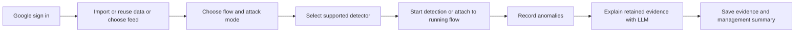

# CEO demo delivery plan

Planning date: 8 October 2026; publication reconciled 9 October. Tracking: [backend #90](https://github.com/khab40/lob-arena/issues/90), [secure UI #91](https://github.com/khab40/lob-arena/issues/91), [Epic #15](https://github.com/khab40/lob-arena/issues/15), [Project #3](https://github.com/users/khab40/projects/3).

Deliver one understandable journey from Google sign-in to retained anomaly evidence and an explanation. Complete review and integration of the private saved-score mock first, then connect fresh detector inference and the secure guided flow. Real-time feeds and the conditional cascade remain later gates. The full existing #90/#91 acceptance remains open after the first mock or a narrower single-detector demo.

## Persistent operator requirement

Operator instruction, 8 October 2026: **the CEO demo must begin with a Google login screen**. Keep this requirement in future demo plans and #91 acceptance. Restore backend verification, application sessions and workspace authorization before a shared deployment exposes sensitive data; protect REST, WebSocket and evidence/export routes. A login page alone does not satisfy this requirement. The approved loopback-only saved-score mock can precede this shared-demo gate.

The requested journey is retained here: Google login → ingest new data, reuse previously ingested data or choose a real-time feed → start a flow or attach to an existing flow → choose a detector → record anomalies → explain results with an LLM → save evidence. This instruction records a product requirement; it does not provision an account or authorize deployment, model runs, new data access or spend.

## Journey and specification owners

This delivery summary owns the dated planning delta and operator instruction; it does not create competing product acceptance. Reuse these maintained behavior owners before implementation:

| Subject | Canonical owner |
| --- | --- |
| Full backend and secure guided UI scope | [PHASES Wave 4](PHASES.md#wave-4-integrate-and-package-the-ceo-demoable-e2e-flow) and [Wave 5](PHASES.md#wave-5-deliver-the-secure-ceo-demo-ui) |
| Detector release and runtime acceptance | [Frozen detector demo section 6](../frozen-detector-release-and-demo-flow.md#6-observable-acceptance-for-implementation) |
| Authentication and Investigator contracts | [PHASES Wave 5](PHASES.md#wave-5-deliver-the-secure-ceo-demo-ui) owns current secure entry; [ARD-0012](../architecture/ARD-0012-google-authentication.md) preserves historical restoration context. [Investigator design](../architecture/ARD-0015-nebius-ai-investigation-team.md) owns its contract. |
| Approved continuation and current gates | [Research disposition](../ml/transformer-research-disposition-20261008.md#next-medium-prs), [current status](CURRENT_STATUS.md) |

Assign stable scenario IDs and map tests/evidence in the owning specification before affected implementation. Resolve proposed refinements below there; this documentation increment delivers no runtime scenario.

As an authorized demo operator,
I want to run or attach a verified detector to an identified market-data flow and review its anomalies with evidence-grounded explanations,
So that a CEO can understand the product outcome and its limitations.

Actor: authorized demo operator and CEO reviewer. Goal: one complete source-to-evidence journey. Value: demonstrate traceable anomaly review. Out of scope for the first integrated demo: arbitrary customer uploads, live-feed acquisition, online training, cascade qualification and production surveillance acceptance. Verification: protected UI/API tests, inert contract tests, separately authorized Nebius inference rehearsal and independent evidence readback.

Choose the detector before starting detection. An existing flow may already be running; attaching detection records its starting cutoff and warm-up state. Unavailable sources and detectors stay visibly unavailable.

Keep source acquisition and run mode separate:

| Source choice | Expected behavior |
| --- | --- |
| Import reference data | Bounded supported Nasdaq/LOBSTER files available to the server; validation, progress, immutable manifest and safe retry. Browser uploads/object-store picking are separate scope. |
| Reuse registered data | Pick an authorized dataset/session/window; retain its original identity without reingestion. |
| Feed connection | Select an authorized compatible feed; show availability and continuity. Adapter work and acquisition remain separate. |

| Run mode | Scope and readiness |
| --- | --- |
| Synthetic | Existing Java market and supported scenario families; attacks optional. |
| Historical | Replay registered events in order; original market activity remains unlabeled by default. |
| Historical with synthetic attacks | Existing hybrid replay concept; explicit overlay seed, parameters, provenance and executed labels. |
| Synthetic with ingested attacks | Working assumption: apply saved supported attack specifications to a synthetic market. Generic imported attack-event replay needs a new contract; existing specifications invoke Java scenario families rather than replay arbitrary event lists. |
| Real time | Later shadow attachment to an authorized feed; declare cutoff, gaps, lag and stop conditions. |

## Current position and concrete gaps

Dated GitHub snapshot on 9 October: #90/#91 were **Open / In Progress** in Project #3. The mock was implemented in open [PR #362](https://github.com/khab40/lob-arena/pull/362), with all 25 checks/status entries passing at reviewed head `914c4ed9a4626a78971a7452dfb8d7d458b88d9e`; it was not merged. Its [operational contract](https://github.com/khab40/lob-arena/blob/914c4ed9a4626a78971a7452dfb8d7d458b88d9e/docs/ml/verified-saved-score-mock.md) and [five-PR integration plan](https://github.com/khab40/lob-arena/blob/914c4ed9a4626a78971a7452dfb8d7d458b88d9e/docs/ml/transformer-integration-plan-20261008.md) stay pinned to that snapshot; the PR may advance. Full #90/#91 acceptance remains incomplete.

| Area | Existing foundation | Work needed for this journey |
| --- | --- | --- |
| Google access | Archived auth and session design; #91 owns restoration. | Restore access checks for the guided flow and shared API/WebSocket state. |
| Data and flow | Registered historical sources, synthetic market, hybrid overlays. | Guided catalogue/import controls and source/mode compatibility; external feed adapter later. |
| Detectors | Rule Arena; frozen LightGBM loader; independently verified Transformer research; saved-score mock in #362. | Complete mock review/integration, then immutable classifier export and causal stream integration under #24/#90. |
| Anomalies | Java rule alerts and incident journal. | Persist learned anomalies even without a scenario/label; retrieve by run after reset/restart; version consolidation policy. |
| Explanation | Bounded Investigator/report endpoints and deterministic fallback. | Bind explanation to captured anomaly evidence; expose actual LLM/fallback mode; retain exact input/output. |
| Evidence | Manifests, governed research artifacts and report history. | One durable run bundle, explicit retention, verified readback and protected export. |

Boundary cases to cover during implementation: Java currently requires an active scenario and confidence ≥0.80 to create an incident, although alerts begin at 0.75 ([runtime](../../java/control-plane/src/main/java/ai/lobarena/controlplane/LiveArenaService.java)). The incident explanation uses `latest_in_memory_state` ([payload builder](../../backend/app/api/routes_incidents.py)). The explanation parser can label endpoint fallback as `nebius`, archive failures can be swallowed ([client](../../backend/app/nebius/client.py)), and default artifact expiry is one day ([configuration](../../backend/app/config.py)). Existing `demo` URL variants force a mock market, and the incident drawer's replay uses a fixed narrative; those cannot substantiate fresh inference or retained event replay. The current WebSocket shares one Arena state; use a clearly bounded authorized demo workspace before proposing full multiuser isolation.

## Delivery sequence and estimates

Estimates below retain the original 8 October whole-journey forecast, not remaining effort after #362. They are proposed focused engineering days for one developer with review support, assuming reuse of reference-data and Investigator paths, timely configuration/approvals, and one supported learned detector for fresh inference. They exclude new feed adapters, arbitrary attack-event replay, investigator model comparison/hosting changes, cascade work and broader unseen-data research. Reforecast remaining effort after mock acceptance and implementation-boundary review.

| Order | Deliverable and observable exit | Tickets | Days |
| --- | --- | --- | --- |
| 1 | Private saved-score playback: ordered Transformer/LightGBM selection, pause/resume/speed, frozen thresholds, provenance and corruption denial. Implemented in #362; review/integration remains. | #90/#91 | 2–4 original |
| 2 | Restore Google sign-in and backend sessions/access checks; test expiry, revocation/logout, denied REST/WebSocket/export access. May run alongside backend work. | #91 | 2–4 |
| 3 | Deliver source catalogue and bounded existing import/reuse controls; select synthetic, historical or historical + overlay with explicit readiness and source identity. | #90/#91; #22 foundation | 3–5 |
| 4 | Export/load the selected immutable classifier and connect causal features/sequence state, warm-up/reset/gaps, bounded queues and learned alert records. | #24/#90 | 4–7 |
| 5 | Verify fresh replay parity, anomaly persistence/retrieval and operational measurements through one separately approved bounded rehearsal. Report lag/throughput and comparable runtime/cost. | #24/#90; #21 where applicable | 2–3 |
| 6 | Connect anomaly review to the existing bounded Investigator; show actual LLM/fallback provenance and retain a durable evidence bundle with checked export. Dependency refinement below is required if using #28 before cascade. | #17/#28; #90/#91 | 3–5 |
| 7 | Finish guided screens and management summary; rehearse login → source → detection → anomaly → explanation → saved evidence, including unavailable/failure paths. | #90/#91 | 2–3 |

Serial sum: **18–31 focused days**, roughly **4–7 working weeks** before external waiting. Step 1 is an earlier local research preview, not the complete CEO journey. Steps 2/3 can overlap classifier work; steps 4/5 precede fresh-score claims, and step 6 must satisfy its scope/deployment dependencies before the final rehearsal. Keep the November 13 UI and November 20 demonstration roadmap dates as existing baselines pending a separate reforecast, not promises from this estimate.

Preserve the already requested five separate Transformer PR workstreams: saved-score mock, fresh inference, operational measurements, additional unseen-data/ablation research and research closure. This plan adds the surrounding CEO journey; it does not combine or cancel those workstreams. Broader research need not delay a clearly bounded research demo, but must remain visible in full #24 acceptance.

## Ticket placement and decisions before extending scope

- Reuse #90 for verified flow/evidence and #91 for Google access and guided controls. #22 is Closed/Done; completed data foundations do not mean its user-facing import journey is complete. Generic BYO data/detectors #87/#88 remain parked under #93.
- #25 is Todo and conditional. Leave combined detector unavailable until its own approved model/calibration/evidence exists; the narrow first demo can use one detector.
- #17/#26 are In Progress; #27/#28 are Todo. #28 currently depends on #25 and #27. Propose a reviewed single-detector explanation increment with an evidence-supported Investigator, or revise that dependency with approval; do not silently close #28 or bypass its full acceptance. Real LLM hosting/evaluation work needs its own estimate and exact approved resources. Fallback reports must be labelled and cannot satisfy real-LLM acceptance.
- Actual hierarchy needs reconciliation: #90 and #91 are directly under Epic #15, despite #90 naming Feature #16 in text. Proposed placement: #15 → #16 → #90; propose a secure-demo Feature under #15 for #91. #17 currently has no epic parent; propose placing it under #15. Prepare approval before creating a new feature or changing approved scope.
- Clarify “synthetic with ingested attacks” before designing an importer. Reusing saved supported scenario specifications, injecting attacks into historical data and replaying arbitrary imported attack events are distinct capabilities. #85 is a planned research-paper attack catalogue, not a delivered generic attack importer.
- For live feed work, prepare actor, authorized source contract, continuity/backpressure behavior, bounded shadow-run criteria and parent placement before new story creation/implementation. #91 already describes authorized feed attachment; acquisition or broader adapter scope is not granted by that description.
- During implementation, create Bug tickets under the appropriate existing story for confirmed defects such as fallback misreporting or lost evidence, add them to Project #3 and retain observable acceptance. This planning audit creates no tickets or changes to their scope/status.

## Acceptance ownership and remaining verification

| Journey target | Existing owner or refinement needed before implementation | State |
| --- | --- | --- |
| Google workspace entry and source import/reuse | PHASES Wave 5 and #91 own acceptance; ARD-0012 is historical context. Include REST/WebSocket/export access and expiry/revocation in the current owner's scenario mapping. | Pending |
| Saved-score playback | #362 operational contract; frozen demo section 6. Saved evidence is distinct from new market events. | Implemented in open PR; merge/acceptance pending |
| Fresh detection, release readiness and event ordering | Frozen demo section 6; source and feature contracts; resolve cadence/warm-up/reset/gaps before code. | Pending; numerical rehearsal gated |
| Anomalies without an active attack label | Refine [detector evidence owner](../architecture/ARD-0003-detector-evidence-model.md) with #90 run persistence and consolidation behavior. | Proposed refinement |
| Captured-window explanation and durable readback | Refine Investigator owner with #28; resolve its #25/#27 dependencies, actual LLM/fallback provenance and evidence-save failure behavior. | Proposed refinement; hosting/evaluation gated |
| Unavailable detector/feed and research limitations | Frozen demo section 6 and PHASES Wave 5; real-feed continuity remains later scope. | Pending |

Saved playback pacing must preserve original scores/decisions. Fresh event replay must preserve feature/decision parity within declared tolerances; a feed gap interrupts scoring until the declared reset/continuity policy restores readiness. Keep deterministic rule confidence separate from calibrated learned probability, and saved predictions separate from fresh inference. Label synthetic overlays, unsupported LOBSTER robustness and research limitations explicitly.

## Verification and durable custody

For each coherent implementation and correction: ticket/canonical specification → story and stable scenario IDs → code/test mapping → focused checks and retained evidence → separate-agent review of exact diff and pinned specification → publication/human gates. Local checks use inert fixtures and artifact inspection. Model training/scoring/rehearsal uses an exactly scoped, separately authorized Nebius Serverless Job with resources, timeout, Job count, spend and immutable image identity declared in advance.

Store durable evidence outside default disposable artifact retention and outside worktrees, under root `outputs/` or the approved private evidence store. Retain source commit, original version/size/SHA-256 receipts, model/runtime identity, source/run/overlay identity, alerts, incident policy, exact bounded LLM request/response and model/fallback/error provenance. A partial archive is an incomplete save. Future Transformer collection uses `RetainingReadbackStore`; recovery uses `OfflineReadbackStore` with separately retained pinned settings. Preserve historical frozen packages. Public Job evidence uses the separate non-executable exporter and enabled publication scans.

## Verification of this planning increment

Scoped delta: publish the reviewed journey, persistent Google-login instruction, current status and delivery estimates; add canonical-owner links instead of a second product acceptance definition. Behavioral change: none. Invariant: existing execution gates and full ticket acceptance remain unchanged. This maintained plan is the canonical document for this planning delta; product owners above retain behavior ownership.

| Scenario ID | Documentation or contract | Test/check | Evidence receipt | Status |
| --- | --- | --- | --- | --- |
| PLAN-01 | Persistent Google requirement and #91/PHASES ownership | Manual requirement/owner comparison | Root `outputs/ceo-demo-plan-pr-20261009/verification.json` and independent review, pinned to this plan hash | Pass (static/manual) |
| PLAN-02 | Public navigation and canonical-owner references | `scripts/check_markdown_links.py` on this plan and docs index; no private `outputs/` link | Same verification receipt | Pass (static/manual) |
| PLAN-03 | Dated status, original estimates and authorization boundaries | Live #90/#91/#362 readback; estimate arithmetic; scope/gate comparison | Same verification receipt and review | Pass (static/manual) |

These planning checks do not pass the runtime scenarios. Retained receipts are local custody references, not public download paths; the PR records their safe identities and reviewed hashes after verification.

Owning references: [current status](CURRENT_STATUS.md), [main roadmap](ROADMAP-MAIN.md), [phase acceptance](PHASES.md), [frozen releases and flow](../frozen-detector-release-and-demo-flow.md), [research disposition](../ml/transformer-research-disposition-20261008.md), [replay quickstart](../data/replay-quickstart.md), [Investigator design](../architecture/ARD-0015-nebius-ai-investigation-team.md), [scenario projection limits](../architecture/ARD-0016-ai-scenario-generator.md).
