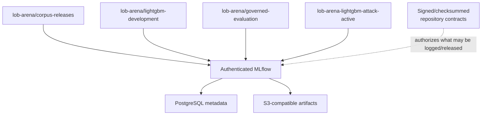
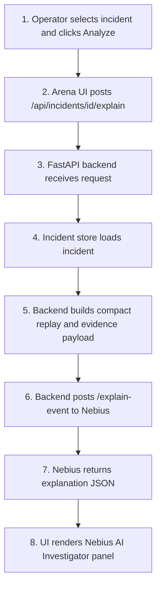
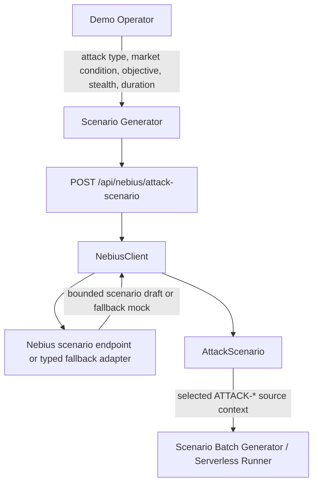
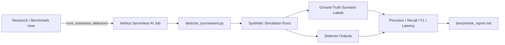
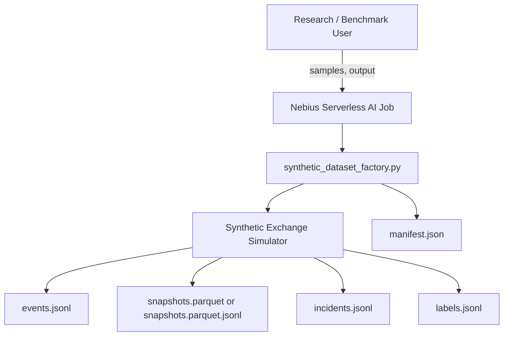
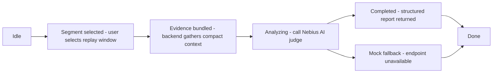
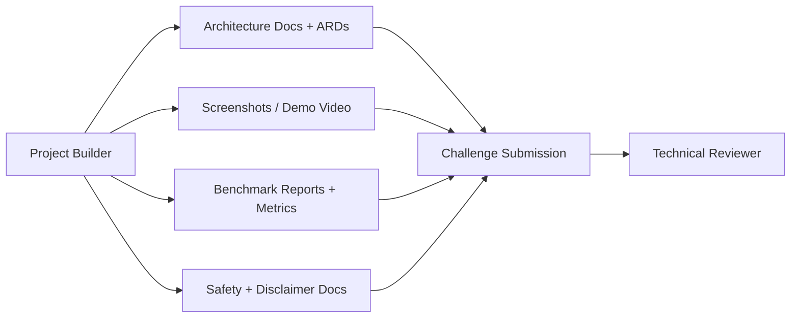

# Use cases

LOB Arena supports synthetic demos, historical/hybrid replay, governed model
development and AI-assisted evidence review. Historical activity is not
automatically benign or abusive; outputs are not trading or compliance decisions.
Use [current status](../roadmap/CURRENT_STATUS.md) for qualification and
[functional scope](../product/FUNCTIONAL_OVERVIEW.md) for acceptance boundaries.

## Workflow catalogue

| Actor and task | Action and result | Detailed owner |
| --- | --- | --- |
| Operator: run a demo | Start Local Mock, launch a bounded scenario, inspect incidents and explicit real/fallback mode | [Quickstart](../deployment/QUICKSTART.md), [demo script](../publication/demo-script.md) |
| Operator: use live arena | Start/pause/reset Java replay and observe complete state over WebSocket | [Runtime model](../runtime/runtime-model.md) |
| Data steward: register history | Validate a licensed pair or ITCH window, write immutable normalized files, register verified hashes/counts | [Client runbook](../data/client-historical-dataset-validation-runbook.md), [ITCH decision](../architecture/ARD-0032-nasdaq-itch-ingestion.md) |
| Researcher: compare hybrid replay | Run historical control and a namespaced attack over the same source; preserve separate truth and signed comparison | [Replay quickstart](../data/replay-quickstart.md), [validation contract](../data/hybrid-dataset-validation.md) |
| Reviewers: freeze a corpus | Review clean windows independently, adjudicate conflicts, verify coverage and chronological splits, sign release | [Corpus protocol](../data/governed-corpus-benchmark-protocol.md) |
| ML engineer: develop a detector | Prepare causal features, train, calibrate/select using validation, freeze candidate and request separate final evaluation | [ML lifecycle](ml-lifecycle.md) |
| Reviewer: inspect MLflow | Inspect permitted lineage, metrics and artifacts after repository verification | [MLflow operations](../ml/mlflow-tracking-server.md) |
| Reviewer: investigate an incident | Select incident, submit bounded evidence through FastAPI, inspect typed AI report or explicit fallback | [Investigation decision](../architecture/ARD-0015-nebius-ai-investigation-team.md) |
| Scenario designer: generate variants | Provide bounded constraints, persist canonical ground truth and launchable scenario projection | [Generator decision](../architecture/ARD-0016-ai-scenario-generator.md) |
| Detector engineer: run tournament | Submit labeled scenario families and compare durable metrics, leaderboard and reports | [Tournament decision](../architecture/ARD-0017-ai-detector-tournament.md) |
| Researcher: generate fixtures | Generate labeled event/snapshot/incident artifacts and a manifest | [Job contract](../../serverless/jobs/README.md) |
| Reviewer: inspect timeline window | Request bounded timeline investigation; dedicated Judge Mode selection remains a separate UI gap | [Judge Mode decision](../architecture/ARD-0009-judge-mode-investigation-reports.md) |
| Builder: publish evidence | Package sanitized screenshots, demo, deployment and benchmark receipts | [Submission index](../publication/challenge-submission.md) |

## Live Arena Mode

Java owns the exchange and broadcasts arena state. Agent runners receive
read-only snapshots and return bounded intents. UI preferences remain browser
state. See the [live tick sequence](../architecture.md#live-tick-sequence).

## UI Shell Personalization

Choose day/night/system theme and compact navigation. Preferences stay local to
the browser and do not change simulation or detector state; no Nebius call is
needed. See [UI preferences](../architecture/ARD-0013-ui-shell-preferences.md).

## Manual Scenario Launch

Use Scenario Setup to launch spoofing-like walls, layering-like patterns,
quote-stuffing bursts or liquidity evaporation. Only synthetic scenarios create
attack labels. The [scenario decision](../architecture/ARD-0006-scenario-labeling-and-reproducibility.md)
owns lifecycle/reproducibility; generated variants use the same bounded launch path.

## Historical Session Registration

Import a complete session or bounded window. Validate schema, alignment,
book invariants and provenance; atomically publish normalized files and manifest
before registration. Keep licensed raw records out of MLflow by default.
Follow the [client runbook](../data/client-historical-dataset-validation-runbook.md).

## Hybrid Historical Replay

Load the same dataset for **Historical control** and **Hybrid + attacks**;
launch an existing scenario only after loading the replay source. Compare
detector metrics and causal-locality evidence without labeling the historical
control clean. [Hybrid validation](../data/hybrid-dataset-validation.md)
defines the signed evidence and statistical acceptance rules.

## Governed Corpus Release

The [corpus protocol](../data/governed-corpus-benchmark-protocol.md) owns coverage,
independent blinded review, adjudication, embargo and exact artifact bindings.
Its client-governance requirements are distinct from the four-date C4
research-control assumption. Typed contracts and CLIs exist; a multi-reviewer
product API/UI is not implied. See [data preparation](ml-data-preparation.md).

## Shared MLflow Tracking

Verify repository contracts before logging approved metadata/artifacts into
corpus, development or governed-evaluation namespaces. Raw rows remain outside
tracking. Namespace creation and artifact logging do not implement model-version

Main flow:

1. A governed pipeline verifies compatible protocol, corpus, split, feature,
   and release hashes locally.
2. It logs parameters, metrics, manifests, and permitted artifacts to the
   appropriate experiment.
3. Development models remain in the development experiment.
4. Final test results enter governed evaluation only after thresholds are
   frozen.
5. Planned registration/promotion will publish verified model versions and
   aliases; current loggers and namespace bootstrap do not implement this step.

## Governed LightGBM v1

Status: implemented and verified locally through the complete governed v1
software boundary. Wave 1 G0–G7 are complete; production G8 evaluation remains
open and G9 disposition is blocked. C4 tabular and sequence projections exist.
The market-sequence Transformer model and Transformer-to-LightGBM cascade
remain proposed after the LightGBM exit decision. Native synthetic recovery
verification is not production model qualification.

Purpose: deliver an interpretable binary `attack_active` challenger and compare
it with deterministic rules on identical governed observations.

Main flow:

1. Load only schema/protocol/corpus/split-compatible feature artifacts.
2. Fit preprocessing and class weights on the training fold only.
3. Use validation for early stopping, probability calibration, and threshold
   selection.
4. Freeze high-precision, balanced, and high-recall operating modes.
5. Run one final paired test evaluation against rules.
6. Persist feature contributions or SHAP evidence, manifests, checksums, and
   MLflow run/model references.

Primary challenge cases are liquidity evaporation and subtle layering, rather
than only reproducing already-easy spoofing or quote-stuffing results.

## Incident Investigation

Purpose: explain a detected synthetic incident using compact replay evidence.

Business value:

- Converts detector evidence into a readable investigation narrative.
- Keeps Nebius credentials and endpoint details out of the browser.
- Preserves safety framing with synthetic-only disclaimers.

Nebius role:

- Backend calls `NEBIUS_INCIDENT_EXPLAINER_URL`, deployed as `/explain-event`.
- Request contains compact replay context, detector evidence, and incident metadata.
- Response is typed explanation JSON for the UI's Nebius AI Investigator panel.

## Red-Team Scenario Generation

Purpose: generate a launchable synthetic scenario configuration from business
constraints.

Business value:

- Lets the demo create scenario variants without hardcoding every variant.
- Keeps generated scenarios bounded, persisted, selectable, and usable as source context for scenario grids or Nebius Serverless batches.
- Supports both Nebius endpoint mode and local mock fallback mode.

Nebius role:

- Backend calls the configured Nebius scenario endpoint when available and falls back to a typed local adapter.
- Input includes attack type, market condition, objective, stealth level, attack duration, red-team agent count, and detector difficulty.
- Output is normalized into `AttackScenario`; persisted scenarios can be selected later in the Control Panel and submitted to the Scenario Batch Generator or Serverless Batch Experiment Runner.

## Detector Tournament Benchmark

Purpose: evaluate deterministic detectors across labeled synthetic scenario
families.

Business value:

- Provides measurable evidence beyond a visual demo.
- Shows detector performance by scenario family.
- Produces artifacts suitable for challenge review and iteration.

Nebius role:

- Runs as a Nebius Serverless AI Job using `serverless/jobs/detector_tournament.py`.
- Accepts `--runs`, `--scenarios`, `--detectors`, and `--output`.
- Writes `benchmark_report.md`, `metrics.csv`, and `results.json`.

## Synthetic Dataset Generation

Purpose: create labeled synthetic artifacts for demos, tests, and analysis.

Business value:

- Produces repeatable labeled synthetic data without external market feeds.
- Supports offline analysis and regression tests.
- Falls back to JSONL when Parquet dependencies are unavailable.

Nebius role:

- Runs as a Nebius Serverless AI Job using `serverless/jobs/synthetic_dataset_factory.py`.
- Accepts `--samples` and `--output`.
- Writes JSONL artifacts and Parquet or Parquet-like JSON fallback snapshots.

## Judge Mode Investigation Report

Purpose: explain a selected timeline window, not only a pre-created incident.

Business value:

- Supports a more exploratory review workflow.
- Connects charts, order-book state, events, and detector signals.
- Produces an investigation-style report while preserving educational framing.

Nebius AI role:

- Uses the same Nebius AI / LLM inference family as AI Investigator.
- Sends bounded timeline context rather than full raw event logs.
- Returns a structured investigation report for reviewer-facing analysis.

## Challenge Submission Evidence

Purpose: package the project story for technical review.

Business value:

- Shows both the visual demo and engineering rigor.
- Makes Nebius usage explicit through endpoint and job workflows.
- Provides a reviewable path from architecture decisions to runnable artifacts.

Nebius role:

- Endpoint evidence: incident explanations, scenario drafts, Judge Mode reports.
- Job evidence: detector tournament metrics and synthetic dataset artifacts.
- Deployment evidence: endpoint/job configs, Dockerfiles, and serverless docs.

## Use Cases → Architecture Mapping

Each use case is supported by specific architecture components:

| Use Case | Primary Path | Key Components | ARDs |
|----------|--------------|-----------------|------|
| Live Arena Mode | Interactive | UI + Java Control Plane + Exchange + Agent Runner | [ARD-0001](../architecture/ARD-0001-overall-architecture.md), [ARD-0002](../architecture/ARD-0002-websocket-state-schema.md), [ARD-0020](../architecture/ARD-0020-java-arena-websocket-agent-orchestration.md) |
| Manual Scenario Launch | Interactive | Scenario Launcher + Backend API | [ARD-0006](../architecture/ARD-0006-scenario-labeling-and-reproducibility.md) |
| Historical Session Registration | Data governance | FastAPI Ingestion + Local Registry + Immutable Parquet | [ARD-0018](../architecture/ARD-0018-canonical-exchange-event-stream.md), [ARD-0022](../architecture/ARD-0022-historical-market-data-ingestion.md) |
| Hybrid Historical Replay | Interactive / Evaluation | Data Ingestion + Java Replay Adapter + Integer Exchange + Scenario Launcher + Comparison Artifacts | [ARD-0018](../architecture/ARD-0018-canonical-exchange-event-stream.md), [ARD-0022](../architecture/ARD-0022-historical-market-data-ingestion.md), [ARD-0023](../architecture/ARD-0023-hybrid-historical-replay.md) |
| Governed Corpus Release | Data governance | Review/Adjudication + Coverage Gates + Frozen Split + Signed Release | [ARD-0025](../architecture/ARD-0025-governed-corpus-and-ml-benchmark.md) |
| Shared MLflow Tracking | ML governance | MLflow + PostgreSQL + S3-Compatible Artifacts | [ARD-0027](../architecture/ARD-0027-shared-mlflow-tracking.md) |
| Governed LightGBM v1 | ML development / Evaluation | Causal Features + Governed Loader + Deterministic Trainer + MLflow + Paired Benchmark | [ARD-0024](../architecture/ARD-0024-versioned-causal-feature-engineering.md), [ARD-0025](../architecture/ARD-0025-governed-corpus-and-ml-benchmark.md), [ARD-0026](../architecture/ARD-0026-governed-lightgbm-release-boundary.md), [ARD-0027](../architecture/ARD-0027-shared-mlflow-tracking.md), [ARD-0028](../architecture/ARD-0028-governed-lightgbm-feature-loading.md), [ARD-0029](../architecture/ARD-0029-deterministic-lightgbm-binary-training.md) |
| Incident Investigation | Interactive | Incident Store + Nebius Endpoint | [ARD-0005](../architecture/ARD-0005-nebius-endpoint-contract.md), [ARD-0008](../architecture/ARD-0008-nebius-serverless-ai-endpoints.md), [ARD-0015](../architecture/ARD-0015-nebius-ai-investigation-team.md) |
| Red-Team Scenario Generation | Interactive | Nebius Endpoint /generate-scenario | [ARD-0005](../architecture/ARD-0005-nebius-endpoint-contract.md), [ARD-0016](../architecture/ARD-0016-ai-scenario-generator.md) |
| Detector Tournament Benchmark | Batch | Nebius Jobs + Simulation + Metrics | [ARD-0004](../architecture/ARD-0004-benchmark-artifact-format.md), [ARD-0007](../architecture/ARD-0007-nebius-serverless-ai-jobs.md), [ARD-0017](../architecture/ARD-0017-ai-detector-tournament.md) |
| Synthetic Dataset Generation | Batch | Nebius Jobs + Dataset Factory | [ARD-0004](../architecture/ARD-0004-benchmark-artifact-format.md), [ARD-0007](../architecture/ARD-0007-nebius-serverless-ai-jobs.md) |
| UI Shell Personalization | Interactive | Themed Shell + Local Preferences + Arena Visual Stability | [ARD-0013](../architecture/ARD-0013-ui-shell-preferences.md) |

## Related Documentation

- [Architecture Overview](../architecture.md) — System design and data flow
- [Functional Overview](../product/FUNCTIONAL_OVERVIEW.md) — Capability status, actors, lifecycle and acceptance rules
- [Architecture Records (ARDs)](../architecture/README.md) — Detailed design decisions
- [Runtime Model](../runtime/runtime-model.md) — Simulation engine execution
- [Benchmark Methodology](../ml/benchmark-methodology.md) — How we measure detector quality
- [Nebius Deployment](../deployment/nebius-deployment.md) — Setup instructions
- [Shared MLflow Tracking](../ml/mlflow-tracking-server.md) — Experiment/model tracking operations and governance boundary
- [Quick Start](../deployment/QUICKSTART.md) — Get running in 5 minutes
- [Safety & Disclaimers](../product/safety-and-disclaimers.md) — Educational focus and limitations
