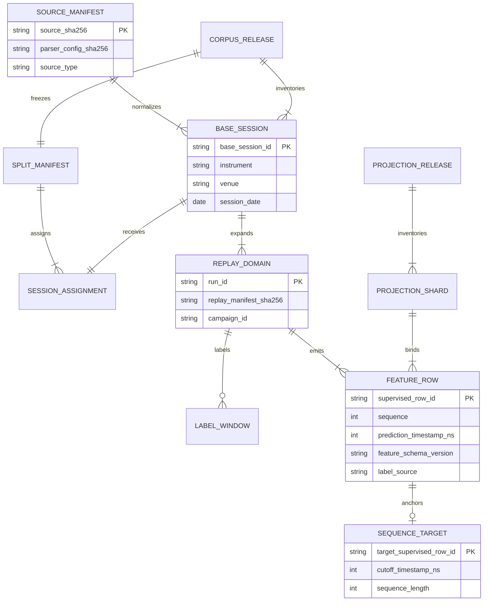

# UC-ML-01: identify, prepare, partition and store ML data

Actor: data steward, with independent reviewers for governed clean labels.
Outcome: immutable inputs for LightGBM and the future Transformer, with shared
observation identities and development/final-test isolation.

## 1. Select a source and a permitted claim

| Source | Identification and ingestion | Label meaning |
| --- | --- | --- |
| Licensed LOBSTER | Pair message/order-book CSV by instrument, date, window and depth; validate counts, units and book alignment | Unlabeled history unless reviewed clean; injected positives remain synthetic |
| Approved public Nasdaq ITCH | Source contract fixes file/date, expected bytes and symbol/window filters; acquisition verifies full compressed bytes, gzip and SHA-256 | Current C4 negatives explicitly use `research_control_assumption` |
| Pure synthetic | Record Java configuration, scenario, seed and optional market-profile hash | Label only declared scenario windows; do not generalize synthetic quality to real abuse |
| Hybrid | Replay immutable history with scheduled synthetic overlays in Java | Synthetic positive windows; negative eligibility follows the chosen protocol |
| Real-time feed | Future source adapter must preserve ordering, units, timestamps, gaps and provenance | New unlabeled observations; no automatic training-label generation |

The source parser is not the acquisition client. The local ITCH adapter reads
plain/gzip files; the separate acquisition Job downloads approved complete
files because the feed multiplexes instruments. Normalize selected symbols in
one pass, reconstruct visible order lifecycles, and publish only a verified
completed directory. See [ITCH ingestion](../architecture/ARD-0032-nasdaq-itch-ingestion.md)
and [the exact source inventory](../data/nasdaq-public-sample-v1-data-flow.md).

The implemented C4 selection is AAPL, MSFT and NVDA, 10:00–10:30 Eastern,
10-level reconstructed books. Each symbol/date has one control plus nine
hybrids: spoofing-like wall, layering-like and quote stuffing at seeds 41–43.
Across four dates that is 12 base sessions and 120 replay streams.

## 2. Normalize, replay and assign labels

1. Store source/config/output hashes in the normalized manifest alongside
   `events.parquet` and `book_snapshots.parquet`. Reject malformed lifecycle,
   ordering, quantity and book-state evidence.
2. Java applies historical updates before the synthetic phase. Scheduled
   injection binds source sequence or timestamp, seed and scenario parameters.
   Record canonical events, combined-book snapshots, separate ground truth,
   rules alerts and comparison manifests.
3. Build causal numeric features first, then join labels. The feature pipeline
   emits rows at simulation-source combined-book checkpoints. Historical-source
   snapshots alone omit overlays and are not prediction rows.
4. General governed corpus loading reconstructs positives from scenario evidence
   and negatives from independently adjudicated clean windows. Unlabeled rows
   stay unlabeled and are excluded from supervised batches.
5. C4 instead uses the explicit research projection loader and records its
   assumed-control negative provenance. It must not be presented as satisfying
   the independent-clean production protocol.

Market-profile calibration adjusts synthetic market parameters; it is distinct
from calibrating model probabilities in [UC-ML-03](ml-training-selection.md#uc-ml-03-calibrate-and-freeze-operating-points).

## 3. Freeze chronological partitions

The general split implementation groups by trading date, assigns complete base
sessions, and keeps duplicate imports, controls and all campaign/seed variants
together. The manifest binds protocol/corpus hashes, assignments, purge horizon
and embargo groups. Never shuffle adjacent rolling rows.

| Frozen C4 fold | Dates | Base symbol/date sessions | Replay shards |
| --- | --- | ---: | ---: |
| Train | 2019-01-30, 2019-03-27 | 6 | 60 |
| Validation | 2019-10-30 | 3 | 30 |
| Final test | 2019-12-30 | 3 | 30 |

The general v2 benchmark specifies one embargo date group at each boundary;
the public-sample policy specifies zero. Do not claim a universal nonzero
embargo or silently resplit the frozen C4 data. Purge/window policy belongs to
the exact protocol; the public configuration declares 10-second feature and
causal-tail horizons and a 5-second alert horizon.

Development loaders admit only train + validation. Final loaders admit only
test. C4 additionally publishes the two lanes separately and has recorded
development-to-final access denial. Naming a file `test` is not access control.

## 4. Materialize each model view

| Property | LightGBM tabular input | Existing Transformer data foundation |
| --- | --- | --- |
| Manifest | `tabular_projection_v1` | `sequence_projection_v1` |
| Row payload | 60 `lob_features_v2` float32 features plus metadata/labels | `causal_feature_sequences_v1`: histories of those numeric feature rows |
| Observation | Stable `supervised_row_id` | Same target ID in `target_supervised_row_id` |
| Context | Top-five-level features; trailing 2s/10s windows | Up to 64 retained supervised rows, including target; stride one target |
| Padding / missingness | Native feature nulls | Left zero padding with false attention mask; actual missing feature values become NaN |
| Isolation | One fold and replay domain per shard | History resets per shard; no cross-session/campaign/fold window |

Sequence vectors are **not raw ITCH event tokens**. Materialization sorts by
timestamp then sequence and includes only the causal prefix of the retained
tabular rows. It currently reads a complete shard and builds its expanded
sequence table in memory; it is not a bounded-memory full-feed tensor pipeline.
Physical sequence types follow the current Arrow materializer; a future trainer
must explicitly validate/cast tensors rather than assume float32 storage.

Before Transformer training, define train-only normalization, numerical
missingness handling distinct from padding, temporal encoding, attention policy,
loss and checkpoint selection. Retained supervised-row context may skip
unlabeled intervals: prove the same sampling can be produced without labels at
serving time, or version a new label-independent context projection while
preserving evaluation target IDs. A new raw-event representation or length is
a new hash-bound contract, not an in-place rewrite of the frozen projection.

## Data model and lineage

These are logical artifact relationships, not new SQL tables.

The target identity hashes frozen-root, assignment, replay, run, sequence and
timestamp evidence. Sequence identity hashes must equal corresponding tabular
row-identity hashes; timestamp-nearest or positional joins are not substitutes.

## 5. Store and verify

| Location | Contents and retention boundary |
| --- | --- |
| Raw quarantine | Source gzip and acquisition manifests; current documented campaign uses a three-day object lifecycle, so raw bytes are not a durable model checkpoint |
| Governed preparation storage | Normalized Parquet, Java replay/comparison artifacts, features and hashes; retain original C3 evidence needed by evaluation |
| Development release | Train/validation tabular **and** sequence shards plus manifests |
| Final release | Test tabular/sequence shards with separate access identity and authorization |
| Result release | Model, calibration, prediction/bundle artifacts, execution records, checksums and terminal marker |
| MLflow | Metadata lineage, approved model/report artifacts; no raw-session or per-row dataset upload by default |

Within a Job, stage permitted artifacts under the declared artifact root;
manifest paths resolve relative to that root. Validate hashes, sizes, inventory,
row identity, folds and label policy before use. Fail on missing/altered members,
wrong roots or incompatible protocols. Partial output without the verified
terminal release marker is not a dataset release.

Source entry points: [acquisition](../../backend/app/market_data/acquisition.py),
[preparation](../../backend/app/market_data/preparation.py),
[projection freeze](../../backend/app/market_data/projection_freeze.py),
[projections and research loader](../../backend/app/market_data/projections.py),
[general splits](../../backend/app/corpus/splits.py),
[general governed loader](../../backend/app/ml/lightgbm/data.py) and
[feature pipeline](../../backend/app/features/pipeline.py).
