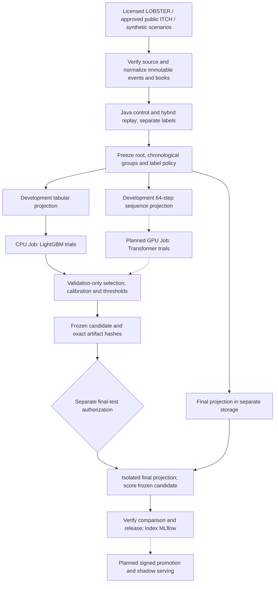

# ML lifecycle: data to selected detector

Reviewed against repository source on 2026-09-21. This guide separates
implemented capabilities, recorded research results and proposed serving work.
It does not authorize a training run, final-test access or model promotion.

## Read the workflow

| Use case | Actor and outcome | Detailed procedure |
| --- | --- | --- |
| UC-ML-01: prepare and freeze data | Data steward produces traceable, isolated model inputs | [Sources, labels, partitions and storage](ml-data-preparation.md) |
| UC-ML-02: train and retain evidence | ML engineer produces a reproducible candidate and run record | [Training and checkpoints](ml-training-selection.md#uc-ml-02-train-and-retain-a-candidate) |
| UC-ML-03: calibrate probabilities | Model validator freezes calibration and operating thresholds | [Calibration](ml-training-selection.md#uc-ml-03-calibrate-and-freeze-operating-points) |
| UC-ML-04: select hyperparameters | ML engineer compares the declared trials on validation only | [Selection](ml-training-selection.md#uc-ml-04-choose-hyperparameters-and-the-frozen-candidate) |
| UC-ML-05: retain and register models | Release reviewer preserves candidate lineage and future deployment identity | [MLflow and promotion](ml-model-serving.md#uc-ml-05-retain-compare-and-register-candidates) |
| UC-ML-06: detect on replay or a live stream | Detector operator scores causal observations in shadow mode | [Serving and combinations](ml-model-serving.md#uc-ml-06-score-historical-synthetic-hybrid-or-live-data) |

## What exists today

| Capability | Implementation and evidence boundary |
| --- | --- |
| LOBSTER / ITCH ingestion; Java control and hybrid replay | Implemented; replay of recorded history does not make its participants reactive |
| C4 tabular and sequence projections | Implemented and frozen; shared row identities, separate development and final lanes |
| Governed LightGBM | Training, calibration, bounded trial selection, frozen candidate, bundle verification and Python scoring adapter implemented |
| Wave 1 qualification | G0–G7 complete; G8 production evaluation open, G9 disposition blocked |
| Native evaluation recovery | Two-Job synthetic rehearsal and independent MLflow/S3 readback recorded; not production quality evidence |
| Transformer classifier | Sequence data foundation exists; model, trainer, GPU campaign and classifier service remain proposed |
| Transformer → LightGBM | Proposed; derived-feature release, leakage-safe training, joined model and fallback service are not implemented |
| MLflow promotion / online ML service | Run logging and registry namespace exist; automatic model-version publication, promotion and Java-to-model serving integration do not |

The current frozen C4 corpus has four dates. It is not the seven-date benchmark
merely because both use the name `nasdaq-public-sample-v1`. Compare protocol
hashes and coverage before combining results. See
[ARD-0038](../architecture/ARD-0038-c4-specific-evaluation.md).

## End-to-end process

All agent-initiated training, scoring and frozen-runtime rehearsals run on
Nebius Serverless Jobs. Local work covers orchestration, edits, static checks
and artifact inspection. Declare resources, timeouts, Job count and applicable
spend bounds before execution under the current operator instructions; preserve
runtime identities and evidence. Historical campaign quotas are not new
execution permission. The [validation policy](../ml/model-validation-execution-policy.md)
records the standing policy; final-test and replacement authorization are separate.

The [review ledger](../architecture/ml-documentation-review-20260921.md)
records corrections and source evidence. Architectural decisions remain in
[the ARD index](../architecture/README.md); this guide explains how to use them.
