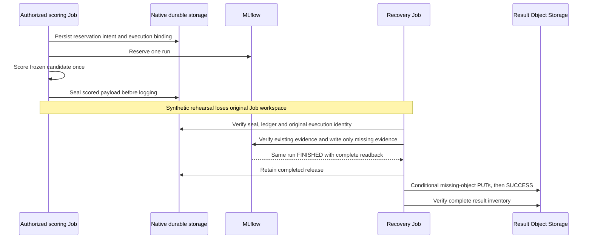
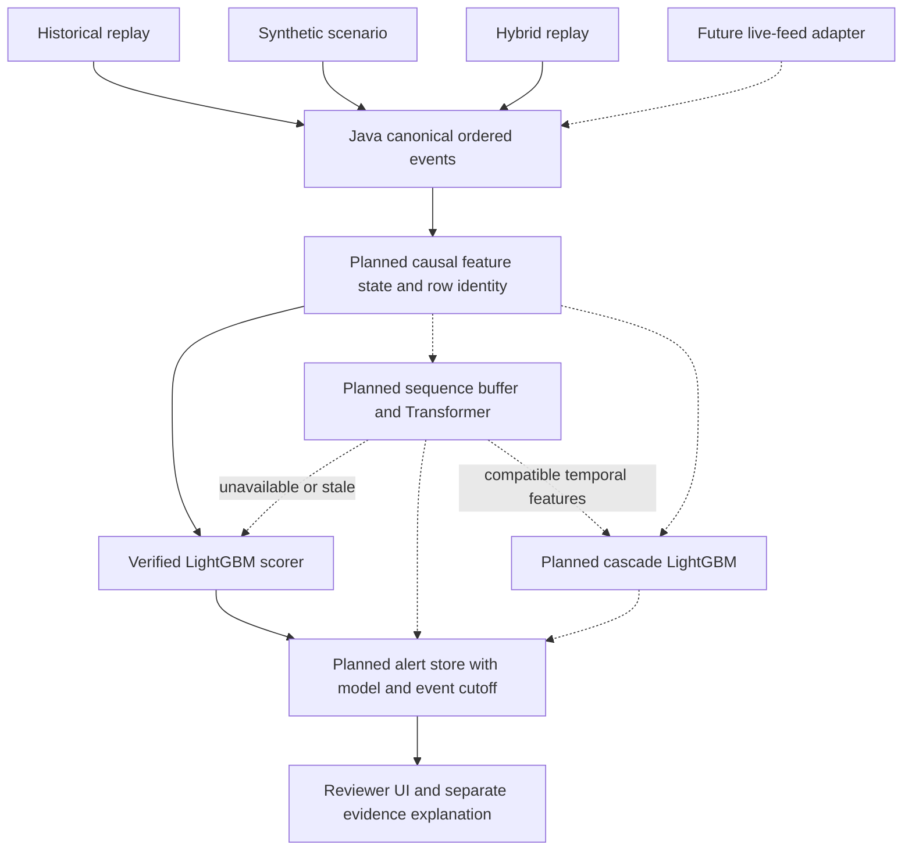

# MLflow candidates, comparisons and near-real-time detection

## UC-ML-05: retain, compare and register candidates

Actor: release reviewer. Goal: recover the exact selected model, reproduce its
comparison and later deploy it with a traceable rollback identity.

### Implemented retention and tracking

| Index / store | What the implementation writes |
| --- | --- |
| `lob-arena/corpus-releases` | Dataset release metadata and lineage; no raw rows |
| `lob-arena/lightgbm-development` | Parameters, binding tags, seed, best iteration/loss, calibration metrics, operating-point metrics, family recall, metadata-only train/validation inputs |
| Development `governed/` artifacts | Training/calibration manifests, validation metrics, feature importance, reliability bins/SVG and `model.txt` |
| `lob-arena/governed-evaluation` | Verified test/bundle identity, test inputs, permitted metrics and optional independently verified benchmark/C4 report |
| Evaluation artifacts | Bundle/checksum/prediction manifests and approved comparison report; not an automatic copy of every bundle payload |
| Governed Object Storage result | Complete hash-bound model, calibration and scoring release plus execution/publication evidence |
| `lob-arena-lightgbm-attack-active` | Bootstrapped registered-model namespace; creation of a namespace is not publication of a model version |

PostgreSQL stores tracking/registry metadata. MLflow proxies permitted artifacts
to MinIO locally or Nebius Object Storage in cloud deployment. The checked-in
[Dockerfile](../../deployments/mlflow/Dockerfile) pins 3.16.0; this is a source
configuration fact, not a fresh assertion about a currently running VM.

[tracking.py](../../backend/app/ml/lightgbm/tracking.py) logs explicit artifacts;
it does not call `log_model`, create model versions, assign champion aliases or
deploy an endpoint. [bootstrap_resources.py](../../deployments/mlflow/bootstrap_resources.py)
creates the namespace. A model file logged to a run is not by itself a complete
serving package, and the evaluation run's four artifacts do not contain all
bytes needed by the current release verifier.

To retrieve today's selected candidate, use the G6 comparison and G7 freeze
receipt to resolve its development run/result URI. Verify the candidate, source
release and artifact hashes; recover the complete root-relative bundle from
governed result storage. Do not select whichever MLflow run was created last.

### Planned registration and promotion procedure

1. Package the entire verified inference dependency set: weights, optional
   preprocessing, calibration, ordered features/sequence schema, operating
   mode, immutable data/code/image identity and the evaluation/release evidence
   required by the verifier. A smaller serving-only verifier needs a separate
   versioned contract; it does not exist today.
2. Implement a verified model-version publication step binding source run,
   artifact URI, bundle hash, protocol hash and comparison receipt. Keep
   standalone LightGBM, Transformer and cascade in separate model families.
   Transformer/cascade namespace names are not provisioned yet.
3. Read back the version and artifacts. Record a proposed `candidate` pointer;
   only a signed quality/operational disposition can approve `champion`.
   Retain the previous verified version as `rollback`.
4. Resolve aliases once at deployment, verify hashes, and pin the immutable
   model version/bundle for that service instance. Record every promotion and
   rollback; never allow a mutable pointer to replace the release checks.

This alias procedure is planned repository integration. MLflow aliases are
mutable version references, as defined in the
[official registry documentation](https://mlflow.org/docs/latest/model-registry/).

### Compare model families fairly

Keep rules, standalone LightGBM, standalone Transformer, cascade and any
declared late-fusion comparator on identical target row IDs and label policies.
Record shared protocol/root/split hashes, per-family quality, probability
calibration, uncertainty and actual end-to-end latency/throughput.
Compare different feature contracts only with explicit lineage; do not mix
four-date C4 and seven-date benchmark scores into one leaderboard.

The LightGBM final-access approval does not authorize Transformer testing.
Each later frozen family requires the applicable reviewed evaluation scope.
Once test outcomes influence design, they are research feedback rather than an
untouched holdout; make further tuning in development and version any new
confirmatory evaluation. C4 reports exclude event-level false alerts and
detection-before-benefit claims that its retained observations cannot support.

## Recovery is part of retention

The [native rehearsal receipt](../evidence/g8-native-recovery-20260917.json)
records one scoring call and same-run recovery; the later
[independent S3 receipt](../evidence/g8-independent-s3-readback-20260917.json)
verified 64 objects. These prove synthetic recovery engineering. Production
transport, comparison semantic verification, fresh preflight and replacement-specific
authorization remain separate G8 work. The [dated readiness snapshot](../roadmap/CURRENT_STATUS.md)
records PR #207's original payload hashes, live registration, capacity and unsigned
review; those audits do not establish production comparison semantics or quality.
Publication-only recovery starts after logging and cannot write MLflow or
rescore; log-only recovery requires the pre-logging scored checkpoint.

## UC-ML-06: score historical, synthetic, hybrid or live data

Actor: detector operator. Existing capability:
[`LightGbmV1Detector`](../../backend/app/ml/lightgbm/detector.py)
loads a verified local bundle and scores one exact feature mapping. It returns
raw/calibrated probability, threshold, alert decision, model identity and
ranked signed tree contributions. Those contributions describe the raw model
margin; they are not additive explanations of the calibrated probability.

The class is currently referenced by tests/package exports, with no Java
stream consumer, inference REST service or Arena alert integration. The
following is a proposed shadow-serving path, not a deployed feature.

| Input mode | How scoring should work | Limit |
| --- | --- | --- |
| Historical | Replay canonical events chronologically; compute the same causal features and score each declared checkpoint | Accelerated or wall-clock-paced replay is not a live exchange feed |
| Synthetic | Feed Java's combined-book checkpoints into the same feature state; use labels only later for evaluation | Results reflect the simulator and scenario design |
| Hybrid | Apply historical phase then overlay; score the combined book | Recorded historical participants do not react to the overlay |
| Real-time | Implement a source adapter and checkpoint cadence, enforce sequence/gap/watermark policy and score without future events | Feed ingestion, online feature parity and production ML serving are not implemented |

### Serving plan and acceptance checks

- Start with microbatch/shadow replay using the verified LightGBM bundle.
  Prove online/offline feature and decision parity at identical cutoffs,
  including warm-up, nulls, duplicate/gapped events and reconnect recovery.
- Keep book mutation in Java. A model consumer maintains read-only derived
  state keyed by instrument/session; it must not block the exchange loop.
  Bound queues and batch sizes; report skipped/late observations explicitly.
- Freeze cadence, watermarks, maximum feature age and latency budget before
  benchmarking. Measure event-to-alert p50/p95/p99, queue lag, throughput,
  drop/failure counts and memory. No measured serving SLO exists yet.
- Standalone Transformer serving needs its own classifier runtime and masking/
  normalization parity. The generative AI Investigator/vLLM endpoint is a
  separate explanation service.
- Default cascade exploration uses offline or bounded microbatch enrichment.
  Join temporal outputs by exact row/session/replay identity and verify producer
  version, schema and cutoff. Online enrichment requires a measured GPU budget
  and end-to-end latency benefit.
- Missing, stale or incompatible temporal features route to a separately
  verified standalone LightGBM scorer and record fallback. Do not pass zeros
  into the cascade as if valid embeddings arrived. If the fallback bundle or
  base features are invalid, emit an explicit unavailable/error state.
- Late fusion, if evaluated, needs its own validation-selected weights,
  calibration, thresholds and missing-model policy. It is not an automatic
  average of already calibrated probabilities.
- Store row/cutoff, model/bundle/calibration IDs, mode, raw/calibrated score,
  threshold and decision, plus latency/fallback evidence. Alert consolidation
  and cooldown rules must be versioned because they change false-alert load.

Promotion follows verified quality and operational gates, a shadow comparison
and a signed decision. Neither the best validation score nor a registry alias
alone establishes that a model is ready for real-time detection.
