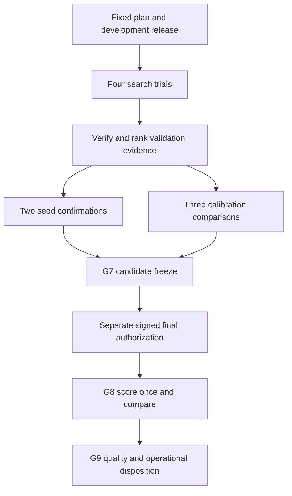

# ML training, calibration and candidate selection

Prerequisite: [UC-ML-01](ml-data-preparation.md) has produced a verified
development release and a separately protected final release.

## UC-ML-02: train and retain a candidate

Actor: ML engineer. Input: frozen development projection, explicit experiment
specification, source commit/image, seed, timestamp and bounded Job request.
Output: immutable model/training artifacts and a verified development run.

1. Prepare a `Wave1JobRequest` and experiment specification. Bind release and
   configuration hashes, exact result URI, runtime image, resources and timeout.
   Submit the reviewed package through the Nebius Job path; preserve actual Job
   identity, logs and result collection receipts.
2. Download only the approved development lane into the Job artifact root.
   The public C4 path uses `load_tabular_projection_dataset`; the general
   independently reviewed corpus uses `load_governed_feature_dataset`.
3. Apply the declared feature exclusions in the Wave 1 runner, preserving the
   original order of retained columns. The release still has 60 features; the
   selected model may consume fewer. Unknown/all-feature exclusions fail.
4. `train_binary_attack_model` materializes train and validation once as
   float32 memory maps. It fits a binary `attack_active` LightGBM model on CPU
   with fixed random sources, deterministic column building and explicit threads.
5. Derive class balance from training labels and normalize contributions by
   base session within class. Validation early stopping uses the same
   training-derived class weights with validation-session normalization.
   Choose best iteration by validation binary log loss.
6. Atomically write the selected booster as `model.txt` and its
   `training-run.json`. The manifest records model digest, ordered features,
   input/fold hashes, hyperparameters, seed, preprocessing and best iteration.
7. Calibrate and log permitted evidence, then verify/publish the result with
   checksums and `SUCCESS` last. Collect and read back remote artifacts before
   accepting the trial as successful.

Scaling is absent by default; missing values retain LightGBM semantics.
An optional allowed deterministic scaler is fitted on train only and persisted
separately. Determinism is scoped to identical inputs, runtime, seed and explicit
creation timestamp; it is not a cross-library-version promise.

### What “checkpoint” means here

| Artifact | Current behavior |
| --- | --- |
| LightGBM training checkpoint | Best-iteration booster is saved after training; there is no periodic boosting-state checkpoint/resume loop |
| Development candidate | Model + training/calibration evidence, immutable result release and content-bound candidate identity |
| C3 preparation checkpoint | Retained source/replay/comparison artifacts; these are data evidence, not model weights |
| G8 scored checkpoint | Sealed scored payload retained before logging, allowing log-only recovery without another scoring call |
| Completed-release checkpoint | Already completed release retained for publication-only recovery |
| Transformer checkpoint | Planned: weights plus optimizer, scheduler, step/epoch, RNG and preprocessing state, immutable configuration/data hashes and resume lineage |

MLflow currently receives summary metrics after training/calibration, not a
per-iteration LightGBM learning curve. Ephemeral Job disk and an MLflow run ID
alone do not guarantee recoverable weights or a complete release.

The implemented entry points are [the cloud runner](../../backend/app/ml/lightgbm/cloud_runner.py),
[trainer](../../backend/app/ml/lightgbm/training.py),
[Job entry point](../../serverless/jobs/run_lightgbm_wave1.py) and
[orchestration CLI](../../scripts/lightgbm_wave1.py).
The [v1 runbook](../lightgbm-v1-runbook.md) describes underlying commands;
its legacy local model-execution examples are historical, not the current
agent execution policy.

## UC-ML-03: calibrate and freeze operating points

Actor: model validator. Input: fixed trained model and validation rows only.
Output: calibration manifest, reliability evidence and frozen thresholds.

The implementation in [scoring.py](../../backend/app/ml/lightgbm/scoring.py)
scores the validation fold with the selected booster, then supports:

| Method | Fitted state |
| --- | --- |
| Raw | Identity mapping; no fitted probability transform |
| Platt, generic default | Logistic regression on clipped raw-probability logits; saved slope and intercept |
| Isotonic | Monotone probability mapping; saved breakpoints with clipped out-of-range behavior |

It saves raw validation predictions, raw/calibrated Brier score and ECE,
reliability bins/diagram, feature importance, schema and calibration manifest.
Unlike weighted training loss, these calibration and threshold metrics operate
on the retained labeled validation rows without session weighting.

| Operating mode | Validation selection rule |
| --- | --- |
| High precision | Highest recall meeting the configured precision floor |
| Balanced | Highest F1 |
| High recall | Highest precision meeting the configured recall floor |

Deterministic tie-breaking is implemented. Unattainable floors fail; the
pipeline does not silently lower them. Calibration method and thresholds are
frozen before final-test access. The runtime adapter accepts only the mode
recorded by the verified release's prediction manifest.

**Evidence limitation:** Wave 1 reuses the same validation fold for early
stopping, hyperparameter selection, calibrator fitting and threshold selection.
Its reported calibration scores are evaluated on the calibrator's fitting
rows. Near-zero validation ECE therefore does not establish out-of-sample
calibration. Preserve the frozen candidate; do not “fix” its protocol after test
access. A future campaign should predeclare separate chronological calibration
and selection groups or grouped out-of-fold predictions within development.
The final fold must remain outside all fitting and model choices.
The general fit/calibration separation requirement is also described by
[scikit-learn](https://scikit-learn.org/stable/modules/generated/sklearn.calibration.CalibratedClassifierCV).

This is probability calibration. [ARD-0034](../architecture/ARD-0034-itch-market-profile-calibration.md)
instead calibrates the market simulator's arrival, depth and other parameters.

## UC-ML-04: choose hyperparameters and the frozen candidate

Actor: ML engineer and release reviewer. Selection is a bounded explicit
campaign, not an implemented Optuna/Bayesian search or an MLflow “best model”
button. The authoritative [G6 plan](../../configs/experiments/lightgbm-wave1/g6-campaign-20260907.json)
and [comparator](../../backend/app/ml/lightgbm/g6_campaign.py) define:

1. Four seed-42 searches: two hyperparameter settings and two feature ablations.
   The hyperparameter alternatives vary learning rate, leaves, minimum leaf
   population, boosting rounds and L2 penalty. The ablations remove behavior
   or state features from the same source schema.
2. Eligible successful results must verify, have no test access, and must not
   worsen both Brier and ECE versus raw probabilities.
3. Rank by balanced F1 descending, minimum attack-family recall descending,
   calibrated Brier ascending, calibrated ECE ascending, validation log loss
   ascending, then experiment hash ascending.
4. Confirm the selected configuration at seeds 7 and 2027 alongside seed 42.
   Maximum ranges: F1 0.05, minimum family recall 0.10, log loss 0.05.
5. Compare raw, Platt and isotonic for that same configuration. Rank by Brier,
   ECE, descending balanced F1, then calibration method name.
6. Retain all nine trial receipts, including rejected trials, and freeze the
   selected candidate through [G7](../../backend/app/ml/lightgbm/g7_candidate.py).
   Candidate freeze and final-test authorization are separate artifacts/actions.

The recorded G6 outcome selected `ablate-state` and isotonic calibration.
Its 29 excluded state features leave 31 model columns. Balanced validation F1
was 0.6931407942 and minimum attack-family recall 0.5333333333. These are
research validation results, not production performance. Exact candidate and
receipt hashes are in [ARD-0035](../architecture/ARD-0035-nebius-lightgbm-first.md).

### Planned Transformer and cascade training

After the LightGBM exit disposition, the Transformer campaign must declare its
tensor contract, masked padding/missingness, causal cutoff, train-only
normalization, model sizes, sequence lengths, optimizer/schedule, loss, seeds,
early stopping and checkpoint selection before GPU Jobs. Record learning
curves, retained checkpoint hashes, runtime, peak memory and throughput in
MLflow. No Transformer training command or resumable checkpoint implementation
exists yet. See [ARD-0036](../architecture/ARD-0036-market-sequence-transformer.md).

The cascade needs a further guard: training features cannot be in-sample
predictions/embeddings from a Transformer trained on those same labels.
Predeclare grouped chronological cross-fitting or disjoint producer-training
and downstream-training groups, preserve model-to-row lineage and audit
distribution shift between producer versions. Fit/tune only in development.
Then freeze the producer and downstream LightGBM before final comparison.
This is a proposed requirement in
[ARD-0037](../architecture/ARD-0037-transformer-to-lightgbm-cascade.md),
not functionality supplied by the current projection materializer.
